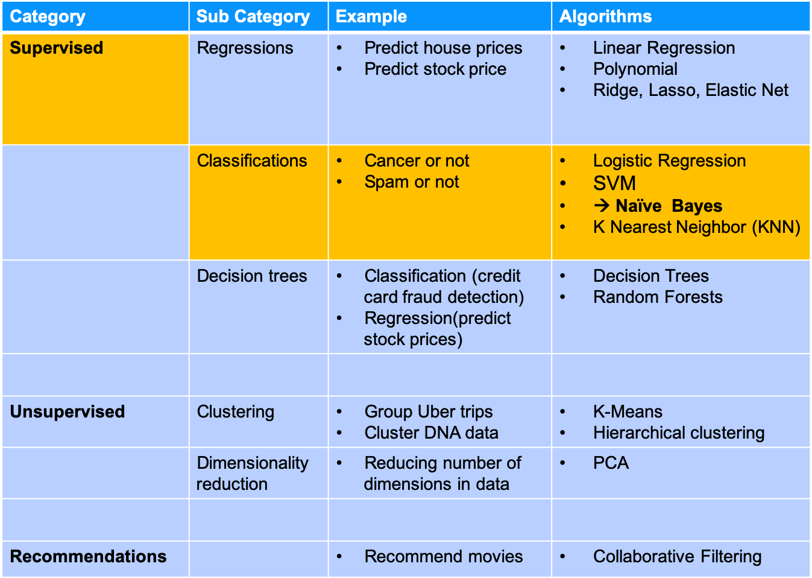
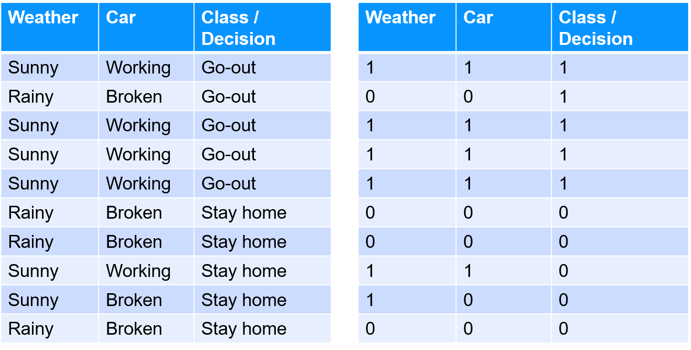
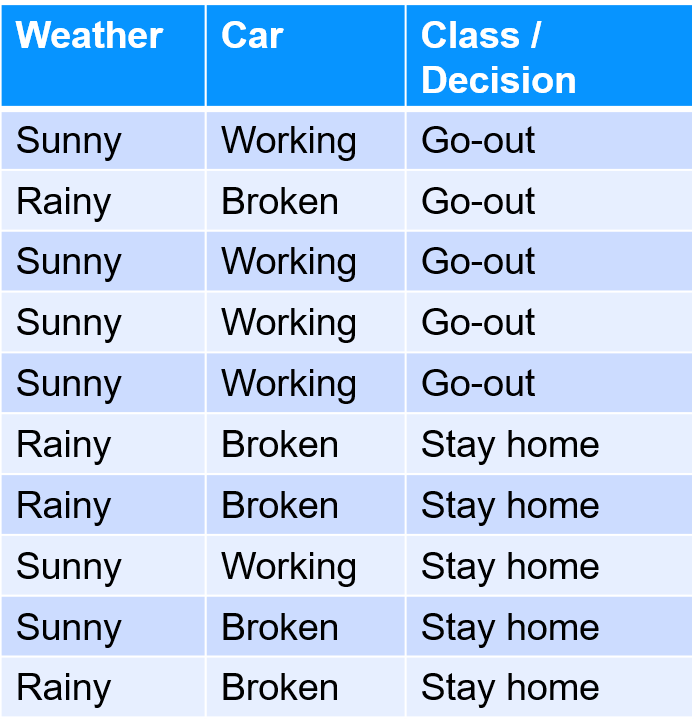
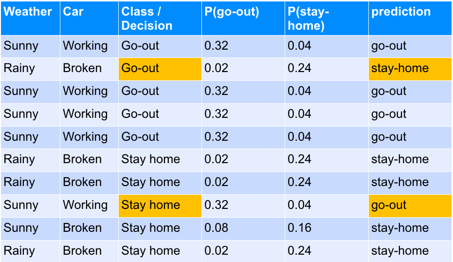

# Naïve Bayes

---

## Algorithm Summary

<!-- {"left" : 2.63, "top" : 2.5, "height" : 8.7, "width" : 12.23} -->


Notes:
* http://machinelearningmastery.com/supervised-and-unsupervised-machine-learning-algorithms/

---

## Naïve Bayes

* Naïve Bayes a probability based classification algorithm that can do binary and multi-class classifications

* It makes pretty strong assumptions about data

    - Inputs are independent

    - Inputs are equally important

* These may not hold up on real world data sets

* Naïve Bayes is surprisingly effective for some domains

    - Categorical

    - Text

Notes:

---

## Naïve Bayes Implementations

| Implementation  | Use Case                                                          |
|-----------------|-------------------------------------------------------------------|
| **Gaussian**    | continuous data (e.g. stock price)                                |
| **Bernoulli**   | Binary data                                                       |
| **Multinomial** | integer count data  (e.g. how often a word appears in a document) |

<!-- {"left" : 2.32, "top" : 2.82, "height" : 4.18, "width" : 12.87} -->


Notes:

---

## Example 1

| Weather |   Car   | Class / Decision |
|:-------:|:-------:|:----------------:|
|  Sunny  | Working |      Go-out      |
|  Rainy  |  Broken |      Go-out      |
|  Sunny  | Working |      Go-out      |
|  Sunny  | Working |      Go-out      |
|  Sunny  | Working |      Go-out      |
|  Rainy  |  Broken |     Stay home    |
|  Rainy  |  Broken |     Stay home    |
|  Sunny  | Working |     Stay home    |
|  Sunny  |  Broken |     Stay home    |
|  Rainy  |  Broken |     Stay home    |

<!-- {"left" : 3.1, "top" : 2.5, "height" : 5.5, "width" : 11.29} -->


* **Question for class‫:‬**

* Are the input variables (weather / car) independent?


Notes:

---

## Example Data 2: Gender Classification Data (fictional)

* **Question for class**: Are the inputs independent in this dataset?

| Person | Height (ft) | Weight (lbs) | Foot Size (inches) | Gender (classification) |
|--------|-------------|--------------|--------------------|-------------------------|
| 1      | 6.00        | 180          | 12                 | Male                    |
| 2      | 5.92        | 190          | 11                 | Male                    |
| 3      | 5.58        | 170          | 12                 | Male                    |
| 4      | 5.00        | 100          | 6                  | Female                  |
| 5      | 5.50        | 150          | 8                  | Female                  |
| 6      | 5.75        | 160          | 9                  | Female                  |

<!-- {"left" : 1.43, "top" : 3.65, "height" : 4.04, "width" : 14.65} -->


Notes:


---


## Example

* Let's convert this to numbers

* Weather: Sunny=1, rainy=0

* Car: working=1, broken=0

* Class: Go-out=1, Stay-home=0

<!-- {"left" : 3.13, "top" : 5.2, "height" : 5.69, "width" : 11.24} -->


Notes:

---

## A Little Statistics

* The conditional probability (denoted by P) of event A given event B occurred is

```text
                 P (A ∩ B)     P (B|A) * P(A)
   P (A | B) = ------------ = ----------------
                   P (B)          P(B)
```
<!-- {"left" : 0.85, "top" : 3.03, "height" : 0.73, "width" : 5.85} -->


* If A and B are independent

```text
   P (A ∩ B) = P (B|A) * P(A) = P(A) * P(B)
```
<!-- {"left" : 0.85, "top" : 4.4, "height" : 0.5, "width" : 6.75} -->

* Example

    - Probability of HEADS in coin toss = 1/2

    - Probability of getting a 6 on a dice throw = 1/6

    - Achieving both  =  1/2∗1/6=1/12 = 8%


Notes:

---

## Calculating Probabilities

```text
                             count(class = 1)
* P(class = 1 / go out )   = ------------------------------
                             count (class = 1) + count (class = 0)

                             count(class = 0)
* P(class = 0 / stay home) = ------------------------------
                             count (class = 1) + count (class = 0)

                                5
* P(class = 1 / go-out)    = --------  = 50%
                              5 + 5

                                5
* P(class = 0 / stay-home) = --------  = 50%
                              5 + 5
```
<!-- {"left" : 0.85, "top" : 2.34, "height" : 4.04, "width" : 9.15} -->

<!-- {"left" : 4.15, "top" : 6.77, "height" : 4.66, "width" : 9.2} -->

Notes:


---

## Calculating Conditional Probabilities

```text
                                  count(weather=sunny AND class=go-out)
P(class=go-out | weather=sunny ) = ------------------------------------
                                  count (class = go-out)
                                    4
                                =  ----  = 0.8 = 80%
                                    5
```
<!-- {"left" : 0.85, "top" : 1.89, "height" : 1.76, "width" : 10.97} -->

 <!-- {"left" : 12.11, "top" : 3.13, "height" : 5.26, "width" : 5.1} -->

* **How weather influences decision**

```text
P (class = go-out | weather = sunny)    = 4 / 5 = 0.8
P (class = go-out | weather = rainy)    = 1 / 5 = 0.2
P (class = stay-home | weather = sunny) = 2 / 5 = 0.2
P (class = stay-home | weather = rainy) = 3 / 5 = 0.6
```
<!-- {"left" : 0.85, "top" : 4.33, "height" : 1.31, "width" : 8.74} -->


* **How car influences decision**

```text
 P (class = go-out | car = working)    = 4 / 5 = 0.8
 P (class = go-out | car = broken)     = 1 / 5 = 0.2
 P (class = stay-home | car = working) = 1 / 5 = 0.2
 P (class = stay-home | car = broken)  = 4 / 5 = 0.8
```
<!-- {"left" : 0.85, "top" : 6.31, "height" : 1.33, "width" : 8.74} -->


Notes:


---

## Bayes Theorem

* Bayes theorem provides way to calculate the probability of hypothesis

* **P(h|d)** is the probability of **hypothesis h given the data d.** This is called the posterior probability

* **P(d|h)** is the **probability of data d given that the hypothesis** h was true

* **P(h)** is the **probability of hypothesis h being true** (regardless of the data). This is called the prior probability of h

* **P(d)** is the **probability of the data** (regardless of the hypothesis)

```python

            P(h|d)x P (h)
P(h | d) = ---------------
                 P(d)
```
<!-- {"left" : 0.85, "top" : 6.68, "height" : 1.5, "width" : 7.17} -->


Notes:


---

## 'Naïve' in Naïve Bayes

* Probability of P(h) happening given events  d1,d2,d3 is `P(h | d1,d2,d3)`

* To simplify this we can calculate the probability as `P(d1 | h) *  P(d2 | h) *  P(d3 | h)`

    - Combining individual probabilities together

    - If we assume  events `d1, d2, d3 are independent`

    - `A big assumption!`

* It is called '`Naive Bayes`' or '`idiot Bayes`' because the calculation of the probabilities for each hypothesis are simplified to make their calculation tractable

* '**Each attribute is independent**' is strong assumption is most unlikely in real world data

* NBC works surprisingly well even on data where this assumption doesn't hold.


Notes:

---

## Making Predictions With Naïve Bayes Model

* Given a NB model we can predict new data as follows

    - MAP(h) =  max ( P (d|h) *  P(h) )

* MAP = Maximum Probable Hypothesis

```python
If weather=sunny
P(go-out)    = P (weather = sunny|class = go-out) * P (class = go-out)
P(stay-home) = P (weather = sunny|class = stay-home) *
               P (class = stay-home)
                              go-out
P(go-out | weather=sunny) = -----------
                             go-out + stay-home

                                 stay-home
P(stay-home | weather=sunny) = -----------
                                go-out + stay-home

```
<!-- {"left" : 0.85, "top" : 3.96, "height" : 3.51, "width" : 13.74} -->

Notes:

---

## Making Predictions With Naïve Bayes Model

```python
What is the prediction if weather=sunny, car=working ?
(we are plugging in probabilities we calculated before

P(go-out)    = P (weather = sunny|class = go-out) *
               P (car=working | class=go-out) *
               P (class = go-out)
             = 0.8 * 0.8 * 0.5
             = 0.32

P(stay-home) = P (weather = sunny|class = stay-home) *
               P (car=working | class=stay-home) *
               P (class = stay-home)
             = 0.4 * 0.2 * 0.5
             = 0.04

P(go-out) 0.32 > P(stay-home) 0.04

So we predict 'go-out'

**So weather=sunny, car=working-->prediction=go-out**
```
<!-- {"left" : 0.85, "top" : 2.44, "height" : 7.39, "width" : 12.8} -->

Notes:


---

## Naïve Bayes Prediction Table

* Our model predicts with accuracy of 80%.Miss-predictions are `highlighted`

<!-- {"left" : 2.15, "top" : 3.37, "height" : 7.62, "width" : 13.19} -->


Notes:


---

## Preparing Data for Naïve Bayes

* **Classification**

    - NB is for doing binary or multi-class classification

* **Categorical Inputs**

    - NB assumes inputs are binary, categorical or nominal
* **Gaussian Inputs:**
    - If input is real values Gaussian distribution is assumed.  Algorithm will perform better if distribution is Gaussian or near-Gaussian.

    - Need to remove outliers (values more than 3 or 4 standard deviations from mean)

* **Log Probabilities**

    - Calculation of probabilities involves multiplying a lot of small numbers together.This can lead to underflow of numerical precision.Log transforming will help:log (0.003) = -5.8


Notes:

---

## Naïve Bayes :Strengths, Weaknesses, and Parameters

* **Strengths**
    - simple, easy to explain
    - fast learner
    - very effective in some real world situations
    - handles noisy and missing data well
    - can learn with few samples
    - can also scale to large datasets

* **Weaknesses**
    - Assumes all features are independent
    - and equally important
    - Not ideal for datasets with many numerical features

---

## Naïve Bayes:Strengths, Weaknesses, and Parameters

* **Parameters**
    - **Type of algorithm**
        - **Gaussian:** can be applied to continuous data
        - **Bernoulli:** can be applied to binary data
        - **Multinomial:** integer count data (e.g. how often a word appears in a document)

Notes:

---

## Further Reading

* ["Introduction to Statistical Learning"](http://www-bcf.usc.edu/~gareth/ISL) - Chapter 9

* [http://tdlc.ucsd.edu/events/boot_camp_2009/tingfansvm.pdf](http://tdlc.ucsd.edu/events/boot_camp_2009/tingfansvm.pdf)

Notes:

http://www-bcf.usc.edu/~gareth/ISL

---

## Doing Naive Bayes

* Next section will show an example on how to do Naive Bayes classification
