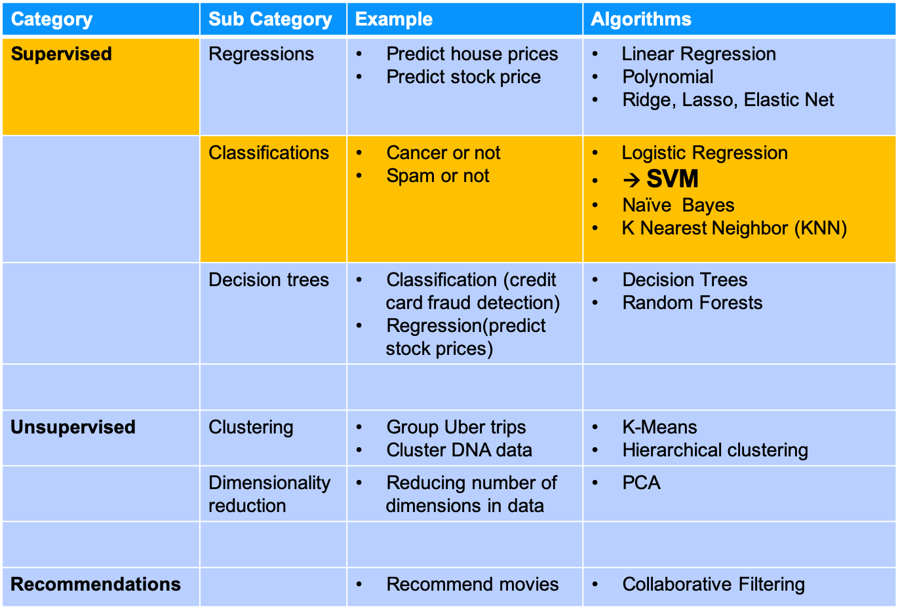
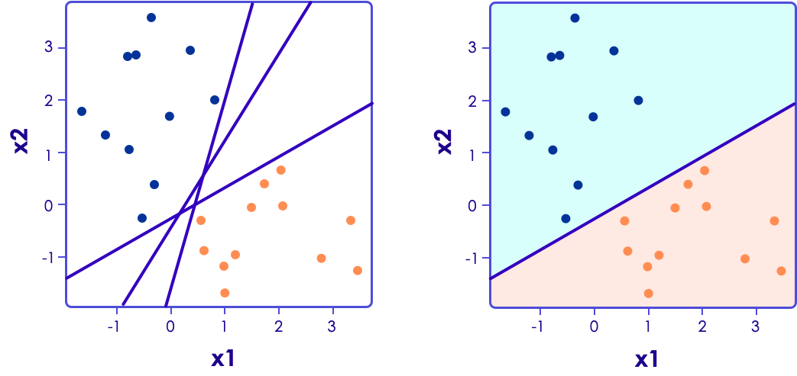
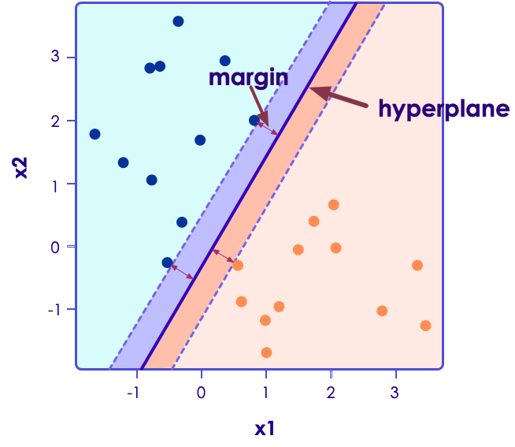
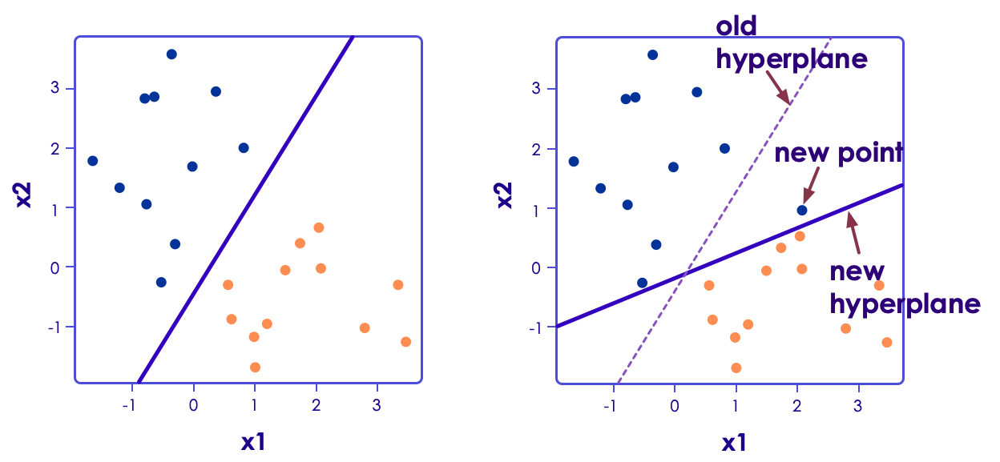
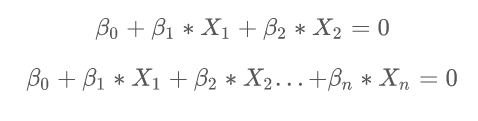
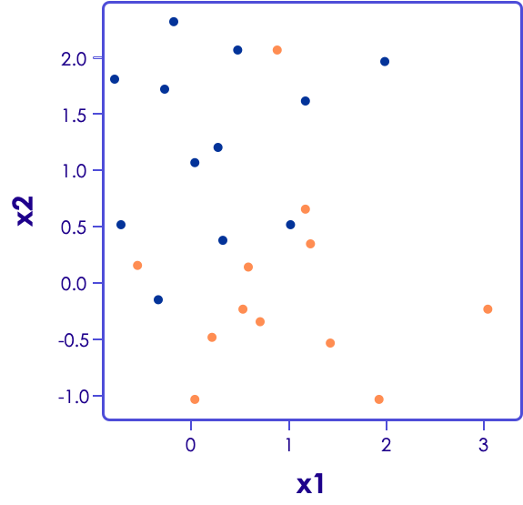
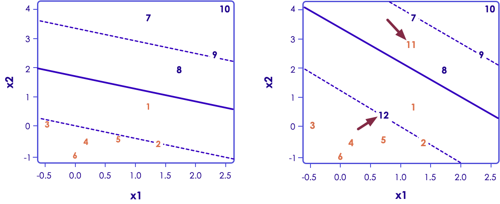
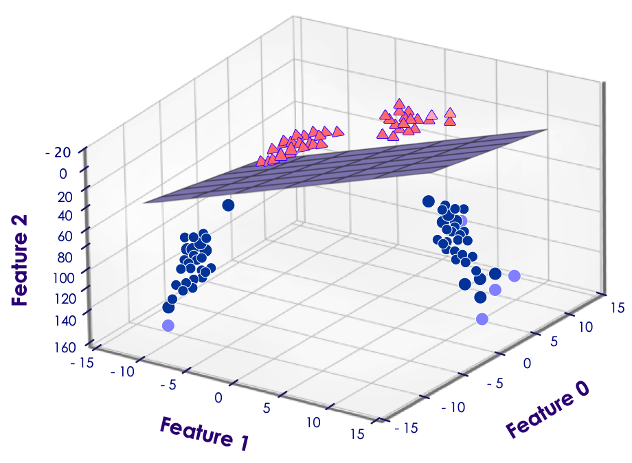
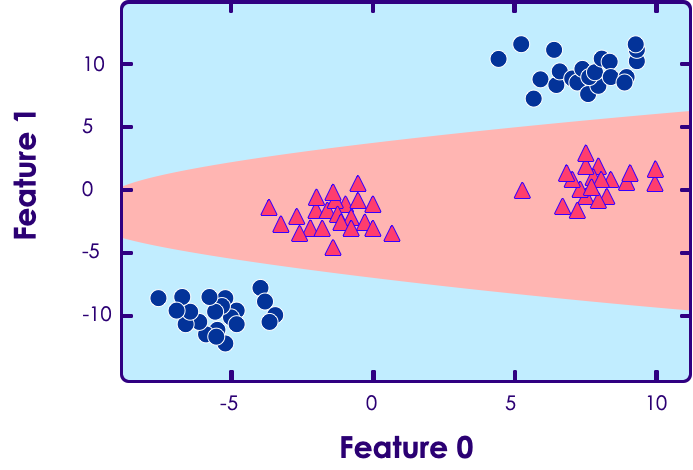

# SVM - Support Vector Machines

---

## Algorithm Summary

<!-- {"left" : 2.55, "top" : 2.74, "height" : 8.22, "width" : 12.41} -->

Notes:
* http://machinelearningmastery.com/supervised-and-unsupervised-machine-learning-algorithms/

---

## SVM - Support Vector Machines

* SVM is a supervised classifier

* It was introduced in mid-1990s

* Became  very popular due to
    - Very accurate classifications
    - High performance (computationally)

* When classes are well separated, SVM performs very well

* When there are overlaps, others like Logistic Regression might work better

Notes:

---

## Theory Behind SVM

* Consider the following data points - Blue and Red

* Since they are in 2D data, a single line can potentially separate them

* Out of many possibilities we choose one, that separates the classes cleanly

<!-- {"left" : 2.66, "top" : 5.35, "height" : 5.7, "width" : 12.19} -->

Notes:

Diagram from "Introduction to Statistical Learning" with thanks to authors

---

## Hyper Planes

<!-- {"left" : 11.49, "top" : 2.18, "height" : 5.07, "width" : 5.84} -->

* When we choose a separating boundary, we want to choose one that separates the points by widest margin
  * more confidence in the classification

* This is called **Maximal Margin Classifier**

Notes:

---

## SVM is Sensitive to Input Data

* Here new point (blue) added shifts the hyper plane dramatically.

* Now even though we have a clean separation, the 'margin' is much narrower

* This leads to lower confidence in prediction

<!-- {"left" : 2.43, "top" : 5.06, "height" : 5.91, "width" : 12.65} -->

Notes:

---

## Math Behind Hyper Planes

* For a 2D problem the hyper plane is a line (first equation)
* For 3D problem hyper plane is a surface / plane
* For P-dimension problem
    - the hyper plane is (P-1) dimensional (second equation)
    - Hard to visualize
* Deciding the class (0 or 1)
    * When you plugin X to the equation, if it evaluates to positive, it belongs in one class
    * If it evaluates to negative, belongs in the other class

<!-- {"left" : 2.82, "top" : 7.75, "height" : 3, "width" : 11.86} -->

Notes:

---

## What if Linear Separation is Not Possible

<!-- {"left" : 11.31, "top" : 2.31, "height" : 5.49, "width" : 5.68} -->

* Here no linear line to __cleanly__ separate blue / orange dots

* We can come up with a line that __mis-classifies__ a few data points

Notes:

---

## Soft Margin Classifier

* In practice, real data is messy and a clean separation by a hyper plane may not be possible

* So the constraint of maximizing the margin of the line that separates classes needs to be relaxed

* Allows some observations to be on the 'wrong side' of the margin or even hyperplane

---

## Soft Margin Classifier

* This is called **'soft margin classifier'**  (soft because it is violated by some observations)

* Here points 8, 11 & 12 are on the wrong side of hyper plane

<!-- {"left" : 2.61, "top" : 5.69, "height" : 5.01, "width" : 12.28} -->

Notes:

---

## Using Soft Margin Classifier

* The tuning parameter is called C (slack variable)

* Defines magnitude of the wiggle allowed across all dimensions

    - C = 0 means no violation is allowed and we are back to the inflexible Maximal-Margin Classifier

    - The larger the value of C the more violations of the hyperplane are permitted

* The smaller the value of C, the more sensitive the algorithm is to the training data (**higher variance and lower bias**)

* The larger the value of C, the less sensitive the algorithm is to the training data (**lower variance and higher bias**)

* Compromise : optimize for overall good prediction, even if we get a few wrong

Notes:

---

## SVM With Kernel Trick

* Standard linear kernel of SVM provides linear separation of data

* As we have seen linear separation is sometimes not possible

    - Solutions: Kernels

    - Polynomial kernel

    - Radical kernel

* SVM Kernels allow SVM to adopt to complex data

Notes:

---

## SVM With Kernel Examples

* Left : Polynomial kernel of degree 3

* Right: Radical kernel

<!-- {"left" : 2.91, "top" : 4.17, "height" : 6.15, "width" : 11.68} -->

Notes:

---

## SVM Kernel Example

* In this (synthetic) data linear separation is not possible

&nbsp;&nbsp;&nbsp;&nbsp;&nbsp;<!-- {"left" : 1.95, "top" : 4.42, "height" : 4.73, "width" : 6.65} --><!-- {"left" : 8.89, "top" : 4.42, "height" : 4.73, "width" : 6.65} -->

Notes:

Reference : Chapter 2, "Introduction to Machine Learning With Python"

---

## SVM Kernel Example

* But adding a higher dimension allows us to separate the points (feature1^2)

&nbsp;<!-- {"left" : 1.95, "top" : 4.02, "height" : 4.98, "width" : 6.78} --><!-- {"left" : 8.76, "top" : 4.02, "height" : 4.98, "width" : 6.78} -->

Notes:

Reference : Chapter 2, "Introduction to Machine Learning With Python"

---

## SVM Kernel Example

* This is the decision boundary of SVM kernel in the above example

<!-- {"left" : 4.07, "top" : 3.68, "height" : 6.35, "width" : 9.37} -->

Notes:

Reference : Chapter 2, "Introduction to Machine Learning With Python"

---

## SVM Kernel Trick Demo

* [Link](https://www.youtube.com/watch?v=3liCbRZPrZA)

<!-- {"left" : 4.94, "top" : 2.62, "height" : 5.08, "width" : 7.62} -->

* The transformation used is: f([x y]) = [x y (x^2+y^2)]

Notes:

https://www.youtube.com/watch?v=3liCbRZPrZA

---

## Preparing Data for SVM

* **Binary Classification**
    - Standard SVM is a binary classifier (class A or B).Extensions are developed for multi-class classification and regressions

* **Numerical Inputs**
    - SVM assumes inputs are numerical.If you have categorical inputs convert it to binary dummy variables

* **Normalize Inputs**
    - SVM assumes that the input data is within standard range.
    - If you have feature-1 that ranges from 1 to 10
    - And feature-2 that ranges from 1 to 1000
    - feature2 will become more important and skew predictions

Notes:

---

## SVM: Strengths, Weaknesses, and Parameters

* **Strengths**
    - Linear SVM can learn fast on linearly separable data
    - Using kernel trick, SVM can adopt to complex data

* **Weaknesses**
    - Sensitive to input data (high variance)
    - Sensitive to tuning parameters
    - Prone to overfit
    - Need to scale data
    - May not scale huge volume of data
    - Complex models can be hard to explain

Notes:

---

## SVM: Strengths, Weaknesses, and Parameters

* **Parameters**
    - Slack variable (C)
    - Regularization parameter (lambda)
    - Choice of kernel (linear, radial, polynomial etc.)

Notes:

---

## Doing SVM

* Next section will show an example on how to do SVM classification
