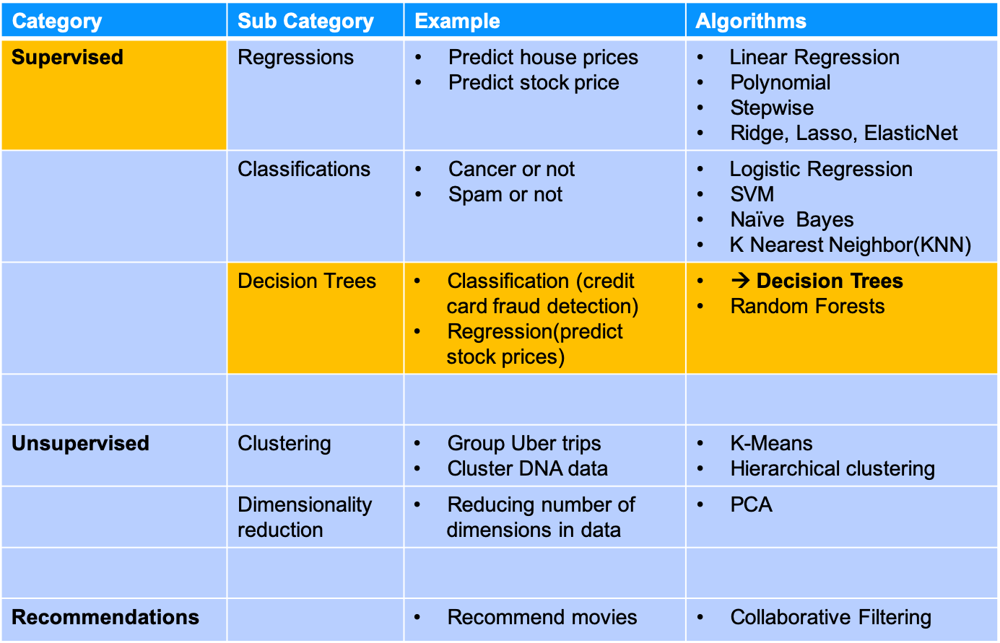
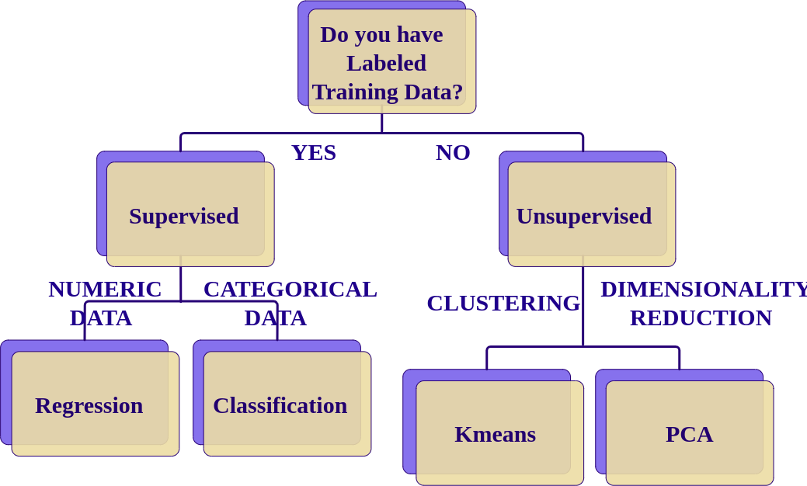
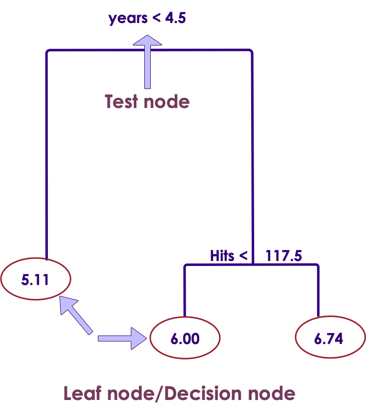
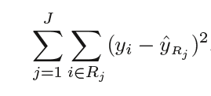
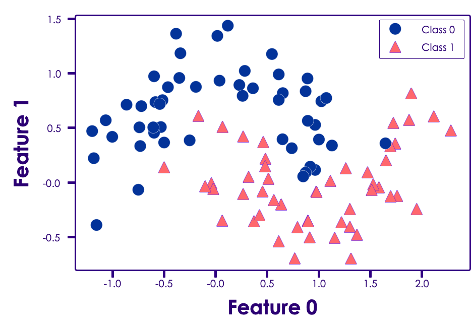

# Decision Trees

---

## Algorithm Summary

<!-- {"left" : 0.57, "top" : 1.3, "height" : 6.02, "width" : 9.11} -->


Notes:

* http://machinelearningmastery.com/supervised-and-unsupervised-machine-learning-algorithms

---

## Exercise: College Admission

* Consider college application and admittance data

*  **Inputs:** GRE:  max 800; GPA: 1.0  to4.0; Rank: 1 (better) to 4

*  **Output**

     - Admitted: Yes or No


| gre     | gpa     | rank.    | admitted     |
|---------|---------|----------|--------------|
| 380     | 3.6     | 3        | No           |
| 660     | 3.67    | 3        | Yes          |
| 800     | 4       | 1        | Yes          |
| 640     | 3.19    | 4        | Yes          |
| 520     | 2.93    | 4        | No           |
| 760     | 3.0     | 2        | Yes          |
| 400     | 3.08    | 2        | No           |
| 700     | 4.0     | 1        | Yes          |
| 500     | 3.17    | 3        | No           |

<!-- {"left" : 0.25, "top" : 3.25, "height" : 5, "width" : 9.75} -->


Notes:


---

## Should I Accept the New Job Offer?

<!-- {"left" : 0.86, "top" : 2.14, "height" : 5.36, "width" : 8.53} -->


Notes:


---

## Example of Decision Tree

<!-- {"left" : 0.5, "top" : 1.59, "height" : 5.89, "width" : 9.25} -->


Notes:


---

## Class Quiz

<!-- {"left" : 5.95, "top" : 1.12, "height" : 2.86, "width" : 4.29} -->

 * **Create a Tree to Classify These Animals**

 * Design a tree with __minimal number of questions__ to identify the following  
 __Bear, Dolphin, Penguin, Eagle, Elephant__

Notes:


---

## Decision Trees Intro


 * Decision Trees are in important algorithm in ML

     - Has long history

     - Classics: Binary Tree (guessing game, customer support)

     - Modern variations: Random Forest, Boosted trees, Bagged trees

 * Trees can be used for both classification and regression.So called  **'Classification and Regression Trees' (CART)**

 * Decision trees are used mostly for classification - **classification trees**

Notes:


---

## Decision Tree Use Cases


 * Customer support - finding a quick resolution based on issues

 * Will a customer purchase a product - given a few conditions

 * Healthcare - symptom diagnosis

Notes:

Medical decision tree use case: https://www.ncbi.nlm.nih.gov/pmc/articles/PMC4251295/


---

## Baseball Player Salary Prediction with Regression Tree


<!-- {"left" : 0.57, "top" : 2.08, "height" : 5.49, "width" : 9.1} -->


Notes:

Image from "An introduction to Statistical Learning"  with thanks to authors


---

## Decision Tree Terminology

<!-- {"left" : 6.34, "top" : 1.23, "height" : 4.32, "width" : 3.83} -->

- Decision Trees are implemented as binary trees

- Question node (years < 4.5)  is called __Test node__

- Leaf nodes / Terminal nodes are __Decision node__


Notes:

Image from "An introduction to Statistical Learning"  with thanks to authors


---

## Storing The Tree Model

<!-- {"left" : 6.65, "top" : 1.05, "height" : 3.93, "width" : 3.48} -->


- Decision Tree can be saved to a file as a graph or set of rules

```
If years < 4.5 Then Salary=5.11
If years >= 4.5 and Hits < 117.5 Then Salary = 6.0
If years >= 4.5 and Hits >= 117.5 Then Salary = 6.74
```
<!-- {"left" : 0, "top" : 5.65, "height" : 1.15, "width" : 9.44} -->


Notes:


---

## Tree Algorithm

<!-- {"left" : 6.02, "top" : 2.2, "height" : 3.09, "width" : 3.96} -->

 * Tree partitions the input space
 * Each input variable as a dimension on an p-dimensional space
 * For 2-dimensional (p-2) data the region is rectangle
 * For higher dimensions (p > 2) => hyper rectangles
 * New data gets filtered through the tree and lands on one rectangle
     - That is the prediction
 * Example
     - Input
        * Years > 4.5?
        * Hits > 117.5?
     - Output: R3

Notes:

Redo pictures and numbers


---

## Creating a Decision Tree


 * We divide all possible values for Y into regions (R1, R2 ... Rj)
     - Distinct
     - Non-overlapping (one data point only assigned to one region)

 * Regions R1, R2, ..., RJ are high-dimensional rectangles
     - Also called `boxes`

 * We want to find a set of boxes that will approximate our data

 * Find the error (prediction vs actual) per each region
     - This is RSS (Residual Sum of Squares)

<!-- {"left" : 0.27, "top" : 4.83, "height" : 1.78, "width" : 3.93} -->


<br/>

 * Try to  **minimize RSS across all regions**
     - The formula calculates RSS across all Regions ( 1 to J)


Notes:


---

## Decision Trees - Region Formulation


 * We would need to consider every possible combination of breaking our data into regions R1, R2, ..., RJ

     - But that is computationally very expensive!

 * Instead, we will take a top-down, `greedy` approach

     - Also known as `recursive binary splitting`

 * First, let us illustrate this with an example

Notes:


---

## Example: Guessing Game

<!-- {"left" : 5.6, "top" : 1.03, "height" : 3.55, "width" : 4.55} -->

 * Let us say the first person choose a number in the range of 1 through 100

 * The second person should ask
     - Is it bigger than 50?  
     answer is `no`

     - Next: is it bigger than 25?  
      the answer is `yes`

     - Next: is it bigger than 37?

 * **Greedy algorithm** for decision trees works in a similar way


Notes:

Source: https://uploads7.wikiart.org/images/honore-daumier/chess-players.jpg!HalfHD.jpg


---

## Greedy Algorithm

<!-- {"left" : 5.86, "top" : 2.14, "height" : 3.7, "width" : 4.02} -->

 * Greedy approach used to divide up the input space is called 'binary recursive split'

 * Different split points are tested using a cost function

     - In regression trees the cost function is RSS

     - For classification trees the cost function is Gini index (covered later)

 * Split with the best cost (lowest cost) is chosen

 * Best split is chosen each time / level


Notes:


---

## What it means to be greedy?

<!-- {"left" : 5.86, "top" : 2.14, "height" : 3.7, "width" : 4.02} -->

 * Select the `best split` from a set of possible splits

 * Maximize the information gain at a tree node

 * Greedy algorithm may not find the best tree

     - Grabs the best at each step

     - Does not consider all steps together


Notes:


---

## Tree Creation Example


 * Here is some synthetic dataset (2 dimensional)

 * We will create a decision tree to identify the classes

<!-- {"left" : 1.74, "top" : 2.56, "height" : 4.52, "width" : 6.76} -->


Notes:

Reference : Chapter 2 , "Machine Learning With Python" by Sarah Guido, Andreas C. Muller (ISBN: 9781449369415)


---

## Tree Creation Example


 * At depth=1

<!-- {"left" : 0.75, "top" : 2.59, "height" : 3.15, "width" : 8.74} -->


Notes:

Reference : Chapter 2 , "Machine Learning With Python" by Sarah Guido, Andreas C. Muller (ISBN: 9781449369415)


---

## Tree Creation Example


 * At depth=2

<!-- {"left" : 0.24, "top" : 2.48, "height" : 2.84, "width" : 9.77} -->


Notes:

Reference : Chapter 2 , "Machine Learning With Python" by Sarah Guido, Andreas C. Muller (ISBN: 9781449369415)


---

## Tree Creation Example


 * At depth=9

 * We can see the tree is over fitting

<!-- {"left" : 0.25, "top" : 2.91, "height" : 3.25, "width" : 9.74} -->


Notes:

Reference: Chapter 2 , "Machine Learning With Python" by Sarah Guido, Andreas C. Muller (ISBN: 9781449369415)


---

## Preventing Trees Overfitting


 * Tree algorithm will recursively partition the dataset until each partition contains a single class (A or B)

     - This is called pure partition (only contains one class)

 * This leads to a very complex tree that overfit the training data

 * Preventing overfitting:

     - Set the maximum depth of the tree (essentially pruning the tree)

     - Set maximum number of nodes/bins

     - Set minimum elements per node

     - Set minimum purity per node

Notes:


---

## Stopping Criteria 1:

*  **Min number of elements per node**

<!--{"left" : 5.98, "top" : 2.55, "height" : 2.42, "width" : 4.11} -->

 * Most common stopping criteria is Minimum instances per node

     - Say minimum per node = 5

     - We are splitting Node A with 10 observations

     - Node B1 = 4 observations

     - Node B2 = 6 observations

     - Now Node B1 is considered a leaf node (4 < minimum 5) (no more splitting it)

     - Node B2 is split farther into C1 and C2


Notes:

---

## Stopping Criteria 1:
* **Min number of elements per node**

* If we set minimum_per_node = 1

     - Each node will have 1 data point

     - We will have number_of_leaf_nodes = number of data points
     - => overfit!


Notes:


---

## Tree Pruning


 * Trees can grow arbitrarily large / deep

 * While they predict training set well, they may overfit !

 * So prune the tree
     - Reduce overfitting
     - Stable predictions, even if they are not most accurate
     - Make the tree simpler -> easier to understand

---

## Tree Pruning

* How to prune?

     - Walk through each leaf node

     - Evaluate the effect of removing it using hold-out test set

     - Stop removing when no further improvements can be made

 * A 'sub tree' is chosen after pruning

     - We can not consider every possible sub-tree.. Too many!

     - Use a heuristic called `minimize alpha / tuning parameter`

Notes:

---

## Tree Pruning


 * Heart condition tree

 * To simplify

     - Cut away branches (at max depth)

     - Combine nodes

<!-- {"left" : 0.49, "top" : 3.42, "height" : 3.07, "width" : 6.03} --><!-- {"left" : 6.84, "top" : 3.42, "height" : 3.07, "width" : 2.92} -->

Notes:


---

## Classification Decision Trees


 * Instead of predicting a number, predict a classification (Spam / Not-Spam)

 * In Regression Trees we use RSS (minimizing RSS) to find best regions

 * In Classification Trees we can not use RSS (the observations may be not be numeric)

 * Instead

     - We should predict the most common class

     - Therefore, let's optimize the error rate

 * Two choices are

     - Gini Index

     - Entropy

Notes:


---

## Gini Index (G)

<!--{"left" : 5.71, "top" : 1.27, "height" : 3.3, "width" : 4.46} -->

 * Gini index measures the 'purity' of each node (how mixed data is in one Region)

 * P<sub>k</sub> = proportion of class k in that region

 * A region with all classes of same type will have G = 0

 * If all of  *P*<sub>*mk*</sub>  are close to 0 or to 1, G is small

<!--{"left" : 6.05, "top" : 6.36, "height" : 1.44, "width" : 3.96} -->

 * If region has 50%-50%  mix then G = 0.5  (worst purity)

 *  **Goal: minimize G score**


Notes:


---

## Gini Index Example


 * Here we have a classifier: class-1  and class-2

 * P1: proportion of class-1

 * P2: proportion of class-2

 * Calculating Gini index as follows

<!-- {"left" : 3.22, "top" : 3.28, "height" : 0.94, "width" : 3.81} --><!-- {"left" : 1.44, "top" : 4.55, "height" : 2.15, "width" : 8.14} -->

Notes:


---

## Decision Trees: Strengths, Weaknesses, and Parameters


 *  **Strengths**
     - All purpose classifier that does well in most scenarios
     - Easy to interpret and explain results
     - Fast learning and prediction
     - Can handle numeric and categorical data
     - No need to scale data
     - Can handle missing data
     - Excluded unimportant features
     - Can work with small datasets
     - But can also scale to large datasets

Notes:


---

## Decision Trees: Strengths, Weaknesses, and Parameters


 *  **Weaknesses**
     - Can overfit
     - Small changes in training data causes large changes in tree structure (High variance)
     - Trees can get arbitrarily deep
     - Often biased towards features with large number of splits

 *  **Parameters**
     - Max depth: how deep a tree can grow
     - Max bins: how many nodes/bins the tree can have
     - Min samples per leaf: stop keep dividing

Notes:


