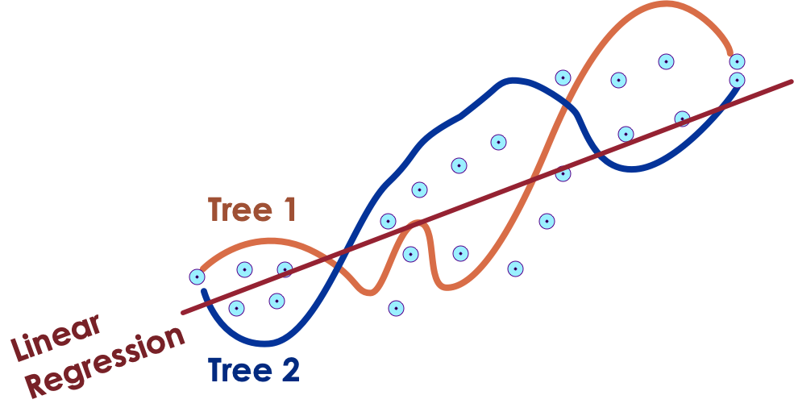
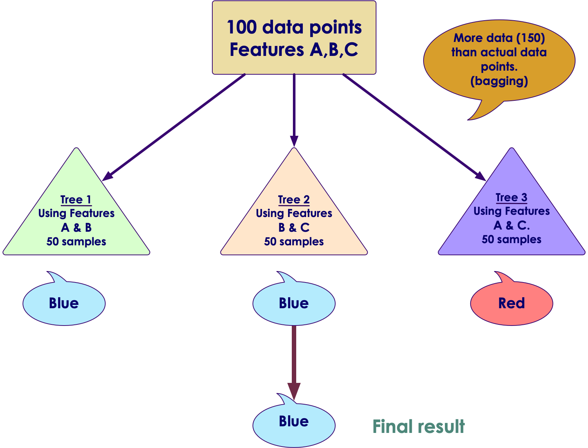

# Random Forests

---

## Algorithm Summary

<!-- {"left" : 0.57, "top" : 1.53, "height" : 6.02, "width" : 9.11} -->

Notes:

http://machinelearningmastery.com/supervised-and-unsupervised-machine-learning-algorithms/

---

## Decision Tree Problems

 *  **Decision Trees' pros**

    * Works rather well

    * Decision are visual and are easy to explain

    * Easy to scale to large datasets

 *  **Decision Trees' drawbacks**

     - They are not stable

     - They are not very precise

 *  **In Machine Learning terms**

     - Decision Trees have high variance (bad)

     - Decision Trees have low bias (good)

Notes:

---

## Bias Variance Tradeoff

[ML-Concepts-Bias-Variance.md](ML-Concepts-Bias-Variance.md)

---

## Each DT Exhibits High Variance and Overfits

 * A tree may fit some of the data well

 * But another tree may fit the other part of the data

 * Neither of them will work well in the real world

<!-- {"left" : 1.86, "top" : 2.66, "height" : 4.46, "width" : 6.53} -->

Notes:

---

## Bias Variance Tradeoff

 * Decision Trees have low bias, and that is good

 * By contrast, Linear Regression has high bias
     - It has less capacity to reflect complex data

<!--{"left" : 1.74, "top" : 2.55, "height" : 4.67, "width" : 6.76} -->

Notes:

---

## Ensembles of Decision Trees

 *  **Ensembles**  are methods that combine multiple machine learning models to create more powerful model

     - `wisdom of many is more than of one`

 * There are many ensemble methods, but two are most popular

     -  **Random forest**

     -  **Gradient boosted tree**

 * Both of these use Decision Trees as their building blocks

Notes:

---

## Random Forests Idea

 * We want to keep low bias but add low variance

 *  **Approach**
     - Generate many decision trees
     - Each tree will operate on
        * Randomly bootstrapped subset of data (minimize overfitting)
        * Randomly chosen feature set (reduce correlation)
     - Each tree will be random and deep, and not pruned
     - And aggregate their predictions

<!-- {"left" : 1.02, "top" : 5.22, "height" : 1.67, "width" : 8.21} -->

Notes:

---

## Bagging (Boosting Aggregation) In Action

<!-- {"left" : 6.04, "top" : 1.18, "height" : 3.51, "width" : 4.11} -->

 * We create 3 trees with  **Boosting**

     - Note : total sample points (150) > actual data points (100)

 * Each tree is predicting blue or red

 * Final result is  **aggregated**  ( **bagging** )

Notes:

---

## Data Bagging Performance

 * We specify number of trees to create

 * More trees will take more time

 * Stop creating more trees when accuracy stops increasing
     - This can be validated by  **cross-validation**  testing

 * Pros:
     - It will not over-fit the data.Because data is randomly split

 * Cons:
     - Even with bagging trees will have lot of structural similarities
     - Their predictions will be highly co-related

Notes:

---

## Improving Bagging

 * Data Bagging (selecting random subsets of data) solved overfitting problem

     - But we still have a problem of trees predicting highly correlated results

 * Solution: **We also select features randomly!**

 * For each tree, we will select a different set of features

 * Then we will average the results

 * This is called **feature bagging**

Notes:

---

## Data & Feature Bagging in Action

<!-- {"left" : 5.67, "top" : 1.15, "height" : 3.41, "width" : 4.47} -->

 * We have 3 trees, each operating on

     - Randomly selected subset of data

     - And randomly selected features (A,B,C)

 * Their predictions are aggregated for final result

Notes:

---

## Random Forest: Making Final Prediction

 * Aggregating regression trees
     - Average out results
     - Tree1 predicts 10,   Tree2 predicts 15,  Tree3 predicts 12
     - Final result = average = (10 + 15 + 12) / 3  = 12.33

 * For classification trees
     - A **soft voting** approach is used
     - Each tree makes a `soft` prediction: provides a probability for each possible output
     - The probabilities from all trees are averaged
     - The class with highest probability is predicted

---
## Random Forest: Making Final Prediction

 * Each random tree might have high variance.When averaged, the combined variance is reduced.Variance of a forest = Variance of a tree / Number of trees

 * Bagging results in the improvement of accuracy

Notes:

---

## Random Forest Example

 * We see decision boundaries by the five trees are different.

 * Ad they overfit

 * Final Random Forest overfits less than each individual tree

<!-- {"left" : 1.02, "top" : 3.12, "height" : 4.21, "width" : 8.21} -->

Notes:

Source : `Introduction to Machine Learning with Python` by Sarah Guido, Andreas C. Muller  (ISBN: 9781449369415)

---

## Random Forest: Strengths, Weaknesses, and Parameters

 *  **Strength**

     - All purpose classifier that does well in most scenarios

     - Performs better than a single Decision Tree (reduces variance)

     - Very simple tuning (number of trees)

     - Can handle numeric and categorical data

     - Doesn't need scaling of data

---

## Random Forest: Strengths, Weaknesses, and Parameters

 *  **Weaknesses**

     - Training can be computationally intensive (if training 100s or 1000s of trees)

        * Parallelizable across many CPU cores or nodes

     - Final model can be more complex than a single decision tree

 *  **Parameters**

     - Number of trees to create

Notes:

