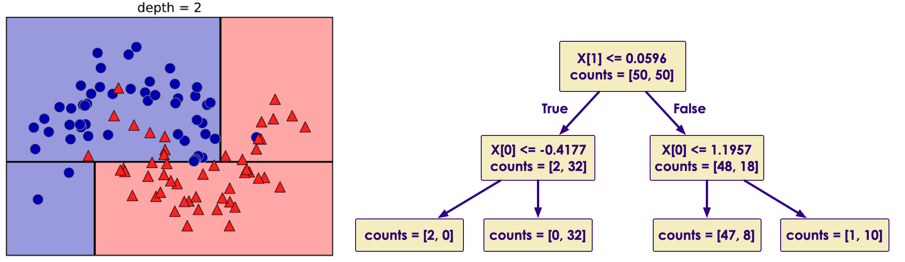
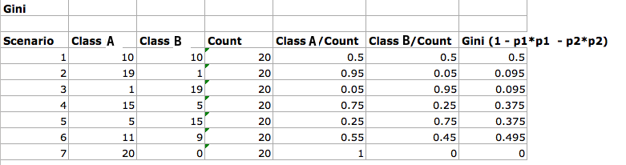
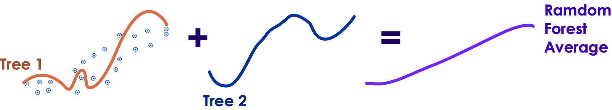

# Decision Trees and Random Forest
---

## Lesson Objectives

 * Learn the following algorithms

     - Decision Trees

     - Random Forest

Notes:

---

# Decision Trees

---

## Algorithm Summary

<!-- {"left" : 0.57, "top" : 0.98, "height" : 6.02, "width" : 9.11} -->


Notes:

* http://machinelearningmastery.com/supervised-and-unsupervised-machine-learning-algorithms

---

## Exercise: College Admission

* Consider college application and admittance data

*  **Inputs:** GRE:  max 800; GPA: 1.0  to4.0; Rank: 1 (better) to 4

*  **Output**

     - Admitted: Yes or No


| **gre** | **gpa** | **rank** | **admitted** |
|---------|---------|----------|--------------|
| 380     | 3.6     | 3        | No           |
| 660     | 3.67    | 3        | Yes          |
| 800     | 4       | 1        | Yes          |
| 640     | 3.19    | 4        | Yes          |
| 520     | 2.93    | 4        | No           |
| 760     | 3.0     | 2        | Yes          |
| 400     | 3.08    | 2        | No           |
| 700     | 4.0     | 1        | Yes          |
| 500     | 3.17    | 3        | No           |

Notes:


---

## Should I Accept the New Job Offer?

<!-- {"left" : 0.86, "top" : 1.31, "height" : 5.36, "width" : 8.53} -->


Notes:


---

## Example of Decision Tree

<!-- {"left" : 0.5, "top" : 1.04, "height" : 5.89, "width" : 9.25} -->


Notes:


---

## Class Quiz


 * **Create a Tree to Classify These Animals**

 * Design a tree with __minimal number of questions__ to identify the following  
 __Bear, Dolphin, Penguin, Eagle, Elephant__

Notes:


---

## Decision Trees Intro


 * Decision Trees are in important algorithm in ML

     - Has long history

     - Classics: Binary Tree (guessing game, customer support)

     - Modern variations: Random Forest, Boosted trees, Bagged trees

 * Trees can be used for both classification and regression.So called  **'Classification and Regression Trees' (CART)**

 * Decision trees are used mostly for classification - **classification trees**

Notes:


---

## Decision Tree Use Cases


 * Customer support - finding a quick resolution based on issues

 * Will a customer purchase a product - given a few conditions

 * Healthcare - symptom diagnosis

Notes:

Medical decision tree use case: https://www.ncbi.nlm.nih.gov/pmc/articles/PMC4251295/


---

## Baseball Player Salary Prediction with Regression Tree


<!-- {"left" : 0.57, "top" : 1.24, "height" : 5.49, "width" : 9.1} -->


Notes:

Image from "An introduction to Statistical Learning"  with thanks to authors


---

## Decision Tree Terminology

<!-- TODO shiva  -->
<!-- {"left" : 0.57, "top" : 1.24, "height" : 5.49, "width" : 9.1} -->

- Decision Trees are implemented as binary trees

- Question node (years < 4.5)  is called __Test node__

- Leaf nodes / Terminal nodes are __Decision node__


Notes:

Image from "An introduction to Statistical Learning"  with thanks to authors


---

## Storing The Tree Model

<!-- TODO shiva  -->
<!-- {"left" : 0.57, "top" : 1.24, "height" : 5.49, "width" : 9.1} -->

- Decision Tree can be saved to a file as a graph or set of rules

```code

If years < 4.5 Then Salary=5.11
If years >= 4.5 and Hits < 117.5 Then Salary = 6.0
If years >= 4.5 and Hits >= 117.5 Then Salary = 6.74
```
<!-- {"left" : 0, "top" : 1.11, "height" : 1.45, "width" : 10.25} -->


Notes:


---

## Tree Algorithm

<!-- {"left" : 6.02, "top" : 2.2, "height" : 3.09, "width" : 3.96} -->

 * Tree partitions the input space
 * Each input variable as a dimension on an p-dimensional space
 * For 2-dimensional (p-2) data the region is rectangle
 * For higher dimensions (p > 2) => hyper rectangles
 * New data gets filtered through the tree and lands on one rectangle
     - That is the prediction
 * Example
     - Input
        * Years > 4.5?
        * Hits > 117.5?
     - Output: R3

Notes:

Redo pictures and numbers


---

## Creating a Decision Tree


 * We divide all possible values for Y into regions (R1, R2 ... Rj)
     - Distinct
     - Non-overlapping (one data point only assigned to one region)

 * Regions R1, R2, ..., RJ are high-dimensional rectangles
     - Also called `boxes`

 * We want to find a set of boxes that will approximate our data

 * Find the error (prediction vs actual) per each region
     - This is RSS (Residual Sum of Squares)

<!--{"left" : 3.48, "top" : 5.53, "height" : 1.5, "width" : 3.3} -->

 * Try to  **minimize RSS across all regions**
     - The formula calculates RSS across all Regions ( 1 to J)


Notes:


---

## Decision Trees - Region Formulation


 * We would need to consider every possible combination of breaking our data into regions R1, R2, ..., RJ

     - But that is computationally very expensive!

 * Instead, we will take a top-down, `greedy` approach

     - Also known as `recursive binary splitting`

 * First, let us illustrate this with an example

Notes:


---

## Example: Guessing Game

<!--{"left" : 6.61, "top" : 2.56, "height" : 2.38, "width" : 3.05} -->

 * Let us say the first person choose a number in the range of 1 through 100

 * The second person should ask
     - Is it bigger than 50?  
     answer is `no`

     - Next: is it bigger than 25?  
      the answer is `yes`

     - Next: is it bigger than 37?

 * **Greedy algorithm** for decision trees works in a similar way


Notes:

Source: https://uploads7.wikiart.org/images/honore-daumier/chess-players.jpg!HalfHD.jpg


---

## Greedy Algorithm

<!-- {"left" : 5.86, "top" : 2.14, "height" : 3.7, "width" : 4.02} -->

 * Greedy approach used to divide up the input space is called 'binary recursive split'

 * Different split points are tested using a cost function

     - In regression trees the cost function is RSS

     - For classification trees the cost function is Gini index (covered later)

 * Split with the best cost (lowest cost) is chosen

 * Best split is chosen each time / level


Notes:


---

## What it means to be greedy?

<!-- {"left" : 5.86, "top" : 2.14, "height" : 3.7, "width" : 4.02} -->

 * Select the `best split` from a set of possible splits

 * Maximize the information gain at a tree node

 * Greedy algorithm may not find the best tree

     - Grabs the best at each step

     - Does not consider all steps together


Notes:


---

## Tree Creation Example


 * Here is some synthetic dataset (2 dimensional)

 * We will create a decision tree to identify the classes

<!-- {"left" : 1.74, "top" : 2.24, "height" : 4.52, "width" : 6.76} -->


Notes:

Reference : Chapter 2 , "Machine Learning With Python" by Sarah Guido, Andreas C. Muller (ISBN: 9781449369415)


---

## Tree Creation Example


 * At depth=1

<!-- {"left" : 0.49, "top" : 2.32, "height" : 3.33, "width" : 9.27} -->


Notes:

Reference : Chapter 2 , "Machine Learning With Python" by Sarah Guido, Andreas C. Muller (ISBN: 9781449369415)


---

## Tree Creation Example


 * At depth=2

<!-- {"left" : 0.64, "top" : 2.37, "height" : 3.23, "width" : 8.97} -->


Notes:

Reference : Chapter 2 , "Machine Learning With Python" by Sarah Guido, Andreas C. Muller (ISBN: 9781449369415)


---

## Tree Creation Example


 * At depth=9

 * We can see the tree is over fitting

<!-- {"left" : 0.64, "top" : 2.26, "height" : 3.45, "width" : 8.97} -->


Notes:

Reference: Chapter 2 , "Machine Learning With Python" by Sarah Guido, Andreas C. Muller (ISBN: 9781449369415)


---

## Preventing Trees Overfitting


 * Tree algorithm will recursively partition the dataset until each partition contains a single class (A or B)

     - This is called pure partition (only contains one class)

 * This leads to a very complex tree that overfit the training data

 * Preventing overfitting:

     - Set the maximum depth of the tree (essentially pruning the tree)

     - Set maximum number of nodes/bins

     - Set minimum elements per node

     - Set minimum purity per node

Notes:


---

## Stopping Criteria 1:

*  **Min number of elements per node**

<!--{"left" : 6.3, "top" : 4.57, "height" : 2.16, "width" : 3.67} -->

 * Most common stopping criteria is Minimum instances per node

     - Say minimum per node = 5

     - We are splitting Node A with 10 observations

     - Node B1 = 4 observations

     - Node B2 = 6 observations

     - Now Node B1 is considered a leaf node (4 < minimum 5) (no more splitting it)

     - Node B2 is split farther into C1 and C2


Notes:

---

## Stopping Criteria 1:
* **Min number of elements per node**

* If we set minimum_per_node = 1

     - Each node will have 1 data point

     - We will have number_of_leaf_nodes = number of data points
     - => overfit!


Notes:


---

## Tree Pruning


 * Trees can grow arbitrarily large / deep

 * While they predict training set well, they may overfit !

 * So prune the tree
     - Reduce overfitting
     - Stable predictions, even if they are not most accurate
     - Make the tree simpler -> easier to understand

---

## Tree Pruning

* How to prune?

     - Walk through each leaf node

     - Evaluate the effect of removing it using hold-out test set

     - Stop removing when no further improvements can be made

 * A 'sub tree' is chosen after pruning

     - We can not consider every possible sub-tree.. Too many!

     - Use a heuristic called `minimize alpha / tuning parameter`

Notes:

---

## Tree Pruning


 * Heart condition tree

 * To simplify

     - Cut away branches (at max depth)

     - Combine nodes

<!-- {"left" : 0.49, "top" : 3.42, "height" : 3.07, "width" : 6.03} --><!-- {"left" : 6.84, "top" : 3.42, "height" : 3.07, "width" : 2.92} -->

Notes:


---

## Classification Decision Trees


 * Instead of predicting a number, predict a classification (Spam / Not-Spam)

 * In Regression Trees we use RSS (minimizing RSS) to find best regions

 * In Classification Trees we can not use RSS (the observations may be not be numeric)

 * Instead

     - We should predict the most common class

     - Therefore, let's optimize the error rate

 * Two choices are

     - Gini Index

     - Entropy

Notes:


---

## Gini Index (G)

<!-- TODO shiva  -->

<!--{"left" : 5.37, "top" : 3.9, "height" : 3.28, "width" : 4.43} -->

<!-- {"left" : 0.73, "top" : 4.84, "height" : 1.4, "width" : 3.83} -->

 * Gini index measures the 'purity' of each node (how mixed data is in one Region)

 * P<sub>k</sub> = proportion of class k in that region

 * A region with all classes of same type will have G = 0

 * If all of  *P*<sub>*mk*</sub>  are close to 0 or to 1, G is small

 * If region has 50%-50%  mix then G = 0.5  (worst purity)

 *  **Goal: minimize G score**


Notes:


---

## Gini Index Example


 * Here we have a classifier: class-1  and class-2

 * P1: proportion of class-1

 * P2: proportion of class-2

 * Calculating Gini index as follows

<!-- {"left" : 3.22, "top" : 3.28, "height" : 0.94, "width" : 3.81} --><!-- {"left" : 1.44, "top" : 4.55, "height" : 2.15, "width" : 8.14} -->

Notes:


---

## Decision Trees: Strengths, Weaknesses, and Parameters


 *  **Strengths**
     - All purpose classifier that does well in most scenarios
     - Easy to interpret and explain results
     - Fast learning and prediction
     - Can handle numeric and categorical data
     - No need to scale data
     - Can handle missing data
     - Excluded unimportant features
     - Can work with small datasets
     - But can also scale to large datasets

Notes:


---

## Decision Trees: Strengths, Weaknesses, and Parameters


 *  **Weaknesses**
     - Can overfit
     - Small changes in training data causes large changes in tree structure (High variance)
     - Trees can get arbitrarily deep
     - Often biased towards features with large number of splits

 *  **Parameters**
     - Max depth: how deep a tree can grow
     - Max bins: how many nodes/bins the tree can have
     - Min samples per leaf: stop keep dividing

Notes:


---

## About the `Prosper` Dataset

 <!-- {"left" : 7.32, "top" : 1.12, "height" : 0.63, "width" : 2.68} -->

 * https://www.prosper.com/

 * America's first peer-to-peer lending marketplace

     - 2 million +  members

     - $ 2 B + in  funded loans

 * Dataset is public

     - 113,937 loans with 81 variables


Notes:


---

## Variables in the Prosper Dataset

| **#** | **Name**                  |**Name** | **#**                  |
|-------|---------------------------|---------|------------------------|
| 1     | ListingKey                |2        | ListingNumber          |
| 3     | ListingCreationDate       |4        | CreditGrade            |
| 5     | Term                      |6        | LoanStatus             |
| 7     | ClosedDate                |8        | BorrowerAPR            |
| 9     | BorrowerRate              |10       | LenderYield            |
| 11    | EstimatedEffectiveYield   |12       | EstimatedLoss          |
| 13    | EstimatedReturn           |14       | ProsperRating..numeric |
| 15    | ProsperRating..Alpha      |16       | ProsperScore           |
| 17    | ListingCategory..numeric  |18       | BorrowerState          |
| 19    | Occupation                |20       | EmploymentStatus       |
| 21    | EmploymentStatusDuration  |22       | IsBorrowerHomeowner    |
| 23    | CurrentlyInGroup          |...      | And so on, till #81    |

Notes:


---

## Lab: Decision Trees


 *  **Overview**
 Create a classification decision tree

 *  **Approximate Time** 30 mins

 *  **Instructions**

     -  Review next few slides for sample code in  Python / Spark / R

     -  **DT-1: college-admission**

     -  **DT-2: prosper-loans**

<!-- {"left" : 3.46, "top" : 3.05, "height" : 1.88, "width" : 3.33} -->


Notes:


---

# Random Forest

---


## Algorithm Summary

<!-- {"left" : 0.87, "top" : 1.17, "height" : 5.63, "width" : 8.52} -->


Notes:

http://machinelearningmastery.com/supervised-and-unsupervised-machine-learning-algorithms/


---

## Decision Tree Problems


 *  **Decision Trees' pros**

    * Works rather well

    * Decision are visual and are easy to explain

    * Easy to scale to large datasets

 *  **Decision Trees' drawbacks**

     - They are not stable

     - They are not very precise

 *  **In Machine Learning terms**

     - Decision Trees have high variance (bad)

     - Decision Trees have low bias (good)

Notes:


---

## Bias Variance Tradeoff

[ML-Concepts-Bias-Variance.md](ML-Concepts-Bias-Variance.md)

---

## Each DT Exhibits High Variance and Overfits


 * A tree may fit some of the data well

 * But another tree may fit the other part of the data

 * Neither of them will work well in the real world

<!-- {"left" : 1.86, "top" : 2.66, "height" : 4.46, "width" : 6.53} -->


Notes:

---

## Bias Variance Tradeoff


 * Decision Trees have low bias, and that is good

 * By contrast, Linear Regression has high bias
     - It has less capacity to reflect complex data

<!--{"left" : 1.74, "top" : 2.55, "height" : 4.67, "width" : 6.76} -->


Notes:


---

## Ensembles of Decision Trees


 *  **Ensembles**  are methods that combine multiple machine learning models to create more powerful model

     - `wisdom of many is more than of one`

 * There are many ensemble methods, but two are most popular

     -  **Random forest**

     -  **Gradient boosted tree**

 * Both of these use Decision Trees as their building blocks

Notes:


---

## Random Forests Idea


 * We want to keep low bias but add low variance

 *  **Approach**
     - Generate many decision trees
     - Each tree will operate on
        * Randomly bootstrapped subset of data (minimize overfitting)
        * Randomly chosen feature set (reduce correlation)
     - Each tree will be random and deep, and not pruned
     - And aggregate their predictions

<!-- {"left" : 1.02, "top" : 5.22, "height" : 1.67, "width" : 8.21} -->


Notes:


---

## Bagging (Boosting Aggregation) In Action

<!-- {"left" : 2.95, "top" : 3.12, "height" : 3.72, "width" : 4.36} -->

 * We create 3 trees with  **Boosting**

     - Note : total sample points (150) > actual data points (100)

 * Each tree is predicting blue or red

 * Final result is  **aggregated**  ( **bagging** )

Notes:


---

## Data Bagging Performance


 * We specify number of trees to create

 * More trees will take more time

 * Stop creating more trees when accuracy stops increasing
     - This can be validated by  **cross-validation**  testing

 * Pros:
     - It will not over-fit the data.Because data is randomly split

 * Cons:
     - Even with bagging trees will have lot of structural similarities
     - Their predictions will be highly co-related

Notes:


---

## Improving Bagging


 * Data Bagging (selecting random subsets of data) solved overfitting problem

     - But we still have a problem of trees predicting highly correlated results

 * Solution: **We also select features randomly!**

 * For each tree, we will select a different set of features

 * Then we will average the results

 * This is called **feature bagging**

Notes:


---

## Data & Feature Bagging in Action


<!--{"left" : 4.17, "top" : 2.9, "height" : 4.22, "width" : 5.75} -->

 * We have 3 trees, each operating on

     - Randomly selected subset of data

     - And randomly selected features (A,B,C)

 * Their predictions are aggregated for final result


Notes:


---

## Random Forest: Making Final Prediction


 * Aggregating regression trees
     - Average out results
     - Tree1 predicts 10,   Tree2 predicts 15,  Tree3 predicts 12
     - Final result = average = (10 + 15 + 12) / 3  = 12.33

 * For classification trees
     - A **soft voting** approach is used
     - Each tree makes a `soft` prediction: provides a probability for each possible output
     - The probabilities from all trees are averaged
     - The class with highest probability is predicted

---
## Random Forest: Making Final Prediction

 * Each random tree might have high variance.When averaged, the combined variance is reduced.Variance of a forest = Variance of a tree / Number of trees

 * Bagging results in the improvement of accuracy

Notes:


---

## Random Forest Example


 * We see decision boundaries by the five trees are different.

 * Ad they overfit

 * Final Random Forest overfits less than each individual tree

<!-- {"left" : 1.02, "top" : 2.6, "height" : 4.21, "width" : 8.21} -->


Notes:

Source : `Introduction to Machine Learning with Python` by Sarah Guido, Andreas C. Muller  (ISBN: 9781449369415)


---

## Random Forest: Strengths, Weaknesses, and Parameters

 *  **Strength**

     - All purpose classifier that does well in most scenarios

     - Performs better than a single Decision Tree (reduces variance)

     - Very simple tuning (number of trees)

     - Can handle numeric and categorical data

     - Doesn't need scaling of data

---

## Random Forest: Strengths, Weaknesses, and Parameters

 *  **Weaknesses**

     - Training can be computationally intensive (if training 100s or 1000s of trees)

        * Parallelizable across many CPU cores or nodes

     - Final model can be more complex than a single decision tree

 *  **Parameters**

     - Number of trees to create

Notes:


---

## Lab: Random Forest


 *  **Overview**

 *  **Approximate Time** 30 mins

 *  **Instructions** 

     - Review next few slides for sample code in  Python / Spark / R

     - RF1: Prosper loan data (classification)

     - RF2: Election contribution data (classification)

     - RF3: Election contribution data (regression)

Notes:


---

## Review Questions


Notes:
