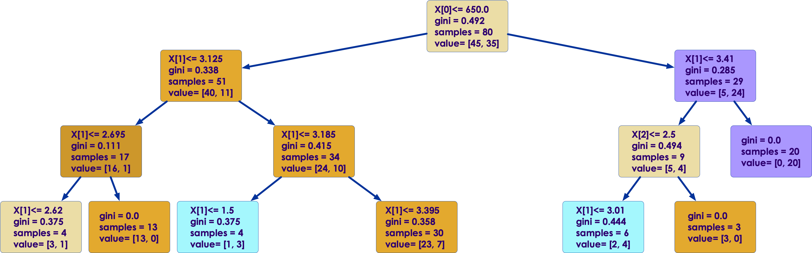
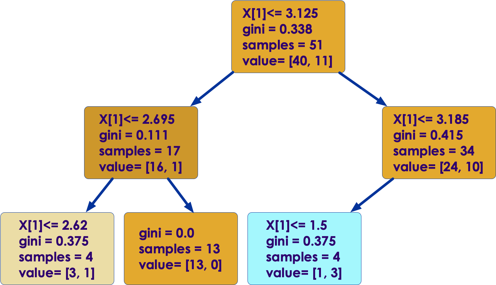
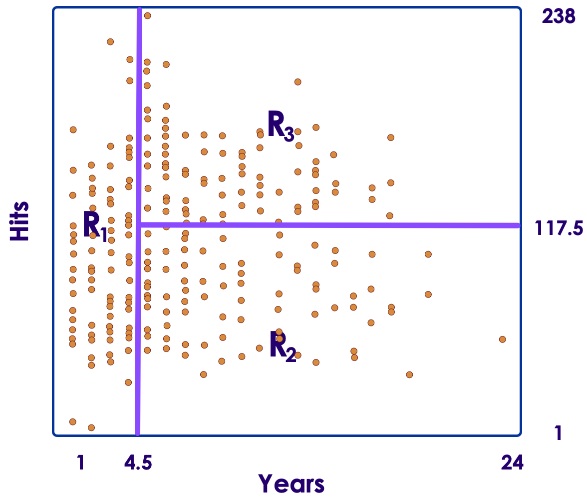
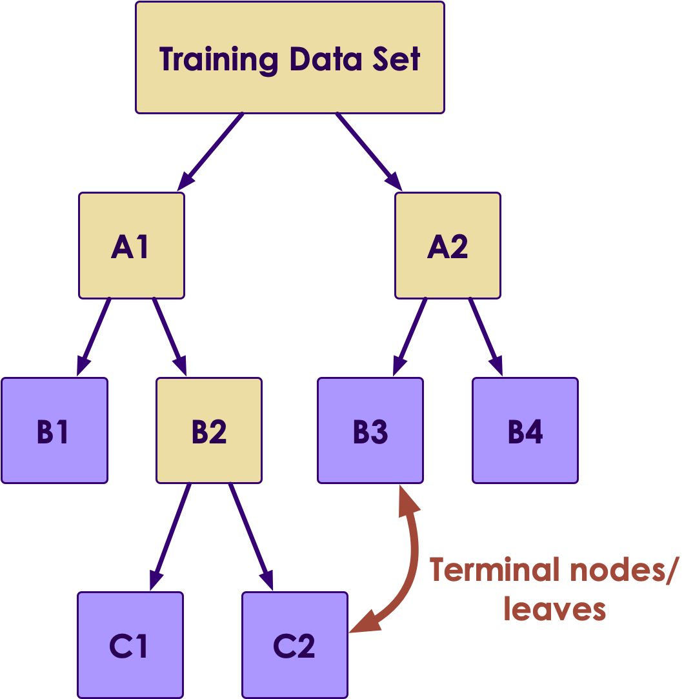
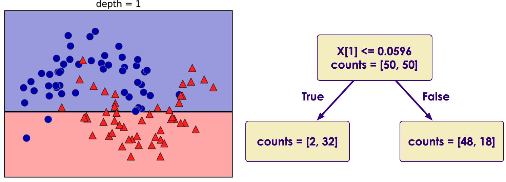
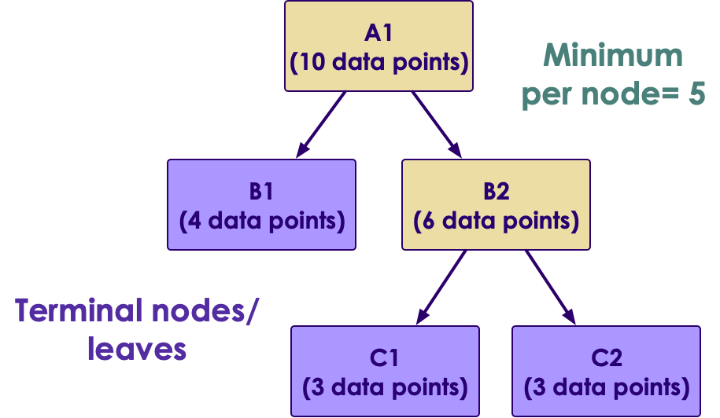

# Decision Trees

<!-- {"left" : 2.75, "top" : 2.75, "height" : 7.93, "width" : 12} -->

---

## Algorithm Summary

<!-- {"left" : 2.75, "top" : 2.75, "height" : 7.93, "width" : 12} -->

* [Reference](http://machinelearningmastery.com/supervised-and-unsupervised-machine-learning-algorithms)

Notes:

---

## Should I Accept the New Job Offer?

<!-- {"left" : 3, "top" : 3.24, "height" : 7.23, "width" : 11.51} -->

Notes:

---

## Decision Tree for ML

<!-- {"left" : 2.35, "top" : 2.78, "height" : 8.15, "width" : 12.81} -->

Notes:

---

## Class Quiz: Classify Animals

<!-- {"left" : 9.84, "top" : 1.89, "height" : 5, "width" : 7.5} -->

 * **Create a Tree to Classify These Animals**

 * Design a tree with **minimal number of questions** to identify the following  
 **Bear, Dolphin, Penguin, Eagle, Elephant**

Notes:

---

## Decision Trees Intro

<!-- {"left" : 2.75, "top" : 2.75, "height" : 7.93, "width" : 12} -->

* Decision Trees are in important algorithm in ML
    - They are flexible - can adopt to complex data
    - Also the final model is easy to understand

* Classics: Binary Tree

* Modern variations: Random Forest, Boosted trees, Bagged trees

* Trees can be used for both classification and regression. So often called  **'Classification and Regression Trees' (CART)**

Notes:

---

## Decision Tree Terminology

<!-- {"left" : 10.58, "top" : 1.89, "height" : 7.34, "width" : 6.51} -->

* Decision Trees are implemented as **binary trees** (Same binary tree from data structures!)

* Question node (years < 4.5)  is called **Test node**

* Leaf nodes / Terminal nodes are **Decision node**

* When navigating a tree, once you arrive at a Decision node, you can make a prediction

* Here is a tree for determining a salary for baseball player (salaries are in log scale)

| Log (salary) | Actual Salary |
|--------------|---------------|
| 5.11         | 165 k         |
| 6            | 403 k         |
| 6.74         | 845 k         |

<br>

* Reference : "An introduction to Statistical Learning" 

Notes:

---

## Storing The Tree Model

<!-- {"left" : 10.58, "top" : 1.89, "height" : 7.34, "width" : 6.51} -->

* Decision Tree can be saved to a file as a graph or set of rules

```text
If years < 4.5 Then Salary=5.11
If years >= 4.5 and Hits < 117.5 Then Salary = 6.0
If years >= 4.5 and Hits >= 117.5 Then Salary = 6.74
```
<!-- {"left" : 0.85, "top" : 3.87, "height" : 1.19, "width" : 9.77} -->

Notes:

---

## Creating a Tree

<!-- {"left" : 10.5, "top" : 2.16, "height" : 5.21, "width" : 6.68} -->

* When creating a tree we partition the input space

* Each input variable as a dimension
    - For 2-dimensional (p=2) data the region is rectangle
    - For higher dimensions (p > 2) => hyper rectangles

* Here we are partitioning 2 dimensional data (Years and Hits).  And we have divided them into three rectangles

Notes:

---

## Creating a Decision Tree

<!-- {"left" : 10.5, "top" : 2.16, "height" : 5.21, "width" : 6.68} -->

<!-- {"left" : 0.85, "top" : 6.7, "height" : 2.08, "width" : 4.6} -->

* We divide all possible values for Y into regions (R1, R2 ... Rj)
    - Regions are Non-overlapping (one data point only assigned to one region)

* How do we decide on boundaries (e.g  Years=4.5,  Hits=117.5) ?

* We try to minimize the error (prediction vs actual) per each region - This is RSS (Residual Sum of Squares)

* Try to  **minimize RSS across all regions**

Notes:

---

## Decision Trees - Region Formulation

<!-- {"left" : 10.5, "top" : 2.16, "height" : 5.21, "width" : 6.68} -->

* We would need to consider every possible combination of breaking our data into regions R1, R2, ..., RJ
    - But that is computationally very expensive!

* Instead, we will take a top-down, `greedy` approach
    - Also known as `recursive binary splitting`

* First, let us illustrate this with an example

Notes:

---

## Example: Guessing Game

<!-- {"left" : 11.18, "top" : 2.32, "height" : 4.56, "width" : 5.85} -->

* Let us say the first person choose a number in the range of 1 through 100

* The second person should ask
    - Is it bigger than 50?  
    answer is `no`

    - Next: is it bigger than 25?  
    the answer is `yes`

    - Next: is it bigger than 37?

* **Greedy algorithm** for decision trees works in a similar way

Notes:

---

## Greedy Algorithm

<!-- {"left" : 10.5, "top" : 2.16, "height" : 5.21, "width" : 6.68} -->

<!-- {"left" : 11.18, "top" : 2.14, "height" : 5.58, "width" : 6.06} -->

* Greedy approach used to divide up the input space is called 'binary recursive split'

* Different split points are tested using a cost function

    - In regression trees the cost function is RSS

    - For classification trees the cost function is Gini index (covered later)

* Split with the best cost (lowest cost) is chosen

* Best split is chosen for each level

* Greedy algorithm may not find the best tree, it finds the best tree for each level

Notes:

---

## Tree Creation Example

* Here is some synthetic dataset (2 dimensional)

* We will create a decision tree to identify the classes

<!-- {"left" : 4.31, "top" : 3.89, "height" : 5.93, "width" : 8.87} -->

* Reference : Chapter 2 , "Machine Learning With Python" by Sarah Guido, Andreas C. Muller (ISBN: 9781449369415)

Notes:

---

## Tree Creation Example

* At depth=1

<!-- {"left" : 1.33, "top" : 4.11, "height" : 5.35, "width" : 14.84} -->

Notes:

Reference : Chapter 2 , "Machine Learning With Python" by Sarah Guido, Andreas C. Muller (ISBN: 9781449369415)

---

## Tree Creation Example

* At depth=2

<!-- {"left" : 0.48, "top" : 3.79, "height" : 4.81, "width" : 16.54} -->

Notes:

Reference : Chapter 2 , "Machine Learning With Python" by Sarah Guido, Andreas C. Muller (ISBN: 9781449369415)

---

## Tree Creation Example

* At depth=9

* We can see the tree is over fitting

<!-- {"left" : 1.38, "top" : 4.25, "height" : 4.92, "width" : 14.74} -->

Notes:

Reference: Chapter 2 , "Machine Learning With Python" by Sarah Guido, Andreas C. Muller (ISBN: 9781449369415)

---

## Preventing Trees From Overfitting

<!-- {"left" : 1.38, "top" : 4.25, "height" : 4.92, "width" : 14.74} -->

* Tree algorithm will recursively partition the dataset until each partition contains a single class (A or B)

    - This is called pure partition (only contains one class)

* This leads to a very complex tree that overfit the training data

* Preventing overfitting:

    - Set the maximum depth of the tree (essentially pruning the tree)

    - Set maximum number of nodes/bins

    - Set minimum elements per node

    - Set minimum purity per node

Notes:

---

## Stopping Criteria 1: Min Elements Per Node

<!--{"left" : 9.16, "top" : 2.39, "height" : 4.93, "width" : 8.37} -->

* Tree algorithm will recursively partition the dataset until each partition contains a single class (A or B) - pure partition

* "Do not split a node that has less than mininum elements"

* In this example we set  minimum per node = 5

* So A1 and B2 will be splited

* Nodes B1, C1, C2 won't be split

Notes:

---

## Stopping Criteria 2: Limit the Depth of the Tree

<!-- {"left" : 1.38, "top" : 4.25, "height" : 4.92, "width" : 14.74} -->

* If uncontrolled, trees can grow arbitrarily large / deep

* This will lead to overfitting!

* By setting a depth limit, we can:
     - Reduce overfitting
     - Stable predictions, even if they are not most accurate
     - Make the tree simpler -> easier to understand

---

## Tree Pruning  Example

* The tree on the left is growing deep (on left side)

* By limiting the depth of tree, we have simplified the tree quite a bit and reduced overfitting

<!-- {"left" : 1.72, "top" : 5.41, "height" : 4.66, "width" : 9.14} -->

<!-- {"left" : 11.35, "top" : 5.41, "height" : 4.66, "width" : 4.43} -->

Notes:

---

## Constructing Classification Decision Trees

<!-- {"left" : 3, "top" : 3.24, "height" : 7.23, "width" : 11.51} -->

* Instead of predicting a number, predict a classification (Spam / Not-Spam)

* In **Regression Trees we use RSS (minimizing RSS)** to find best regions

* To construct classification trees, we use
    - Gini Index
    - Entropy

Notes:

---

## Gini Index (G)

<!--{"left" : 10.39, "top" : 1.89, "height" : 4.92, "width" : 6.65} -->

<!--{"left" : 10.39, "top" : 1.89, "height" : 4.92, "width" : 6.65} -->

* Gini index measures the **purity** of each node (how mixed data is in one Region)

* A node that only has **ONE class** of data is said to be **pure** - Gini score will be 0

* If region has 50% / 50%  mix then G = 0.5  (worst purity)

* **Goal: minimize G score**

<!--{"left" : 10.74, "top" : 8.4, "height" : 2.17, "width" : 5.96} -->

Notes:

---

## Gini Index Example

<!-- {"left" : 0.79, "top" : 5.18, "height" : 1.23, "width" : 4.97} -->

* Here we have a classifier: class-1  and class-2

* P1: proportion of class-1

* P2: proportion of class-2

* Calculating Gini index as follows

<!-- {"left" : 1.45, "top" : 6.85, "height" : 3.86, "width" : 14.61} -->

Notes:

---

## Decision Trees: Strengths, Weaknesses, and Parameters

* **Strengths**
    - All purpose classifier that does well in most scenarios
    - Easy to interpret and explain results
    - Fast learning and prediction
    - Can handle numeric and categorical data
    - No need to scale data
    - Can handle missing data
    - Excluded unimportant features
    - Can work with small datasets
    - But can also scale to large datasets

Notes:

---

## Decision Trees: Strengths, Weaknesses, and Parameters

* **Weaknesses**
    - Can overfit
    - Small changes in training data causes large changes in tree structure (High variance)
    - Trees can get arbitrarily deep
    - Often biased towards features with large number of splits

* **Parameters**
    - Max depth: how deep a tree can grow
    - Max bins: how many nodes/bins the tree can have
    - Min samples per leaf: stop keep dividing

Notes:

---

## Implementing Decision Trees

* Next section will show an example on how to do Decision Trees