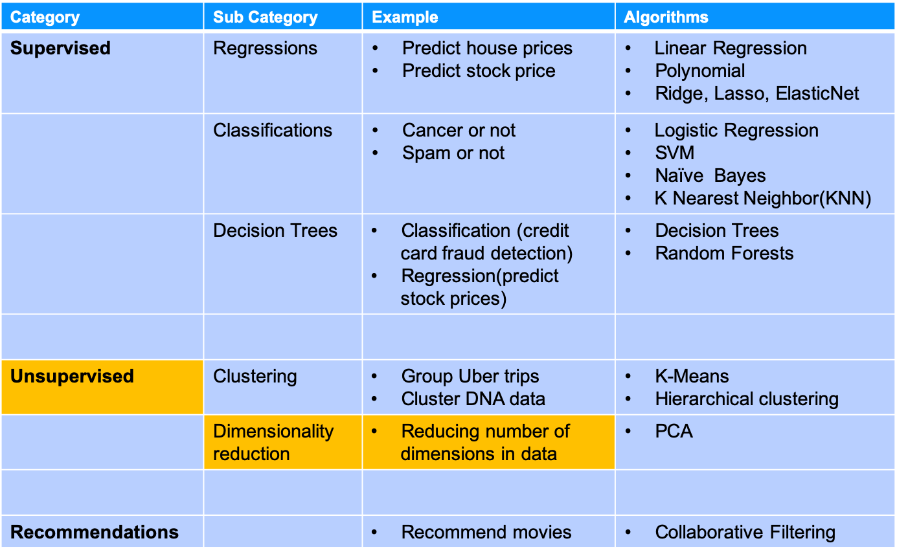
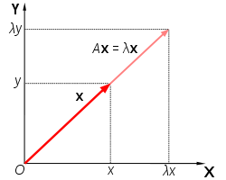
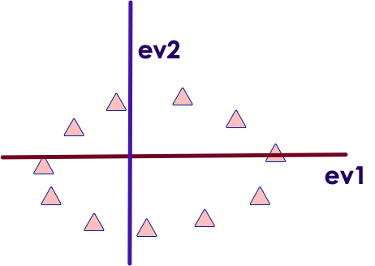
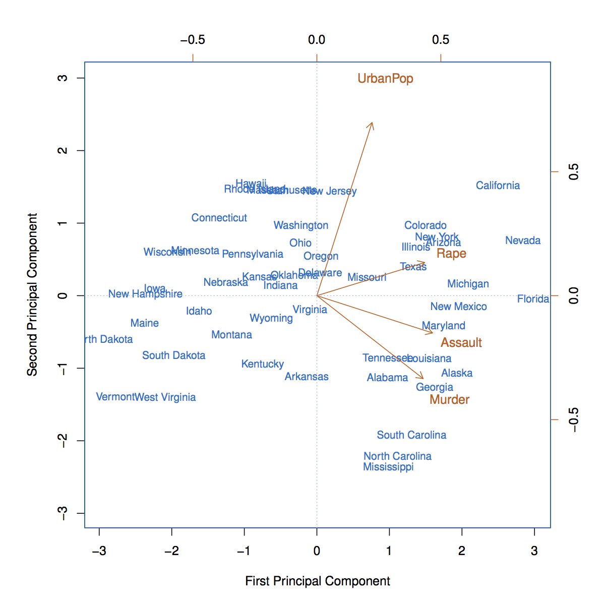

# Dimensionality Reduction

---

## Algorithm Summary

<!-- {"left" : 1.59, "top" : 2.43, "height" : 8.85, "width" : 14.32} -->

* [Reference](http://machinelearningmastery.com/supervised-and-unsupervised-machine-learning-algorithms/)

Notes:

---

## Dimensionality Reduction

* Imagine we have too many variables/features (hundreds or even thousands!)

* But this is good!?
     - Not always

* Too many variables
    - complicate the model make it prone to overfit
    - Slow down the calculation
    - Require lots of compute power and resources

<br/>

| Feature 1 | F 2 | F 3 | ... | ... | F 99 | F  100 |
|-----------|-----|-----|-----|-----|------|--------|
|           |     |     |     |     |      |        |
|           |     |     |     |     |      |  &nbsp;|

<!-- {"left" : 1.02, "top" : 7.38, "height" : 2.33, "width" : 15.47} -->

Notes:

---

## Can We Reduce the Features?

* Advantages
    - Efficient compute
        - Use compute more effectively, use less memory, reduce network traffic (in distributed scenarios)
    - Simpler model
        - Less susceptible for overfitting
        - Quicker to train

* However, we can not just drop features
     - We don't want to drop important features
     - Also we don't want to loose too much of 'signal' from original data

Notes:

---

## Dimensionality Reduction Solution

* Say we have a data set with 100 attributes

* We want to create 10 attributes out of 100 and give this out for further analysis
     - Retains as much spirit' of original data
     - Hard to reverse engineer

* Here we are creating **totally new attributes** (a,b,c) from original attributes

<!-- {"left" : 3.57, "top" : 6.23, "height" : 4.81, "width" : 10.36} -->

Notes:

---

## Analogy: Dimension Reduction

<!-- {"left" : 3.57, "top" : 6.23, "height" : 4.81, "width" : 10.36} -->

* Think of 'Dimension Reduction' like making a fruit smoothie.

* We throw in all the fruits in the blender, and the final outcome is different than original fruits, but still has the 'flavors' of original fruits

<!-- {"left" : 3.57, "top" : 6.23, "height" : 4.81, "width" : 10.36} -->

---

## Analogy: Image Resolution Reduction

* You want to email / SMS a beautiful sunset photo

* original image is 10 MB - high resolution

* SMS program will resize / reduce resolution for sending
     - Smaller size, but still maintains the image

<!-- {"left" : 3.55, "top" : 5.08, "height" : 5.84, "width" : 9.96} -->

Notes:

Image "Sunset at Mauii, Hawaii",  credit: Sujee Maniyam (author) - used with permission

---

## Benefits of Dimension Reduction

* **Efficient computation**
    - With reduced feature-set computation takes less resources (memory/cpu)

* **Data masking**
    - Since original data is reduced to completely new features, original sensitive data is no longer visible

<!-- {"left" : 2.73, "top" : 6.8, "height" : 3.95, "width" : 12.04} -->

* **Eliminate duplicate data**
    - When multiple datasets are merged there may be duplicates
    - Here is an example of 'height' recorded in feet and cm.
    - Dimension reduction will eliminate dupe data

Notes:

---

# Principal Component Analysis (PCA)

---

## Algorithm Summary

<!-- {"left" : 2.24, "top" : 2.83, "height" : 8.05, "width" : 13.01} -->

* [Reference](http://machinelearningmastery.com/supervised-and-unsupervised-machine-learning-algorithms/)

Notes:

---

## Principal Component Analysis (PCA)

* Not all dimensions are equally interesting.Can we reduce the  **'dimensionality** ' of data,  **without loosing too much information** ?

* PCA does just that

* It finds low-dimensional representation of data that contains as much as possible of  **variation**

* PCA seeks a small number of dimensions that are as  **interesting**  as possible

* **Interesting**  is measured by the amount that the observations vary along each dimension

<!-- {"left" : 1.91, "top" : 7.35, "height" : 2.98, "width" : 13.67} -->

Notes:

---

## Understanding Eigen Vectors / Values

<!-- {"left" : 1.91, "top" : 7.35, "height" : 2.98, "width" : 13.67} -->
<!-- {"left" : 1.91, "top" : 7.35, "height" : 2.98, "width" : 13.67} -->

* Let's consider an example data, we have 3 dimensional data

* That is  3 variables --> 3 Eigen vectors; So number of Eigen vectors = number of dimensions

* EigenVector is a direction - vertical, horizontal, 45' degrees ..etc

* EigenValue is a number - denoting how much 'variance' in the data in that vector's direction

* Eigen Vector and Eigen Value go together(E Vector,   E Value)

* EigenVector with highest EigenValue (meaning lot of variance in that direction)  becomes a Principal Component

Notes:

---

## Eigen Vector Example

<!-- {"left" : 10.45, "top" : 2.35, "height" : 5.54, "width" : 6.75} -->

* Imagine we are in a town with bunch of bars and restaurants

* if we only travel on streets North and East, we wouldn't see most of the restaurants

* But if we walk down the alley way, we will encounter most of the restaurants and bars

* So the alleyway is a better street

---

## PCA Math: Eigen Vectors

* In the plot below, EigenVector (ev1) is shown that crosses the data with 'highest variance'

<!-- {"left" : 3.85, "top" : 3.83, "height" : 6.8, "width" : 9.8} -->

Notes:

Image adopted with thanks to: https://georgemdallas.wordpress.com/2013/10/30/principal-component-analysis-4-dummies-eigenvectors-eigenvalues-and-dimension-reduction/

---

## PCA Math: Eigen Vectors

* But we have a 2-dimensional data -> 2 eigen vectors

* To maximize coverage the second EigenVector will be orthogonal (90 degrees) to the first one (ev1)

<!-- {"left" : 4.82, "top" : 5.88, "height" : 5.48, "width" : 7.91} -->

Notes:

Image adopted with thanks to: https://georgemdallas.wordpress.com/2013/10/30/principal-component-analysis-4-dummies-eigenvectors-eigenvalues-and-dimension-reduction/

---

## PCA Math: Eigen Vectors

* The EigenVectors have given us more useful axis to frame data

* Remember, the data hasn't changed at all, we are just looking at it from a different perspective

<!-- {"left" : 10.31, "top" : 2.41, "height" : 4.88, "width" : 6.86} -->

Notes:

Image adopted with thanks to: https://georgemdallas.wordpress.com/2013/10/30/principal-component-analysis-4-dummies-eigenvectors-eigenvalues-and-dimension-reduction/

---

## PCA Example

* Say the original data is 15 dimensions

* Say our 15 Eigen Values are (in descending order)  
    - [  **`25, 22, 15, 13`** , 8, 5, 4, 3, 2, 1, 0.7, 0.5, 0.4,  0.3, 0.1 ]

* We see the first 4 have the biggest values
    - Indicating 4 directions with lots of information

* We have identified our 4 Principal Components (PC)

* We have gone from 15 attributes to 4  (call them PC1, PC2, PC3, PC4)

* First Principal Component (PC1)  has the largest variance (EigenValue)

* Second Principal Component has second largest variance that is uncorrelated to PC1

     - Orthogonal vector to PC1

Notes:

---

## PCA Example: USArrests Data

<!-- {"left" : 10.81, "top" : 2.4, "height" : 6.18, "width" : 6.18} -->

* Original data has 50 rows,  and 4 columns / dimensions

* PCA was performed after standardizing each variable to have mean zero and standard deviation one

* Here is the data after PCA
    - 2 dimensions (PC1 and PC2)

<!-- {"left" : 5.09, "top" : 2.05, "height" : 2.59, "width" : 7.32} -->

Notes:

Diagram with thanks to : "An introduction to Statistical Learning" book.

---

## Understanding BiPlot

<!-- {"left" : 5.09, "top" : 2.05, "height" : 2.59, "width" : 7.32} -->

<!-- {"left" : 10.32, "top" : 1.89, "height" : 6.64, "width" : 6.64} -->

* Biplot displays both

    - Principal Component scores (left & lower axis)

    - And Principal Component loadings (top & right axis)

* States are mapped according their PC1 / PC2 value  (left / lower axis)

* Orange arrows indicated the first 2 PC vectors (axis on top and right)

    - Loading for 'Rape' on PC1 0.54  (top axis)

    - Loading for 'Rape' on PC2 0.17  (right axis)

Notes:

---

## Understanding BiPlot

<!-- {"left" : 11.74, "top" : 1.89, "height" : 5.31, "width" : 5.31} -->

* Crime related variables (Murder, Assault and Rape) are close to each other
* UrbanPop is far from other three
    - Less correlated with others
* States with large PC1 scores have high crime rates
    - California, Nevada, Florida
* States with negative PC1 scores low crime rates
    - North Dakota
* California also high on PC2 indicating more urbanized.While Mississippi and NC are least urbanized
* States close to zero on both components like Indiana have average crime and urbanization

Notes:

---

## Scaling Variables Before PCA

* Left: Scaled data, centered at zero, with standard deviation one
* Right: Unscaled data
* With unscaled data we see 'Assault' having the largest loading on PC1 (b/c it has the highest variance)
* So it is exerting a lot of influence on the data
* So it is recommended to  **scale the data before performing** a PCA
* Diagram with thanks to : "An introduction to Statistical Learning" book.

<!-- {"left" : 9.99, "top" : 2.34, "height" : 4.76, "width" : 7.13} -->

Notes:

---

## Evaluating PCA - Scree Plot

* We use a  **scree plot** to understand PCA
* Left chart plots Variance for each PC component.
    - First component (PC1) has the most (62%)
    - Second one PC2 around 25%
    - PC4 hast the least
* Right graph shows 'accumulated' variance when combining PCs.  We are moving towards ONE

<!-- {"left" : 3.92, "top" : 6.22, "height" : 5.27, "width" : 9.66} -->

Notes:

---

## PCA - Best Practices

<!-- {"left" : 9.71, "top" : 2.52, "height" : 3.67, "width" : 7.52} -->

<!-- {"left" : 9.71, "top" : 2.52, "height" : 3.67, "width" : 7.52} -->

* How many PC components do I need?
    - Start with PC components that give you enough coverage on variance (say 70%)
    - Then add more PCs until we don't discover any more patterns in the data

* PCA with supervised learning
    - Feed PCA'd data into a Supervised learning algorithm  (e.g. regression or classification)
    - Measure the performance of supervised learning
    - Then tweak the number of PCs if desired

Notes:

---

## PCA - Best Practices - Normalize Data

* Always recommended to scale data before doing PCA

| id | age | salary  |
|----|-----|---------|
| 1  | 32  | 60,000  |
| 2  | 26  | 50,000  |
| 3  | 40  | 100,000 |
| 4  | 37  | 75,000  |

<!-- {"left" : 3.88, "top" : 2.44, "height" : 2.5, "width" : 9.75} -->

* In this data variables are all in different ranges
     - Age: 26- 40
     - Salary: 50,000 - 100,000

* Typically we scale between 0 to 1

---

## Can we Restore Original Data from PCA?

<!-- {"left" : 11.93, "top" : 2.26, "height" : 4.06, "width" : 5.22} -->

 <!-- {"left" : 12.03, "top" : 6.97, "height" : 2.94, "width" : 5.02} -->

* Yes, you can restore original data

* If we took all Eigen Vectors, then we can restore the original data exactly

* But usually we only select a few Eigen Vectors -> you will lose some precision

* Apply the same transforms backwards to the new points

* See the beach picture (we can not 100% restore original image from a down-sampled image)

Notes:

---

## When to Use PCA

* Good use of PCA
    - Compression of data for reduce resource requirements
    - Speed up supervised learning
    - Visualizing high dimensional data by reducing it to two dimensional or three dimensional.  A nice example of this [word2vec projector](http://projector.tensorflow.org/).  (Demo this if time permits)

* Bad use of PCA
    - To prevent overfitting
    - Your thinking: less features, less likely to overfit
    - Most likely it is not a good idea, since the data is the same
    - Rather, use regularization parameter lambda (λ) to reduce overfitting

Notes:

---

## PCA + Supervised Learning

<!-- {"left" : 9.71, "top" : 2.52, "height" : 3.67, "width" : 7.52} -->

* Use PCA to speed up supervised learning! Why?

* It is easy to get vectors of sizes like 10,000

* Just think of a 100x100 pixel matrix for classification

* With PCA, we may reduce the data to 100 columns of 10,000
    - And run 10 times faster

* So the workflow is

```text
raw data --> PCA --> reduced data --> supervised learning
```

Notes:

---

## PCA: Further Readings


 * ["Internet Cultures of UK"](http://oxis.oii.ox.ac.uk/wp-content/uploads/2014/11/OxIS-2013.pdf) study by Oxford Internet Institute

 * [PCA for dummies](https://georgemdallas.wordpress.com/2013/10/30/principal-component-analysis-4-dummies-eigenvectors-eigenvalues-and-dimension-reduction/) - a nice blog post by George Dallas

 * [Intro to PCA](https://valiancesolutions.com/introduction-to-principal-component-analysis)

Notes:

---

## Implementing PCA

* The following section will demonstrate how to implement PCA
