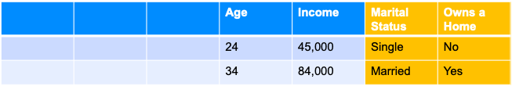
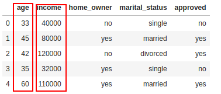
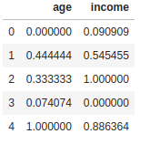

# Feature Engineering
---

## Feature Engineering

 * **Feature Engineering:**   
    _"Using transformations of raw input data to create new features to be used in ML model"_

 * Feature Engineering examples
    - Data cleanup
    - Convert to same units of measurements  (imperial to metric)
    - Enriching data by combining with other data sources (e.g. combining house sales prices with census data)


Notes:

---

## Features / Output

 * Features are inputs to the algorithm

 * Output is what are trying to predict

 * The following is an example
    - Inputs: Bedrooms, Bathrooms, Size
    - Output: Sale Price

<br />

| Bedrooms (input 1) | Bathrooms (input 2) | Size sqft (input 3) | Sale Price (in thousands)(we are trying to predict) |
|--------------------|---------------------|----------------|------------------------------------------------------|
| 3                  | 1                   | 1500           | 230                                                  |
| 3                  | 2                   | 1800           | 320                                                  |
| 5                  | 3                   | 2400           | 600                                                  |
| 4                  | 2                   | 2000           | 500                                                  |
| 4                  | 3.5                 | 2200           | 550                                                  |

<!-- {"left" : 0.25, "top" : 6.18, "height" : 1, "width" : 17, "columnwidth" : [3.19, 3.38, 3.03, 7.4]} -->


---

# Feature Selection

---
## Feature Selection

- We could have a lot of features to choose from

- Let's say there are 100 features in our dataset

- Not all of them would be important in predicting the outcome

- We don't want to input all the possible features into the algorithm
    - More features will take more compute power / resources
    - Can result in more noise than signal
        - Can distort the results

Notes:
- https://www.quora.com/Is-having-a-very-large-number-of-features-in-Machine-Learning-ever-a-bad-thing

---


## Class Quiz: Feature Selection

<!-- {"left" : 10.19, "top" : 1.78, "height" : 4.8, "width" : 7.2} -->

* Assume we are evaluating a credit card application
* **Q: What features we might consider?**

<br clear="all"/>

| Customer_id | Name | Zipcode | Have Direct Deposit | Age | Income | Marital Status | Owns a Home |
|-------------|------|---------|---------------------|-----|--------|----------------|-------------|
| 1           | Joe  | 11111   | Yes                 | 24  | 45,000 | Single         | No          |
| 2           | Jane | 22222   | No                  | 34  | 84,000 | Married        | Yes         |
<!-- {"left" : 0.29, "top" : 8.06, "height" : 1, "width" : 16.92, "columnwidth" : [2.39, 1.44, 2.24, 2.73, 1.33, 2.31, 2.44, 2.05]} -->


Notes:

---

## Feature Extraction

 * Here is a sample data for credit card applications
 * Our algorithm only uses selected input (features) to determine credit worthiness
 * Here 'name' and 'zipcode' aren't considered


  | Customer_id | Name | Zipcode | Have Direct Deposit | Age | Income | Marital Status | Owns a Home |
  |-------------|------|---------|---------------------|-----|--------|----------------|-------------|
  | 1           | Joe  | 11111   | Yes                 | 24  | 45,000 | Single         | No          |
  | 2           | Jane | 22222   | No                  | 34  | 84,000 | Married        | Yes         |
<!-- {"left" : 0.05, "top" : 7.92, "height" : 1, "width" : 17.39, "columnwidth" : [2.35, 1.3, 1.62, 3.55, 1.21, 1.9, 2.65, 2.8]} -->


 <!-- {"left" : 6.84, "top" : 9.45, "height" : 0.89, "width" : 3.83} -->


|             |      |         | Age | Income | Marital Status | Owns a Home |
|-------------|------|---------|-----|--------|----------------|-------------|
|             |      |         | 24  | 45,000 | Single         | No          |
|             |      |         | 34  | 84,000 | Married        | Yes         |

<!-- {"left" : 2.31, "top" : 10.37, "height" : 1, "width" : 12.88, "columnwidth" : [0.8, 0.8, 0.8, 1.74, 2.91, 2.91, 2.91]} -->

Notes:

---

## Class Quiz: Predicting Credit Card Fraud

<!-- {"left" : 10.19, "top" : 1.78, "height" : 4.8, "width" : 7.2} -->

* Assume we are evaluating if a credit card transaction is fraud or not

* **Q: What features we might consider? (open ended)**

Notes:

---

##  How do We Select Features?

* __Using Domain Knowledge__
  - In the previous example how did we figure out the features to consider?  
  Probably 'common sense' :-)

*  In practice we use our **domain knowledge** to identify important features

* For example if you work in finance domain, you know what attributes are good signals
    - e.g How did Alan Greenspan predict labor market ?

* __Some algorithms can help__  
  Some ML algorithms can take in all features and provide _'feature importance'_

Notes:

Alan Greenspan used suites and ties sold by Sears department store to predict the labor market conditions.  Remember, this was in 50s/60s.  So it worked then.   Will you think it will work now in 2020? :-)

---

## Feature Selection

* __Question:What makes a good feature?__

* Known at model building time  (during training)

* Has to be meaningful to the objective

* Has enough examples in data

* Numeric features are **preferred but not required**

* Must be legal to use (See next slide)

Notes:

---

## Legal Implications

* Some features can not be used legally !

* Some examples:
    - **Race** of a person
    - **Age** of a person
    - **Address** may not be used in some instances ('red lining')
    - Can you think of any thing else that may not be used?


Notes:

---


## 'Curse of Dimensionality'

- ['Curse of Dimensionality'](https://en.wikipedia.org/wiki/Curse_of_dimensionality) says more features, required more _observations_ (rows)

- This is not a linear relationship;
    - More features --> **many** more rows

- For example, let's say we have only 100 rows/samples of data.
  - Say each row has lots of features / columns (100+),
  - then we'd need more samples for ML algorithm to learn effectively


Notes:
- https://en.wikipedia.org/wiki/Curse_of_dimensionality

---

# Data Wrangling

---

## Data Wrangling

 <!-- {"left" : 9.43, "top" : 1.89, "height" : 5.66, "width" : 7.87} -->

* Data scientists spend significant amount of time doing **data wrangling**

* In [Anaconda 2020 survey](https://www.anaconda.com/state-of-data-science-2020) data wrangling takes up up to 45% of time

* This can include cleaning up data, transforming data into a format that can be used by ML algorithms

---

## Data Cleaning

<!-- {"left" : 11.11, "top" : 1.89, "height" : 4.71, "width" : 6.09} -->

* Real world data is hardly in a format to be used for ML

* We need to do fair amount of cleaning of data before we can do ML

* This is **not very interesting** part of ML, still very important 😄

* Let's look at some of the techniques for data cleansing in the next lab

---

## Lab: Data Cleanup

<!-- {"left" : 6.76, "top" : 0.88, "height" : 4.37, "width" : 3.28} -->

* **Overview:**
    - Cleaning up data, getting it ready for machine learning

* **Approximate Time:**
    - 10 - 15 mins

* **Instructions:**
    - **feature-engineering/data-cleanup**

Notes:

---

# Non-numeric Features

---
## Numeric Features

* Most ML algorithms deal in numbers (vectors)

* So numeric features are preferred

* Which of these is numeric?

<br />

| Feature            | Sample Value                                            | Numeric? |
|--------------------|---------------------------------------------------------|----------|
| Number of Bedrooms | 3                                                       | ?        |
| House Type         | - Single Family <br /> - Townhome <br /> - Apartment    | ?        |
| Discount           | 10%                                                     | ?        |
| Owns a home        | Yes / No                                                | ?        |
| Item Category      | - Jewelry <br/> - Groceries <br /> - Electronics <br /> | ?        |

<!-- {"left" : 1.42, "top" : 4.74, "height" : 1, "width" : 14.66} -->


Notes:
Bedrooms : yes,   House Type : No,  Discount : Yes, Owns a Home : No, Item : No
---

## Categorical Variables

 * Some of the variables are non-numeric

 * Example: Marital Status (Married / Divorced / Single) / Owns a Home (Yes / No)

 * We have to convert the variable to a numeric value

 * Example:  
  `Owns A Home -> 0 = No, 1 = Yes`

 * Categorical Variables are essentially structured data, despite being strings

 * (Unstructured data would include things like: documents, emails, tweets)

 <!-- {"left" : 1.36, "top" : 7.93, "height" : 2.49, "width" : 14.79} -->


Notes:

---

## Example of Factorization / Indexing

 * We can convert our string variables into factors / numbers

 * This means we assign a number to each unique value of the column

 * Added benefits
    - Numbers are more efficient to store
    - And compute!

<!-- {"left" : 2.59, "top" : 5.84, "height" : 4.67, "width" : 12.32} -->


Notes:

---

## Potential Problems With Factorization / Indexing

 * Some ML algorithms can start interpreting the numbers!

 * In the example below, an ML algorithm can think
    - 2 (Divorced)  >  1 (Single)  > 0 (Married)

 * This can lead to surprising outcomes

 * We can fix this by 'one-hot-encoding' method

<!-- {"left" : 2.48, "top" : 5.64, "height" : 4.75, "width" : 12.54} -->


Notes:

---

## Dummy Variables / One-Hot-Encoding

 * Dummy variables can help us treat the different values separately
    - Without trying to infer some relationship between values.

 * 'dummy variables' assigns  true / false to each.
    - Note, only one bit is on
    - This is called **ONE-HOT-Encoding**

<!-- {"left" : 1.99, "top" : 6.21, "height" : 4.26, "width" : 13.53} -->


Notes:

---

## Generating New Dimensions

 * Problem: Comparing house prices

 * Can we say Mountain View is most expensive city?

 * On first table, there is no data point for 'size of the house'

 * May be an 'apples-to-apples' comparison would be 'price per sq. foot'

 <!-- {"left" : 8.85, "top" : 2.18, "height" : 4.04, "width" : 8.39} -->


| City           | House Price   |
|--------        |----------     |
| San Jose       | 800k          |
| Mountain View  | 1,200 k (1.2M)|
| San Francisco  | 1,000 k (1 M) |
| Gilroy         | 700 k         |

<!-- {"left" : 1.17, "top" : 8.09, "height" : 1, "width" : 7.7, "columnwidth" : [3.89, 3.81]} -->


Notes:

---

## Converting Word to Vectors

 <!-- {"left" : 1.9, "top" : 2.39, "height" : 7.6, "width" : 13.7} -->


Notes:

---

## Lab: Encoding Variables

<!-- {"left" : 6.76, "top" : 0.88, "height" : 4.37, "width" : 3.28} -->

* **Overview:**
  - Encode non-numeric features

* **Approximate run time:**
  - 20-30 mins

* **Instructions:**
  - **Feature Engineering: Encoding Variables**

Notes:

---

# Scaling and Normalization

---

## Scaling

 * Usually data needs to be cleaned up and transformed before creating features

 * In the data below, we see **age** and **income** are in two different scales
    - age: ranges from 33 - 60
    - income ranges from 32,000  to 120,000

 * Some algorithms will yield better results if these different ranges can be scaled to a uniform range
    - Remove high magnitude data

<!-- {"left" : 3.66, "top" : 6.89, "height" : 4.34, "width" : 10.19} -->

---

## Scaling Approaches

<!-- {"left" : 12.55, "top" : 1.89, "height" : 3.3, "width" : 4.42} -->

* Z-Scoring:
    - Subtract mean and divide standard deviation

<!-- {"left" : 10.5, "top" : 5.82, "height" : 2.07, "width" : 6.47} -->

* Min-Max Scaling
    - Scale between a range 0 to 1 typically (or other ranges like 1 to 100)

* Standardized with zero mean and standard deviation of one

Notes:

---

## Scaling Using MinMaxScaler

```python
import pandas as pd
from sklearn.preprocessing import MinMaxScaler

data = pd.DataFrame ( { 'age' : [33,45,42,35,60],
                        'income' : [40000,80000,120000,32000,110000]
                    })

# create scaler, between 0 and 1
scaler = MinMaxScaler(feature_range=(0, 1))

# scale data
normalized = scaler.fit_transform(data)

# inverse transform
inverse = scaler.inverse_transform(normalized)
```
<!-- {"left" : 0.85, "top" : 2.39, "height" : 5.34, "width" : 13.89} -->

 &nbsp; <!-- {"left" : 5.44, "top" : 7.91, "height" : 3.74, "width" : 3.06} -->  <!-- {"left" : 8.15, "top" : 7.91, "height" : 3.74, "width" : 3.91} -->


Notes:


---

## Scaling Using StandardScaler

```python
import pandas as pd
from sklearn.preprocessing import StandardScaler

data = pd.DataFrame ( { 'age' : [33,45,42,35,60],
                        'income' : [40000,80000,120000,32000,110000]
                    })

scaler = StandardScaler()

# scale data
normalized = scaler.fit_transform(data)

# inverse transform
inverse = scaler.inverse_transform(normalized)
```
<!-- {"left" : 0.85, "top" : 2.39, "height" : 5.24, "width" : 14.54} -->

 &nbsp; <!-- {"left" : 5.21, "top" : 7.72, "height" : 3.97, "width" : 3.25} -->  &nbsp; <!-- {"left" : 8.37, "top" : 7.65, "height" : 3.97, "width" : 3.92} --> 

Notes:


---

## Comparing Scalers

* Here our original data (left) , z-scaling / standard scaling (middle) is on a uniform distribution;   and min-max scale (right) is between 0 to 1.0

* After standard scaling, some values would be negative!  That is OK!

 &nbsp; <!-- {"left" : 2.12, "top" : 5.66, "height" : 4.72, "width" : 3.86} -->  &nbsp; <!-- {"left" : 5.88, "top" : 5.58, "height" : 4.72, "width" : 4.66} --> <!-- {"left" : 10.45, "top" : 5.75, "height" : 4.72, "width" : 4.93} -->

---

## Lab: Scaling Data

<!-- {"left" : 6.76, "top" : 0.88, "height" : 4.37, "width" : 3.28} -->

* **Overview:**
    - Scale data

* **Approximate Time:**
    - 20 - 25 mins

* **Instructions:**
    - **Feature Engineering: Scaling Data**

Notes:

---

# Dealing With Skewed / Unbalanced Data

---

## Unbalanced Data

* Datasets can be balanced or unbalanced

* An example of balanced data would be gender split in population (more or less 50-50 split)

* An example of unbalanced data could be **credit card fraud data**
    - Say 99% of transactions are legit
    - 1% of them are fraud

<!-- {"left" : 6.76, "top" : 0.88, "height" : 4.37, "width" : 3.28} -->

---

## Dealing with Unbalanced Data

* A widely adopted method for dealing with highly imbalanced datasets is **resampling**

* We can **under-sample**, removing samples from majority class

* Or we can **over-sample**, adding samples to minority class

<!-- {"left" : 6.76, "top" : 0.88, "height" : 4.37, "width" : 3.28} -->

---

## Under Sampling

* Say we have the following data of 10,000 samples total for type A and B (A is majority class)

|               | A    | B    |
|---------------|------|------|
| Original Data | 9000 | 1000 |
| Percentages   | 90%  | 10%  |

* If we took 10% of random sampling, the sampled data will retain the same ratio of original data

|             | A   | B   |
|-------------|-----|-----|
| Sample Data | 900 | 100 |
| Percentages | 90% | 10% |

* Here is a weighted sampling.  Only select 11% of A, but all of B

|                   | A   | B   |
|-------------------|-----|-----|
| Weighted Sampling | 100 | 100 |
| Percentages       | 50% | 50% |

---

## Stratified Sampling

* **Stratified sampling** allows us carefully choose the sample from a population

* For example, let's say we want to survey a group of students.  But they are imbalanced

|                            | Boys | Girls |
|----------------------------|------|-------|
| Original Data (Population) | 120  | 80    |
| Percentages                | 60%  | 40%   |

* We would want a balanced group for our survey.  So one possibility is we can 'stratify' along one attribute: **gender**

* And we end up with a sample like this

|                   | Boys | Girls |
|-------------------|------|-------|
| Stratified sample | 30   | 30    |
| Percentages       | 50%  | 50%   |

* We can also stratify along other features like: race, sports activity ..etc

Notes:

---

## Stratified Sampling

* Here we see a population is being stratified along a few characteristics (Source : [Scribbler](https://www.scribbr.com/methodology/stratified-sampling/))

<!-- {"left" : 6.76, "top" : 0.88, "height" : 4.37, "width" : 3.28} -->

---

## Stratified Sampling

* Advantages
    - allows a more precise research sample compared to simple random sampling
    - way to ensure that all the sub-groups in your research population are well-represented in the sample
    - lowers the chances of researcher bias and sampling bias, significantly

* Disadvantages
    - can be difficult to split the population into individual, homogeneous strata, especially if some of the groups have overlapping characteristics.
    - If the strata are wrongly selected, it can lead to research outcomes that do not reflect the population accurately

Notes:

---

## Undersampling using `Tomek Links`

* `Tomek links` are pairs of examples of opposite classes in close vicinity.

* In this algorithm, we end up removing the majority element from the Tomek link, which provides a better decision boundary for a classifier.

* [imbalanced-learn](https://imbalanced-learn.org/)  library implements this algorithm

```python
from imblearn.under_sampling import TomekLinks

tl = TomekLinks(return_indices=True, ratio='majority')
X1, y1, idx = tl.fit_sample(X, y)
```

<!-- {"left" : 6.76, "top" : 0.88, "height" : 4.37, "width" : 3.28} -->

---

## Over Sampling with SMOTE

* In SMOTE (Synthetic Minority Oversampling Technique) we synthesize elements for the minority class, in the vicinity of already existing elements

* References:
    - [Original SMOTE paper](https://arxiv.org/abs/1106.1813)
    - [SMOTE examples](https://paperswithcode.com/method/smote)

* Using [imbalanced-learn](https://imbalanced-learn.org/) library

```python
from imblearn.over_sampling import SMOTE

smote = SMOTE(ratio='minority')
X1, y1 = smote.fit_sample(X, y)
```

<!-- {"left" : 6.76, "top" : 0.88, "height" : 4.37, "width" : 3.28} -->

---

## Using Class Weights

* Some algorithms have built-in  `class weights` to deal with unbalanced data

* Here is an example of Scikit Logistic Regression

```python
from sklearn.linear_model import LogisticRegression

# we are weighing 
#      0  - 1  (9% = 1 / (1+10))
#      1  - 10  (11% = 10 / (1+10))
lr = LogisticRegression(class_weight={  0:1,   1:10 })
```

* And here is how to calculate weights 

```python
from sklearn.utils.class_weight import compute_class_weight

class_weights = compute_class_weight('balanced', np.unique(y), y)
```

---

## Choose a Different Evaluation Metric

* For evaluating classifications, most of the time the metric **`accuracy`** is used

* How ever `accuracy` can be misleading for unbalanced datasets

* A better metrics would be **`F1 score`**.  More on this later!

* References
    - [F1 vs accuracy](https://www.statology.org/f1-score-vs-accuracy/)
    - [Accuracy, Precision, Recall or F1?](https://towardsdatascience.com/accuracy-precision-recall-or-f1-331fb37c5cb9)

---

## Lab: Dealing with Skewed / Unbalanced Data

<!-- {"left" : 6.76, "top" : 0.88, "height" : 4.37, "width" : 3.28} -->

* **Overview:**
    - Learn to deal with unbalanced data

* **Approximate Time:**
    - 20 - 25 mins

* **Instructions:**
    - **Feature Engineering: Dealing with Skewed Data**

Notes:

---

## Review and Q&A

<!-- {"left" : 8.56, "top" : 1.21, "height" : 1.15, "width" : 1.55} -->
<!-- {"left" : 6.53, "top" : 2.66, "height" : 2.52, "width" : 3.79} -->

* Let's go over what we have covered so far

* Any questions?

