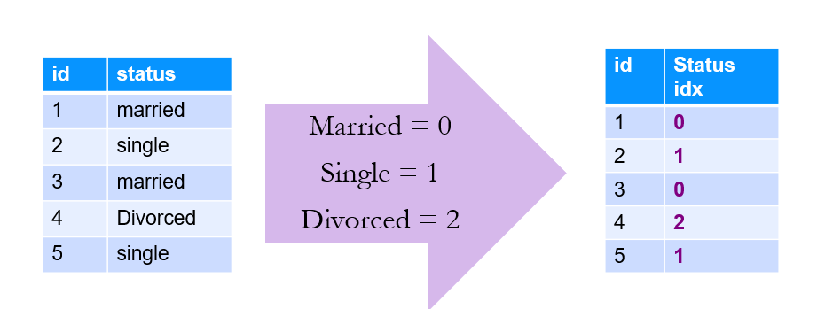
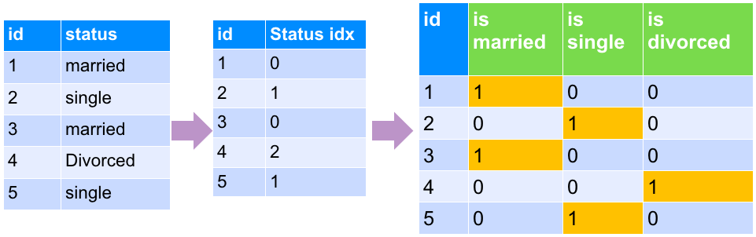
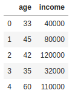

# Feature Engineering
---

## Feature Engineering

 * **Feature Engineering:**   
    _"Using transformations of raw input data to create new features to be used in ML model"_

 * Feature Engineering examples
    - Join two database tables to have all data in one place
    - Convert to same units of measurements  (imperial to metric)
    - Enriching data by combining with other data sources e.g. combining house sales prices with census data


Notes:

---

## Features / Output

 * Features are inputs to the algorithm

 * Output is what are trying to predict

 * The following is an example
    - Inputs: Bedrooms, Bathrooms, Size
    - Output: Sale Price

| Bedrooms (input 1) | Bathrooms (input 2) | Size sqft (input 3) | Sale Price (in thousands)(we are trying to predict) |
|--------------------|---------------------|----------------|------------------------------------------------------|
| 3                  | 1                   | 1500           | 230                                                  |
| 3                  | 2                   | 1800           | 320                                                  |
| 5                  | 3                   | 2400           | 600                                                  |
| 4                  | 2                   | 2000           | 500                                                  |
| 4                  | 3.5                 | 2200           | 550                                                  |

<!-- {"left" : 0.25, "top" : 4.01, "height" : 3.19, "width" : 9.75, "columnwidth" : [1.83, 1.94, 1.74, 4.25]} -->


---

# Feature Selection

---

## Feature Selection

- We could have a lot of features to choose from

- Let's say there are 100 features in our dataset

- Not all of them would be important in predicting the outcome

- We don't want to input all the possible features into the algorithm
    - More features will take more compute power / resources
    - Can result in more noise than signal
        - Can distort the results

Notes:
- https://www.quora.com/Is-having-a-very-large-number-of-features-in-Machine-Learning-ever-a-bad-thing

---

## 'Curse of Dimensionality'

- ['Curse of Dimensionality'](https://en.wikipedia.org/wiki/Curse_of_dimensionality) says more features, required more _observations_ (rows)
    
- This is not a linear relationship;
    - More features --> **many** more rows
    
- For example, let's say we have only 100 rows/samples of data.
  - Say each row has lots of features / columns (100+), 
  - then we'd need more samples for ML algorithm to learn effectively


Notes:
- https://en.wikipedia.org/wiki/Curse_of_dimensionality

---

## Class Quiz: Feature Selection

<!-- {"left" : 6.24, "top" : 1.14, "height" : 2.59, "width" : 3.89} -->

  * Assume we are evaluating a credit card application
  * **Q: What features we might consider?**

<br clear="all"/>

| Customer_id | Name | Zipcode | Have Direct Deposit | Age | Income | Marital Status | Owns a Home |
|-------------|------|---------|---------------------|-----|--------|----------------|-------------|
| 1           | Joe  | 11111   | Yes                 | 24  | 45,000 | Single         | No          |
| 2           | Jane | 22222   | No                  | 34  | 84,000 | Married        | Yes         |
<!-- {"left" : 0.13, "top" : 4.72, "height" : 2.58, "width" : 10, "columnwidth" : [1.25, 1.01, 1.32, 1.61, 1.15, 1.23, 1.21, 1.21]} -->


Notes:

---

## Feature Extraction

 * Here is a sample data for credit card applications
 * Our algorithm only uses selected input (features) to determine credit worthiness
 * Here 'name' and 'zipcode' aren't considered


  | Customer_id | Name | Zipcode | Have Direct Deposit | Age | Income | Marital Status | Owns a Home |
  |-------------|------|---------|---------------------|-----|--------|----------------|-------------|
  | 1           | Joe  | 11111   | Yes                 | 24  | 45,000 | Single         | No          |
  | 2           | Jane | 22222   | No                  | 34  | 84,000 | Married        | Yes         |
<!-- {"left" : 0.26, "top" : 3.21, "height" : 2.39, "width" : 9.74, "columnwidth" : [1.32, 0.94, 1.29, 1.5, 0.75, 1.08, 1.29, 1.57]} -->


 <!-- {"left" : 3.23, "top" : 5.89, "height" : 0.87, "width" : 3.79} -->


|             |      |         | Age | Income | Marital Status | Owns a Home |
|-------------|------|---------|-----|--------|----------------|-------------|
|             |      |         | 24  | 45,000 | Single         | No          |
|             |      |         | 34  | 84,000 | Married        | Yes         |

<!-- {"left" : 1.02, "top" : 7.15, "height" : 1.51, "width" : 8.2, "columnwidth" : [0.5, 0.5, 0.5, 1.09, 1.82, 1.82, 1.82]} -->


Notes:

---

##  How do We Select Features? 

* __Using Domain Knowledge__
  - In the previous example how did we figure out the features to consider?  
  Probably 'common sense' :-)
  
*  In practice we use our **domain knowledge** to identify important features
 
* For example if you work in finance domain, you know what attributes are good signals
    - e.g How did Alan Greenspan predict labor market ?
    
* __Some algorithms can help__  
  Some ML algorithms can take in all features and provide _'feature importance'_

Notes:

---

## Categorical Variables

 * Some of the variables have string content
 * Example: Marital Status / Owns a Home
 * Feature vectors must be numeric.
 * We have to convert the variable to a numeric value.
 * Example:  
  `Owns A Home -> 0 = No, 1 = Yes`
 * Categorical Variables are essentially structured data, despite being strings.
 * Unstructured data would include things like: documents, emails, tweets

 <!-- {"left" : 0.26, "top" : 5.52, "height" : 1.64, "width" : 9.74} -->


Notes:

---

## Encoding Categorical Variables

 * We have to convert our categorical variables into numbers
 * 3 Strategies:
    - Factorization / Indexing
    - One-Hot-Encoding/Dummy Variables
    - Quantization


Notes:

---

## Example of Factorization / Indexing

 * We can convert our string variables into factors / numbers
 * This means we assign a number to each unique value of the column
 * Added benefits
    - Numbers are more efficient to store
    - And compute!

<!-- {"left" : 1.02, "top" : 4.38, "height" : 3.11, "width" : 8.21} -->


Notes:

---

## Potential Problems With Factorization / Indexing

 * Some ML algorithms can start interpreting the numbers!
 * In the example below, an ML algorithm can think
    - 2 (Divorced)  >  1 (Single)  > 0 (Married)

 * This can lead to surprising outcomes
 * We can fix this by 'one-hot-encoding' method

<!-- {"left" : 1.02, "top" : 4.09, "height" : 3.11, "width" : 8.21} -->


Notes:

---

## Dummy Variables / One-Hot-Encoding

 * Dummy variables can help us treat the different values separately
    - Without trying to infer some relationship between values.
 * 'dummy variables' assigns  true / false to each.
    - Note, only one bit is on
    - This is called **ONE-HOT-Encoding**

<!-- {"left" : 0.52, "top" : 4.55, "height" : 2.9, "width" : 9.21} -->


Notes:

---

## Quantization

 * Sometimes we do want the ML model to interpret categorical variables
    - Grades :  A > B > C > D
    - Domain specific meaning
 * For example, colors in physics has a numeric meaning:
    - Red: 480 THz frequency of light
    - Green: 600 THz
 * This might allow our models to make inferences
    - e.g., Orange is close to red on the spectrum, but more distant from violet.

<!-- {"left" : 1.83, "top" : 5.97, "height" : 2.79, "width" : 6.59} -->


Notes:

Image credit : https://study.com/academy/lesson/the-nature-of-light-origin-spectrum-color-frequency.html


---

## Generating New Dimensions

 * Problem: Comparing house prices
 * Can we say Mountain View is most expensive city?
 * On first table, there is no data point for 'size of the house'
 * May be an 'apples-to-apples' comparison would be 'price per sq. foot'


| City           | House Price   |
|--------        |----------     |
| San Jose       | 800k          |
| Mountain View  | 1,200 k (1.2M)|
| San Francisco  | 1,000 k (1 M) |
| Gilroy         | 700 k         |

<!-- {"left" : 0.49, "top" : 4.95, "height" : 2.01, "width" : 3.6, "columnwidth" : [1.82, 1.78]} -->

 <!-- {"left" : 4.33, "top" : 4.64, "height" : 2.64, "width" : 5.47} -->


Notes:

---

## Converting Word to Vectors

 <!-- {"left" : 0.29, "top" : 1.85, "height" : 5.36, "width" : 9.66} -->


Notes:

---

# Scaling and Normalization

---

## Scaling
 * Usually data needs to be cleaned up and transformed before creating features
 * In the data below, we see **age** and **income** are in two different scales
    - age: ranges from 33 - 60
    - income ranges from 32,000  to 120,000
 * Some algorithms will yield better results if these different ranges can be scaled to a uniform range
    - Remove high magnitude data

<!-- {"left" : 1.5, "top" : 5.43, "height" : 3.09, "width" : 7.26} -->


---
## Scaling Approaches

<!-- {"left" : 7.06, "top" : 1.26, "height" : 2.16, "width" : 2.89} -->


* Z-Scoring:
    - Subtract mean and divide standard deviation

<br clear="all" />

<!-- {"left" : 5.54, "top" : 4.08, "height" : 1.48, "width" : 4.63} -->


* Min-Max Scaling
    - Scale between a range (0 to 1   or 1 to 100)


Notes:

---

## Scaling Example

<br/>

```python
import pandas as pd
data = pd.DataFrame ( { 'age' : [33,45,42,35,60],
                        'income' : [40000,80000,120000,32000,110000]
                    })
## z-score scaling
data_scaled_z =  (data - data.mean()) / data.std()
## min-max scaling
data_scaled_mm = (data - data.min()) / (data.max() - data.min())
```
<!-- {"left" : 0, "top" : 1.12, "height" : 2.03, "width" : 10.25} -->


- Here our original data (left) , z-scaling (middle) is on a uniform distribution;   and min-max scale (right) is between 0 to 1.0

 &nbsp; <!-- {"left" : 0.38, "top" : 5.31, "height" : 3.46, "width" : 2.83} -->  &nbsp; <!-- {"left" : 3.14, "top" : 5.25, "height" : 3.46, "width" : 3.42} --> <!-- {"left" : 6.49, "top" : 5.38, "height" : 3.46, "width" : 3.62} -->


---
## Scaling Example 2

```python
import pandas as pd

data = pd.DataFrame ( { 'age' : [33,45,42,35,60],
                        'income' : [40000,80000,120000,32000,110000],
                        'home_owner' : ['no', 'yes', 'no', 'yes', 'yes' ],
                        'marital_status' : ['single', 'married', 'divorced', 'single', 'married'],
                        'approved' : ['no', 'yes', 'yes', 'no', 'yes']
                    })
data

data['age_z'] = (data['age'] - data['age'].mean()) / data['age'].std()
data['income_z'] = (data['income'] - data['income'].mean()) / data['income'].std()
data
```
<!-- {"left" : 0, "top" : 1.28, "height" : 2.22, "width" : 10.25} -->


<!-- {"left" : 0.17, "top" : 4.82, "height" : 1.97, "width" : 4.64} --><!-- {"left" : 4.81, "top" : 4.92, "height" : 2.1, "width" : 5.3} -->


Notes:

---


## Lab: Exploratory Data Analysis (EDA)

 * **Overview:**
    - Analyze house sales data

 * **Approximate Time:**
    - 20 - 25 mins

 * **Instructions:**
    - **'exploration/explore-house-sales' lab for Python / R / Spark**


Notes:

---

## Bonus Lab: Feature Engineering

 * **Overview:**
    - Feature engineering exercises

 * **Approximate Time:**
    - 20 - 30 mins

 * **Instructions:**
    - **'feature-eng' lab for Python / R / Spark**


Notes:


