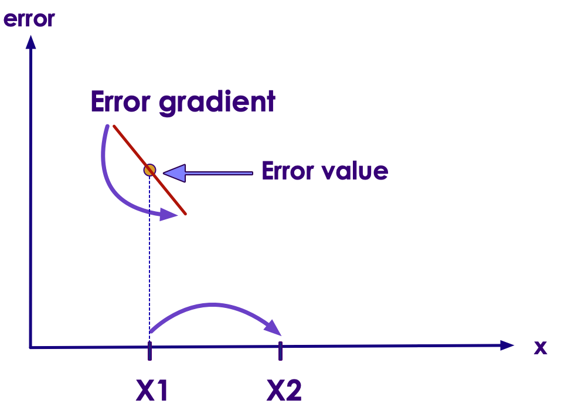
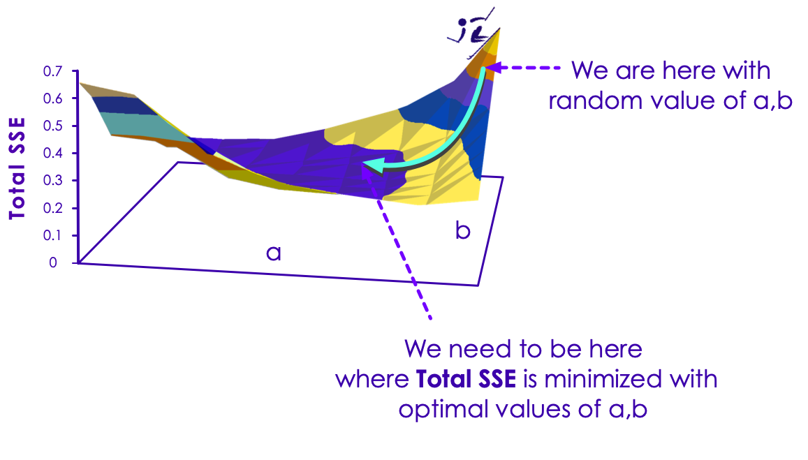

# Gradient Descent Algorithm

---

## Find the Optimal Value for a Variable

<!-- {"left" : 9.88, "top" : 1.89, "height" : 5.81, "width" : 7.23} -->

 * Now we understand **error/loss functions** let's try this:

 * Here when we change variable X, the error function changes   
    `Error = F(x)`

 * Goal: find the optimal X that gives me the lowest error

 * How ever there is a catch!  (See next slide!)

---

## Gradient Descent Process

<!-- {"left" : 10.53, "top" : 1.89, "height" : 5.55, "width" : 6.37} -->

* Challenge is find the optimal value of X without knowing the graph!

---

## Gradient Descent Process - Step 1

<!-- {"left" : 10.12, "top" : 1.89, "height" : 5.73, "width" : 7.21} -->

- We are going to start at some random value of X (say x1)

- We can calculate the error for this x1  
 `error = f(x1)`

- We can also measure the error gradient (which way the error function is sloping) for x1
    - This uses _derivative_ functions

---

## Gradient Descent Process - Step 2

<!-- {"left" : 10.62, "top" : 1.89, "height" : 4.85, "width" : 6.73} -->

- Using the error derivative, we can see the error function sloping to the right

- That tells us we should be 'moving right' in the graph

- So we calculate x2 (mostly randomly)

- And repeat the process

---

## Gradient Descent Process - Step 3

<!-- {"left" : 9.83, "top" : 1.89, "height" : 5.48, "width" : 7.58} -->

- Now we calculate the error for x2  
`error = f(x2)`

- Measure the error gradient at f(x2)

- And calculate the next X (x3)

- And repeat the process

---

## Gradient Descent

<!-- {"left" : 10.45, "top" : 1.89, "height" : 6.69, "width" : 6.7} -->

 * This is basically what a Gradient Descent algorithm does

 * Start at a random point, and make 'jumps' towards the minimum

 * As it gets closer to convergence the 'steps' gets smaller
    - so we don't overshoot  and miss the bottom

---

## Avoiding Getting Trapped in Local Minima

<!-- {"left" : 10.37, "top" : 1.89, "height" : 5.31, "width" : 7.19} -->

- Sometimes the descent algorithm will get stuck on local minima

- A practical solution for this problem is to run the descent algorithm multiple times, starting at different random points

- And the algorithm will eventually find the global minimum

Notes:

---

## Gradient Descent Algorithm

 * Another example in 2D data

<!-- {"left" : 2.62, "top" : 3.94, "height" : 6.97, "width" : 12.26} -->

Notes:

Image credit to KDNuggets : https://www.kdnuggets.com/2017/04/simple-understand-gradient-descent-algorithm.html

---
## Gradient Descent Demo

<!-- {"left" : 2.14, "top" : 4.64, "height" : 5.62, "width" : 5.66} --> &nbsp; &nbsp; <!-- {"left" : 8.28, "top" : 6.06, "height" : 2.77, "width" : 7.08} -->

 - [Animation 1](https://s3.amazonaws.com/elephantscale-public/media/machine-learning/gradient-descent-animation-1.gif)
 - [Animation 2](https://s3.amazonaws.com/elephantscale-public/media/machine-learning/gradient-descent-animation-3.gif)

Notes:

Demo1 : http://vis.supstat.com/2013/03/gradient-descent-algorithm-with-r/

---

## Gradient Descent Algorithms

* **Batch Gradient Descent**
     - The cost is calculated for a machine learning algorithm over the entire training dataset for each iteration of the gradient
     - One iteration of the algorithm is called  **one batch** and this form of gradient descent is referred to as batch gradient descent

* **Stochastic Gradient Descent (SGD)**
     - Classic Gradient Descent can be slow on large datasets (each iteration requires calculation over millions of data points)
     - SGD updates coefficients for each training instance, rather than at the end of the batch of instances
     - Also randomizes training set to
        * reduce coefficients jumping all over the place
        * And to avoid 'getting stuck' at local minima
     - Very effective for large datasets,  requires very few passes (usually 10-20) to converge

Notes:

---

## End: Gradient Descent

