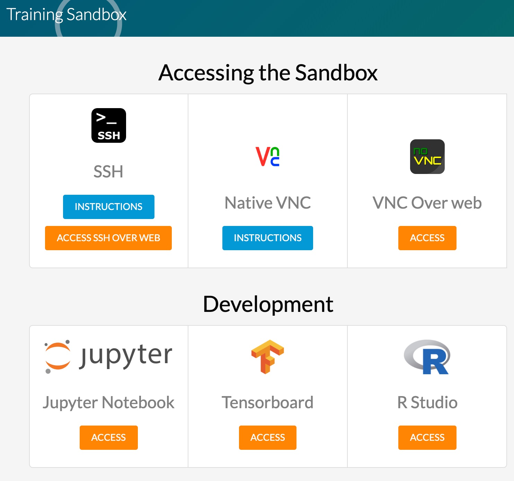
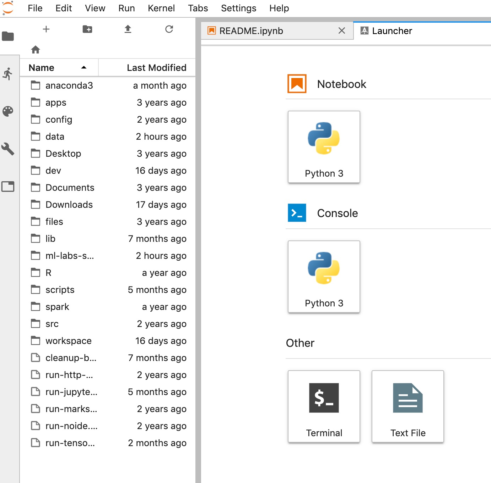
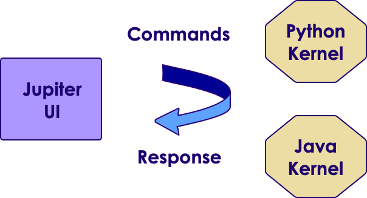

# Lab Prep

---

## Lesson Objectives

 * Getting labs up and running

Notes:


---

## Step 1: Distribute VMs

<!-- {"left" : 5.8, "top" : 1.1, "height" : 4.02, "width" : 4.3} -->

 *  **Instructor**

 * Allocate VMs to students in class

 * Point them to IP address of the machine

 * Access the IP address in a browser

 * Make sure they can see the sandbox splash page

<!-- {"left" : 1.84, "top" : 6.25, "height" : 2.18, "width" : 6.57} -->


Notes:


---

## Step 2: Test Jupyter

 <!-- {"left" : 5.52, "top" : 1.8, "height" : 4.4, "width" : 4.46} -->


 *  **Instructor**

 * Ask students to access Jupyter Labs environment

 * Provide username and password

 * If port 8888 doesn't work, highly likely it is a network issue. Try the following
     - Disable any VPN software on student's laptop
     - Connect to 'guest' network
     - Try connecting via 'mobile hotspot'

Notes:


---

## Step 3: Distribute Lab Bundle

 *  **To instructor:**
    - create a lab bundle

```bash
        $   cd labs-dir
        $  ./package-labs.sh
    ```

<!-- {"left" : 0, "top" : 2.14, "height" : 0.86, "width" : 4.61} -->


<br/>

    - This will create a zip file
    -  Distribute this bundle to students
        - Upload it to Google drive or Amazon S3
    -  **Explain the difference between .md, .ipynb, .html files**

 *  **To students**
     - You can open html files in browser to see lab instructions
     - If you have Jupyter environment setup, you can run   
     __`./run-jupyter.sh`__   
     and view the notebooks
Notes:


---

## Step 4: Setup

<!-- {"left" : 7.02, "top" : 1.16, "height" : 3.88, "width" : 2.91} -->
 *  **Overview:**

     - Setting up the environment

 *  **Approximate time:**

     - 10 mins

 *  **Instructions:**

     - Follow  ' **setup** '  instructions in the lab bundle

Notes:


---

## Step 5:  Testing123

<!-- {"left" : 7.02, "top" : 1.16, "height" : 3.88, "width" : 2.91} -->

 *  **Overview:**

     - Testing the environment

 *  **Approximate time:**

     - 5 mins

 *  **Instructions:**

     - Testing123

Notes:


---

## Jupyter - Interactive Notebook

 * Jupyter is like the newspapers in 'Harry Potter' => they are live!

 * [https://www.youtube.com/watch?v=xaBEFqFVSE8](https://www.youtube.com/watch?v=xaBEFqFVSE8)

<!-- {"left" : 1.02, "top" : 3.06, "height" : 5.19, "width" : 8.21} -->


Notes:

https://www.youtube.com/watch?v=xaBEFqFVSE8


---

## Step 6: Jupyter

<!-- {"left" : 7.64, "top" : 0.82, "height" : 3.3, "width" : 2.47} -->

 *  **Instructor**
    - Survey students if they have used Jupyter notebooks before.
    - If not, demo ' **Hello Jupyter** ' lab.
    - Explain how Jupyter works

<!-- {"left" : 2.07, "top" : 5.09, "height" : 3.3, "width" : 6.1} -->


Notes:
