# Machine Learning Algorithms

---

## Algorithms Summary

[Algorithm-Summary.md](Algorithm-Summary.md)

---

## Types of Machine Learning

 *  **Supervised Machine Learning:**
     - Algorithm learns from labeled training data
     - And predicts on new data

 *  **Unsupervised Machine Learning**
     - Algorithm tries to find natural patterns in the data

 *  **Semi-Supervised Learning**
     - Algorithm is trained with a training set which contains unlabeled (usually lot) and labeled (usually little) data

 *  **Reinforcement Learning**
     - Based on 'game play'  (rewards vs penalties)

Notes:

---

## Supervised Machine Learning

<!-- {"left" : 5.51, "top" : 1.18, "height" : 2.96, "width" : 4.45} -->

 * Algorithm learns from (training) data

 * Then predicts on 'unseen' data

 

| Algorithms     | Description                                                            | Applications                                     |
|----------------|------------------------------------------------------------------------|--------------------------------------------------|
| Classification | Categorize things into groups                                          | -Spam classification  -Fraud / no fraud      |
| Regression     | Dealing with numbers and calculate the probability something happening | -Predict house prices  -Predict stock market |

<!-- {"left" : 0.25, "top" : 5.1, "height" : 2.17, "width" : 9.75, "columnwidth" : [3.25, 3.25, 3.25]} -->

Notes:

Image credit (Creative Commons): Pexels.com

---

## Supervised Learning Example - Regression

 * Predicting stock market

 * Train the model using training data (past data; already known)

 * Test performance using test data (past data; already known)

 * If performance is statisfactory, predict on new data (unseen)

<!-- {"left" : 1.02, "top" : 4.12, "height" : 3.44, "width" : 8.21} -->

Notes:

---

## Supervised Learning - Classification

 * Classification is a model that predicts data into "buckets"
     - Email is  **SPAM**  or  **HAM**  (not-SPAM)
     - A cell is  **cancerous**  or  **healthy**
     - Hand-written numbers -> any digits -1, 0, 1,..., 8

 * Classification algorithm learns from training data (Supervised learning) and predicts on new data

 * In the example below, we input mixed data to the model, and the model classifies them into A or B

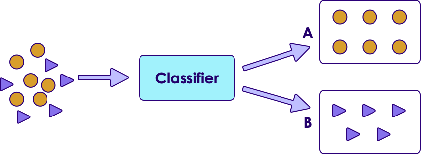<!-- {"left" : 1.21, "top" : 5.37, "height" : 2.88, "width" : 7.83} -->

Notes:

---

## Classification Applications

 * Web

     - Email is spam or not

     - Website is authentic or fraudulent

 * Medicine

     - Is this cell cancerous or not?

 * Finance

     - Credit card transaction fraudulent or not

 * OCR

     - Recognizing characters and symbols

Notes:

---

## Un Supervised Machine Learning

<!-- {"left" : 5.1, "top" : 1.23, "height" : 2.75, "width" : 4.87} -->

 * No training needed

 * Algorithm tries to find patterns in data

  

| Algorithms               | Description                             | Applications                                                      |
|--------------------------|-----------------------------------------|-------------------------------------------------------------------|
| Clustering               | Find naturally present patterns in data | -Identify news stories (sports / business)  -Gnome clustering |
| Association              | Find similar patterns                   | -people who buy A also buy B                                      |
| Dimensionality Reduction | Reduces number of features              | -Reducing 999s of variables into manageable size                 |

<!-- {"left" : 0.25, "top" : 5.12, "height" : 3.13, "width" : 9.75, "columnwidth" : [3.11, 2.97, 3.67]} -->

Notes:

---

## Clustering

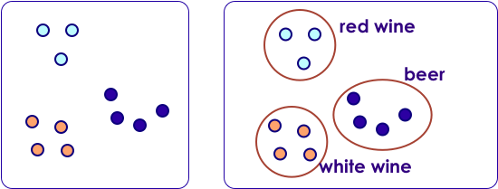<!-- {"left" : 5.41, "top" : 1.5, "height" : 1.79, "width" : 4.72} -->

 * Clustering finds natural groupings in data

 * Humans naturally cluster data we encounter
     - Categorizing, organizing, etc.
     - Our brains seek patterns

 * Why do we cluster?
     - To understand our data
     - To find "more like this"

Notes:

* Clustering allows us to group similar objects or events or data sets.
* This is a method of unsupervised learning.

---

## Clustering Use Cases: Fraud / Anomaly Detection

<!-- TODO shiva -->
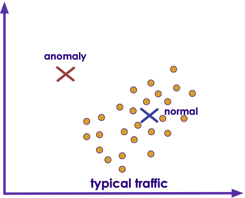<!-- {"left" : 2.34, "top" : 3.62, "height" : 4.52, "width" : 5.57} -->

 * Anomaly detection is used to:

     - Find fraud

     - Detect network intrusion attack

     - Discover problems on servers

 * Here we see an anomaly (top left) that doesn't fall into the usual pattern (bottom right)

Notes:

* Image credit : Pixabay : Creative Commons Zero :
* https://pixabay.com/en/nuts-black-acorn-oak-animal-food-60813/

---

## Clustering Applications

 * Biology

     - Genomics grouping

 * Medicine

     - Xray/CAT image analysis

 * Marketing

     - Consumer grouping ("soccer mom"...etc.) and behavior analysis

 * Web

     - Search result grouping
     - News article grouping (Google news)

 * Computer Science: Image analysis

 * Climatology: Weather pattern analysis (high pressure/warm regions)

Notes:

* https://en.wikipedia.org/wiki/Cluster_analysis

---

## Unsupervised Example: Google News

 * Google News algorithm automatically groups **related news stories**  into sections

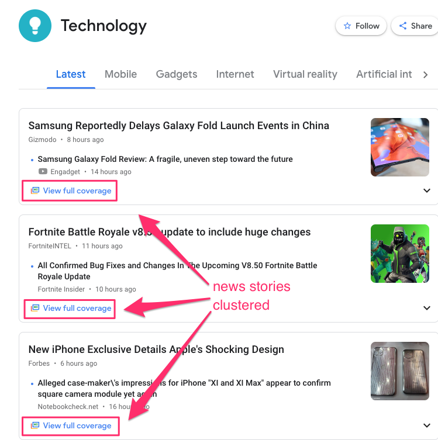<!-- {"left" : 2.13, "top" : 2.41, "height" : 6.02, "width" : 5.99} -->

Notes:

---

## Clustering Use Case: Customer Purchases @ Walmart

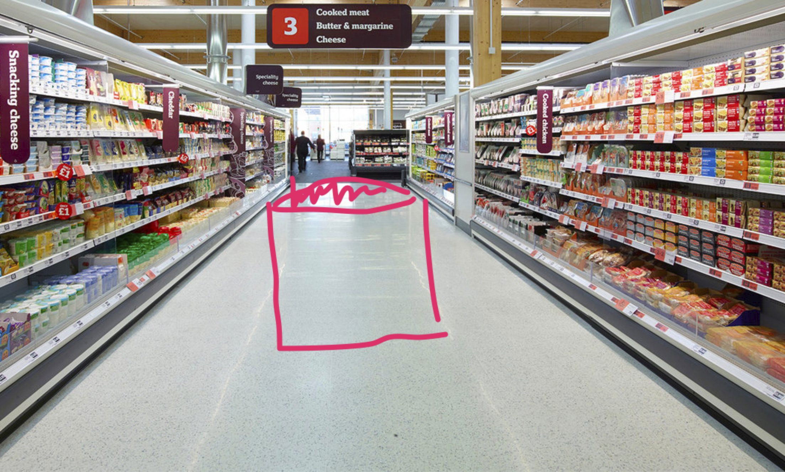<!-- {"left" : 5.38, "top" : 1.11, "height" : 2.78, "width" : 4.62} -->

 * Here is how Walmart is segmenting customer purchases ([link](https://www.kaggle.com/c/walmart-recruiting-trip-type-classification))
     * Pharmacy Runs
     * Strictly Grocery
     * Grocery and General Merchandise
     * Toys
     * Electronics
     * Baby
     * Gallon of Milk
     * **Booze and Calories**
     * and more ...

 * **Question for class:** What is the use case for this?

Notes:

---

## Semi-Supervised

 * We are still learning, but not all data points are 'labelled'

 * But by grouping data points together, the algorithm can 'infer' information, even when labels are missing

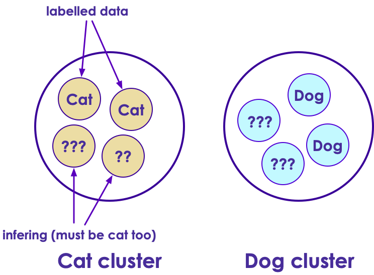<!-- {"left" : 1.56, "top" : 2.97, "height" : 5.25, "width" : 7.12} -->

Notes:

---

## Semi-Supervised Learning Video

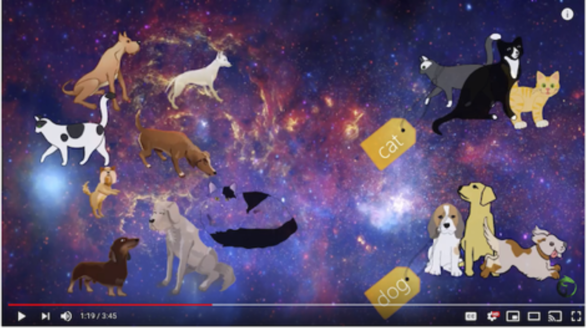<!-- {"left" : 1.02, "top" : 1.52, "height" : 4.59, "width" : 8.21} -->

[Link](https://www.youtube.com/watch?v=b-yhKUINb7o)

Notes:

https://www.youtube.com/watch?v=b-yhKUINb7o

---

## Reinforcement Learning

 * Imagine you are playing a new video game.  You have no idea how to play it.How will you learn?

 * Try a few things:
    - Open a door -> get more money / ammo
    - Jump from a cliff -> got hurt.. Loose health points .. Ouch!

 * This is how 'Reinforcement Learning' works.
     - Algorithm tries a few moves.. And learns automatically

Notes:

---

## Reinforcement Learning

 * Here the robot gets rewarded for 'food' and penalized for walking into fire

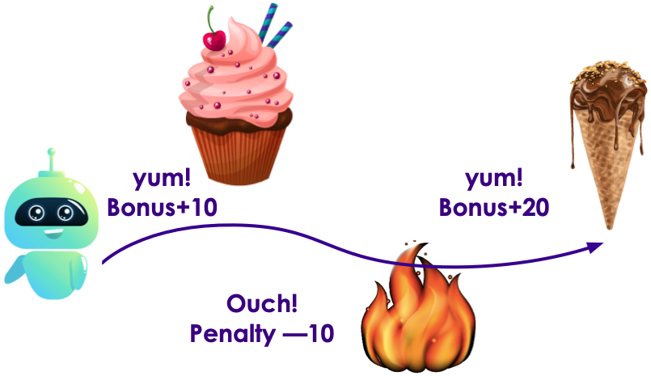<!-- {"left" : 1.05, "top" : 2.66, "height" : 4.71, "width" : 8.15} -->

Notes:

---

## Reinforcement Learning Demo: Atari Breakout

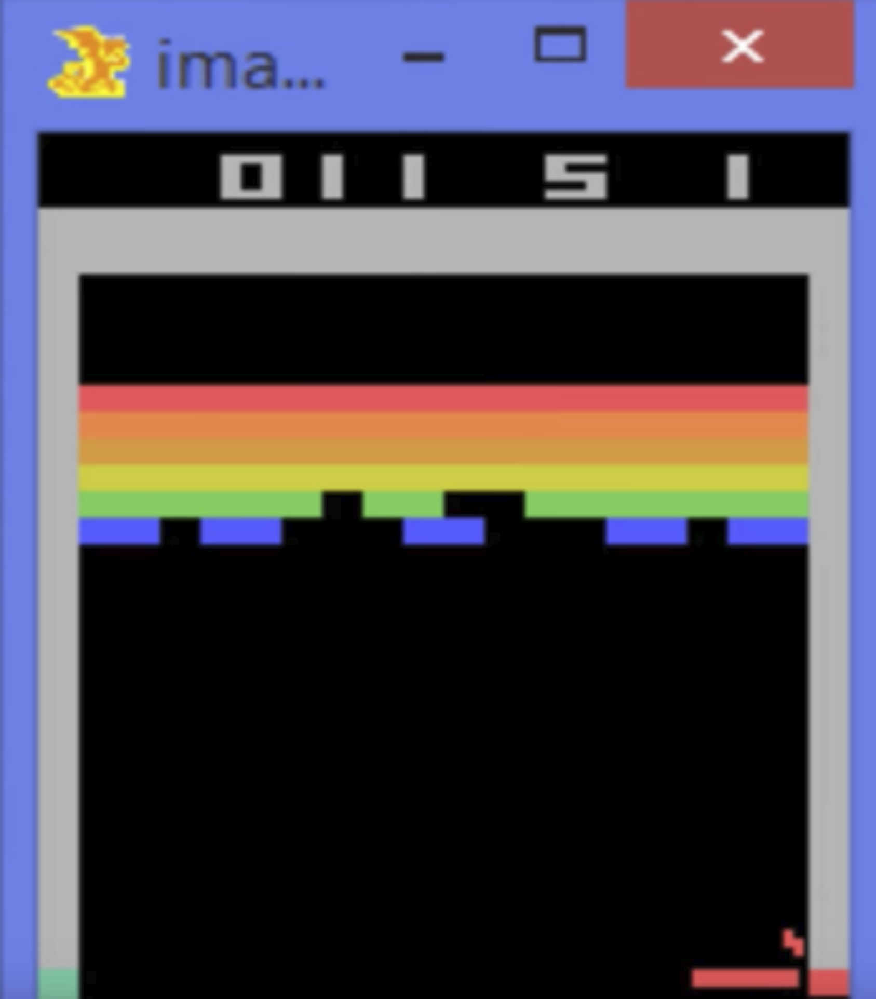<!-- {"left" : 2.64, "top" : 1.24, "height" : 5.66, "width" : 4.96} -->

[Link](https://www.youtube.com/watch?v=V1eYniJ0Rnk)

Notes:

* [Video](https://www.youtube.com/watch?v=V1eYniJ0Rnk)
* https://money.cnn.com/2016/8/28/technology/future/alphago-movie/index.html

---

## Reinforcement Learning Demo: AI Learning to Play 'Hide and Seek'
<!-- {"left" : 3.5, "top" : 1.06, "height" : 3.72, "width" : 6.61} -->

* [Open AI blog](https://openai.com/blog/emergent-tool-use/)
* [Watch video 1](https://openai.com/blog/emergent-tool-use/)
* [Watch video 2](https://www.youtube.com/watch?v=Lu56xVlZ40M)

---

## Reinforcement Learning Demo: Open AI Bots Playing Dota

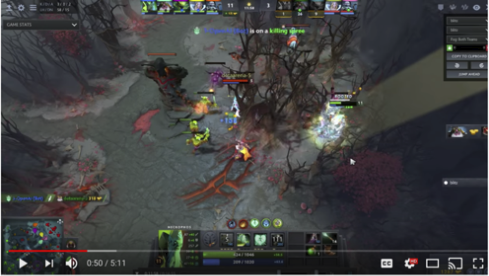<!-- {"left" : 1.05, "top" : 1.27, "height" : 4.59, "width" : 8.15} -->

[Link](https://www.youtube.com/watch?v=eHipy_j29Xw)

Notes:

* https://www.youtube.com/watch?v=eHipy_j29Xw

---

## Reinforcement Learning: Further Reading

 * [OpenAI trounces Dota-3 players](https://www.theinquirer.net/inquirer/news/3037135/openais-dota-3-playing-bots-trounce-semi-pro-players)

 * [Deep Mind's AI beats GO champion](https://www.theverge.com/2016/9/17/16495547/deepmind-ai-go-alphago-zero-self-taught)

    The company's latest AlphaGo AI learned superhuman skills by playing itself over and over

 * [Google's Alpha-GO defeats GO master](https://qz.com/639951/googles-ai-won-the-game-go-by-defying-millennia-of-basic-human-instinct/)

 * [OpenAI](https://openai.com/research/) is founded by Elon Musk.

     - To promote AI research for public bood

Notes:

* https://www.theinquirer.net/inquirer/news/3037135/openais-dota-3-playing-bots-trounce-semi-pro-players
* https://openai.com/research/
* https://www.theverge.com/2016/9/17/16495547/deepmind-ai-go-alphago-zero-self-taught
* https://qz.com/639951/googles-ai-won-the-game-go-by-defying-millennia-of-basic-human-instinct/

---

## Algorithm Summary

[Algorithm-Summary.md](Algorithm-Summary.md)

---

## ML Algorithm Cheat Sheet

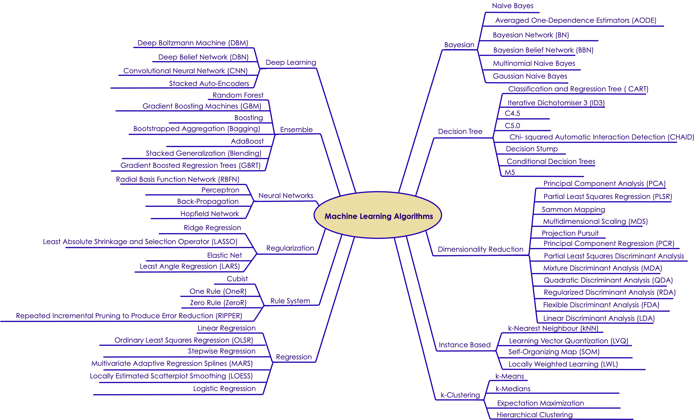<!-- {"left" : 0.29, "top" : 1.62, "height" : 5.82, "width" : 9.67} -->

Notes:
