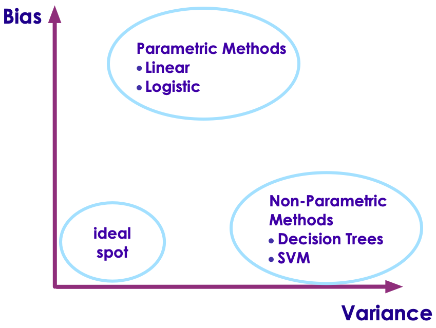
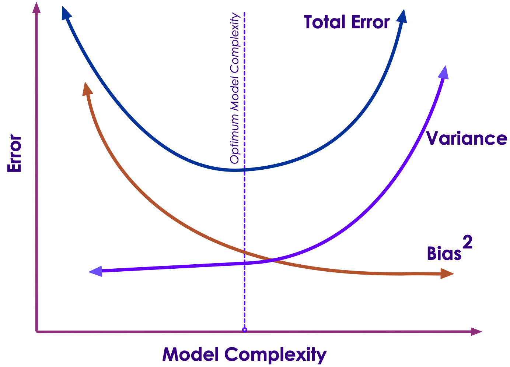

# Bias Variance Trade-off

---

## Estimating Target Function

 * In supervised algorithms try to estimate target function
'f'  
`Y = f(X)`  
`Y: output,  X: input`

 * The error can be broken down to
    - Bias error
    - Variance error
    - Irreducible error

 * Irreducible error can not be minimized.May be caused by unknown variables, noise ..etc

Notes:

---

## Bias Error

 * Bias are the **simplifying assumptions** made by a model to make target function easier to learn
 * Generally **parametric algorithms have high bias**
    - Fast learning
    - Easier to understand
    - But less flexible
    - Lower predicting performance on complex data (That doesn't fit the simplifying assumptions of algorithm)
 * **Low Bias (good!):**
    - Less assumptions made about target function
    - E.g. Decision Trees, KNN, SVM
 * **High Bias (not good):**
    - more assumptions of target function
    - E.g. Linear regression, Logistic regression

Notes:

---

## Variance

 * Target function is estimated from training data
    - So it is influenced by training data
 * **Variance is the amount that the estimate of the target function will change if different training data was used**
 * Ideally target function should not change drastically from one training set to next
    - meaning that the algorithm is good at picking out the hidden underlying mapping between the inputs and the output variables

 <!-- {"left" : 3.03, "top" : 4.72, "height" : 2.54, "width" : 4.2} -->

---

## Variance

 * **Low Variance:**
    - Suggests small changes to the estimate of the target function with changes to the training dataset
    - E.g. parametric algorithms: Linear Regression, Logistic Regression
 * **High Variance:**
    - Suggests large changes to the estimate of the target function with changes to the training dataset.
    - Generally nonparametric machine learning algorithms that have a lot of flexibility have a high variance
    - E.g. decision trees have a high variance, that is even higher if the trees are not pruned before use

Notes:

---

## Bias - Variance Tradeoff

 * Goal of supervised algorithm is to achieve **low bias and low variance**
 * Low bias: less assumptions of target function form --> more flexibility
 * Low variance: less swings in target function for changes in training data --> stable algorithm
 * **Parametric or linear algorithms** often have a high bias but a low variance
 * **Nonparametric or nonlinear algorithms** often have a low bias but a high variance
 * There is no escaping the relationship between bias and variance in machine learning
    - Increasing the bias will decrease the variance
    - Increasing the variance will decrease the bias
  * Bias-Variance can be adjusted for particular algorithms

Notes:

---
## Bias-Variance Tradeoff

| Low Bias (good)                                                 	| High Bias,(not good)                                                    	|
|-----------------------------------------------------------------	|-------------------------------------------------------------------------	|
| Decision Trees, k-Nearest Neighbors and Support Vector Machines 	| Linear Regression, Linear Discriminant Analysis and Logistic Regression 	|
| More able to adopt to complex data                              	| May not be able to adopt to complex data                                	|

 

| Low Variance (good)                                                     	| High Variance (not good)                                                                      	|
|-------------------------------------------------------------------------	|-----------------------------------------------------------------------------------------------	|
| Modestly influenced by change of data                                   	| Strongly influenced by change of data                                                         	|
| Parametric methods usually have low variance                            	| nonparametric machine learning algorithms that have a lot of flexibility have a high variance 	|
| Linear Regression, Linear Discriminant Analysis and Logistic Regression 	| Decision Trees, k-Nearest Neighbors and Support Vector Machines.                              	|

Notes:

---
## Bias Variance Trade Off

 <!-- {"left" : 1.59, "top" : 1.5, "height" : 5.32, "width" : 7.07} -->

Notes:

---

## Bias-Variance Trade Off

 <!-- {"left" : 1.02, "top" : 1.5, "height" : 5.32, "width" : 8.21} -->

Notes:
