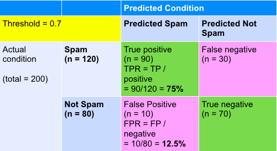
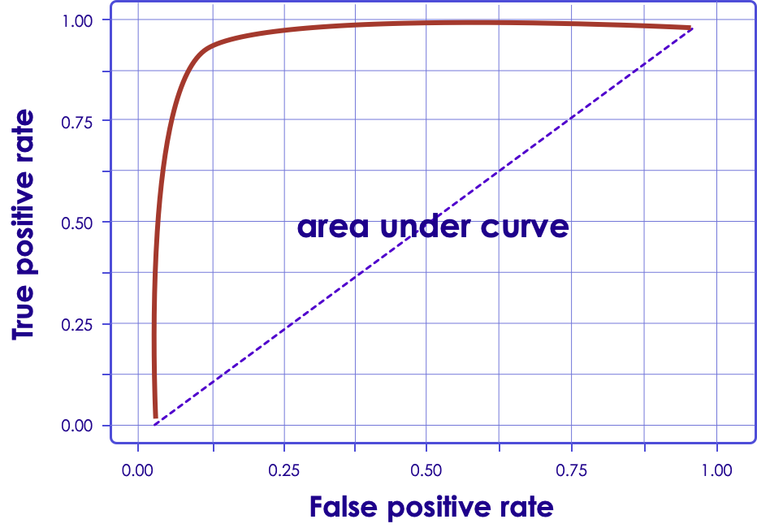
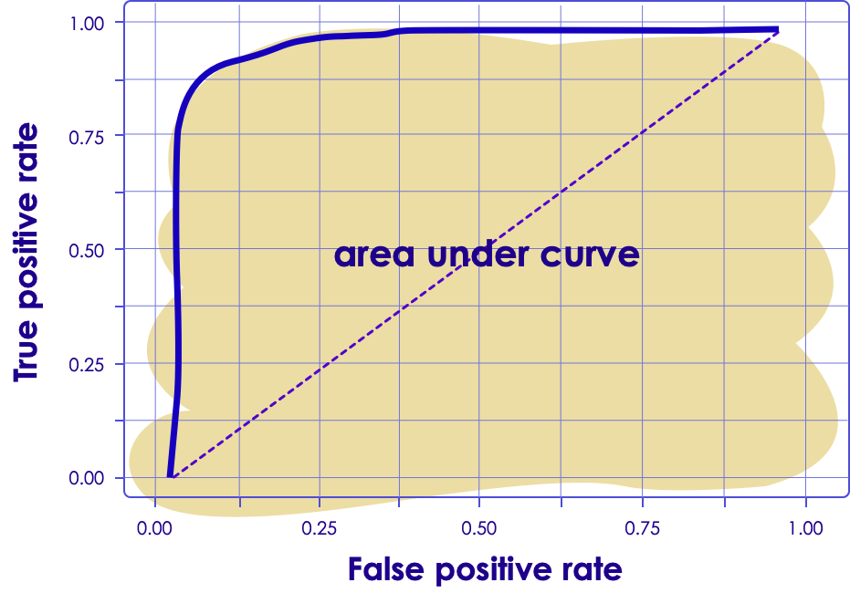
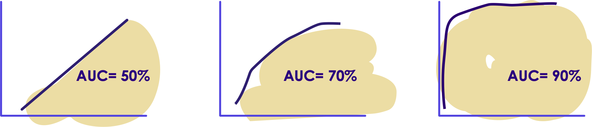

# Confusion Matrix and ROC Curve

---

## Confusion Matrix / Error Matrix

 * Let's consider a binary classifier
    - Picks one of two outcomes  (spam / not-spam)
 * Say we are classifying 10 emails (6 spam, 4 not-spam)

 <!-- {"left" : 1.35, "top" : 3.22, "height" : 5.03, "width" : 7.54} -->

Notes:

---

## Confusion Matrix: More Than 2 Outcomes

 <!-- {"left" : 1.13, "top" : 1.19, "height" : 2.79, "width" : 7.98} -->

  * Which animal the algorithm has trouble classifying? (too many misclassifications)
  * Which animal the algorithm is good at classifying?

Notes:

Answers :
algorithm is bad at predicting dogs (too many miss classifications, and only gets 50% right)
Algorithm is good at identifying rabbits

---

## Interpreting Confusion Matrix (True/False Positives/Negatives)

 <!-- {"left" : 0.51, "top" : 1.45, "height" : 6.17, "width" : 9.22} -->

Notes:

Story: A shepherd who cried wolf

---

## Confusion Matrix: Accuracy / Error Rate

 <!-- {"left" : 1.93, "top" : 4.37, "height" : 4.05, "width" : 6.39} -->

 * **Accuracy**  
Overall how accurate is the model?  
= (TP + TN) / total  
= (90 + 70) / 200  
= 0.8  or 80%

 * **Misclassifications / Error rate**  
How wrong is the model?  
= (FP + FN) / total  
= (10 + 30) / 200  
= 0.2 or 20%  
= 1 - accuracy

Notes:

http://www.dataschool.io/simple-guide-to-confusion-matrix-terminology/

---

## Confusion Matrix: Accuracy May Not Be Enough

 <!-- {"left" : 2.81, "top" : 5.78, "height" : 2.94, "width" : 4.63} -->

 * Let's say our classifier is used to diagnose cancer patients.
 * We have total 100 patients
    - 98 healthy
    - 2 have cancer
 * **Accuracy**  
  = (TP + TN) / total   
  = (1 + 98) / 100   
  = 99%  (very good!)
 * **Misclassifications / Error rate**  
= (FP + FN) / total  
= (0 + 1) / 100  
= 1%  (1 - accuracy)

---

## Confusion Matrix: Accuracy May Not Be Enough

<!-- {"left" : 5.45, "top" : 1.21, "height" : 2.99, "width" : 4.48} -->

  * **Question for class:**
    * What is the implication of 'False Positive'
    * What is the implication of 'False Negative' ?
    * Which is more serious?

  * Since accuracy may not be enough of a metric, there are other metrics
    - Precision
    - Recall

  * Next few slides will explain these

Notes:

 * Answers
  - False positive : a healthy patient is diagnosed as cancer patient.They have to go through additional testing.  Costing time and money and of course causing mental anxiety
  - False negative : a caner patient is diagnosed as healthy.This is pretty serious, because now a patient has missed treatment, potentially leading to health deterioration and may be loss of life.

 * http://www.dataschool.io/simple-guide-to-confusion-matrix-terminology/

---

## Confusion Matrix: TPR / FPR

 <!-- {"left" : 5.58, "top" : 2.19, "height" : 2.87, "width" : 4.44} -->

 * **True Positive Rate (TPR)  /Sensitivity / Hit Rate / Recall**  
  How often model predicts 'positive' as 'positive' (correctly) ? -- actual positive  
  = TP / (TP + FN)  
  = 90 / 120  
  = 0.75  or 75%

  * **False Positive Rate (FPR)**   
  How often model predicts 'negative' as 'positive' (incorrectly)  -- actual negative
  = FP / (FP + TN)  
  = 10 / 80  
  = 0.125 or 12.5%

Notes:

http://www.dataschool.io/simple-guide-to-confusion-matrix-terminology/

---

## Confusion Matrix: Specificity / Precision / Prevalence

 <!-- {"left" : 2.36, "top" : 4.91, "height" : 3.56, "width" : 5.53} -->

  * **Specificity**   
  How often model predicts negative' as negative' (correctly)?  -- actual no  
  = TN / (TN + FP)   
  = 70 / (70 + 10)  
  = 0.875 or 87.5 %  
  = 1 - FPR

 * **Precision / Positive Predictive Value (PPV)**  
When model predicts 'positive' how often it is right?  -- true / predicted positive   
= TP / (TP + FP)   
= 90 / (90 + 10)  
= 0.9  or 90%

Notes:

http://www.dataschool.io/simple-guide-to-confusion-matrix-terminology/

---

## Confusion Matrix: PPV / Null Error Rate

 <!-- {"left" : 2.14, "top" : 4.85, "height" : 3.89, "width" : 5.98} -->

 * **Prevalence**   
  How often does 'positive' occurs in our sample  
  = actual positive  / total  
  = 120 / 200  
  = 0.6  or 60%

 * **Null Error Rate**  
How often would the model be wrong if it always predicted the majority class?  
Here our majority = Positive  
If we always predicted 'positive' we would be wrong 80 times (negative)  
= 80/200  
= 40% of time

Notes:

http://www.dataschool.io/simple-guide-to-confusion-matrix-terminology/
https://en.wikipedia.org/wiki/Positive_and_negative_predictive_values

---

## Confusion Matrix : F-Score

 * So, while precision and recall are very important measures, looking at only one of them will not provide us with the full picture.
 * One way to summarize them is the f-score or f-measure, which is with the harmonic mean of precision and recall

 * **F = 2 * (Precision * Recall) / (Precision + Recall)**

Notes:

---

## Threshold
<!-- {"left" : 6.42, "top" : 2.18, "height" : 5.29, "width" : 3.72} -->

 * Our spam classifier provides a 'spam probability' for each email
    - Probability is between 0.0. and 1.0 (or 0 to 100%)
    - 1.0  definitely spam
    - 0.0 definitely not spam
 * When an email's 'spam score' is above a certain number we mark it as spam
    - This is called 'threshold'

---

## Threshold

<!-- {"left" : 6.67, "top" : 2.55, "height" : 5.04, "width" : 3.54} -->

 * If spam threshold is lower (say 50%)
    - more emails will be classified as spam (email1, email3)
    - Users will miss emails (as they are in Spam folder)
 * If spam threshold is higher (70%)
    - Fewer emails will be classified as spam (email3)
    - Users will see more spam emails be in Inbox
 * We need to find the sweet spot for threshold

Notes:

---

## Threshold

 * In first table our threshold is 0.7
    - 90 emails are correctly predicted as spam

 * Next table, our threshold is higher 0.8
    - Only 70 emails are classified as spam
Lower TPR

 &nbsp; <!-- {"left" : 0.51, "top" : 4.23, "height" : 2.62, "width" : 4.8} --> <!-- {"left" : 5.62, "top" : 4.19, "height" : 2.7, "width" : 4.12} -->

Notes:

---

## How is ROC Curve Generated

<!-- TODO shiva -->

 <!-- {"left" : 1.27, "top" : 1.83, "height" : 5.98, "width" : 7.7} -->

 * Y-axis: True Positive Rate (TPR)
    - Actual=positive, predicted=positive
    - Correct!

 * X-axis: False Positive Rate (FPR)
    - Actual=negative, predicted=positive
    - Incorrect!

 * `0.0 <= TPR & FPR  <= 1.0`

 * Plot TPR / FPR while varying 'threshold'

Notes:

---

## ROC Curve Example

 <!-- {"left" : 1.19, "top" : 2.07, "height" : 5.5, "width" : 7.88} -->

Notes:

---

## Interpreting ROC Curve

 <!-- {"left" : 6.05, "top" : 1.86, "height" : 4.35, "width" : 4.12} -->

 * The red line plots 'random guess' = B

 * Approaching 'top left' corner would be a perfect classifier!
    - So  D is better A

 * C performs worse than random --> bad

Notes:

https://en.wikipedia.org/wiki/Receiver_operating_characteristic
http://www.dataschool.io/roc-curves-and-auc-explained/

Image credit (CC) : https://commons.wikimedia.org/wiki/File:ROC_space-2.png

---

## Interpreting ROC Curve

  <!-- {"left" : 5.77, "top" : 2.55, "height" : 2.64, "width" : 4.34} -->

 * Shows tradeoff of TPR (sensitivity) vs. FPR (1 - specificity)
 * The closer to top-left , the more accurate  the model
 * Upper left corner (0,1) = perfect classification!
 * The closer to middle line (45 degree)  the less accurate the test
    - Middle line represents: random classification (50%)

Notes:

---

## Area Under Curve - AUC

 <!-- {"left" : 5.61, "top" : 2.08, "height" : 3.11, "width" : 4.45} -->

 * Measures the percentage of area 
   'under the curve'
 * AUC is between 0 and 1.0
 * Higher AUC --> more accurate the model
 * See 3 scenarios below
    - Leftmost is bad (50%)
    - Middle: OK (70%)
    - Rightmost: very good (90%)

 <!-- {"left" : 0.57, "top" : 6.35, "height" : 2.33, "width" : 9.1} -->

Notes:

---

## Using AUC to Measure Accuracy

 * Accuracy can be specified using a grading system

<!-- TODO shiva -->
 <!-- {"left" : 0.42, "top" : 4.36, "height" : 4.26, "width" : 5.71} -->

| AUC        | Grade         |
|--------    |----------     |
| 0.9 - 1.00 | A - Excellent |
| 0.80 - 0.90| B - good      |
| 0.70 - 0.80| C - fair      |
| 0.60 - 0.70| D - poor      |
| 0.50 - 0.60| F - Fail      |

<!-- {"left" : 6.7, "top" : 1.98, "height" : 2.38, "width" : 3.3, "columnwidth" : [1.61, 1.69]} -->

Notes:

 * https://www.youtube.com/watch?v=21Igj5Pr6u4
 * http://gim.unmc.edu/dxtests/roc3.htm

 * Image credit (CC) : http://gim.unmc.edu/dxtests/roc3.htm

---
## ROC / AUC For Multiclass Classifiers

<!-- TODO shiva -->
 <!-- {"left" : 2.43, "top" : 4.43, "height" : 4.03, "width" : 5.4} -->

 * Say our algorithm recognizes hand-written digits (postal code) into numbers.
 * Its ROC can be drawn as follows
 * **Question for class**:
    - Which digit the classifier is doing well?
    - Which digit the classifier is not doing well?

Notes:
