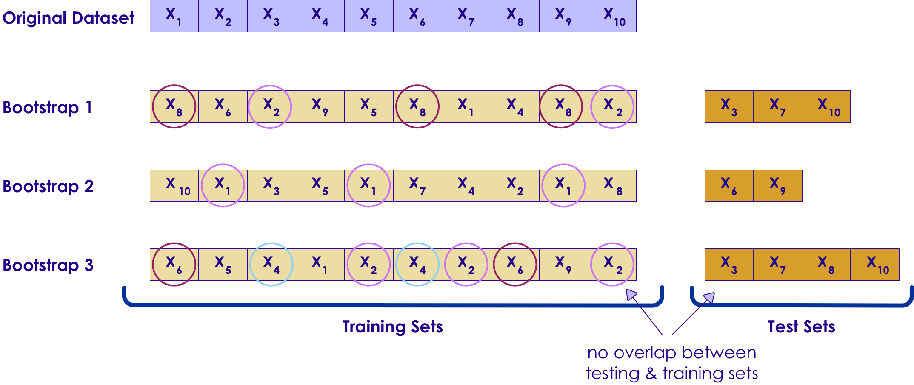

# Cross Validation
---

## Common Mistakes in Model Validation

 * **Mistake: Re-using 'training data' as 'testing data'**
    - Model can predict accurately on testing (because it has 'seen' the data before)
    - Giving the designer 'false confidence'
    - But will do badly on new data

 * Solution:
    - **Cross Validation**

---

## Common Mistakes in Model Validation

 * **Mistake: Using overly simplistic validation methods**
    - Model might appear to be working well

 * **Mistake: Using more parameters (20 attributes) than actual observations (10 observations)**
    - Model will 'memorize' the data rather than learning
    - Will do well on testing data / but poorly on new data

 * Solution:
    - Use more data

Notes:

---

## Hold Out Method (Validation Set)

 * Do not use the same data for training and testing!
    - Model will do well in testing (it has seen the questions before!)
 * Separate the data set into
    - Training set  (60-70%)
    - Testing set (30-40%)
 * This is done  randomly

 <!-- {"left" : 2.16, "top" : 4.63, "height" : 2.61, "width" : 5.94} -->

Notes:

---

## Hold Out Method Drawbacks

 * Drawbacks
    - Error rate can significantly fluctuate based on how data is divided (randomly)
    - When we do a randomly split data into training/test
    - If we are 'lucky', we get an easy test set -> resulting in higher than usual accuracy
      - If we are 'unlucky' we get a hard test set -> resulting in lower than usual accuracy

---

## Hold Out Method Drawbacks

 * Example
    - Assume we want to test a student's knowledge in a subject
    - We have a pool of 20 questions
    - Test 1:
      - Out of 20, we randomly choose 15 questions And the student scores 60%
      - Is this the final score?  No.
      - We need to do more tests and average out the score

 * Solution: **k-fold Cross validation**
    - Rigorously tests model accuracy

Notes:

---

## K-Fold Cross Validation

 * Divide the data into equal k sections (k folds, usually 10 to 20)
 * Reserve one fold for testing (say fold-i)
 * Use others folds for training
 * Then test with fold-I
 * After we have cycled through all k folds, prediction accuracies are aggregated and compared

 <!-- {"left" : 1.42, "top" : 4.43, "height" : 4.07, "width" : 7.41} -->

Notes:

---

## Cross-Validation Example

 <!-- {"left" : 0.36, "top" : 1.1, "height" : 2.47, "width" : 9.54} -->

 * Here we are doing a 5-fold cross validation
 * Data is split into 5 splits - one held for testing, remaining 4 used for training
 * Accuracy varies from 80% to 90%
 * Average accuracy is `AVG(80,84,90,86,82) = 85%`

Notes:

---

## Cross Validation

 * Cross Validation is used to evaluate different algorithms

 * See the following CV runs of 3 different algorithms (A,B,C)
    - Algorithm A accuracy is : 60%  to 72%
    - Algorithm B accuracy is : 70%  to 85%
    - Algorithm C accuracy is : 50%  to 90%

 * We might select algorithm B, as it seems to produce decent range

 * Algorithm C is not desirable as its accuracy varies so much (high variance)

<!-- {"left" : 0.76, "top" : 5.64, "height" : 2.65, "width" : 8.73} -->

---

## Cross Validation Takeaways

 * We don't choose the 'best performing model' from CV
    - CV is used to understand a particular algorithm's performance for the given data
    - And how well it can generalize to new data

 * Pros
    - Helps us systematically tests a model through the data
    - Can identify high-variance / over-fitting models

 * Cons
    - Increased compute time to create multiple models and test
      - Solution: run CV tasks in parallel across multiple CPU-cores or on a cluster (embarrassingly parallelizable problem)

Notes:

---
# Bootstrapping
---

## Bootstrapping

 * Randomly selecting data for training with replacement

 * Data points: [a, b, c, d, e ]
    - Bootstrap selection 1: [  b,  d,  d,   c ]
    - Bootstrap selection 2: [ d,  a, d,  a ]

 * It may seem counter-intuitive to draw the same data again and again

 * But in some scenarios, bootstrapping really helps to train the model

 * See next slides to understand sampling with and without replacement

Notes:

---

## Sampling Without Replacement

 <!-- {"left" : 1.02, "top" : 1.51, "height" : 6.62, "width" : 8.2} -->

Notes:

---

## Sampling With Replacement (aka Bootstrapping)

 <!-- {"left" : 1.66, "top" : 1.38, "height" : 6.89, "width" : 6.92} -->

Notes:

---

## Bootstrapping Example 2

 <!-- {"left" : 0.39, "top" : 2.82, "height" : 4.01, "width" : 9.48} -->

Notes:
