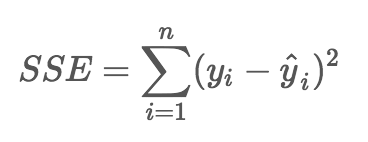
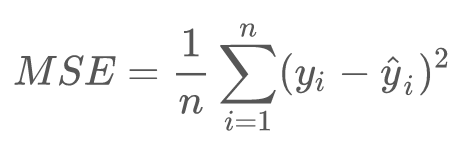
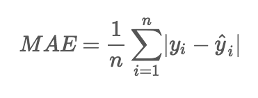
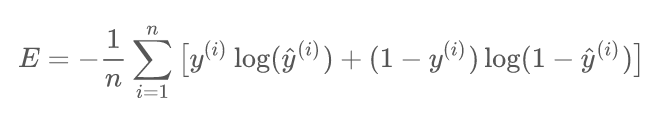
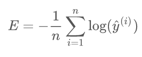
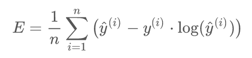
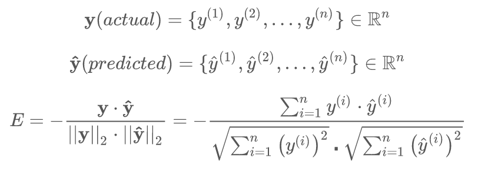
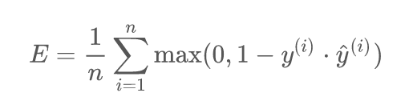
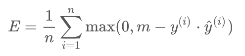

# Errors and Loss Functions

---

# Error/Loss Functions for Regressions

---

## Error / Loss Function

- The function that is used to compute the error is known as **Loss Function `J()`**

- Different loss functions will calculate different values for the same prediction errors

- In next few slides, we are going to examine some of the loss functions

---

## Estimating Tips for Meals

 * Let's consider tips at a restaurant

| Meal # | Tip ($)  |
|--------|----------|
| 1      | 12       |
| 2      | 7        |
| 3      | 13       |
| 4      | 8        |
| 5      | 15       |
| 7      | 5        |

<!-- {"left" : 0.25, "top" : 2.3, "height" : 3.5, "width" : 9.75} -->

Notes:

- https://www.youtube.com/playlist?list=PLIeGtxpvyG-LoKUpV0fSY8BGKIMIdmfCi

---

## Understanding Residuals / Errors

 * Let's say, our _very naive_ model __always predicts tip as `$10`__ :-)
 * From the table, we can see none of the tip amounts are exactly $10
    * This difference (delta) is called __Error or Residual__
    * __`Residual = actual tip - predicted tip`__
 * Sum of all residuals = **ZERO**  (positive and negative errors are canceling each other)

<!-- {"left" : 0.23, "top" : 5.62, "height" : 1.89, "width" : 3.83} -->

| Actual Tip | Predicted Tip | Error or Residual = (Actual - Predicted) |
|------------|---------------|------------------------------------------|
| 12         | 10            | +2  = (12 - 10)                          |
| 7          | 10            | -3 = (7 - 10)                            |
| 13         | 10            | +3 = (13 - 10)                           |
| 8          | 10            | -2 = (8 - 10)                            |
| 15         | 10            | +5 = (15 - 10)                           |
| 5          | 10            | -5 = (5 - 10)                            |
|            |               | SUM = 0  (+2 -3 +3 -2 +5 -5)             |

<!-- {"left" : 4.18, "top" : 4.57, "height" : 3.98, "width" : 5.98, "columnwidth" : [1.08, 1.39, 3.51]} -->

Notes:

---

## Sum of Squared Errors (SSE)

 * From the previous table, errors can cancel each other out
 * Let's square the error:
   - To make them all positive (so negative and positive don't cancel each other out)
   - To amplify 'outliers' (large deviations)
 * **Question for the class: Can SSE be zero? :-)**

| Actual Tip | Predicted Tip | Error = (Actual - Predicted) | Error Squared |
|------------|---------------|------------------------------|---------------|
| 12         | 10            | +2  = (12 - 10)              | 4             |
| 7          | 10            | -3 = (7 - 10)                | 9             |
| 13         | 10            | +3 = (13 - 10)               | 9             |
| 8          | 10            | -2 = (8 - 10)                | 4             |
| 15         | 10            | +5 = (15 - 10)               | 25            |
| 5          | 10            | -5 = (5 - 10)                | 25            |
|            | Total ==>     | 0                            | 76            |

<!-- {"left" : 1.06, "top" : 4.1, "height" : 3.18, "width" : 8.13, "columnwidth" : [1.32, 1.69, 3.41, 1.81]} -->

Notes:

---

## Sum of Squared Errors (SSE)

<!-- {"left" : 6.65, "top" : 1.94, "height" : 1.33, "width" : 3.45} -->

 * Also known as
    - **Residual Sum of Squares (RSS)**
    - **Sum of Squared Residuals (SSR)**
 * In this formula
    - Yi: actual value
    - Ŷi: predicted value
 * Properties
    * A good all purpose error metric that is widely used
    * SSE also 'amplifies' the outliers (because of squaring)
 * For example, if SSE for model-A = 75 and SSE for model-B  = 50
    - Model-B might be better fit

Notes:

- https://en.wikipedia.org/wiki/Residual_sum_of_squares
- https://isaacchanghau.github.io/post/loss_functions/

---

## Mean Squared Error (MSE) (L2)

<!-- {"left" : 6.82, "top" : 2.47, "height" : 1.2, "width" : 3.17} -->

| Actual Tip | Predicted Tip | Error = (Actual - Predicted) | Error Squared |
|------------|---------------|------------------------------|---------------|
| 12         | 10            | +2  = (12 - 10)              | 4             |
| 7          | 10            | -3 = (7 - 10)                | 9             |
| 13         | 10            | +3 = (13 - 10)               | 9             |
| 8          | 10            | -2 = (8 - 10)                | 4             |
| 15         | 10            | +5 = (15 - 10)               | 25            |
| 5          | 10            | -5 = (5 - 10)                | 25            |
|            | Total ==>     | 0                            | 76            |

<!-- {"left" : 0.31, "top" : 1.33, "height" : 3.47, "width" : 6.22, "columnwidth" : [1.32, 1.69, 2.08, 1.13]} -->

- `MSE = (4  + 9 + 9 + 4 + 25 + 25)/6 = 76 / 6 = 12.6`
- Properties
    - Can be sensitive to outliers; predictions that deviate a lot from actual values are penalized heavily
    - Easy to calculate gradients (fast)

Notes:  
https://isaacchanghau.github.io/post/loss_functions/

---

## Mean Absolute Error (MAE)

<!-- {"left" : 6.71, "top" : 2.3, "height" : 1.2, "width" : 3.17} -->

| Actual Tip | Predicted Tip | Error = (Actual - Predicted) | **Absolute Error** | Error Squared |
|------------|---------------|------------------------------|--------------------|---------------|
| 12         | 10            | +2  = (12 - 10)              | 2                  | 4             |
| 7          | 10            | -3 = (7 - 10)                | 3                  | 9             |
| 13         | 10            | +3 = (13 - 10)               | 3                  | 9             |
| 8          | 10            | -2 = (8 - 10)                | 2                  | 4             |
| 15         | 10            | +5 = (15 - 10)               | 5                  | 25            |
| 5          | 10            | -5 = (5 - 10)                | 5                  | 25            |
|            | Total ==>     | 0                            | 20                 | 76            |

<!-- {"left" : 0.18, "top" : 1.1, "height" : 3.73, "width" : 6.68, "columnwidth" : [1.39, 1.4, 2.06, 0.62, 1.22]} -->

- `MAE = (2 + 3 + 3 + 2 + 5 + 5) = 20 / 6 = 3.33`
- Properties:
    - More robust and is generally not affected by outliers
    - Use if 'outliers' are considered 'corrupt data' (or not critical part of data)

---

## Regression Error Functions - Summary

- Error functions tell us 'how far off' our prediction from actual value is.
- We have seen 3 popular error functions for regression
- Which one to use?
    - No 'hard' rules!, follow some practical guide lines
    - Try them all and see which one gives better results! :-)  
    (most ML libraries allow us to configure the error function very easily)

| Regression                  |
|-----------------------------|
| Sum of Squared Errors (SSE) |
| Mean Square Error (MSE)     |
| Mean Absolute Error (MAE)   |

---

# Error/Loss Functions for Classifications

---

## Summary of Error / Loss Functions

| Regression                  | Classification          | Embedding      |
|-----------------------------|-------------------------|----------------|
| Sum of Squared Errors (SSE) | Binary Class Entrophy   | Cosine Error   |
| Mean Square Error (MSE)     | Negative Log Likelihood | L1 Hinge Error |
| Mean Absolute Error (MAE)   | Margin Classifier       |                |
|                             | Soft Margin Classifier  | &nbsp;         |

<!-- {"left" : 0.25, "top" : 1.64, "height" : 2.69, "width" : 9.75} -->

---

## Loss Functions for Classification

- Binary Class Entrophy

- Negative Log Likelihood

- Margin Classifier

- Soft Margin Classifier

---

## Binary Class Entrophy

- Cross Entropy is used in binary classification scenarios (0 / 1)

- Measures the divergence of probability distributions between actual and predicted values

<!-- {"left" : 1.7, "top" : 3.11, "height" : 1.28, "width" : 6.85} -->

---

## Negative Logarithmic Likelihood

- Used when model outputs probability of each class  
(digit-1  : 10%,   digit-9 : 90%  ..etc)

<!-- {"left" : 3.15, "top" : 2.95, "height" : 1.6, "width" : 3.95} -->

Notes:  
- https://quantivity.wordpress.com/2011/05/23/why-minimize-negative-log-likelihood/

---

## Poisson Loss Function

- Derived from [Poisson distribution](https://en.wikipedia.org/wiki/Poisson_regression) which is used for counting data

<!-- {"left" : 1.97, "top" : 3.03, "height" : 1.45, "width" : 6.31} -->

---

## Cosine Proximity

<!-- {"left" : 6.62, "top" : 1.15, "height" : 3.05, "width" : 3.43} -->

- Computes the cosine proximity between predicted value and actual value

- Based on [Cosine similarity](https://en.wikipedia.org/wiki/Cosine_similarity)
    - Vectors are 'similar' if they are parallel
    - Vectors are 'not similar' if they are perpendicular / orthogonal

<!-- {"left" : 1.79, "top" : 6.36, "height" : 2.67, "width" : 6.67} -->

Notes:

---

## Hinge Loss / Max Margin Loss

- From [Support Vector Machines (SVM)](https://en.wikipedia.org/wiki/Support_vector_machine)

- For binary output

<!-- {"left" : 2.47, "top" : 2, "height" : 1.42, "width" : 5.31} -->

- For multi-class classifier

<!-- {"left" : 2.63, "top" : 4.55, "height" : 1.15, "width" : 5} -->

Notes:  
- https://en.wikipedia.org/wiki/Hinge_loss

---

## Loss Functions: Resources

- https://heartbeat.fritz.ai/5-regression-loss-functions-all-machine-learners-should-know-4fb140e9d4b0

- https://rishy.github.io/ml/2015/07/28/l1-vs-l2-loss/

- https://isaacchanghau.github.io/post/loss_functions/

- https://ml-cheatsheet.readthedocs.io/en/latest/loss_functions.html

- https://towardsdatascience.com/common-loss-functions-in-machine-learning-46af0ffc4d23
