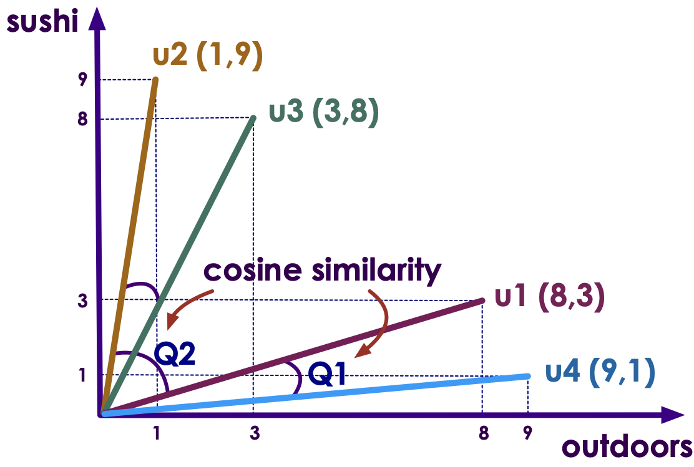
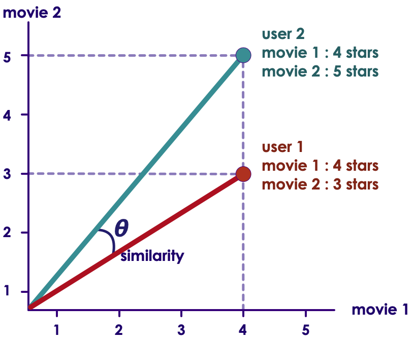
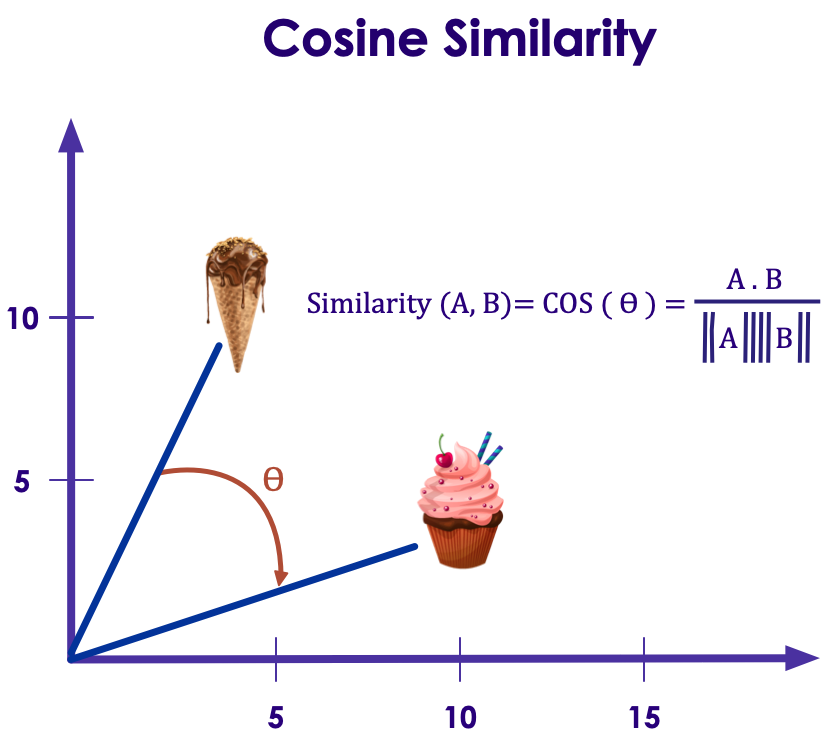

# Errors and Loss Functions

---

# Error/Loss Functions for Regressions

---

## Error / Loss Function

- The function that is used to compute the error is known as **Loss Function `J()`**

- Different loss functions will calculate different values for the same prediction errors

- In next few slides, we are going to examine some of the loss functions

---

## Estimating Tips for Meals

 * Let's consider tips at a restaurant

| Meal # | Tip ($)  |
|--------|----------|
| 1      | 12       |
| 2      | 7        |
| 3      | 13       |
| 4      | 8        |
| 5      | 15       |
| 7      | 5        |

<!-- {"left" : 3.88, "top" : 4.11, "height" : 3.5, "width" : 9.75} -->

Notes:

- https://www.youtube.com/playlist?list=PLIeGtxpvyG-LoKUpV0fSY8BGKIMIdmfCi

---

## Understanding Residuals / Errors

 * Let's say, our _very naive_ model __always predicts tip as `$10`__ :-)
 * From the table, we can see none of the tip amounts are exactly $10
    * This difference (delta) is called __Error or Residual__
    * __`Residual = actual tip - predicted tip`__
 * Sum of all residuals = **ZERO**  (positive and negative errors are canceling each other)

<!-- {"left" : 0.93, "top" : 6.64, "height" : 3.14, "width" : 6.37} -->

| Actual Tip | Predicted Tip | Error or Residual = (Actual - Predicted) |
|------------|---------------|------------------------------------------|
| 12         | 10            | +2  = (12 - 10)                          |
| 7          | 10            | -3 = (7 - 10)                            |
| 13         | 10            | +3 = (13 - 10)                           |
| 8          | 10            | -2 = (8 - 10)                            |
| 15         | 10            | +5 = (15 - 10)                           |
| 5          | 10            | -5 = (5 - 10)                            |
|            |               | SUM = 0  (+2 -3 +3 -2 +5 -5)             |

<!-- {"left" : 7.76, "top" : 6.03, "height" : 4.35, "width" : 8.81} -->

Notes:

---

## Sum of Squared Errors (SSE)

 * From the previous table, errors can cancel each other out
 * Let's square the error:
   - To make them all positive (so negative and positive don't cancel each other out)
   - To amplify 'outliers' (large deviations)
 * **Question for the class: Can SSE be zero? :-)**

| Actual Tip | Predicted Tip | Error = (Actual - Predicted) | Error Squared |
|------------|---------------|------------------------------|---------------|
| 12         | 10            | +2  = (12 - 10)              | 4             |
| 7          | 10            | -3 = (7 - 10)                | 9             |
| 13         | 10            | +3 = (13 - 10)               | 9             |
| 8          | 10            | -2 = (8 - 10)                | 4             |
| 15         | 10            | +5 = (15 - 10)               | 25            |
| 5          | 10            | -5 = (5 - 10)                | 25            |
|            | Total ==>     | 0                            | 76            |

<!-- {"left" : 1.75, "top" : 5.91, "height" : 3.93, "width" : 14} -->

Notes:

---

## Sum of Squared Errors (SSE)

<!-- {"left" : 11.17, "top" : 2.16, "height" : 2.12, "width" : 5.51} -->

 * Also known as
    - **Residual Sum of Squares (RSS)**
    - **Sum of Squared Residuals (SSR)**
 * In this formula
    - Yi: actual value
    - Ŷi: predicted value
 * Properties
    * A good all purpose error metric that is widely used
    * SSE also 'amplifies' the outliers (because of squaring)
 * For example, if SSE for model-A = 75 and SSE for model-B  = 50
    - Model-B might be better fit

Notes:

- https://en.wikipedia.org/wiki/Residual_sum_of_squares
- https://isaacchanghau.github.io/post/loss_functions/

---

## Mean Squared Error (MSE) (L2)

<!-- {"left" : 12.1, "top" : 3.7, "height" : 1.83, "width" : 4.84} -->

| Actual Tip | Predicted Tip | Error = (Actual - Predicted) | Error Squared |
|------------|---------------|------------------------------|---------------|
| 12         | 10            | +2  = (12 - 10)              | 4             |
| 7          | 10            | -3 = (7 - 10)                | 9             |
| 13         | 10            | +3 = (13 - 10)               | 9             |
| 8          | 10            | -2 = (8 - 10)                | 4             |
| 15         | 10            | +5 = (15 - 10)               | 25            |
| 5          | 10            | -5 = (5 - 10)                | 25            |
|            | Total ==>     | 0                            | 76            |

<!-- {"left" : 0.7, "top" : 1.77, "height" : 1, "width" : 11.25, "columnwidth" : [2.04, 2.27, 3.51, 1.32, 2.11]} -->

- `MSE = (4  + 9 + 9 + 4 + 25 + 25)/6 = 76 / 6 = 12.6`
- Properties
    - Can be sensitive to outliers; predictions that deviate a lot from actual values are penalized heavily
    - Easy to calculate gradients (fast)

Notes:  
https://isaacchanghau.github.io/post/loss_functions/

---

## Mean Absolute Error (MAE)

<!-- {"left" : 11.74, "top" : 3.7, "height" : 1.83, "width" : 4.84} -->

| Actual Tip | Predicted Tip | Error = (Actual - Predicted) | **Absolute Error** | Error Squared |
|------------|---------------|------------------------------|--------------------|---------------|
| 12         | 10            | +2  = (12 - 10)              | 2                  | 4             |
| 7          | 10            | -3 = (7 - 10)                | 3                  | 9             |
| 13         | 10            | +3 = (13 - 10)               | 3                  | 9             |
| 8          | 10            | -2 = (8 - 10)                | 2                  | 4             |
| 15         | 10            | +5 = (15 - 10)               | 5                  | 25            |
| 5          | 10            | -5 = (5 - 10)                | 5                  | 25            |
|            | Total ==>     | 0                            | 20                 | 76            |

<!-- {"left" : 0.92, "top" : 1.89, "height" : 1, "width" : 10.62} -->

- `MAE = (2 + 3 + 3 + 2 + 5 + 5) = 20 / 6 = 3.33`
- Properties:
    - More robust and is generally not affected by outliers
    - Use if 'outliers' are considered 'corrupt data' (or not critical part of data)

---

## Regression Error Functions - Summary

- Error functions tell us 'how far off' our prediction from actual value is.
- We have seen 3 popular error functions for regression
- Which one to use?
    - No 'hard' rules!, follow some practical guide lines
    - Try them all and see which one gives better results! :-)  
    (most ML libraries allow us to configure the error function very easily)

| Regression                  |
|-----------------------------|
| Sum of Squared Errors (SSE) |
| Mean Square Error (MSE)     |
| Mean Absolute Error (MAE)   |

<!-- {"left" : 3.64, "top" : 6.43, "height" : 2, "width" : 10.22} -->

---

# Error/Loss Functions for Classifications

---

## Loss Functions for Classification

- Binary Class Entrophy

- Categorical Crossentropy / Sparse Categorical Crossentropy

- Negative Log Likelihood

- Margin Classifier

- Soft Margin Classifier

---

##  Binary Classifications: Binary Class Entrophy

- Cross Entropy is used in binary classification scenarios (0 / 1)

- Measures the divergence of probability distributions between actual and predicted values

| Income (input 1) | Credit Score (input 2) | Current Debt (input 3) | Loan Approved (output) |
|------------------|------------------------|------------------------|------------------------|
| 40,000           | 620                    | 0                      | 0                      |
| 80,000           | 750                    | 100,000                | 1                      |
| 100,000          | 800                    | 50,000                 | 1                      |

<!-- {"left" : 0.78, "top" : 4.49, "height" : 1, "width" : 15.95, "columnwidth" : [3.99, 3.99, 3.99, 3.99]} -->

<!-- {"left" : 2.67, "top" : 7.3, "height" : 2.27, "width" : 12.16} -->

---

## Multi Class Classifications: Sparse Categorical Crossentropy  

* Here we predict one of many labels (1,2,3)

* Our labels are integers

* Choice: **`sparse_categorical_crossentropy`**

 

| a   | b   | c   | d   | label |
|-----|-----|-----|-----|-------|
| 6.4 | 2.8 | 5.6 | 2.2 | 1     |
| 5.0 | 2.3 | 3.3 | 1.0 | 2     |
| 4.9 | 3.1 | 1.5 | 0.1 | 3     |

<!-- {"left" : 1.35, "top" : 5.07, "height" : 1, "width" : 14.79} -->

---

## Multi Class Classifications: Categorical Crossentropy  

* Here we predict one of many labels (1,2,3)

* Our labels are **`one-hot-encoded`**

* Choice: **`categorical_crossentropy`**

 

| a   | b   | c   | d   | label       |
|-----|-----|-----|-----|------------ |
| 6.4 | 2.8 | 5.6 | 2.2 | [1,0,0]     |
| 5.0 | 2.3 | 3.3 | 1.0 | [0,1,0]     |
| 4.9 | 3.1 | 1.5 | 0.1 | [0,0,1]     |

<!-- {"left" : 1.35, "top" : 5.07, "height" : 1, "width" : 14.79} -->

---
## Summary of Errors / Loss Functions

| Regression                  | Classification           | Embedding      |
|-----------------------------|--------------------------|----------------|
| Sum of Squared Errors (SSE) | Binary Class Entrophy    | Cosine Error   |
| Mean Square Error (MSE)     | Categorical Crossentropy | L1 Hinge Error |
| Mean Absolute Error (MAE)   | Margin Classifier        |                |
|                             | Soft Margin Classifier   |                |
|                             | Negative Log Likelihood  |                |

<!-- {"left" : 1.41, "top" : 2.68, "height" : 1, "width" : 14.68} -->

---

## Loss Functions Based on Task

| Problem Type   | Prediction                      | Loss Function            |
|----------------|---------------------------------|--------------------------|
| Regression     | a number                        | mse, sse, mae            |
|                |                                 |                          |
| Classification | binary (0/1)                    | binary_crossentropy      |
|                | Multi-class   (A, B, C , D) | categorical_crossentropy |

<!-- {"left" : 1.41, "top" : 2.68, "height" : 1, "width" : 14.68} -->

---

# Cosine Similarity

---

## Use Case:  Find Similar Users in a Dating Website

| User | Likes Outdoors | Likes Sushi |
|------|----------------|-------------|
| u1 | 8 | 3 |
| u2 | 1 | 9 |
| u3 | 3 | 8 |
| u4 | 9 | 1 |

<!-- {"left" : 3.88, "top" : 2.4, "height" : 1, "width" : 9.75} -->

- Users are rating each item on a 1-10 scale (1 being least, 10 being most)
- We can represent these as vectors
    - u1: [8,3]
    - u2: [1,9]
- __Question for class:__
  - Looking at the matrix, which users __have similar tastes__ ?

---

## Finding Similar Users

<!-- {"left" : 10.26, "top" : 1.89, "height" : 4.37, "width" : 7} -->

- Now let's plot our users' interest
    - X-axis: outdoors
    - Y-axis: sushi

- It is much easier to identify users with 'similar tastes' from this plot
    - u1 and u4 have very similar tastes
    - u2 and u3 have very similar tastes

- __Cosine similarity__ measures how close the vectors are to each other  (the angle between them)

---

## Finding Similar Users: Adding More Dimensions

- Now let's add more attributes to our user profiles

| User | Likes Outdoors | Likes Sushi | Likes Cats | Likes to Read | Likes Movies | Likes Rock Music | Likes XYZ |
|------|----------------|-------------|------------|---------------|--------------|------------------|-----------|
| u1 | 8 | 3 | 10 | 8 | 4 | 3 | 7 |
| u2 | 1 | 9 | 1 | 9 | 9 | 8 | 6 |
| u3 | 3 | 8 | 5 | 7 | 1 | 1 | 1 |
| u4 | 9 | 1 | 8 | 1 | 10 | 8 | 9 |

<!-- {"left" : 0.4, "top" : 2.82, "height" : 1, "width" : 16.7, "columnwidth" : [1.54, 2.23, 1.79, 2.23, 2.14, 2.06, 2.81, 1.89]} -->

- Now our vectors have more dimension than 2
    - u1: [8,3,10,8,4,3,7]
    - u2: [1,9,1,9,9,8,6]
- __Question for class:__ Can we visualize this?
    - More than 3 dimensions is hard to visualize
- We need a way to measure 'similarity' of vectors in regardless of dimensions
    - __cosine similarity__

---

## Cosine Similarity

<!-- {"left" : 11.45, "top" : 1.89, "height" : 3.78, "width" : 5.62} -->

- __Cosine Similarity__ measures 'angle' between vectors
- Even though cosine values are between -1 and +1, cosine similarity is normalized between 0 and 1
    - 1: vectors are perfect alignment
    - 0: vectors are orthogonal (not like each other)
- So here an example would be:
    - cosine_similarity(u1,u4) = 0.85 (very close)
    - cosine_similarity(u1,u2) = 0.1  (not close)

 

<!-- {"left" : 1.9, "top" : 8.74, "height" : 1.88, "width" : 6.96} -->
<!-- {"left" : 10.94, "top" : 8.56, "height" : 2.08, "width" : 4.65} -->

---

## Cosine Similarity for Ratings

- Here we are representing ratings as vectors
- (Left) Start with ratings for 'movie-1'
- (Middle) Add ratings for 'movie-2'
- (Right) Generalize it to any number of movies

| User | m1 | m2 | m3 |
|------|----|----|----|
| u1   | 4  | 3  | 5  |
| u2   | 4  | 5  | 5  |

<!-- {"left" : 11.95, "top" : 2.6, "height" : 1, "width" : 4.95} -->

<!-- {"left" : 0.88, "top" : 7.45, "height" : 2.12, "width" : 6.74} --> &nbsp;
<!-- {"left" : 7.94, "top" : 6.32, "height" : 3.3, "width" : 3.98} --> &nbsp;
<!-- {"left" : 12.24, "top" : 6.18, "height" : 3.57, "width" : 4.38} -->

---

## Finding Similar Users Using Cosine Similarity

| User | Likes Outdoors | Likes Sushi | Likes Cats | Likes to Read | Likes Movies | Likes Rock Music | Likes XYZ |
|------|----------------|-------------|------------|---------------|--------------|------------------|-----------|
| u1 | 8 | 3 | 10 | 8 | 4 | 3 | 7 |
| u2 | 1 | 9 | 1 | 9 | 9 | 8 | 6 |
| u3 | 3 | 8 | 5 | 7 | 1 | 1 | 1 |
| u4 | 9 | 1 | 8 | 1 | 10 | 8 | 9 |

<!-- {"left" : 0.78, "top" : 2.1, "height" : 2.98, "width" : 15.95, "columnwidth" : [1.47, 2.13, 1.71, 2.13, 2.05, 1.97, 2.69, 1.81]} -->

- In this data, once we represent each user's interest as a vector, we can use cosine similarity to find similar tastes

- cosine_similarity(u1, others) gives us closest matches
    - u4  (0.8): closest
    - u3  (0.5)
    - u2  (0.1): farthest

---

## Cosine Proximity

<!-- {"left" : 11.29, "top" : 2.16, "height" : 5.26, "width" : 5.91} -->

- Computes the cosine proximity between predicted value and actual value

- Based on [Cosine similarity](https://en.wikipedia.org/wiki/Cosine_similarity)
    - Vectors are 'similar' if they are parallel
    - Vectors are 'not similar' if they are perpendicular / orthogonal

<!-- {"left" : 1.91, "top" : 7.97, "height" : 3.32, "width" : 8.3} -->

Notes:

---

# Summary of Errors / Loss Functions

---

## Summary of Errors / Loss Functions

| Regression                  | Classification           | Embedding      |
|-----------------------------|--------------------------|----------------|
| Sum of Squared Errors (SSE) | Binary Class Entrophy    | Cosine Error   |
| Mean Square Error (MSE)     | Categorical Crossentropy | L1 Hinge Error |
| Mean Absolute Error (MAE)   | Margin Classifier        |                |
|                             | Soft Margin Classifier   |                |
|                             | Negative Log Likelihood  |                |

<!-- {"left" : 1.29, "top" : 3.43, "height" : 1, "width" : 14.91} -->

---

## Loss Functions: Resources

- https://heartbeat.fritz.ai/5-regression-loss-functions-all-machine-learners-should-know-4fb140e9d4b0

- https://rishy.github.io/ml/2015/07/28/l1-vs-l2-loss/

- https://isaacchanghau.github.io/post/loss_functions/

- https://ml-cheatsheet.readthedocs.io/en/latest/loss_functions.html

- https://towardsdatascience.com/common-loss-functions-in-machine-learning-46af0ffc4d23

---

# Backup Slides

---

## Negative Logarithmic Likelihood

- Used when model outputs probability of each class  
(digit-1  : 10%,   digit-9 : 90%  ..etc)

<!-- {"left" : 11.67, "top" : 2.37, "height" : 2.08, "width" : 5.13} -->

Notes:  
- https://quantivity.wordpress.com/2011/05/23/why-minimize-negative-log-likelihood/

---

## Poisson Loss Function

- Derived from [Poisson distribution](https://en.wikipedia.org/wiki/Poisson_regression) which is used for counting data

<!-- {"left" : 4.5, "top" : 4.15, "height" : 1.95, "width" : 8.49} -->

---

## Hinge Loss / Max Margin Loss

- From [Support Vector Machines (SVM)](https://en.wikipedia.org/wiki/Support_vector_machine)

- For binary output

<!-- {"left" : 8.6, "top" : 2.78, "height" : 1.88, "width" : 7.02} -->

- For multi-class classifier

<!-- {"left" : 8.56, "top" : 6.38, "height" : 1.63, "width" : 7.09} -->

Notes:  
- https://en.wikipedia.org/wiki/Hinge_loss

