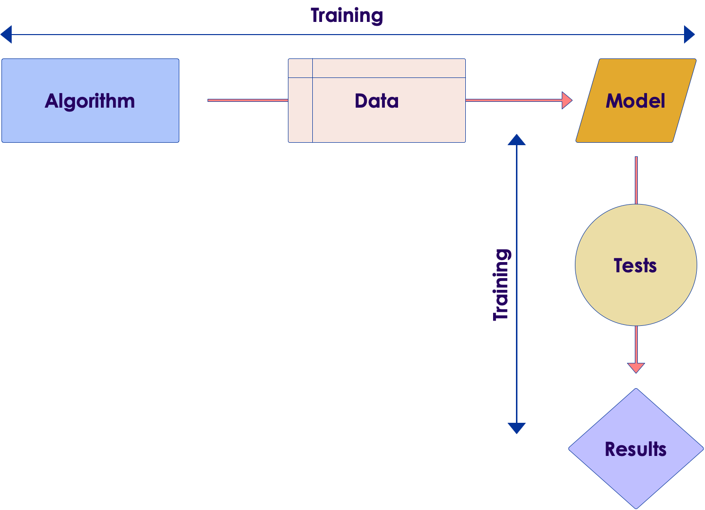
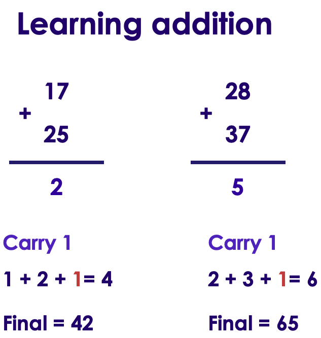
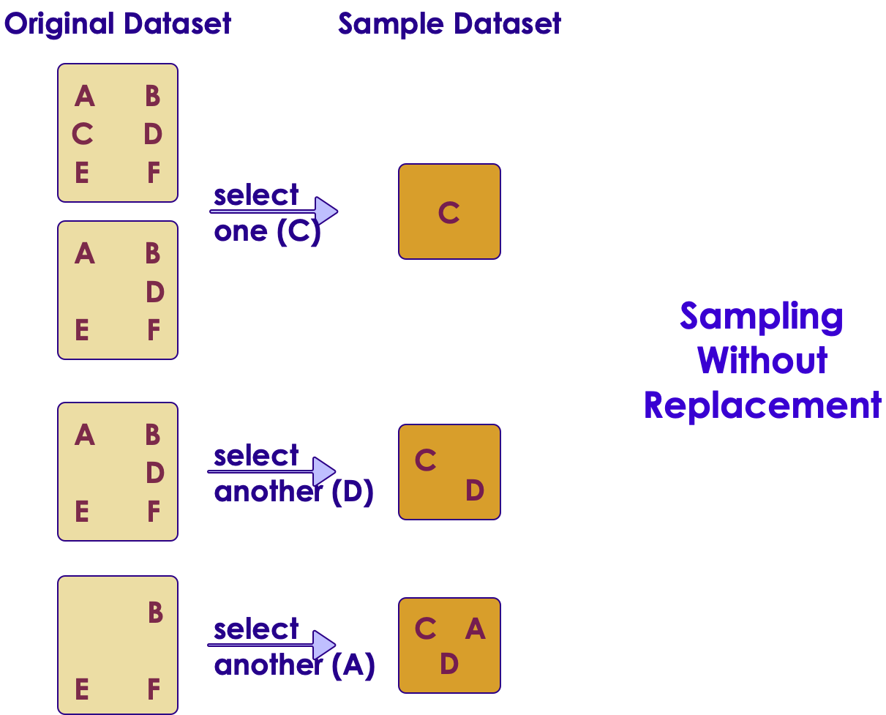

# Model Validation

---

## Model Evaluation

<!-- {"left" : 2.32, "top" : 3.48, "height" : 6.46, "width" : 12.87} -->

---

## Evaluating A Model

* How do we know our model is 'good'?

* Just like we test our software, we test our model

* Model is trained with 'training data'

* It's performance is measured on 'test data' (the model hasn't seen 'test data')

 <!-- {"left" : 0.88, "top" : 7.39, "height" : 1.82, "width" : 7.4} -->
 <!-- {"left" : 8.65, "top" : 5.41, "height" : 5.77, "width" : 7.97} -->

Notes:

---

# Model Validation Methods

---

## Model Validation

<!-- {"left" : 12.45, "top" : 1.89, "height" : 5.93, "width" : 4.7} -->

* **Mistake: Re-using 'training data' as 'testing data'**

* Here we are using the same data for training and testing

* Model can predict well on testing (because it has 'seen' the data before during training)

* This gives us 'false confidence'

* But the model will do badly on new data

* **Solution:  We need to use separate datasets for training and testing**

---
## Hold Out Method

 <!-- {"left" : 12.45, "top" : 1.89, "height" : 5.93, "width" : 4.7} -->

* Here we split the data into
    - Training set  (80%)
    - Testing set (20%)
* The split is done **randomly**
* The split is done so majority of data goes to training set
    - 70% training + 30%  testing
    - 80% training + 20%  testing
    - No hard rule, adjust as needed
* The following are not great splits:
    - 50% training + 50% testing : too little training data
    - 95% training + 5% testing : may not be enough data for testing

---

## Hold Out Method Drawbacks

 <!-- {"left" : 12.45, "top" : 1.89, "height" : 5.93, "width" : 4.7} -->

* Training/Test split is done randomly

* If we are 'lucky', we can get a well rounded training set and the model can learn well

* Also we can get an easy test set, resulting in higher than usual accuracy

* Or we could get a 'weak' training set, the model doesn't learn much;  
And get a 'hard' test set, where model does badly

* So model accuracy (performance) can significantly fluctuate based on how data is divided (randomly)

* See next slide for an example

---

## Hold Out Method Drawback Example

 <!-- {"left" : 12.45, "top" : 1.89, "height" : 5.93, "width" : 4.7} -->

* Assume we want to test a student's knowledge in a subject

* We have a pool of 20 questions

* Out of 20, we randomly choose 15 questions And the student scores 60%

* Is this the final score?  No.
    - This is just one score in a random test

* We need to do more tests and average out the score

* Solution: **k-fold Cross validation**

Notes:

---

# Cross Validation

---

## K-Fold Cross Validation

 * Divide the data into equal k sections (k folds, usually 10 to 20)
 * Reserve one fold for testing (say fold-i)
 * Use others folds for training
 * Then test with fold-I
 * After we have cycled through all k folds, prediction accuracies are aggregated and compared

 <!-- {"left" : 4.77, "top" : 6.65, "height" : 4.37, "width" : 7.96} -->

Notes:

---

## Cross-Validation Example

 <!-- {"left" : 3.16, "top" : 1.95, "height" : 2.9, "width" : 11.19} -->

 * Here we are doing a 5-fold cross validation
 * Data is split into 5 splits - one held for testing, remaining 4 used for training
 * Accuracy varies from 80% to 90%
 * Average accuracy is `AVG(80,84,90,86,82) = 85%`

Notes:

---

## Cross Validation

 * Cross Validation is used to evaluate different algorithms

 * See the following CV runs of 3 different algorithms (A,B,C)
    - Algorithm A accuracy is : 60%  to 72%
    - Algorithm B accuracy is : 70%  to 85%
    - Algorithm C accuracy is : 50%  to 90%

 * We might select algorithm B, as it seems to produce decent range

 * Algorithm C is not desirable as its accuracy varies so much (high variance)

<!-- {"left" : 2.85, "top" : 7.34, "height" : 3.58, "width" : 11.79} -->

---

## Cross Validation Takeaways

 * We don't choose the 'best performing model' from CV
    - CV is used to understand a particular algorithm's performance for the given data
    - And how well it can generalize to new data

 * Pros
    - Helps us systematically tests a model through the data
    - Can identify high-variance / over-fitting models

 * Cons
    - Increased compute time to create multiple models and test
      - Solution: run CV tasks in parallel across multiple CPU-cores or on a cluster (embarrassingly parallelizable problem)

Notes:

---

# Underfitting / Overfitting

---

## Under-fitting / Over-fitting

 * Here we have 3 models
 * One on left: is not really capturing the essence of the data
    - Underfitting
 * One on right: following every small variation of data, not really generalizing
    - Overfitting
 * One in the middle is just right

 <!-- {"left" : 1.79, "top" : 6.44, "height" : 4.39, "width" : 13.93} -->

Notes:

---

## Under-fitting

 * Model is 'too simple'  to capture the trends in input data
 * Hot to detect under-fitting?
    - We will get poor performance in both training & testing data
    - E.g.:
      - Training accuracy: 45%
      - Testing accuracy: 42%
 * Resolution:
    - Try a different algorithm / model, that better fits the data

  <!-- {"left" : 3.38, "top" : 7.37, "height" : 3.49, "width" : 10.74} -->

Notes:

---

## Overfitting

<!-- {"left" : 11.65, "top" : 1.89, "height" : 5.75, "width" : 5.45} -->

* Imagine we are teaching addition to young kids

* Rather than learning the 'carry concept' what if the kids just memorized all the examples

* They can do well in problems, they have seen before, but not any thing new
    - will do well: (17+25),  (28+37)
    - will not so well (they haven't seen it before):  (45+48)

* This is basically **overfitting**

* When model is **memorizing** training data instead of learning from it.

---

## Over-fitting

 * How to detect over-fitting?
    - Excellent performance on training data, but poor performance on testing (new) data
    - E.g.: Training accuracy: 95%
    - Testing accuracy: 62%
 * Resolution:
    - Try a different algorithm / model, that better fits the data
    - Simplify inputs

 <!-- {"left" : 2.57, "top" : 6.77, "height" : 4.12, "width" : 12.35} -->

Notes:

---

## Achieving a Good Fit

 * In ML we strive to find the 'sweet spot' between under-fitting models and over-fitting models

 <!-- {"left" : 4.46, "top" : 4.69, "height" : 6.26, "width" : 8.58} -->

Notes:

---

## Achieving a Good Fit

 * Both overfitting and underfitting can lead to poor model performance

 * underfitting is easier to spot
    - Bad performance on training data
    - Bad performance on test data

 * Overfitting can be hard to spot
    - because it performs well on training data
    - But doesn't do well on 'unseen' test data

 * Avoiding overfitting
    - Resampling technique
    - Hold back a validation dataset
    - Most popular method is: k-fold validation (more on this later)

 * For **decision trees**, we **prune** the tree to limit overfitting

Notes:

---

# Bootstrapping

---

## Bootstrapping

* Randomly selecting data for training with replacement

* Data points: [a, b, c, d, e ]
  - Bootstrap selection 1: [  b,  d,  d,   c ]
  - Bootstrap selection 2: [ d,  a, d,  a ]

* It may seem counter-intuitive to draw the same data again and again

* But in some scenarios, bootstrapping really helps to train the model

* See next slides to understand sampling with and without replacement

Notes:

---

## Sampling Without Replacement

 <!-- {"left" : 3.92, "top" : 2.3, "height" : 7.8, "width" : 9.66} -->

Notes:

---

## Sampling With Replacement (aka Bootstrapping)

 <!-- {"left" : 4.04, "top" : 2.17, "height" : 9.37, "width" : 9.41} -->

Notes:

---

## Bootstrapping Example 2

 <!-- {"left" : 1.98, "top" : 3.99, "height" : 5.73, "width" : 13.54} -->

Notes:
