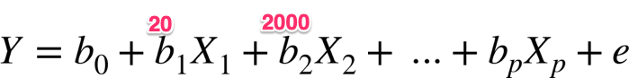
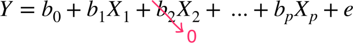

# Regularization

---

## Regularization

 * Regularization means explicitly restricting a mode
     - to avoid overfitting
     - And to reduce the complexity of the model

 * How to regularize?
     - Removing unnecessary coefficients (b1, b2 ..etc)
     - Keeping coefficient values from getting too large (**`parameter shrinkage`**)
        * Large coefficients amplify certain parameters

 * In the equation below, assume b1=20 and b2=2000Which variable X1 or X2 will have a large impact on outcome?

<!-- {"left" : 3.01, "top" : 7.91, "height" : 1.42, "width" : 11.48} -->

Notes:

Answer X2.. Because it gets multiplied by 2000

---

## Regularization

* We can control regularization by adjusting lambda (ƛ) variable

     - Lambda=0: no regularization

     - Lambda= small (0.001): very little regularization

     - Lambda= large (10): very strong regularization

* Optimal Lambda (ƛ) value depends on particular dataset, and can be calculated using cross validation

Notes:

---

## Ridge vs. Lasso

 * Two types of regularizations

     -  **Lasso Regression** ( **L1 regularization** )

     -  **Ridge Regression (L2 regularization)**

 * Ridge regression will  **'minimize' coefficients close to zero but not to zero**

     - Called  **parameter shrinkage**

 * Lasso regression  **can shrink parameters can also set them zero** !

     - By setting some coefficients to zero, it eliminates certain features

     - Called  **variable/feature selection**

<!-- {"left" : 3.36, "top" : 8.44, "height" : 1.59, "width" : 10.77} -->

Notes:

https://www.slideshare.net/ShangxuanZhang/ridge-regression-lasso-and-elastic-net
