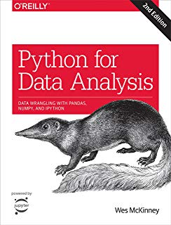
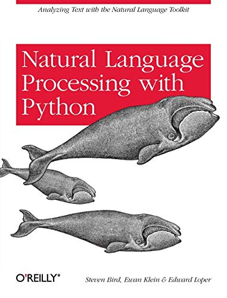
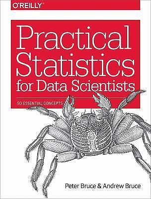
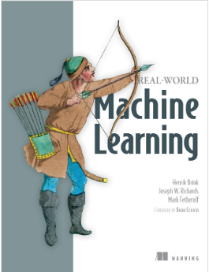
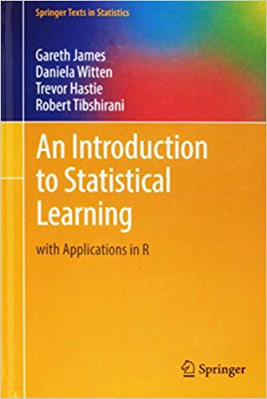

# Machine Learning Resources

---

## Python Language

- [A Byte of Python](https://python.swaroopch.com/) - (FREE online book) - a very good online book introducing Python
- [Dive into Python](https://diveintopython3.problemsolving.io/) - (FREE online book)
- [Learn Python the Hard Way](https://learnpythonthehardway.org/python3/) - (FREE online book)
- [Google Python Class](https://developers.google.com/edu/python/?csw=1) - FREE online class
- [Python Cookbook](https://github.com/ActiveState/code) - Recipes in Python
- [Python tutorials and exercises](https://www.w3resource.com/python-exercises/) - For your practice

---

## Python Data Science
- [https://scipy-lectures.org/](https://scipy-lectures.org/)
- [Best Python data science books](http://bigdata-madesimple.com/8-best-python-data-science-books/)
- Book - [Python for Data Analysis](https://www.oreilly.com/library/view/python-for-data/9781491957653/)
- Book - [Natural Language Processing with Python](http://www.nltk.org/book/)

 

<!-- {"left" : 2.25, "top" : 3.99, "height" : 3.4, "width" : 2.6} --> &nbsp; &nbsp; <!-- {"left" : 5.41, "top" : 3.99, "height" : 3.4, "width" : 2.59} -->

---

## Machine Learning - Meta Links

- [Awesome Machine Learning](https://github.com/josephmisiti/awesome-machine-learning)
- [Machine Learning for Software Engineers](https://github.com/ZuzooVn/machine-learning-for-software-engineers)

---

## Machine Learning - Gentle Introduction

* [Great AI Awakening](https://www.nytimes.com/2016/12/14/magazine/the-great-ai-awakening.html) - New York Times profile of on Google Brain and the people behind it

* [Gentle Intro to Machine Learning](https://monkeylearn.com/blog/a-gentle-guide-to-machine-learning/)

* [Machine Learning Basics](https://www.analyticsvidhya.com/blog/2015/06/machine-learning-basics/)

---

## Machine Learning Basics

- Book - [Think Stats](https://greenteapress.com/wp/think-stats-2e/)
- Book - [Practical Statistics for Data Scientists](http://shop.oreilly.com/product/0636920048992.do)
- [Basic Stats](https://statpages.info/)

 

<!-- {"left" : 1.82, "top" : 3.51, "height" : 3.98, "width" : 3.04} --> &nbsp;  &nbsp; <!-- {"left" : 5.4, "top" : 3.51, "height" : 3.98, "width" : 3.03} -->

---

## Machine Learning

- [Machine Learning Mastery](https://machinelearningmastery.com/) - Good collection of books and blog posts
- Book - [Real-World Machine Learning](https://www.manning.com/books/real-world-machine-learning)
- Book - [An Introduction to Statistical Learning](http://faculty.marshall.usc.edu/gareth-james/) - A gentle introduction to ML theory
- Book - [Elements of Statistical Learning](https://web.stanford.edu/~hastie/ElemStatLearn/) - more rigorous math treatment than above

 

<!-- {"left" : 0.7, "top" : 4.7, "height" : 3.47, "width" : 2.67} --> &nbsp;  &nbsp; <!-- {"left" : 4.15, "top" : 4.7, "height" : 3.47, "width" : 2.32} --> &nbsp; &nbsp; <!-- {"left" : 7.25, "top" : 4.7, "height" : 3.47, "width" : 2.3} -->

---

## Deep Learning

* [Neural networks and deep learning](https://learning.oreilly.com/library/view/neural-networks-and/9781492037354/)  
by  Aurélien Géron (ISBN: 9781492037347)

* [Hands-on Machine Learning with Scikit-Learn, Keras, and TensorFlow, 2nd Edition](https://learning.oreilly.com/library/view/hands-on-machine-learning/9781492032632/)  
by  Aurélien Géron (ISBN: 9781492032649)

&nbsp;&nbsp;<!-- {"left" : 2.41, "top" : 4.2, "height" : 3.57, "width" : 2.37} -->
<!-- {"left" : 5.12, "top" : 4.2, "height" : 3.57, "width" : 2.72} -->

---

## Deep Learning

* [Deep Learning](https://learning.oreilly.com/library/view/deep-learning/9781491924570/)  
by by Adam Gibson, Josh Patterson(ISBN: 9781491914250)

* [Practical Deep Learning for Cloud and Mobile](https://learning.oreilly.com/library/view/practical-deep-learning/9781492034858/)  
by Meher Kasam, Siddha Ganju, Anirudh Koul (ISBN: 9781492034841)

&nbsp;&nbsp;<!-- {"left" : 2.21, "top" : 4.21, "height" : 3.62, "width" : 2.75} -->
<!-- {"left" : 5.27, "top" : 4.21, "height" : 3.62, "width" : 2.77} -->
