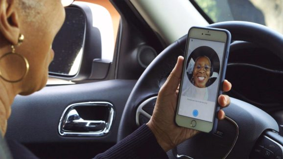

# Machine Learning Use Cases and Demos

  <!-- {"left" : 3.05, "top" : 8.12, "height" : 1.47, "width" : 2.04} -->    &nbsp; &nbsp;
   <!-- {"left" : 6.81, "top" : 8.88, "height" : 0.71, "width" : 3.74} -->    &nbsp; &nbsp;
  <!-- {"left" : 11.68, "top" : 9.07, "height" : 0.55, "width" : 2.77} -->

---

## Use Case 1: Uber Driver Verification

- To increase passenger safety, Uber drivers have to verify their identity before accepting rides

- Uber uses [Microsoft Cognitive Services](https://azure.microsoft.com/en-us/services/cognitive-services/) to recognize 7 million+ drivers in milli seconds

- [Link](https://venturebeat.com/wp-content/uploads/2016/09/uberids.gif?resize=343%2C600&strip=all)

&nbsp;&nbsp;<!-- {"left" : 1.95, "top" : 6.8, "height" : 2.74, "width" : 3.76} -->&nbsp;&nbsp;<!-- {"left" : 6.42, "top" : 6.59, "height" : 3.16, "width" : 5.64} --><!-- {"left" : 12.74, "top" : 5.7, "height" : 4.93, "width" : 2.81} -->

---

## Use Case 2: Photobucket

- [Photobucket](http://photobucket.com/) is a image / video hosting service

- They want to identify and tag NSFW (Not Safe For Work) images and offensive images

- Previously, their human moderation team was only able to monitor about 1% of content

- Now AI system (Using [Clarify](https://www.clarifai.com/)), screens images and tags them properly.  
Illegal images (child pornography ..etc) are flagged for law enforcement

- [Link](https://blog.clarifai.com/how-photobucket-uses-image-recognition-to-protect-its-community-from-unwanted-content)

 &nbsp; &nbsp; <!-- {"left" : 1.64, "top" : 7.84, "height" : 1.34, "width" : 7.09} --><!-- {"left" : 10.54, "top" : 7.95, "height" : 1.13, "width" : 5.32} -->

Notes:  
- https://blog.clarifai.com/how-photobucket-uses-image-recognition-to-protect-its-community-from-unwanted-content

---

## Clarifai Demo

- Go to: https://clarifai.com/demo

- Upload an image (or give a image URL)

- Examine the output.  
Have fun :-)

<!-- {"left" : 3.94, "top" : 4.64, "height" : 6.15, "width" : 9.61} -->

Notes:  
https://clarifai.com/demo
