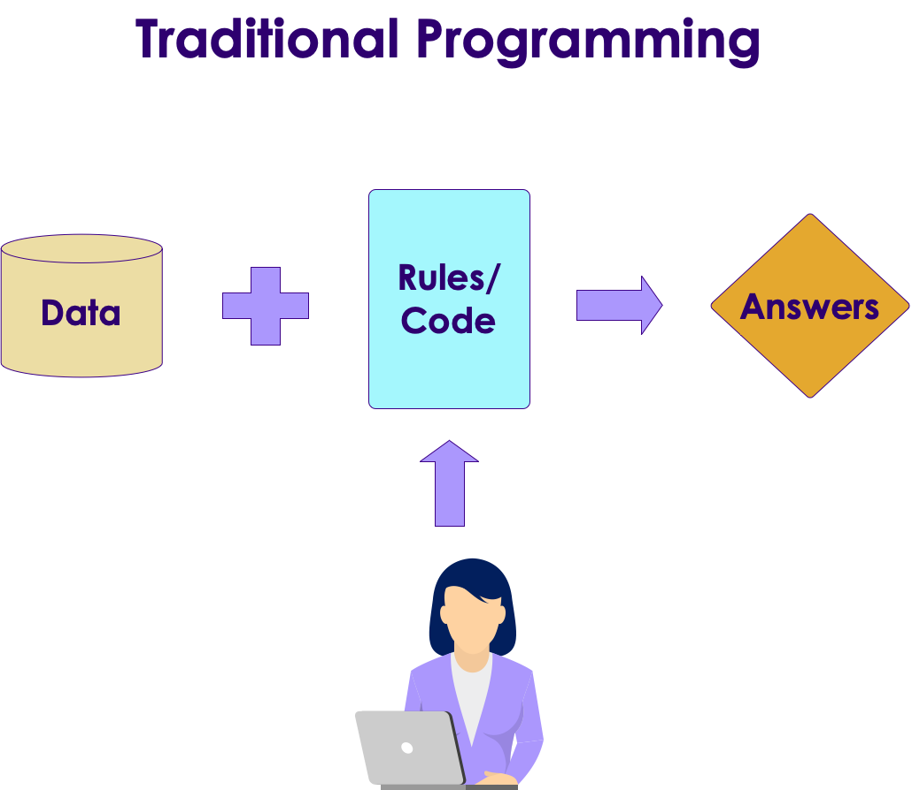

## Why Machine Learning Matters?

<!-- {"left" : 0.88, "top" : 1.34, "height" : 4.42, "width" : 8.49} -->


[Link](https://www.youtube.com/watch?v=HcqpanDadyQ)

Notes:

https://www.youtube.com/watch?v=HcqpanDadyQ

---

## What is Machine Learning

<!-- {"left" : 7.41, "top" : 1.1, "height" : 3.71, "width" : 2.63} -->

* **"The field of study that gives computers the ability to learn without being explicitly programmed."**  
 -- Arthur Samuel


Notes:


---

## Traditional Programming vs. Machine Learning

<!-- TODO shiva -->
<!-- {"left" : 0.96, "top" : 3.83, "height" : 4.16, "width" : 8.33} -->

* Here is an example of spam detection rule engine

* The rules are coded by developers

* There could be 100s of 1000s of rules!

<br />
<br />
<br />
<br />

```java

if (email.from_ip.one_of("ip1", "ip2", "ip3")) {
  result = "no-spam"
}
else if ( email.text.contains ("free loans", "cheap degrees"))
{
  result = "spam"
}

```
<!-- {"left" : 0, "top" : 2.81, "height" : 1.98, "width" : 10.25} -->

Notes:

---

## Traditional Programming vs. Machine Learning

<!-- TODO shiva -->
<!-- {"left" : 0.96, "top" : 3.83, "height" : 4.16, "width" : 8.33} -->

* Here is how we detect spam using ML
* We don't explicitly write rules
* Instead, we show the algorithm with spam and non-spam emails
* Algorithm 'learns' which attributes are indicative of spam
* Then algorithm predicts spam/no-spam on new email

<!-- {"left" : 0.96, "top" : 3.83, "height" : 4.16, "width" : 8.33} -->


Notes:

---

## Traditional Programming vs. Machine Learning

<!-- TODO shiva -->
<!-- {"left" : 0.96, "top" : 3.83, "height" : 4.16, "width" : 8.33} -->

* As data size grows so much, ability to humans to write rules to analyze all data can't keep up

* How ever, we can have machines analyze large amount of data and create comprehensive rules!

* These rules can be applied to provide answers to new questions


---

## Rule Based Systems vs. Machine Learning

 * Rule based systems are static
    - They are programmed in
    - They don't learn from data

 * AI can learn from data
     - It gets better every day with more data it sees

<!-- {"left" : 0.78, "top" : 4.13, "height" : 3.28, "width" : 8.7} -->


Notes:
