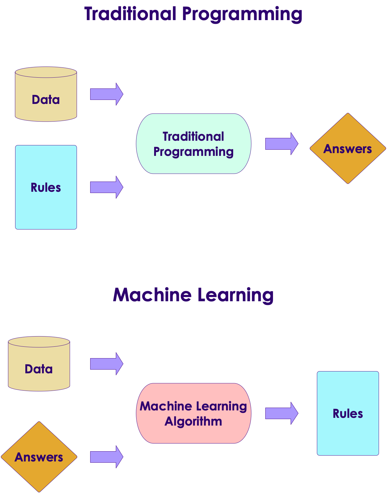

## Why Machine Learning Matters?

<!-- {"left" : 2.87, "top" : 2.19, "height" : 6.12, "width" : 11.76} -->


[Link](https://www.youtube.com/watch?v=HcqpanDadyQ)

Notes:

https://www.youtube.com/watch?v=HcqpanDadyQ

---

## What is Machine Learning

<!-- {"left" : 13.23, "top" : 2.44, "height" : 5.1, "width" : 3.62} -->

* **"The field of study that gives computers the ability to learn without being explicitly programmed."**  
 -- Arthur Samuel


Notes:


---

## Traditional Programming vs. Machine Learning

<!-- {"left" : 10.58, "top" : 1.88, "height" : 5.83, "width" : 6.71} -->

* Here is an example of spam detection rule engine

* The rules are coded by developers

* There could be 100s of 1000s of rules!


```java

if (email.from_ip.one_of("ip1", "ip2", "ip3")) {
  result = "no-spam"
}
else if ( email.text.contains ("free loans", "cheap degrees"))
{
  result = "spam"
}

```
<!-- {"left" : 0.8, "top" : 5.13, "height" : 2.32, "width" : 11.11} -->

Notes:

---

## Traditional Programming vs. Machine Learning

<!-- {"left" : 10.52, "top" : 1.89, "height" : 3.97, "width" : 6.59} -->

* Here is how we detect spam using ML
* We don't explicitly write rules
* Instead, we show the algorithm with spam and non-spam emails
* Algorithm 'learns' which attributes are indicative of spam
* Then algorithm predicts spam/no-spam on new email

<!-- {"left" : 10.44, "top" : 7.16, "height" : 3.36, "width" : 6.74} -->


Notes:

---

## Traditional Programming vs. Machine Learning

<!-- {"left" : 11.61, "top" : 2.54, "height" : 7.05, "width" : 5.54} -->

* As data size grows so much, ability to humans to write rules to analyze all data can't keep up

* How ever, we can have machines analyze large amount of data and create comprehensive rules!

* These rules can be applied to provide answers to new questions

---

## Learning From Data

- Let's start with simple housing sales data

<br/>

| Bedrooms (input 1) | Bathrooms (input 2) | Size (input 3) | Sale Price (in thousands) (we are trying to predict) |
|--------------------|---------------------|----------------|------------------------------------------------------|
| 3                  | 1                   | 1500           | 230                                                  |
| 3                  | 2                   | 1800           | 320                                                  |
| 5                  | 3                   | 2400           | 600                                                  |
| 4                  | 2                   | 2000           | 500                                                  |
| 4                  | 3.5                 | 2200           | 550                                                  |

<!-- {"left" : 0.81, "top" : 2.73, "height" : 3.38, "width" : 15.88} -->

* So our formula for predicting `SalePrice` is something like this:

* **`Saleprice = f (Bedrooms, Bathrooms, Size)`**

* We need to figure out what `f` is

---

## Let's Play a Guessing Game!

<!-- {"left" : 11.35, "top" : 2.14, "height" : 4.14, "width" : 6.22} -->

* Look at the data below.  Come up with a formula linking X and Y


| X | Y |
|---|---|
| 1 | 2 |
| 2 | 5 |

<!-- {"left" : 0.83, "top" : 3.95, "height" : 1.5, "width" : 6.63} -->

* So what is the formula?

* `Y = ???`

* Answer next slide

---

## Guessing Game

<!-- {"left" : 11.35, "top" : 2.14, "height" : 4.14, "width" : 6.22} -->

| X | Y |
|---|---|
| 1 | 2 |
| 2 | 5 |

<!-- {"left" : 0.83, "top" : 2.62, "height" : 1.5, "width" : 6.63} -->

* I have 2 possible formulas (there may be more)

* **`Y = 3X - 1`**

* **`Y = X^2 + 1`**

---

## Guessing Game

<!-- {"left" : 11.35, "top" : 2.14, "height" : 4.14, "width" : 6.22} -->

* Let me provide more data

| X | Y  |
|---|----|
| 1 | 2  |
| 2 | 5  |
| 3 | 10 |
| 4 | 17 |

<!-- {"left" : 0.83, "top" : 3.65, "height" : 2.5, "width" : 6.23} -->

* Now, what would be the formula?

* Answer next slide

---

## Guessing Game

<!-- {"left" : 11.35, "top" : 2.14, "height" : 4.14, "width" : 6.22} -->


| X | Y  |
|---|----|
| 1 | 2  |
| 2 | 5  |
| 3 | 10 |
| 4 | 17 |

<!-- {"left" : 0.83, "top" : 3.18, "height" : 2.5, "width" : 6.23} -->

* With more data, we can finalize on a formula

* **`Y = X^2 + 1`**

* Lesson:  More (quality) data we have, we can come up with a more precise formula

* **This is the essense of machine learning!**

---

## Learning From Data


- An machine learning algorithm learns from the above data, and then tries to predict house prices on new data


| Bedrooms (input 1) | Bathrooms (input 2) | Size (input 3) | Predicted Sale Price (in thousands) |
|--------------------|---------------------|----------------|-------------------------------------|
| 3                  | 2                   | 1900           | ???                                 |
| 4                  | 3                   | 2300           | ???                                 |

<!-- {"left" : 0.95, "top" : 4, "height" : 1.88, "width" : 15.59} -->

