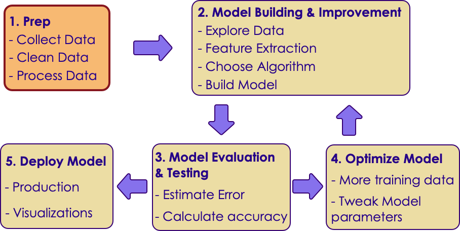
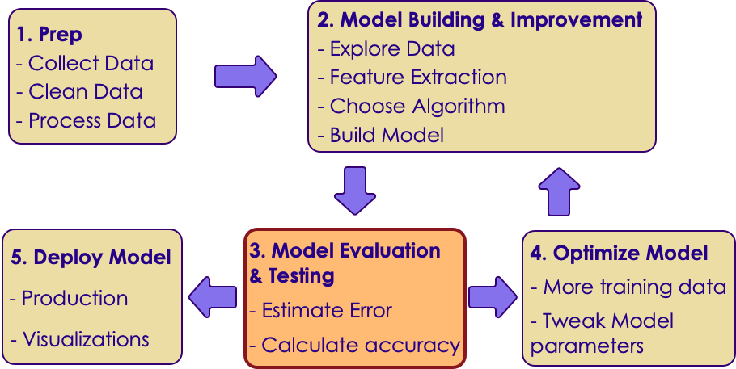
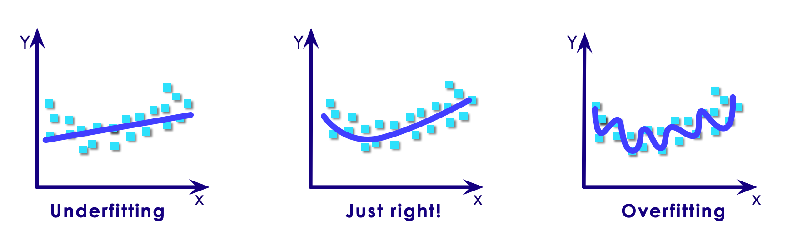
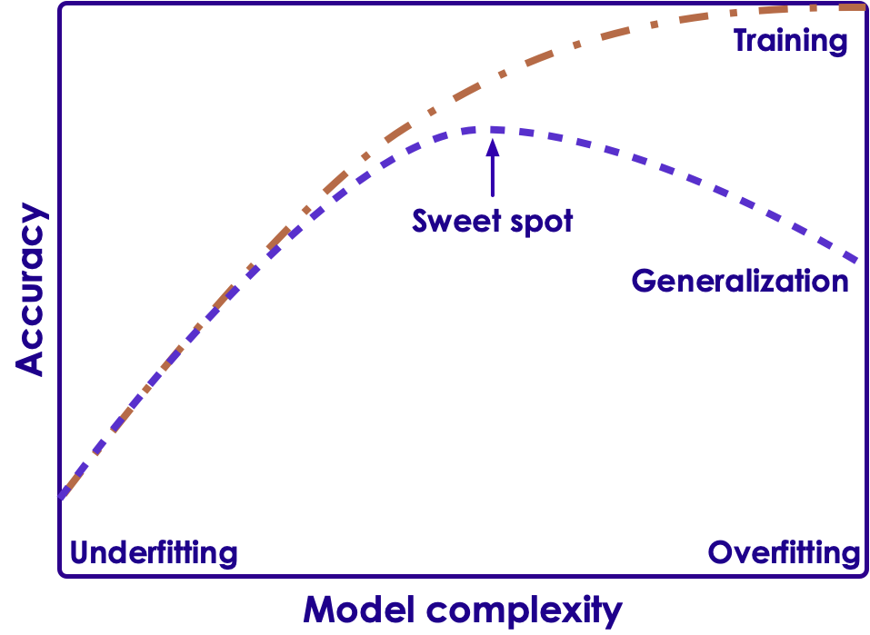

# Machine Learning Workflow / Process

---

## Machine Learning Process

<!-- {"left" : 1.02, "top" : 2.47, "height" : 4.13, "width" : 8.21} -->

---

## Machine Learning Process

 * Step 1: Get Data

 * Step 2: Explore Data and build model

 * Step 3: Evaluate model

 * Step 4: Optimize model

 * Step 5: Deploy and monitor

---

## Machine Learning Process: Step 1: Data Exploration

<!-- {"left" : 0.53, "top" : 2.22, "height" : 4.62, "width" : 9.19} -->

---

# Developing A Model
---

## Machine Learning Process: Step 2: Developing a Model

<!-- {"left" : 0.81, "top" : 2.36, "height" : 4.35, "width" : 8.64} -->

---

## Sample Dataset:  Cars

* We want to predict MPG of a car
* What attributes to consider?

 <!-- {"left" : 0.39, "top" : 2.47, "height" : 4.71, "width" : 9.48} -->

Notes:

---

## Sample Model for Predicting MPG

 <!-- {"left" : 0.49, "top" : 1.66, "height" : 5.74, "width" : 9.26} -->

Notes:

---

## Model Building

 * Designate inputs as X
    - X1: first input  (e.g.  number of cylinders)
    - X2: second input  (e.g. weight of car)
    - Xi: ith input  (e.g. horsepower)
 * Output  / target variable is denoted as Y

 * Our Mathematical model is
    - `Y = f(X) + E`
      - Y: TargetX:
      - Inputs (X1, X2 ..etc)
      - f: function
      - E: error / noise

Notes:

---

## Using the Model

 * Our Model:
    - **MPG  = f  ( cylinders,   horse power,  weight)  + E**

 * **Goal: figure out 'f' from given data**
    - Once we figure out 'f' then we can plug-in values for *cylinders , horse power and weight  and predict MPG*
    - Prediction is the most common use of ML

 * **Inference**
    - Which of the 3 attributes (cylinders / horse power / weight) influences MPG more?
    - Figuring this out might give us insight into better products.  
     *'what is the best way to get best MPG?'*

Notes:

---

## Modeling Techniques (Little Math!)

 * ML model has two types: Parametric / Non-Parametric
 * Parametric models assume a strong 'f'
    - Tend to be simple models
    - May not be very accurate

 * Non-parametric models don't assume a rigid 'f'
    - Adopt to data very well
    - More accurate
    - More difficult to understand than parametric models

Notes:

---

## Parametric vs. Non Parametric

|               | Parametric                                                                                  | Non Parametric                                                                                                                                          |
|---------------|---------------------------------------------------------------------------------------------|---------------------------------------------------------------------------------------------------------------------------------------------------------|
| Advantages    | - Simpler  - Very fast to learn from data  - Don't required, a lot of training data | -Flexible: can adopt to complex data,  - No assumptions about underlying function,  - good prediction performance                                 |
| Disadvantages | - limited by function  - Can not adopt to complex data - Can underfit                   | -Complex to understand and explain,  - Require more data for learning, - Slower to train as they have more parameters to tweak,  - Canover-fit |
| Algorithms    | - Linear Regression  - Logistic Regression  - Linear Discriminant Analysis          | - Decision Trees,  - Support Vector Machines,  - Naïve Bayes                                                                                       |
| Best for      | - small size data with previous knowledge of features                                       | when having lots of data and no prior knowledge of features                                                                                             |

<!-- {"left" : 0.25, "top" : 1.06, "height" : 7.43, "width" : 9.75, "columnwidth" : [1.65, 3.57, 4.54]} -->

Notes:

---

## Parametric vs. Non Parametric

|                         | Parametric         | Non Parametric    |
|-------------------------|--------------------|-------------------|
| Model complexity        | Simple             | More complex      |
| Training speed          | Fast               | Slow              |
| Amount of training data | Doesn't need a lot | Needs more data   |
| Explainability          | Simple to explain  | Harder to explain |
| Fit                     | under-fit          | over-fit          |
| Adopting to data        | simple data        | complex data      |
| Prediction accuracy     | good               | better            |

<!-- {"left" : 0.25, "top" : 1.4, "height" : 4, "width" : 9.75} -->

Notes:

---
# Evaluating A Model
---

## Machine Learning Process: Step 3: Model Evaluation

<!-- {"left" : 0.91, "top" : 2.42, "height" : 4.23, "width" : 8.43} -->

---

## Evaluating A Model

 * How do we know our model is 'good'?

 * One way to measure the performance, is how well it is predicting on 'new data'
    - Model is trained with 'training data'
    - Measure its performance on 'test data' (the model hasn't seen 'test data')

 <!-- {"left" : 1.84, "top" : 4.62, "height" : 2.88, "width" : 6.57} -->

Notes:

---

## Under-fitting / Over-fitting

 * Here we have 3 models
 * One on left: is not really capturing the essence of the data
    - Underfitting
 * One on right: following every small variation of data, not really generalizing
    - Overfitting
 * One in the middle is just right

 <!-- {"left" : 0.26, "top" : 5.16, "height" : 3.07, "width" : 9.74} -->

Notes:

---

## Under-fitting

 * Model is 'too simple'  to capture the trends in input data
 * Hot to detect under-fitting?
    - We will get poor performance in both training & testing data
    - E.g.:
      - Training accuracy : 45%
      - Testing accuracy : 42%
 * Resolution:
    - Try a different algorithm / model, that better fits the data

  <!-- {"left" : 0.83, "top" : 5.38, "height" : 2.79, "width" : 8.59} -->

Notes:

---

## Over-fitting

 * Model is 'too complex'  that is 'memorizing' training data, but not **'generalizing' for new data**
 * Hot to detect over-fitting?
    - Excellent performance on training data, but poor performance on testing (new) data
    - E.g.:
      - Training accuracy : 95%
      - Testing accuracy : 62%
 * Resolution:
    - Try a different algorithm / model, that better fits the data
    - Simplify inputs

 <!-- {"left" : 1.05, "top" : 5.95, "height" : 2.72, "width" : 8.16} -->

Notes:

---

## Achieving a Good Fit

 * In ML we strive to find the 'sweet spot' between under-fitting models and over-fitting models

 <!-- {"left" : 1.4, "top" : 2.85, "height" : 5.08, "width" : 6.96} -->

Notes:

---

## Achieving a Good Fit

 * Both overfitting and underfitting can lead to poor model performance

 * underfitting is easier to spot
    - Bad performance on training data
    - Bad performance on test data

 * Overfitting can be hard to spot
    - because it performs well on training data
    - But doesn't do well on 'unseen' test data

 * Avoiding overfitting
    - Resampling technique
    - Hold back a validation dataset
    - Most popular method is: k-fold validation (more on this later)

 * For **decision trees**, we **prune** the tree to limit overfitting

Notes:

---

## Cross Validation and Bootstrapping

[ML-Concepts-Cross-Validation-Bootstrapping.md](ML-Concepts-Cross-Validation-Bootstrapping.md)
