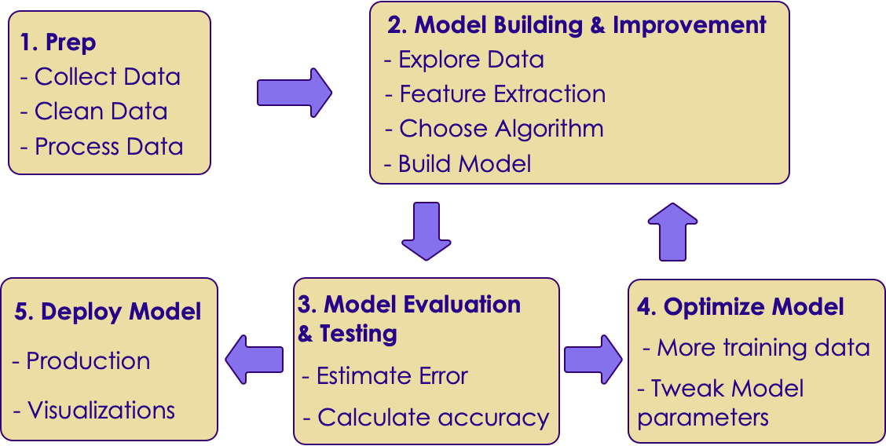

# Machine Learning Workflow / Process

---

## Machine Learning Process

<!-- {"left" : 2.26, "top" : 3.59, "height" : 6.53, "width" : 12.98} -->

---

## Machine Learning Process

 * Step 1: Get Data

 * Step 2: Explore Data and build model

 * Step 3: Evaluate model

 * Step 4: Optimize model

 * Step 5: Deploy and monitor

---

## Machine Learning Process: Step 1: Data Exploration

<!-- {"left" : 2.35, "top" : 3.63, "height" : 6.44, "width" : 12.81} -->

---

# Developing A Model
---

## Machine Learning Process: Step 2: Developing a Model

<!-- {"left" : 1.95, "top" : 3.43, "height" : 6.85, "width" : 13.6} -->

---

## Sample Dataset: Cars

* We want to predict MPG of a car
* What attributes to consider?

 <!-- {"left" : 1.96, "top" : 4.2, "height" : 6.74, "width" : 13.57} -->

Notes:

---

## Sample Model for Predicting MPG

 <!-- {"left" : 8.05, "top" : 2.09, "height" : 5.74, "width" : 9.26} -->

* Designate inputs as X
  - X1: first input  (e.g.  number of cylinders)
  - X2: second input  (e.g. weight of car)
  - Xi: ith input  (e.g. horsepower)
* Output  / target variable is denoted as Y
* **`Y = f(X) + E`**
  - Y: Target:
  - Inputs (X1, X2 ..etc)
  - E: error / noise

Notes:

---

## Let's Play a Guessing Game!

<!-- {"left" : 10.59, "top" : 1.89, "height" : 4.55, "width" : 6.84} -->

* Look at the data below.  Come up with a formula linking X and Y

 

| X | Y |
|---|---|
| 1 | 2 |
| 2 | 5 |

<!-- {"left" : 0.93, "top" : 4.5, "height" : 1, "width" : 6.58} -->

* So what is the formula?

* `Y = ???`

* Answer next slide

---

## Guessing Game

<!-- {"left" : 10.1, "top" : 1.47, "height" : 4.9, "width" : 7.38} -->

| X | Y |
|---|---|
| 1 | 2 |
| 2 | 5 |

<!-- {"left" : 1.04, "top" : 2.88, "height" : 1, "width" : 5.54} -->

* I have 2 possible formulas (there may be more)

* **`Y = 3X - 1`**

* **`Y = X^2 + 1`**

---

## Guessing Game

<!-- {"left" : 10.05, "top" : 1.89, "height" : 4.87, "width" : 7.33} -->

* Let me provide more data

| X | Y  |
|---|----|
| 1 | 2  |
| 2 | 5  |
| 3 | 10 |
| 4 | 17 |

<!-- {"left" : 1.04, "top" : 3.87, "height" : 1, "width" : 6.97} -->

* Now, what would be the formula?

* Answer next slide

---
## Guessing Game

<!-- {"left" : 10.27, "top" : 1.61, "height" : 4.62, "width" : 6.94} -->

| X | Y  |
|---|----|
| 1 | 2  |
| 2 | 5  |
| 3 | 10 |
| 4 | 17 |

<!-- {"left" : 0.68, "top" : 2.67, "height" : 1, "width" : 7.38} -->

* With more data, we can finalize on a formula

* **`Y = X^2 + 1`**

* Lesson:  More (quality) data we have, we can come up with a more precise formula

* **This is the essense of machine learning!**

---

## Modeling Techniques (Little Math!)

 * ML model has two types: Parametric / Non-Parametric
 * Parametric models assume a strong 'f'
    - Tend to be simple models
    - May not be very accurate

 * Non-parametric models don't assume a rigid 'f'
    - Adopt to data very well
    - More accurate
    - More difficult to understand than parametric models

Notes:

---

## Parametric vs. Non Parametric

|               | Parametric                                                                                  | Non Parametric                                                                                                                                          |
|---------------|---------------------------------------------------------------------------------------------|---------------------------------------------------------------------------------------------------------------------------------------------------------|
| Advantages    | - Simpler  - Very fast to learn from data  - Don't require a lot of training data | - Flexible: can adopt to complex data,  - No assumptions about underlying function,  - good prediction performance                                 |
| Disadvantages | - limited by function  - Can not adopt to complex data  - Can underfit                   | - Complex to understand and explain,  - Require more data for learning, - Slower to train as they have more parameters to tweak,  - Can over-fit |
| Algorithms    | - Linear Regression  - Logistic Regression  - Linear Discriminant Analysis          | - Decision Trees,  - Support Vector Machines,  - Naïve Bayes                                                                                       |
| Best for      | small size data with previous knowledge of features                                       | when having lots of data and no prior knowledge of features                                                                                             |

<!-- {"left" : 0.43, "top" : 2.36, "height" : 1, "width" : 16.64, "columnwidth" : [2.81, 6.09, 7.74]} -->

Notes:

---

## Parametric vs. Non Parametric

|                         | Parametric         | Non Parametric    |
|-------------------------|--------------------|-------------------|
| Model complexity        | Simple             | More complex      |
| Training speed          | Fast               | Slow              |
| Amount of training data | Doesn't need a lot | Needs more data   |
| Explainability          | Simple to explain  | Harder to explain |
| Fit                     | under-fit          | over-fit          |
| Adopting to data        | simple data        | complex data      |
| Prediction accuracy     | good               | better            |

<!-- {"left" : 1.19, "top" : 2.66, "height" : 1, "width" : 15.13} -->

Notes:

---
# Evaluating A Model

[ML-Concepts-Model-Validation.md](ML-Concepts-Model-Validation.md)
