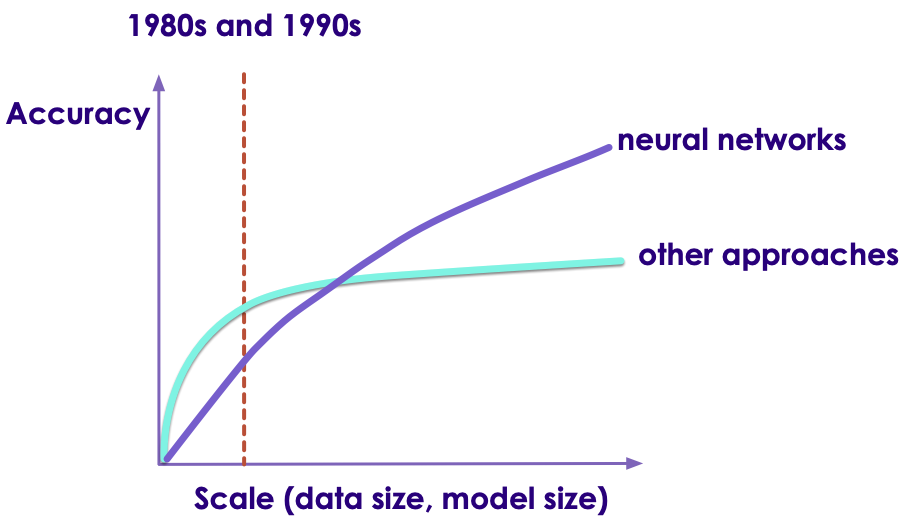

# Machine Learning vs. Deep Learning

---

## AI / Machine Learning / Deep Learning

<!-- {"left" : 5.56, "top" : 2.35, "height" : 4.37, "width" : 4.37} -->

 * **Artificial Intelligence (AI):** Broader concept of "making machines smart"

 * **Machine Learning:** Current application of AI that machines learn from data using mathematical, statistical models

 * **Deep Learning: (Hot!)** Using Neural Networks to solve some hard problems


Notes:

* http://www.teglor.com/b/deep-learning-libraries-language-cm569/

---

## AI / Machine Learning / Deep Learning


<!-- {"left" : 1.02, "top" : 2.69, "height" : 4.26, "width" : 8.21} -->


Notes:

---

## Deep Learning (DL)


* Deep Learning uses Neural networks techniques

* Neural Networks fell out of favor in the 80s as statistics-based methods yielded better results

* Now making a comeback due to Big Data & Big Compute ((cluster computing , GPU and TPU)

* Examples
   - Facebook Deep Face
   - Google Translate
   - Google DeepMind playing GO game

Notes:

* https://www.quora.com/What-is-the-difference-between-deep-learning-and-usual-machine-learning
* https://www.wired.com/2015/5/deep-learning-isnt-dangerous-magic-genie-just-math/
* https://en.wikipedia.org/wiki/AlphaGo


---

## Neural Network Animation

* **Animation** below: [link-S3](https://elephantscale-public.s3.amazonaws.com/media/machine-learning/neural-networks-animation-1.mp4), [link-youtube](https://youtu.be/mpofZfpe9lA)

<!-- {"left" : 0.38, "top" : 4.99, "height" : 2.23, "width" : 9.48} -->

---

## Deep Neural Network - Face Recognition


<!-- {"left" : 2.64, "top" : 1.53, "height" : 6.59, "width" : 4.98} -->


Notes:

* Image credit : Facebook research
* Source: https://deeplearning3j.org/neuralnet-overview


---

## Machine Learning vs. Deep Learning (1/3)

| Features                             | Machine Learning                                              | Deep Learning                                                    |
|--------------------------------------|---------------------------------------------------------------|------------------------------------------------------------------|
| **==> Data size (see next slide for graph)** | Performs reasonably well on small / medium data               | Need large amount of data for reasonable performance             |
| Data Type (see next slides)          | Works well with structured data                               | Can handle structured data & unstructured data                   |
| Scaling                              | Doesn't scale with large amount of data                       | Scales well with large amount of data                            |
| Compute power                        | Doesn't need a lot of compute (works well on single machines) | Needs a lot of compute power (usually runs on clusters)          |
| CPU/GPU                              | Mostly CPU bound                                              | Can utilize GPU for certain computes (massive matrix operations) |
| Feature Engineering                  | Features needs to specified manually (by experts)             | DL can learn high level features from data automatically         |
| Execution Time                       | Training usually takes seconds, minutes, hours                | Training takes lot longer (days)                                 |
| Interpretability                     | Easy to interpret                                             | Hard to understand the final result                              |

<!-- {"left" : 0.13, "top" : 1.18, "height" : 6.74, "width" : 9.99, "columnwidth" : [2.59, 3.32, 4.09]} -->


Notes:

* https://www.analyticsvidhya.com/blog/2017/04/comparison-between-deep-learning-machine-learning/


---

## Machine Learning vs. Deep Learning


<!-- {"left" : 1.18, "top" : 1.83, "height" : 5.98, "width" : 7.88} -->


Notes:


---

## 1980's and 1990's

<!-- {"left" : 0.71, "top" : 2.28, "height" : 5.08, "width" : 8.83} -->


Notes:

Source: Jeff Dean


---

## 1990+

<!-- {"left" : 0.22, "top" : 2, "height" : 5.64, "width" : 9.8} -->


Notes:

Source: Jeff Dean


---

## Now

<!-- {"left" : 0.31, "top" : 2.05, "height" : 5.55, "width" : 9.64} -->


Notes:

---

## Machine Learning vs. Deep Learning (2/3)

| Features                             | Machine Learning                                              | Deep Learning                                                    |
|--------------------------------------|---------------------------------------------------------------|------------------------------------------------------------------|
| Data size (see next slide for graph) | Performs reasonably well on small / medium data               | Need large amount of data for reasonable performance             |
| **==> Data Type (see next slides)**          | Works well with structured data                               | Can handle structured data & unstructured data                   |
| Scaling                              | Doesn't scale with large amount of data                       | Scales well with large amount of data                            |
| Compute power                        | Doesn't need a lot of compute (works well on single machines) | Needs a lot of compute power (usually runs on clusters)          |
| CPU/GPU                              | Mostly CPU bound                                              | Can utilize GPU for certain computes (massive matrix operations) |
| Feature Engineering                  | Features needs to specified manually (by experts)             | DL can learn high level features from data automatically         |
| Execution Time                       | Training usually takes seconds, minutes, hours                | Training takes lot longer (days)                                 |
| Interpretability                     | Easy to interpret                                             | Hard to understand the final result                              |

<!-- {"left" : 0.25, "top" : 1.18, "height" : 6.89, "width" : 9.75, "columnwidth" : [2.86, 3.17, 3.72]} -->

Notes:


---

## Structured Data vs. Unstructured Data

| Structured Data                                          | Unstructured Data                             |
|----------------------------------------------------------|-----------------------------------------------|
| Data has well defined structure.                         | Structure is not well defined or non existing |
| Data in a database tables are well defined.  10 columns, first column is integer, second column is timestamp ..etc | videos, images                                             |

<!-- {"left" : 0.26, "top" : 1.18, "height" : 2.65, "width" : 9.82, "columnwidth" : [6.33, 3.49]} -->

<!-- {"left" : 1.53, "top" : 4.35, "height" : 3.83, "width" : 7.19} -->


Notes:


---

## Structured Data Examples

- Pretty much any data stored in a schema database

| Bedrooms | Bathrooms | Size | Sale Price (in thousands) |
|--------------------|---------------------|----------------|------------------------------------------------------|
| 3                  | 1                   | 1500           | 230                                                  |
| 3                  | 2                   | 1800           | 320                                                  |
| 5                  | 3                   | 2400           | 600                                                  |
| 4                  | 2                   | 2000           | 500                                                  |
| 4                  | 3.5                 | 2200           | 550                                                  |

<!-- {"left" : 2.1, "top" : 1.77, "height" : 2.68, "width" : 6.04, "columnwidth" : [1.36, 1.44, 1.22, 2.02]} -->

 * Text data (CSV, JSON) can have structure too

JSON data

```json
{   "name" : "Joe",
    "email" : "joe@gmail.com" }
```
<!-- {"left" : 0, "top" : 5.87, "height" : 0.49, "width" : 3.61} -->


CSV data (Comma Seperated Values)

```
joe,joe@gmail.com
jane,jane@gmail.com
```
<!-- {"left" : 0, "top" : 6.93, "height" : 0.81, "width" : 3.94} -->


Notes:


---

## Unstructured Data Examples


 * Text
    - Documents: email, word documents
    - Survey results (customer feedback)
    - customer support ticket notes

 * Binary data
    - Audio (phone call recordings)
    - Images
    - Video (YouTube videos)

&nbsp;<!-- {"left" : 1.93, "top" : 5.83, "height" : 1.22, "width" : 0.97} -->&nbsp;<!-- {"left" : 3.25, "top" : 5.95, "height" : 0.97, "width" : 0.97} -->&nbsp;<!-- {"left" : 4.57, "top" : 5.65, "height" : 1.51, "width" : 0.97} -->&nbsp;<!-- {"left" : 5.86, "top" : 5.92, "height" : 1.04, "width" : 0.97} --><!-- {"left" : 7.15, "top" : 5.95, "height" : 0.97, "width" : 1.17} -->


Notes:

---

## Semi-Structured Data

 * This is 'between' structured and and unstructured

 * Data has some structure, but it may not be well defined

 * Example, tweet data

```json
{   "user_id" : "user123",
    "timestamp" : "2018-09-20 12:00:05 EST",
    "device" : "iPhone X",
    "location" : "34.893, 120.979",
    "tweet" : "Enjoying my first Pumpkin Spice Latte at Starbucks in Seattle downtown  #PSL, @Starbucks",
    "image_url" : "https://imgurl.com/1234"
}
```
<!-- {"left" : 0, "top" : 3, "height" : 1.41, "width" : 10.25} -->
**Question to the class: What data points you can extract from above tweet?      Which is structured / unstructured?**

Notes:


---

## Machine Learning vs. Deep Learning (3/3)

| Features                             | Machine Learning                                              | Deep Learning                                                    |
|--------------------------------------|---------------------------------------------------------------|------------------------------------------------------------------|
| Data size (see next slide for graph) | Performs reasonably well on small / medium data               | Need large amount of data for reasonable performance             |
| Data Type (see next slides)          | Works well with structured data                               | Can handle structured data & unstructured data                   |
| Scaling                              | Doesn't scale with large amount of data                       | Scales well with large amount of data                            |
| Compute power                        | Doesn't need a lot of compute (works well on single machines) | Needs a lot of compute power (usually runs on clusters)          |
| CPU/GPU                              | Mostly CPU bound                                              | Can utilize GPU for certain computes (massive matrix operations) |
| Feature Engineering                  | Features needs to specified manually (by experts)             | DL can learn high level features from data automatically         |
| Execution Time                       | Training usually takes seconds, minutes, hours                | Training takes lot longer (days)                                 |
| Interpretability                     | Easy to interpret                                             | Hard to understand the final result                              |

<!-- {"left" : 0.25, "top" : 1.18, "height" : 6.89, "width" : 9.75, "columnwidth" : [2.86, 3.17, 3.72]} -->


Notes:


---

## Deciding Between Machine Learning(ML) and Deep Learning(DL)

- This is not an easy decision, but here are some factors to think about

- Have structured data?  Then both ML and DL can be used

- Got unstructured data?  Probably deep learning

- Do keep in mind, deep learning usually needs
    - lot of data
    - and lot of compute time   
    to produce good results


Notes:


---

## Video: How Scale is Helping Deep Learning

<!-- {"left" : 1.36, "top" : 1.34, "height" : 4.04, "width" : 7.52} -->


[Link](https://www.youtube.com/watch?v=LcfLo7YP8O4)

Andrew Ng explains how Deep Learning algorithms can scale better with data size.


Notes:
