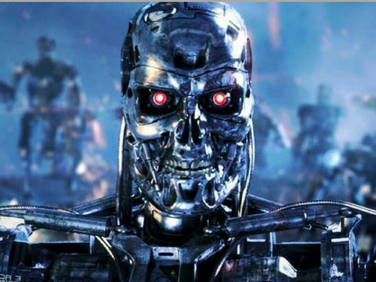
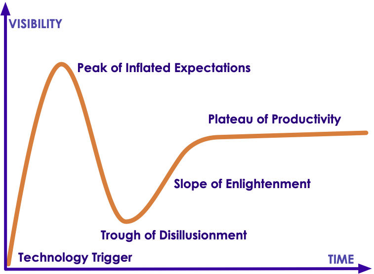
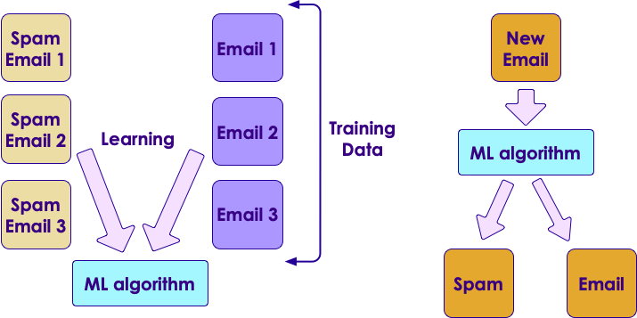
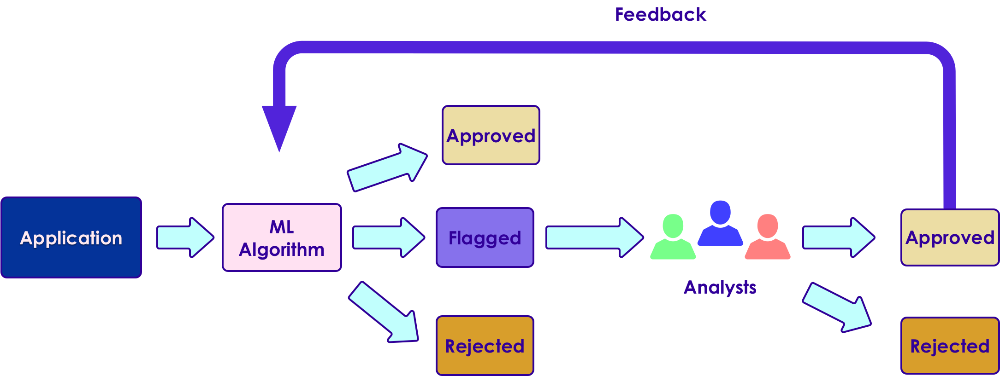
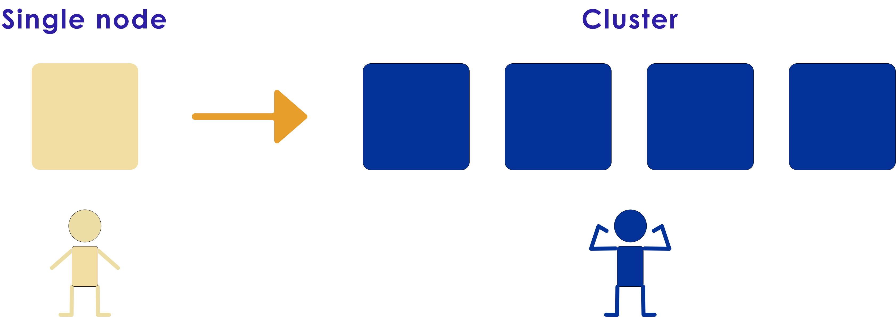

# Machine Learning Primer

---


## Lesson Objectives

<!-- {"left" : 5.3, "top" : 1.23, "height" : 3.54, "width" : 4.72} -->


 * Learn Machine Learning use cases

 * Understand ML vocabulary

 * Overview of major machine learning algorithms

Notes:


---

# Machine Learning Evolution

---

## Question for Audience

 * Think of something you did today / this week that is AI powered?

Notes:

---
## Demo - Gmail AI Helper

<!-- {"left" : 0.1, "top" : 1.92, "height" : 2.82, "width" : 10.06} -->

<!-- {"left" : 1.35, "top" : 4.48, "height" : 3.24, "width" : 7.56} -->


Notes:


---

## Why Machine Learning Matters?

<!-- {"left" : 0.88, "top" : 1.34, "height" : 4.42, "width" : 8.49} -->


[Link](https://www.youtube.com/watch?v=HcqpanDadyQ)

Notes:

https://www.youtube.com/watch?v=HcqpanDadyQ

---

## Hype Cycle

 * **Question for the class:**  
   - Where do you think AI is in this cycle? :-)

<!-- {"left" : 1.23, "top" : 2.93, "height" : 5.06, "width" : 7.8} -->


Notes:
- https://en.wikipedia.org/wiki/Hype_cycle

---

## What is Machine Learning

<!-- {"left" : 7.41, "top" : 1.1, "height" : 3.71, "width" : 2.63} -->

* **"The field of study that gives computers the ability to learn without being explicitly programmed."**  
 -- Arthur Samuel

* Example: Self-driving cars
    - Historical approach:  
    Write a massive program to instruct the car to handle all possible scenarios encountered while driving
        - This is immensely difficult

    - AI approach:  
        - Let AI learn by observing the scenery and your  reactions
        - Once it learnt enough, let the AI predict the next reaction for a scenary


Notes:


---

## Spam Detection - Traditional (Rule Based) Approach

* Here is an example of spam detection rule engine

* The rules are coded by developers

* There could be 100s of 1000s of rules!

```java

if (email.from_ip.one_of("ip1", "ip2", "ip3")) {
  result = "no-spam"
}
else if ( email.text.contains ("free loans", "cheap degrees"))
{
  result = "spam"
}

```
<!-- {"left" : 0, "top" : 2.81, "height" : 1.98, "width" : 10.25} -->

Notes:


---

## Spam Detection - AI Approach


 * Show the algorithm with spam and non-spam emails

 * Algorithm 'learns' which attributes are indicative of spam

 * Then algorithm predicts spam/no-spam on new email

<!-- {"left" : 0.96, "top" : 3.83, "height" : 4.16, "width" : 8.33} -->


Notes:


---

## How is AI Different from Rule Based Systems

 * Rule based systems are static
    - They are programmed in
    - They don't learn from data

 * AI can learn from data
     - It gets better every day with more data it sees

<!-- {"left" : 0.78, "top" : 4.13, "height" : 3.28, "width" : 8.7} -->


Notes:

---

## Machine Learning Use Cases

|       Finance       |         Healthcare        |        Retail       |        Manufacturing       |    Network & Security    |
|:-------------------:|:-------------------------:|:-------------------:|:--------------------------:|:------------------------:|
| Fraud Detection     | Diagnosis                 | Recommendations     | Identify defects           | Identify security breach |
| Algorithmic trading | Patient care              | Customer retentions | Fully automated assemblies | Facial recognition       |
| Credit Approvals    | Treatment recommendations |                     |                            |                          &nbsp;|

<!-- {"left" : 0.1, "top" : 1.17, "height" : 3.08, "width" : 10.05, "columnwidth" : [1.88, 2.14, 2.23, 1.94, 1.86]} -->

---

# A Brief History of AI

[AI-brief-history.md](AI-brief-history.md)

---

## AI Vocabulary

[AI-vocabulary.md](AI-vocabulary.md)

---

# Machine Learning vs. Deep Learning

[ML-vs-DL.md](ML-vs-DL.md)


---

## AI Software Eco System

|             | Machine Learning                        | Deep Learning                            |
|-------------|-----------------------------------------|------------------------------------------|
| Java        | - Weka <br/>- Mahout                    | - DeepLearning4J                         |
| Python      | - SciKit <br/>- (Numpy, Pandas)         | - Tensorflow <br/>- Theano <br/>- Caffe  |
| R           | - Many libraries                        | - Deepnet <br/>- Darch                   |
| Distributed | - H20 <br/>- Spark                      | - H20 <br/>- Spark                       |
| Cloud       | - AWS <br/>- Azure  <br/>- Google Cloud | - AWS  <br/>- Azure  <br/>- Google Cloud |

<!-- {"left" : 0.25, "top" : 1.25, "height" : 4.53, "width" : 9.75, "columnwidth" : [3.25, 3.25, 3.25]} -->


Notes:


---


## Machine Learning and Big Data

 * Until recently most of the machine learning is done on "single computer" (with lots of memory-100s of GBs)

 * Most R/Python/Java libraries are "single node based"

 * Now Big Data tools make it possible to run machine learning algorithms at massive scale-distributed across a cluster




Notes:


---

## Machine Learning vs. Big Data

| Traditional ML                                 | ML on Big Data                               |
|------------------------------------------------|----------------------------------------------|
| All (or most) data fits into single machine    | Data is distributed across multiple machines |
| Data almost / always in memory                 | Memory is scarce                             |
| Optimized for heavy iterative computes         | Optimized for single pass computes           |
| Maintains state between stages                 | stateless                                    |
| CPU bound                                      | IO bound (disk / network).                   |
| GPU (Graphical Processing Unit) seldom engaged | GPUs are utilized increasingly               |            |

<!-- {"left" : 0.25, "top" : 1.48, "height" : 3.88, "width" : 9.75} -->


Notes:


---

## Tools for Scalable Machine Learning

<!-- {"left" : 7.64, "top" : 1.04, "height" : 1.3, "width" : 2.44} -->

 *  **Spark ML**
     - Runs on top of popular Spark framework
     - Massively scalable
     - Can use memory (caching) effectively for iterative algorithms
     - Language support: Scala, Java, Python, R

 *  **Cloud Vendors**
     - Ready to go algorithms
     - Visualization tools
     - Wizards to guide
     - Virtually 'unlimited' scale
     - [Amazon Machine Learning](https://aws.amazon.com/machine-learning/), Azure Machine Learning,  Google ML


  &nbsp; <!-- {"left" : 0.18, "top" : 7.52, "height" : 0.86, "width" : 3.74} -->  &nbsp; <!-- {"left" : 4.03, "top" : 7.55, "height" : 0.8, "width" : 2.77} -->  &nbsp; <!-- {"left" : 6.92, "top" : 7.6, "height" : 0.71, "width" : 3.15} -->


Notes:

* http://www.kdnuggets.com/2016/04/top-15-frameworks-machine-learning-experts.html
* http://www.infoworld.com/article/2853707/machine-learning/11-open-source-tools-machine-learning.html
* https://aws.amazon.com/machine-learning/


---


## Tools for Scalable Deep Learning

<!-- {"left" : 7.58, "top" : 1.07, "height" : 2.02, "width" : 2.37} -->

 *  **`TensorFlow`**
     - Based on "data flow graphs"
     - "Tensor" = batches of data
     - Language support: Python, C++
     - Run time: CPU, GPU

<br  clear="all"/>

<!-- {"left" : 7.52, "top" : 4.71, "height" : 1.14, "width" : 2.48} -->

 *  **`Intel BigDL`**  

     - Deep learning library
     - Built on Apache Spark
     - Language support: Python, Scala


Notes:

* https://www.tensorflow.org/


---

# Machine Learning Algorithms

[ML-Algorithms.md](ML-Algorithms.md)

---
# ML Use Cases

[ML-Use-Cases.md](ML-Use-Cases.md)

---

## Review and Q&A

<!-- {"left" : 8.24, "top" : 1.21, "height" : 1.28, "width" : 1.73} -->


- Let's go over what we have covered so far

- Any questions?

<!-- {"left" : 2.69, "top" : 4.43, "height" : 3.24, "width" : 4.86} -->

---

## Review Questions


 * What is Machine Learning and how is it different from regular programming?

 * Name a few of Machine Learning use cases

 * How does Big Data help Machine Learning?

 * What is supervised learning? Unsupervised learning?

Notes:


---

## Further Reading

- See __ML-Resources__ handout
