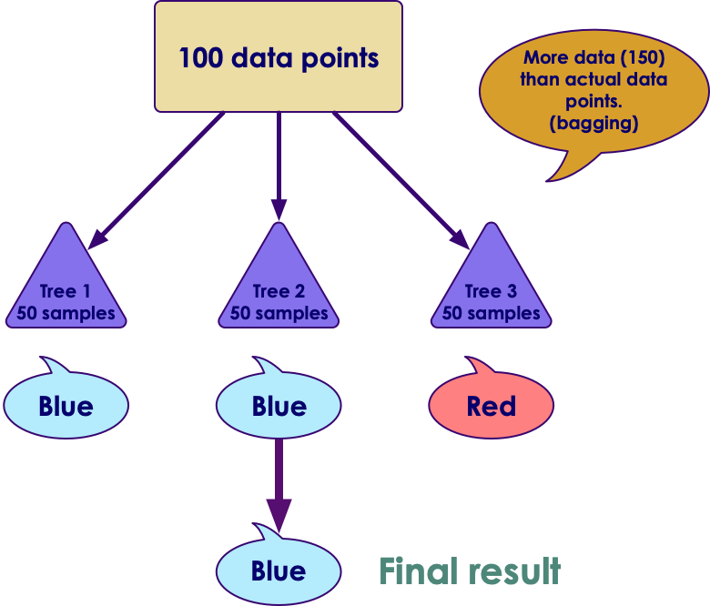
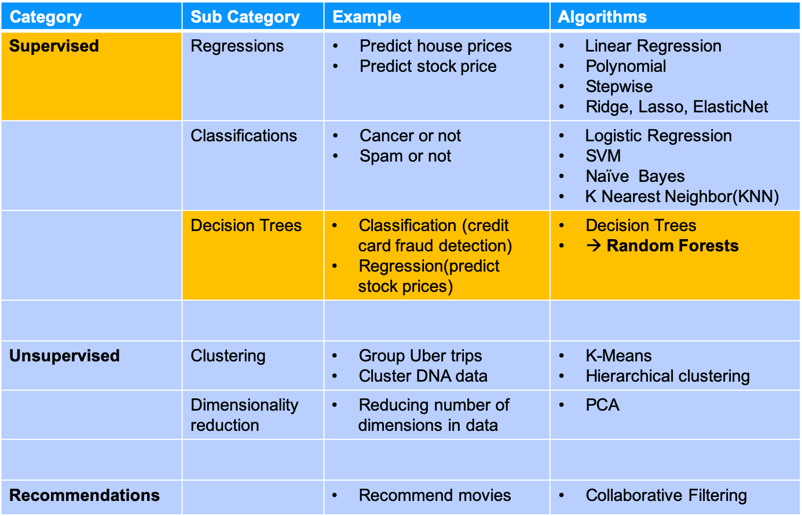
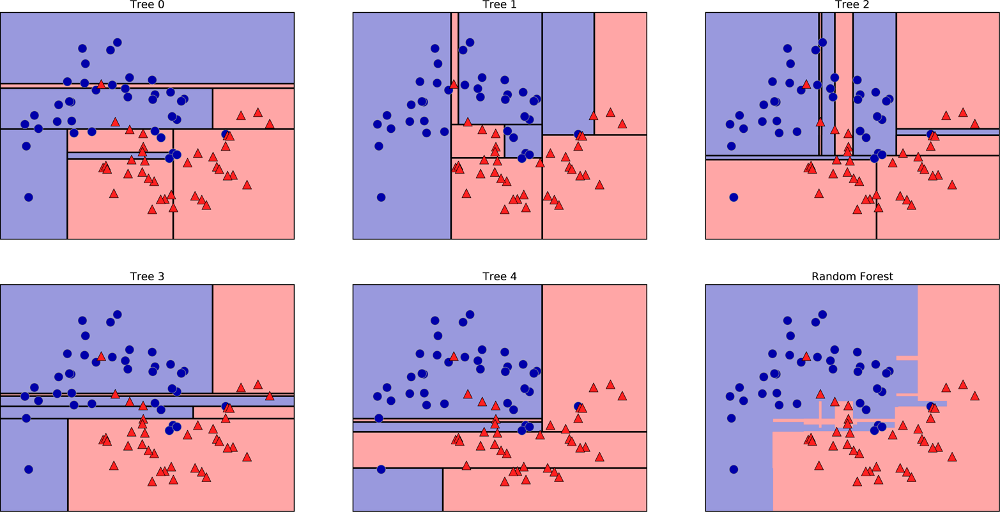

# Random Forests

<!-- {"left" : 2.67, "top" : 2.84, "height" : 8.04, "width" : 12.16} -->

---

## Algorithm Summary

<!-- {"left" : 2.67, "top" : 2.84, "height" : 8.04, "width" : 12.16} -->

Notes:

---

## Decision Tree Problems

<!-- {"left" : 4.16, "top" : 4.69, "height" : 6.27, "width" : 9.18} -->

* **Decision Trees' pros**
    - Works rather well
    - Decision are visual and are easy to explain
    - Easy to scale to large datasets

* **Decision Trees' drawbacks**
    - They are not stable
    - They are not very precise
    - They tend to overfit

* **In Machine Learning terms**
    - Decision Trees have high variance (bad)
    - Decision Trees have low bias (good)

Notes:

---

## Bias-Variance Tradeoff

| Low Bias (good)                                                 	| High Bias,(not good)                                                    	|
|-----------------------------------------------------------------	|-------------------------------------------------------------------------	|
| Decision Trees, k-Nearest Neighbors and Support Vector Machines 	| Linear Regression, Linear Discriminant Analysis and Logistic Regression 	|
| More able to adopt to complex data                              	| May not be able to adopt to complex data                                	|

<!-- {"left" : 2.29, "top" : 2.87, "height" : 2.01, "width" : 12.93} -->

 

| Low Variance (good)                                                     	| High Variance (not good)                                                                      	|
|-------------------------------------------------------------------------	|-----------------------------------------------------------------------------------------------	|
| Modestly influenced by change of data                                   	| Strongly influenced by change of data                                                         	|
| Parametric methods usually have low variance                            	| nonparametric machine learning algorithms that have a lot of flexibility have a high variance 	|
| Linear Regression, Linear Discriminant Analysis and Logistic Regression 	| Decision Trees, k-Nearest Neighbors and Support Vector Machines.                              	|

<!-- {"left" : 0.98, "top" : 6.15, "height" : 3.1, "width" : 15.53} -->

 

* For more details see **ML-Concepts: Bias-Variance**

Notes:

---

## Bias Variance Trade Off

* The 'lower left corner' is the sweet spot for ML algorithms

 <!-- {"left" : 3.23, "top" : 2.7, "height" : 8.31, "width" : 11.05} -->

Notes:

---

## Random Forests Idea

<!-- {"left" : 4.16, "top" : 4.69, "height" : 6.27, "width" : 9.18} -->

* Decision Trees have low bias, and that is good

* We want to keep the low bias but reduce variance

* **Approach**
    - Generate many decision trees
    - Train them independently
    - And aggregate their predictions --> This will minimize the variance

<!-- {"left" : 2.2, "top" : 7.76, "height" : 2.66, "width" : 13.1} -->

Notes:

---

## Ensembles of Decision Trees

* **Ensembles** are methods that combine multiple machine learning models to create more powerful model
    - **wisdom of many is more than of one**

* There are many ensemble methods, but two are most popular
    - **Random forest**
    - **Gradient boosted tree**

* Both of these use Decision Trees as their building blocks

* Ensemble methods use the following techniques:
    - Bagging (bootstrap aggregation)
    - Stacking
    - Boosting

Notes:

---

## Bagging (Bootstrap Aggregation)

<!-- {"left" : 9.17, "top" : 2.44, "height" : 6.85, "width" : 8.02} -->

* Bagging is a technique that trains diverse/different models by varying training data

* In this example, we create 3 trees

* Each tree is getting **randomly selected, partial** data (50 each)

* Note : Even though we only have 100 data points total, each tree gets 50 data points  (randomly selected from 100).  This is **sampling with replacement or bootstraping**

* Each tree will be different as they **are trained with different data**

* Each tree is predicting blue or red

* Final result is **aggregated** ( **bagging** )

Notes:

---

## Improving Bagging

<!-- {"left" : 9.68, "top" : 2.34, "height" : 5.84, "width" : 7.65} -->

* Data Bagging (selecting random subsets of data) solved overfitting problem

* But we still have a problem of trees predicting highly correlated results

* Solution: **We also select features randomly!**.  

* For each tree, we will select a different set of features ; Here we see each tree getting randomly selected subset of features A, B, C

* This is called **feature bagging**

Notes:

---

## Making Final Prediction

<!-- {"left" : 9.68, "top" : 2.34, "height" : 5.84, "width" : 7.65} -->

* Aggregating regression trees
    - Average out results
    - Tree1 predicts 10,   Tree2 predicts 15,  Tree3 predicts 12
    - Final result = average = (10 + 15 + 12) / 3  = 12.33
* For classification trees
    - A **soft voting** approach is used
    - Each tree makes a `soft` prediction: provides a probability for each possible output
    - The probabilities from all trees are averaged
    - The class with highest probability is predicted
* Each random tree might have high variance.When averaged, the combined variance is reduced.
    - `Variance of a forest = Variance of a tree / Number of trees`

---

## Random Forest Example

* We see decision boundaries by the five trees are different.
* And they overfit
* Final Random Forest overfits less than each individual tree

<!-- {"left" : 3.17, "top" : 4.49, "height" : 5.73, "width" : 11.17} -->

* Source : `Introduction to Machine Learning with Python` by Sarah Guido, Andreas C. Muller  (ISBN: 9781449369415)

Notes:

---

## Random Forest: Strengths, Weaknesses, and Parameters

* **Strength**
    - All purpose classifier that does well in most scenarios
    - Performs better than a single Decision Tree (reduces variance)
    - Very simple tuning (number of trees)
    - Can handle numeric and categorical data
    - Doesn't need scaling of data
* **Weaknesses**
    - Training can be computationally intensive (if training 100s or 1000s of trees)
        * Parallelizable across many CPU cores or nodes
    - Final model can be more complex than a single decision tree
* **Parameters**
     - Number of trees to create

---

## Random Forests Best Practices

* Random Forest is a popular choice in lot of machine learning competition entries
    - Because it is easy to use and produces very good results

* Pretty much the only significant parameter to specify **number of trees to create**
    - More trees will take more compute time/resources
    - In practice we create 100s / 1000s of trees
    - Start with a default number of trees (100) and go up
    - Stop creating more trees when accuracy stops increasing
    - This can be validated by  **cross-validation**  testing

Notes:

---

## Implementing Random Forest

* Let's try the algorithm out!