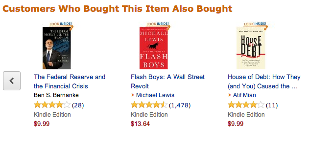
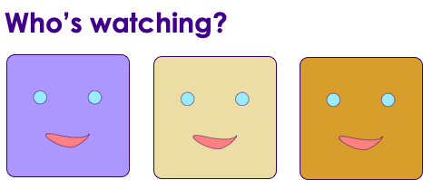
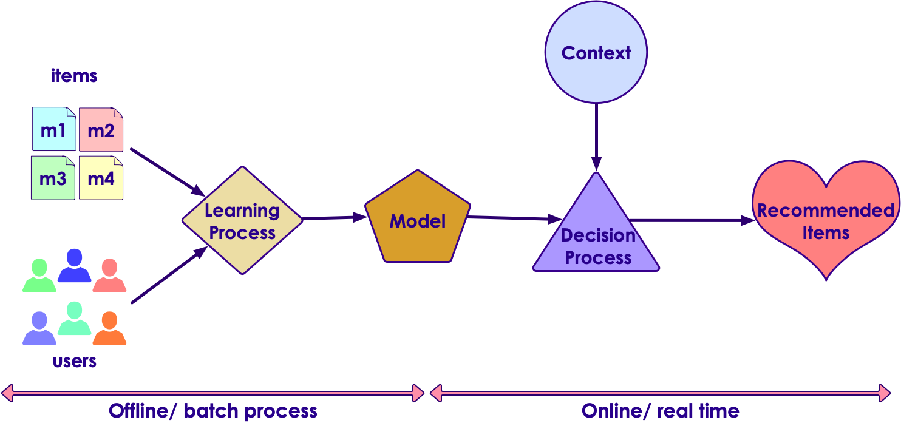
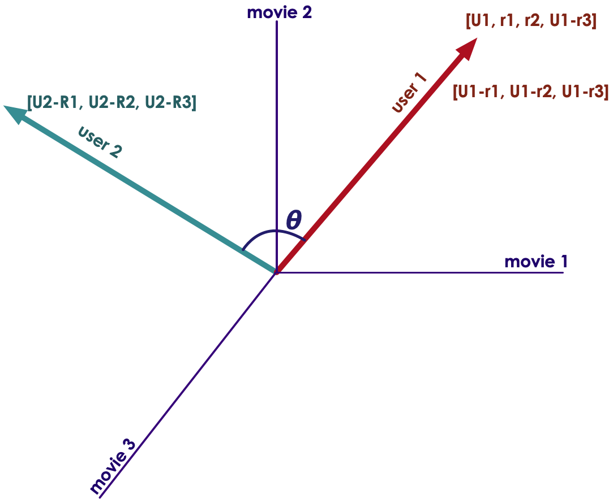

# Recommendations

---

## Lesson Objectives

 * Understand recommendations

 * Examine different recommendations approaches

 * Discuss ALS algorithm

Notes:

---

# Recommendations Intro

---

## Recommendations Are Everywhere: Amazon

<!-- {"left" : 1.63, "top" : 1.21, "height" : 3.27, "width" : 6.99} -->

* *Source: Amazon*

Notes:

---

## Recommendations by Amazon Prime

<!-- {"left" : 1.68, "top" : 1.36, "height" : 4.42, "width" : 6.88} -->

* *Source: Amazon*

Notes:

- Images courtesy of Amazon.com & Netflix.com

---

## Recommendations With Profiles by Netflix

<!-- {"left" : 1.95, "top" : 1.14, "height" : 2.99, "width" : 6.36} -->

<!-- {"left" : 1.15, "top" : 4.36, "height" : 3.17, "width" : 7.95} -->

* *Source: Netflix*

Notes:

- Images are used under fair use. Copyright belongs to respective copyright holders

---

## Value of Recommendations

 * Chris Anderson in "Long Tail""We are leaving the age of information and entering the age of recommendation"

 * @ Netflix, 2/3 of the movies watched are recommended [1]

 * @ Google News, recommendations generate 38% more click through [1]

 * @ Amazon, recommendations drive 35% of sales [1]

Notes:

[1] - Recommender Systems : https://www.slideshare.net/xamat/recommender-systems-machine-learning-summer-school-2014-cmu

---

## Recommender Problem

 *  **Predict if a user will like an item**

 * Based on

     - Past behavior: User has rated other items

     - Relations to other users: age group, subscribes to the same playlist, etc.

     - Item similarity: People who bought X also bought Y

     - Context: A news site can recommend 'related stories'

Notes:

---

## Recommendation is Two Step Process

<!-- {"left" : 0.33, "top" : 2.26, "height" : 4.55, "width" : 9.6} -->

Notes:

---

## Recommender Approaches

 *  **Collaborative Filtering:** recommend items based on  **only on users past** behavior

     -  **User based:** find similar users to me and recommend what they liked

     -  **Item based:** find similar items to those that I have previously liked

 *  **Content based:** Recommend based on item features (Actor: Bruce Willis,  Genre: Action)

 *  **Personalized Rank:** Treat recommendations like a ranking problem

 *  **Demographic:** based on user features (age, location, interests)

 *  **Social recommendations:** recommend friends' items (trust based)

 *  **Hybrid:** combine any of the above

Notes:

---

## Recommender Approaches

|                     |                                                                             |
|---------------------|-----------------------------------------------------------------------------|
| Traditional Methods | Collaborative Filtering                                                     |
|                     | - Content based  - recommendations                                               |
| Novel               | Learning to rank                                                            |
|                     | - Context aware recommendations  - Tensor Factorization  - Factorization Machines |
|                     | Deep learning                                                               |
|                     | Similarity                                                                  |
|                     | Social recommendations                                                      |

<!-- {"left" : 0.25, "top" : 1.36, "height" : 4.67, "width" : 9.75} -->

Notes:

---

## Netflix Prize competition (2009)

<!-- {"left" : 8.65, "top" : 0.96, "height" : 0.34, "width" : 1.54} -->

 * Netflix Prize was an open competition for the best collaborative filtering algorithm to predict user ratings for films, based on previous ratings without any other information about the users or films
 * Target: Improve Netflix's own recommender system by at least 10%
 * https://www.netflixprize.com/
 * Dataset
     -  **100 Million ratings by 480k users to 18k movies**
     - Format: (userid,  movieid, rating, date)
 * Prize of US $1 Million was claimed in Sept 2009 by 'Pragmatic Chaos' team
     - Improved Netflix ratings by 10.06 %
 * Sequel cancelled due to privacy concerns
     - Researchers were able to identify individual users by correlating Netflix ratings with Internet Movie Database (IMDB)!

Notes:

https://en.wikipedia.org/wiki/Netflix_Prize

---

## Netflix Prize Results

- Can you guys spot the difference between top-2 teams in the leaderboard? :-) 

<!-- {"left" : 1.08, "top" : 2.52, "height" : 5.62, "width" : 8.09} -->

---

## Netflix Prize Findings

 * It is really  **extremely simple to produce** "reasonable" recommendations and **extremely** **difficult to improve** **them**.

<!-- {"left" : 2.47, "top" : 2.57, "height" : 5.44, "width" : 5.31} -->

Notes:

Image credit : https://www.slideshare.net/xamat/recommender-systems-machine-learning-summer-school-2014-cmu

---

# Collaborative Filtering

---

## Collaborative Filtering

 * There are 3 data models: Users, Items, Ratings

 * Users rate items

     - Movies (one star to 5 stars)

 * Ratings can be

     - explicit (user actually rated)

     - or implicit (user watched the movie)

     - **Question: If I started watching a movie and backed out within 5 minutes, what is the implicit rating?**

 * The system matches this user's ratings against other users' and finds the people with most " **similar** " tastes.

 * With similar users, the system recommends items that the similar users have rated highly but not yet being rated by this user.Presumably the absence of rating is often considered as the unfamiliarity of an item

Notes:

---

## Ratings Matrix

 * See the rating matrix below.

 *  **Questions for the class**

     - Will this be a sparse matrix or dense matrix?

     - How will you go about recommending movies to **u5**?

<!-- {"left" : 1.02, "top" : 3.63, "height" : 3.97, "width" : 8.21} -->

Notes:

---

## Ratings Matrix

 * See the rating matrix below.

 *  **Questions for the class**

     - Will this be a sparse matrix or dense matrix?

     - How will you go about recommending movies to **u5**?

<!-- {"left" : 1.36, "top" : 3.64, "height" : 4.37, "width" : 7.53} -->

Notes:

---

## Implicit vs Explicit Ratings

 * Some Applications have "explicit" ratings:

     - Netflix (1-5 stars)

     - Facebook ("like")

 * What if we don't have explicit ratings?

 * Example: Apple Itunes

     - Doesn't (probably) have a lot of star-ratings

     - It does have your play history and counts.

     - Can we "infer" a rating based on play history?

     - If you played a song 1000 times, does that indicate a "like?"

Notes:

---

## Collaborative Filtering Challenges

 *  **Data Sparsity**

     - User/Item ratings matrix can be extremely sparse.Users don't rate every movie

     - Netflix prize data, 500k users x 17k movies => 8,500 M positions  = 8.5 Billion positionOut of only 100M are not zeros!

 *  **Data Size**

     - A streaming service may have100 Million users, 100,000 titles, and say every user rates 20 movies.

     - 100 Million x 20 = 2,000 million = 2 Billion ratings!

     - Netflix has 5 Billion ratings

     - Huge matrix --> won't fit on a single machine, need to distribute the data on a cluster

Notes:

---

## Collaborative Filtering Challenges

 *  **Computational Complexity**

     - CF algorithms are O(MxN) complexity (worst case), for M customers (could be millions)  and N items (hundreds of thousands or millions)

     - Best case  O (M+N) - we only have to consider a small number of products for customer

 *  **Rating variance**

     - Not every one rates the same

     - For example user1 ratings are between 3 and 5 (3 is a minimum rating)

     - While user2's ratings are between 2-4  (never a 5)

     - Ratings need to be normalized before processing begins(Z-Scoring is a popular method)

Notes:

---

## Collaborative Filtering Challenges

 *  **Cold Start**
     - CF works well when there are ratings for a user
     - What if a new user joins the system, and he hasn't got a ratings history?
     - Most systems can compensate for this scenario
        * Recommend  **'popular items** '   (most people like popular items)
        * Recommend based on location "people in San Jose watched these movies"
 *  **Spoofing**
     - Users can rate their items higher, and rate competition lower
     - Rating systems need to have safeguards for this
     - Also before running CF the data has to be sanitized

Notes:

---

## Recommender Algorithms

 * Collaborative Filtering
     - K-Nearest Neighbors
     - Matrix decomposition (ALS, SVD)

 * Clustering
     - Above algorithms are supervised (they learn and then predict)
     - Clustering - unsupervised - can find patterns without 'learning'
     - Can be a solution to  **'cold start** ' problem
     - And a way to break up massive data into manageable sized clusters
     - Each cluster is assigned typical preferences, based on users that belong in the cluster
     - Users within each cluster will receive recommendations computed at the cluster level

---

## Recommender Algorithms

 * Deep Learning

     - Using neural network

     - High computational complexity  (needs cluster wide resources)

     - But produces really good results

Notes:

---

## Collaborative Filtering Approaches

 *  **User based**

     - Find other users with similar taste

     - Find out items they have rated higher, and recommend them to me

 *  **Item based**

     - Find similar items to the items I have liked in the past

     - Recommend them to me

Notes:

---

## Similarity Between Two Users

<!-- {"left" : 6.03, "top" : 1.7, "height" : 4.87, "width" : 3.99} -->

 * Let's say we want to compare U5 with U1. Let's imagine a matrix with just two of these users and their ratings

 * One approach is  **'cosine similarity**'
  - that measures the similarity between vectors

 * Another approach: Correlation!

Notes:

---

## Cosine Similarity

<!-- {"left" : 0.64, "top" : 3, "height" : 3.73, "width" : 3.63} -->  &nbsp;  &nbsp;
<!-- {"left" : 5.72, "top" : 3, "height" : 3.46, "width" : 3.89} --> 

---

## Cosine Similarity for Ratings

- Here we are representing ratings as vectors
- (Left) Start with ratings for 'movie-1'
- (Middle) Add ratings for 'movie-2'
- (Right) Generalize it to any number of movies

| User | m1 | m2 | m3 |
|------|----|----|----|
| u1   | 4  | 3  | 5  |
| u2   | 4  | 5  | 5  |

<!-- {"left" : 0.25, "top" : 3.16, "height" : 1.5, "width" : 9.75} --> 

<!-- {"left" : 0.26, "top" : 6.91, "height" : 1.66, "width" : 5.28} -->  &nbsp;
<!-- {"left" : 4.13, "top" : 5.39, "height" : 2.28, "width" : 2.75} -->  &nbsp;
<!-- {"left" : 7.24, "top" : 5.32, "height" : 2.42, "width" : 2.97} --> 

---

## K Nearest Neighbor

 * We could find a neighborhood of similarity

 * K-Nearest users (rows)

 * Can also do K-nearest items (columns)

<!-- {"left" : 0.13, "top" : 3.41, "height" : 4.29, "width" : 9.99} -->

Notes:

* This is a matrix of users and items. Users in rows and items in columns.
* When a user rates a item, that particular cell gets filled. Lot of empty cells - sparse matrix.
* Source: https://cran.r-project.org/web/packages/recommenderlab/vignettes/recommenderlab.pdf

---

# Matrix Factorization

---

## Alternating Least Squares

 * ALS is an algorithm to figure out how users / items relate to each other

 * Similar to 'dimensionality reduction'

     - Trying to reduce huge amount of vectors (users x items) into smaller size, while still keeping the relevant information

     - PCA!

 * Done by  **'matrix factorization** '

 * We take a large users x items matrix and figure out 'hidden' (latent) features that results in much smaller matrix and explains the relationship

Notes:

---

## Matrix Refactorization Explained

 * R is matrix is  M (users)  x N (items)

     - Can be really large  - 100 million users x 1 million items

 * Factorize R into two smaller matrices ,

     - U : latent vectors for each user , MxK dimension,

     - V : latent vectors for each item,  KxN dimension

 * Multiplying U and V will  **approximately**  give R

 * But matrices U & V are  **dense** !  So can be stored effectively

---

## Matrix Refactorization Explained

<!-- {"left" : 0.4, "top" : 2.16, "height" : 5.32, "width" : 9.45} -->

Notes:

---

## Singular Value Decomposition

 * We can also perform the Singular Value Decomposition of the Matrix

 * Singular Value Decomposition finds 2 Matrices: U and V

     - U dot V = rating.

 * Problem: In most real-world cases the SVD is very hard!

 * Typical Use case:

     - Millions rows times Millions of Columns!

 * Can we approximate the SVD?

Notes:

---

## ALS

 * To solve matrices U and V, we can utilize
     - SVD : Requires inverting a very large matrix -> computationally expensive
     - Apply ALS to approximate it
 * ALS we only need to solve one vector at time -> parallelizable !!
 * This is why Spark ML implements ALS
 * Basic algorithm:
     - Randomly initialize U and solve for V
     - Then go back and solve U using our solution for V
     - Keep iterating back and forth until we converge and approximate R as best as we can
 * After the matrix work is done, we can simply take the dot product of U and V to see what a predicted rating would be for a (user, item) combination

Notes:
