# Recommendations

---

## Lesson Objectives

* Understand recommendations

* Examine different recommendations approaches

Notes:

---

## Recommendations Are Everywhere

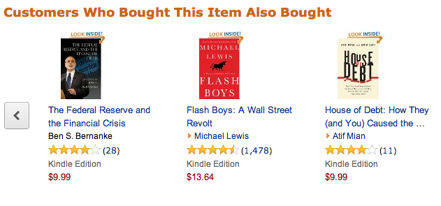<!-- {"left" : 1.84, "top" : 2.96, "height" : 6.46, "width" : 13.82} -->

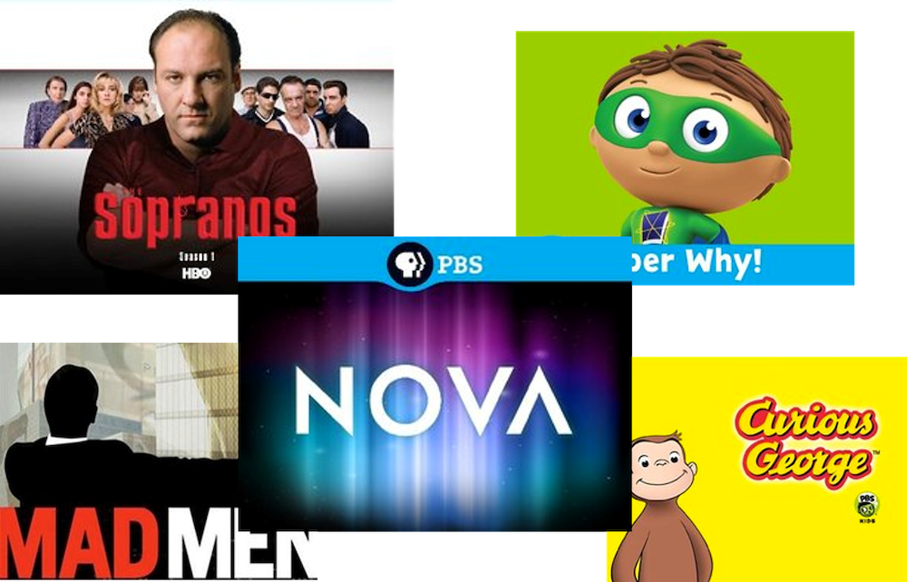<!-- {"left" : 3.55, "top" : 1.67, "height" : 6.69, "width" : 10.41} -->

 

* Question: How can the movie recommendations be improved? 😃

Notes:

---

## Value of Recommendations

* Chris Anderson in "Long Tail" - We are leaving the age of information and entering the age of recommendation"

* @ Netflix, 2/3 of the movies watched are recommended [1]

* @ Google News, recommendations generate 38% more click through [1]

* @ Amazon, recommendations drive 35% of sales [1]

* References: [1 - Recommender Systems](https://www.slideshare.net/xamat/recommender-systems-machine-learning-summer-school-2014-cmu)

Notes:

---

## How to do Recommeondations?

* **Predict if a user will like an item**
    - How can we determine this?

* Past behavior: User has rated other items
    - Netflix will recommend movies based on our past ratings

* Demographics
    - Spotify may recommend 'Top RAP artists liked by millennials"

* Association
    - People listened to 'artist X' also liked 'artist Y' (Spotify)
    - People who bought X also bought Y  (Amazon)

* Context based
    - Facebook/Linkedin may promote stories on your feed, based on your past clicks / likes

Notes:

---

## Netflix Prize competition (2009)

<!-- {"left" : 13.12, "top" : 1.89, "height" : 0.93, "width" : 4.23} -->

* Netflix Prize was an open competition to improve Netflix's recommendation system by atleast 10%

* Dataset
    - **100 Million ratings by 480k users to 18k movies**

* Prize of US $1 Million was claimed in Sept 2009 by 'Pragmatic Chaos' team
    - Improved Netflix ratings by 10.06 %

* Sequel cancelled due to privacy concerns
    - Researchers were able to identify individual users by correlating Netflix ratings with Internet Movie Database (IMDB)!

* References:
    - [Netflixprice](https://www.netflixprize.com/)
    - [Wikipedia](https://en.wikipedia.org/wiki/Netflix_Prize)

Notes:

---

## Netflix Prize Results

- Can you guys spot the difference between top-2 teams in the leaderboard? :-) 

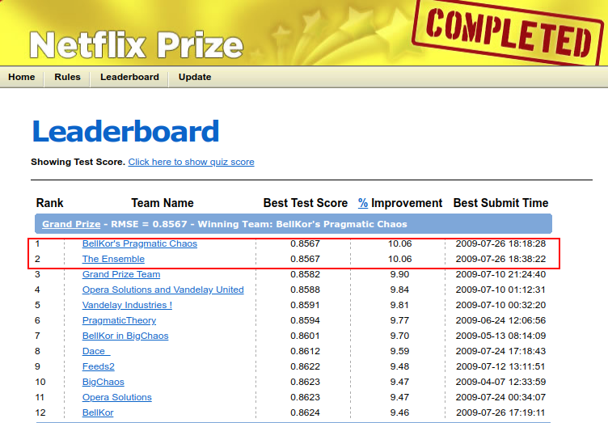<!-- {"left" : 3.37, "top" : 3.73, "height" : 7.48, "width" : 10.77} -->

---

## Netflix Prize Findings

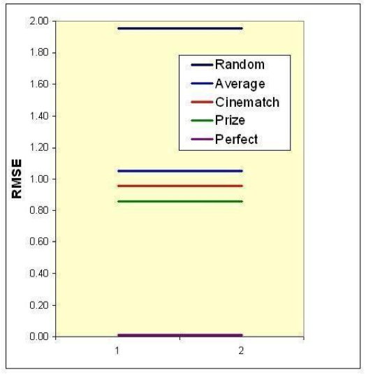<!-- {"left" : 11.47, "top" : 2.27, "height" : 5.86, "width" : 5.72} -->

* It is really **extremely simple to produce "reasonable" recommendations and extremely difficult to improve them.**

Notes:

Image credit : https://www.slideshare.net/xamat/recommender-systems-machine-learning-summer-school-2014-cmu

---

## Recommendation is Two Step Process

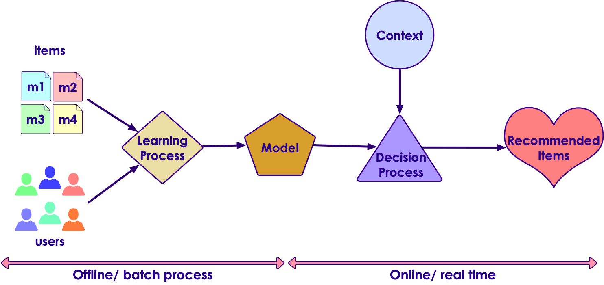<!-- {"left" : 1.48, "top" : 2.75, "height" : 6.89, "width" : 14.53} -->

Notes:

---

## Recommender Algorithms

* Collaborative Filtering
    - Matrix decomposition (ALS, SVD)
    - K-Nearest Neighbors

* Deep Learning algorithms (new!)
    - Using neural network
    - High computational complexity  (needs cluster wide resources)
    - But produces really good results

* Above algorithms are supervised (they learn and then predict)

* Clustering based algorithms are unsupervised; Can find patterns without 'learning'
    - Can be a solution to  **cold start** problem
    - And a way to break up massive data into manageable sized clusters
    - Users within each cluster will receive recommendations computed at the cluster level

---

# Collaborative Filtering

---

## Collaborative Filtering

* **Collaborative Filtering** is a very popular and widespread recommendation system

* There are 3 data models: Users, Items, Ratings
    - Users rate items (say 1 to 5 stars)

* Ratings can be
    - explicit (user actually rated)
    - or implicit (user watched the entire movie or stopped watching after a few minutes)
    - **Question: If I started watching a movie and backed out within 5 minutes, what is the implicit rating?**

* The system matches this user's ratings against other users' and finds the people with most **similar** tastes.

Notes:

---

## Collaborative Filtering Example

* See the rating matrix below.

* **Questions for the class**

    - Will this be a sparse matrix or dense matrix?

    - How will you go about recommending movies to **u5**?

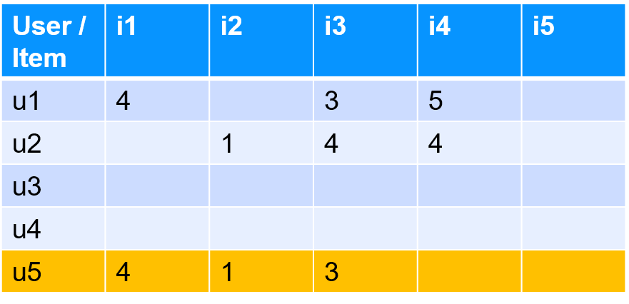<!-- {"left" : 3.57, "top" : 5.14, "height" : 5.01, "width" : 10.37} -->

Notes:

---

## Collaborative Filtering Example

* See the rating matrix below.

* **Questions for the class**

    - Will this be a sparse matrix or dense matrix?

    - How will you go about recommending movies to **u5**?

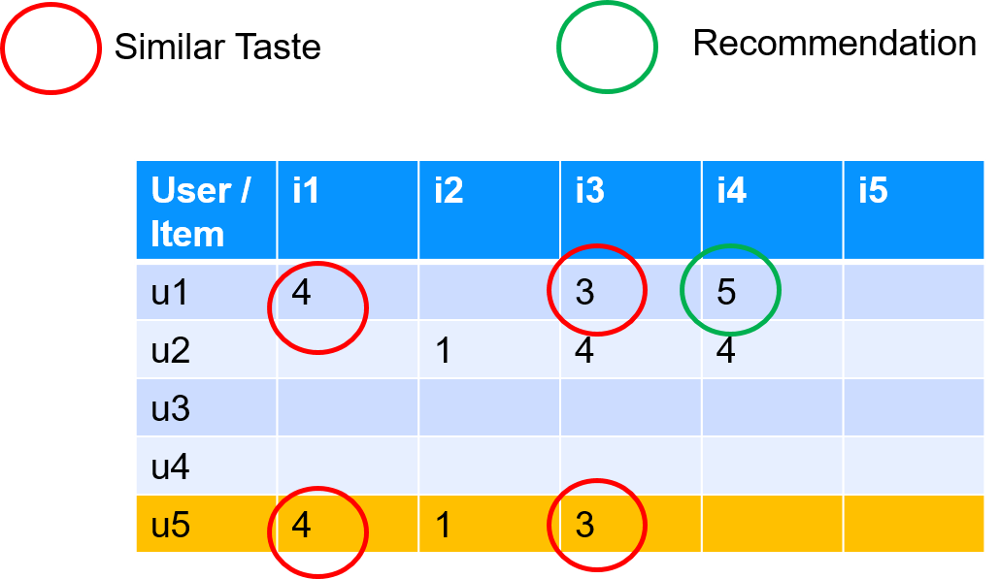<!-- {"left" : 3.34, "top" : 4.89, "height" : 6.28, "width" : 10.83} -->

Notes:

---

## Implicit vs Explicit Ratings

* Some Applications have "explicit" ratings:
    - Netflix (1-5 stars)
    - Facebook ("like")

* What if we don't have explicit ratings?

* Example: Apple Itunes
    - Doesn't (probably) have a lot of star-ratings
    - It does have your play history and counts.
    - Can we "infer" a rating based on play history?
    - If you played a song 1000 times, does that indicate a "like?"

* A good recommender system will incorporate both implicit and explicit ratings

Notes:

---

## Collaborative Filtering Challenges

* Data Sparsity
    - User/Item ratings matrix can be extremely sparse.Users don't rate every movie
    - For example, Netflix prize data had 500k users and 17k movies => 8,500 Million (8.5 Billion) positions
    - Out of 8.5 Billion positions only 100M had values  (the rest were blank/sparse!)

* Data Size

    - A streaming service may have 100 Million users, 100,000 titles, and say every user rates 20 movies.

    - 100 Million x 20 = 2,000 million = 2 Billion ratings!

    - Netflix has 5 Billion ratings

    - Huge matrix --> won't fit on a single machine, need to distribute the data on a cluster

Notes:

---

## Collaborative Filtering Challenges

* **Computational Complexity**
    - CF algorithms are O(MxN) complexity (worst case), for M customers (could be millions)  and N items (hundreds of thousands or millions)
    - Best case  O (M+N) - we only have to consider a small number of products for customer

* **Rating variance**
    - Not every one rates the same
    - For example user1 ratings are between 3 and 5 (3 is a minimum rating)
    - While user2's ratings are between 2-4 (never a 5)
    - Ratings need to be normalized before processing begins(Z-Scoring is a popular method)

Notes:

---

## Collaborative Filtering Challenges

* **Cold Start**
     - CF works well when there are ratings for a user
     - What if a new user joins the system, and he hasn't got a ratings history?
     - Most systems can compensate for this scenario
        * Recommend  **'popular items** '   (most people like popular items)
        * Recommend based on location "people in San Jose watched these movies"

* **Spoofing**
     - Users can rate their items higher, and rate competition lower
     - Rating systems need to have safeguards for this
     - Also before running CF the data has to be sanitized

Notes:

---

## Collaborative Filtering Approaches

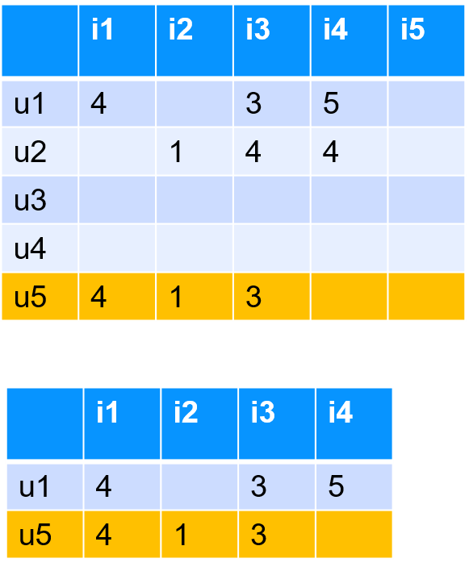<!-- {"left" : 11.38, "top" : 2.48, "height" : 7.17, "width" : 5.88} -->

* **User based**
     - Find other users with similar taste
     - Find out items they have rated higher, and recommend them to me

* **Item based**
    - Find similar items to the items I have liked in the past
    - Recommend them to me

* What can we use to measure the similarities?
    - **cosine similarity**
    - correlation

Notes:

---

## Cosine Similarity

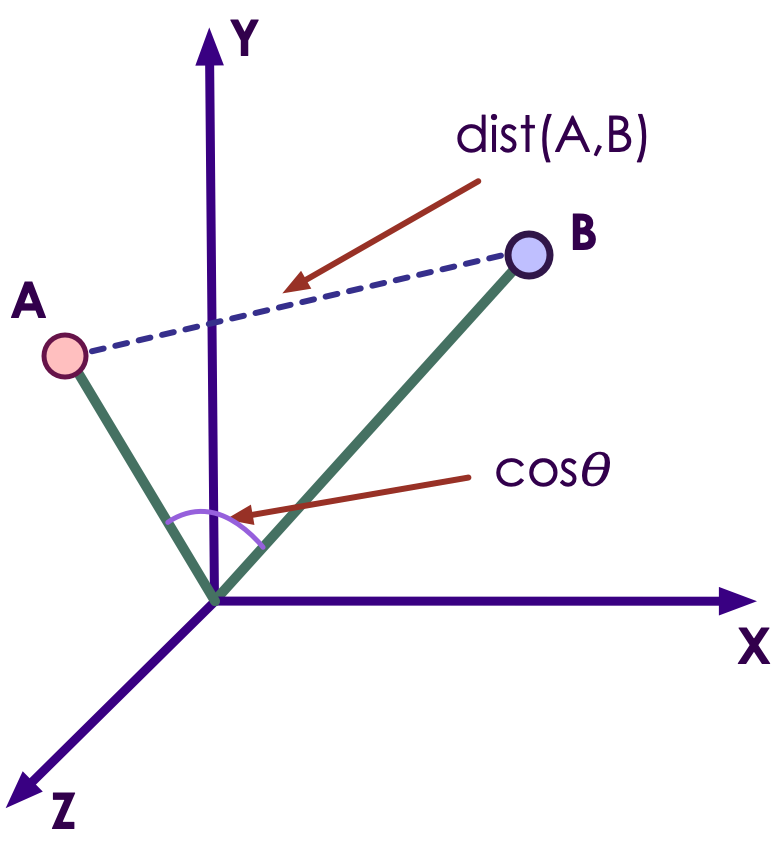<!-- {"left" : 1.33, "top" : 3.38, "height" : 6.39, "width" : 6.22} -->  &nbsp;  &nbsp;
<!-- {"left" : 8.99, "top" : 3.38, "height" : 6.39, "width" : 7.18} -->

---

## Cosine Similarity for Ratings

- Here we are representing ratings as vectors
- (Left) Start with ratings for 'movie-1'
- (Middle) Add ratings for 'movie-2'
- (Right) Generalize it to any number of movies

| User | m1 | m2 | m3 |
|------|----|----|----|
| u1   | 4  | 3  | 5  |
| u2   | 4  | 5  | 5  |

<!-- {"left" : 3.88, "top" : 4.84, "height" : 1.5, "width" : 9.75} --> 

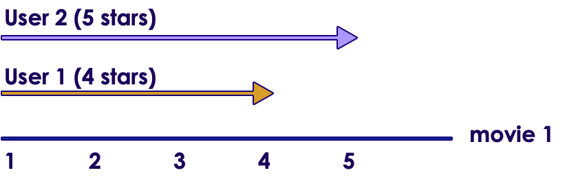<!-- {"left" : 0.81, "top" : 8, "height" : 2, "width" : 6.37} -->  &nbsp;
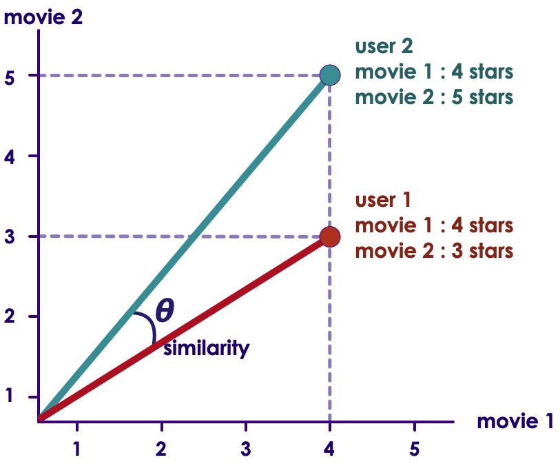<!-- {"left" : 7.84, "top" : 7.54, "height" : 3.33, "width" : 4.01} -->  &nbsp;
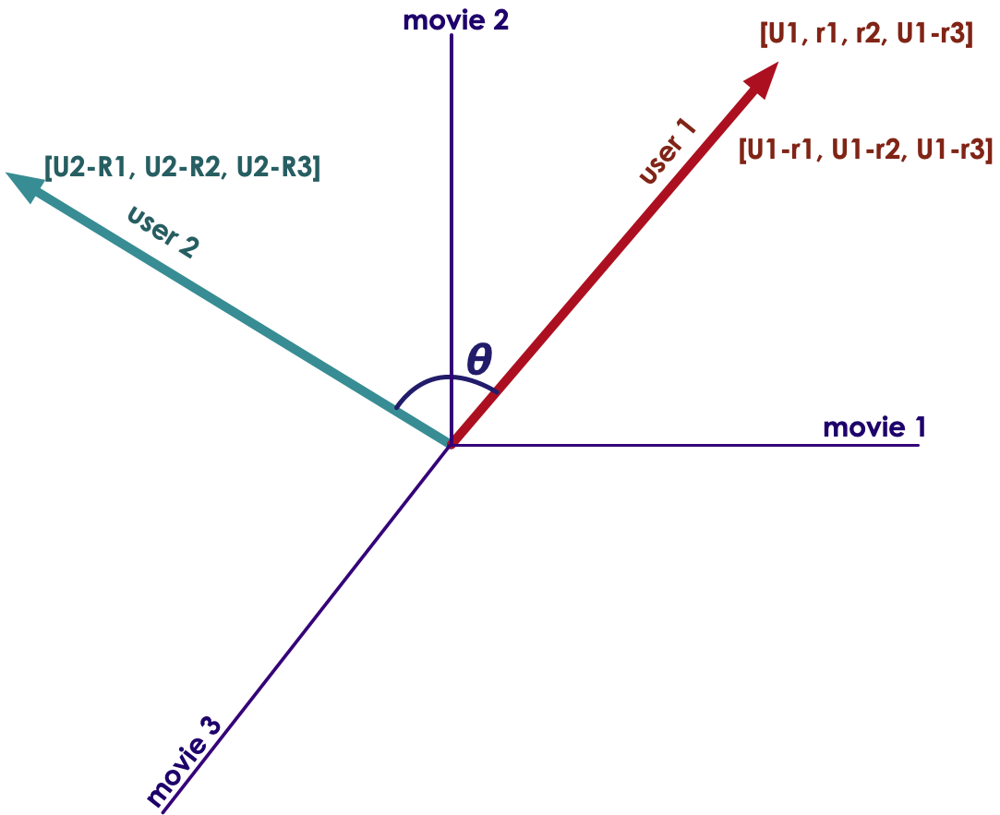<!-- {"left" : 12.26, "top" : 7.54, "height" : 3.61, "width" : 4.43} -->

---

## K Nearest Neighbor

* We could find a neighborhood of similarity

* K-Nearest users (rows)

* Can also do K-nearest items (columns)

* [Reference](https://cran.r-project.org/web/packages/recommenderlab/vignettes/recommenderlab.pdf)

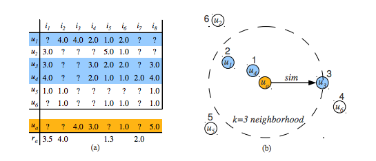<!-- {"left" : 1.75, "top" : 4.49, "height" : 6.01, "width" : 14} -->

Notes:

---

# Matrix Factorization

---

## Dealing with Huge Sparse Matrices

<!-- {"left" : 3.34, "top" : 4.89, "height" : 6.28, "width" : 10.83} -->

* As we saw, ratings matrices can be huge and sparse!

* We need to wrangle these to manageable size to compute efficiently

* Similar to 'dimensionality reduction'; Trying to reduce huge amount of vectors (users x items) into smaller size, while still keeping the relevant information

* Done by **matrix factorization**

Notes:

---

## Matrix Refactorization Explained

<!-- {"left" : 2.09, "top" : 3.11, "height" : 7.5, "width" : 13.32} -->

* R is matrix is M (users) x N (items)
    - Can be really large  - 100 million users x 1 million items
* Factorize R into two smaller matrices
    - U: latent vectors for each user , MxK dimension,
    - V: latent vectors for each item, KxN dimension
* Multiplying U and V will **approximately**  give R
* But matrices U & V are **dense** ! So can be stored effectively

---

## Singular Value Decomposition

* We can also perform the Singular Value Decomposition of the Matrix

* Singular Value Decomposition finds 2 Matrices: U and V
    - U dot V = rating.

* Problem: In most real-world cases the SVD is very hard!

* Typical Use case:

    - Millions rows times Millions of Columns!

* Can we approximate the SVD?

Notes:

---

## ALS - Alternating Least Squares

* To solve matrices U and V, we can utilize SVD

* How ever SVD requires inverting a very large matrix -> computationally expensive

* Use ALS to approximate it

* ALS we only need to solve one vector at time -> parallelizable !!

* This is why Spark ML implements ALS

* Basic algorithm:
    - Randomly initialize U and solve for V
    - Then go back and solve U using our solution for V
    - Keep iterating back and forth until we converge and approximate R as best as we can
* After the matrix work is done, we can simply take the dot product of U and V to see what a predicted rating would be for a (user, item) combination

Notes:

---

## Doing Recommendations

* We will see how to implement recommender algorithms next!

