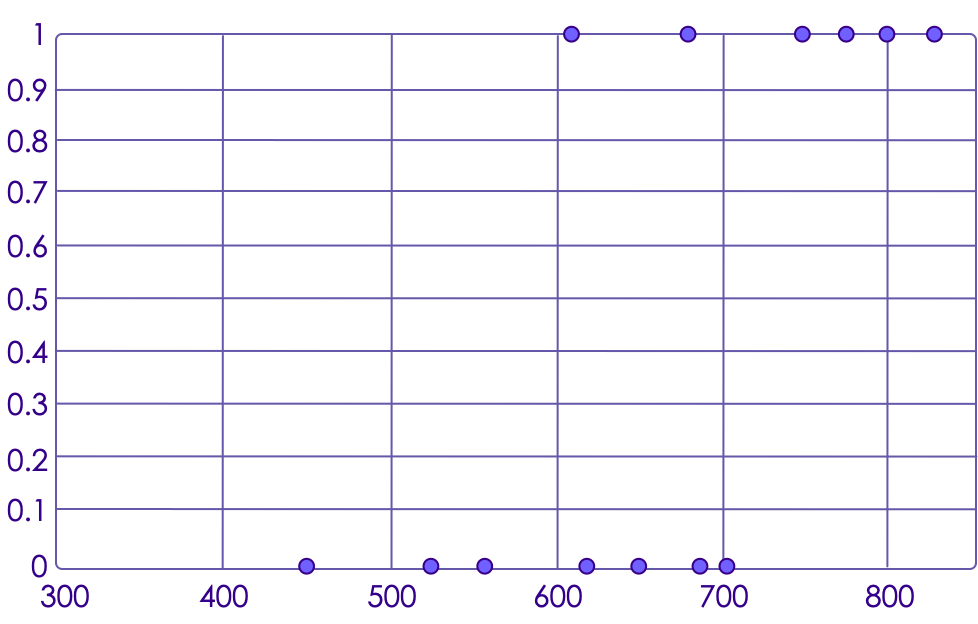
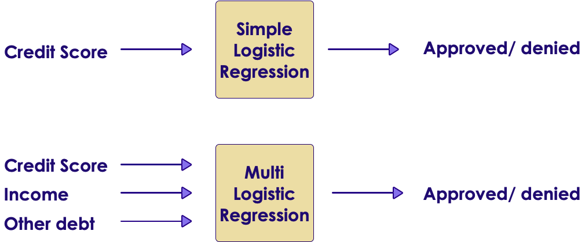
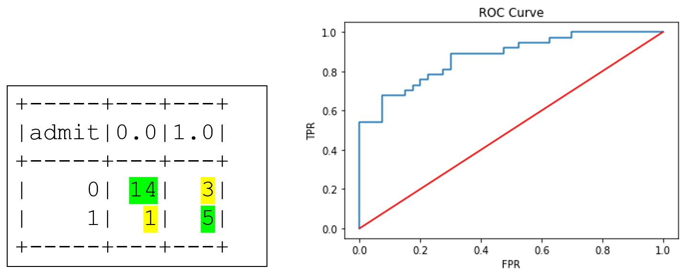

# Logistics Regression

---

## Algorithm Map

<!-- {"left" : 2.51, "top" : 2.69, "height" : 8.33, "width" : 12.47} -->

---

## Task: Approving Credit Card Applications

 * In US most adults have a 'credit score' (a.k.a. FICO score)

 * Ranges from 300 (very poor) to 850 (excellent)

 * Credit score is a big determining factor when applying for loans / mortgages / credit cards

<!-- {"left" : 2.75, "top" : 5.78, "height" : 5.35, "width" : 11.99} -->


Notes:

Image credit : (CC) : https://www.flickr.com/photos/cafecredit/27321078025


---

### Task : Credit Approval


 * Here is historical data on credit score and if the credit application is approved
 * What is the chance some one with score of  **700**  getting a credit card approved?


| Credit Score | Approved? |
|--------------|-----------|
| 560          | No        |
| 750          | Yes       |
| 680          | Yes       |
| 650          | No        |
| 450          | No        |
| 800          | Yes       |
| 775          | Yes       |
| 525          | No        |
| 620          | No        |
| 830          | Yes       |
| 610          | Yes       |

<!-- {"left" : 6.11, "top" : 5.15, "height" : 5.9, "width" : 5.29} -->


Notes:


---

## Plotting Credit Approval Data

<!-- {"left" : 3.19, "top" : 3.19, "height" : 7.34, "width" : 11.11} -->


Notes:


---

## Plotting Credit Approval Data

 * X axis = credit score

 * Y axis = 0 (declined), 1 (approved), nothing in between

 * There is no linear fit line!

<!-- {"left" : 4.47, "top" : 4.61, "height" : 6.54, "width" : 8.56} -->


Notes:


---

## Linear vs. Logistic


 * Linear Regression provides continuous Y values

 * Classification gives out discrete output (Spam / Not-Spam)

 * Logistic Regression produces numbers that are probabilities

<!-- {"left" : 4.22, "top" : 4.67, "height" : 6.11, "width" : 9.05} -->


Notes:


---

## Logistic Regression

<!-- {"left" : 13.35, "top" : 2.23, "height" : 4.62, "width" : 3.61} -->

 * Logistic Regression gives out probability between 0 to 1

     - 70% chance this email is Spam

     - 40% this loan will fail

 * This probability is mapped into binary outcome (true/false,  yes / no)

 * **Logistic uses Regression algorithm, but used for classification**

 * Logistic regression is Linear (classification) algorithm

 * Invented by Sir David Cox (author of 364 books and papers!)


Notes:


---

## Math Behind  Logistic Regression : Sigmoid Function

- The __Sigmoid function__ always returns between 0 and 1

- So we can treat the output of Sigmoid function as  __probability__

<!-- {"left" : 1.48, "top" : 6.74, "height" : 1.9, "width" : 5.08} -->

<!-- {"left" : 8.41, "top" : 4.45, "height" : 6.48, "width" : 7.61} -->


<!--  -->


Notes:


---

## Math Behind Logistic Regression

 <!-- {"left" : 5.17, "top" : 1.8, "height" : 1.08, "width" : 2.9} -->
 <!-- {"left" : 8.51, "top" : 1.85, "height" : 1.03, "width" : 3.82} -->
 <!-- {"left" : 4.6, "top" : 3.14, "height" : 0.76, "width" : 8.29} -->


<br/>

 * Here
     - β represents parameters

     - X is independent variable (we have more than one)

 * In calculating `log(odds)`
    * `p = the probably the event will occur`


Notes:


---

## Applying Logistic Regression To Credit Card Application

<!-- {"left" : 10.16, "top" : 2.5, "height" : 4.31, "width" : 6.55} -->

```text
X : input
Y : output
b0,b1 : coefficients

         (b0 + b1 * X)
      e
Y = ---------------------------
            (b0 + b1 * X)
      1 + e

Coefficients for our credit card problem:
b0 = -1.69754 ,  b1 = 0.002319     
For score of 700

        exp (b0 + b1*X)
 Y = -------------------------
        1 + exp (b0 + b1 * X)   

        exp (-1.69754 + 0.002319 * 700)
   = -------------------------------------
      1 + exp (-1.69754 + 0.002319 * 700)

   = 0.84

Predicts 84% chance of getting the loan approved.
So this mapped to YES
```
 <!-- {"left" : 0.85, "top" : 2.5, "height" : 7.86, "width" : 8.94} -->


Notes:

---

## Multiple Logistic Regression


 * So far we have seen ONE predictor determining the outcome

     - Credit score determining  approval / denial

 * We can have multiple factors (independent variables) determining an outcome as well

     - This is called 'multiple logistic regression'

 <!-- {"left" : 3.18, "top" : 5.82, "height" : 4.63, "width" : 11.13} -->


Notes:

---

## Logistic Regression Example

 * We are going to look college admission data

<!-- {"left" : 3.18, "top" : 3.69, "height" : 6.81, "width" : 11.14} -->


Notes:

---

## Measuring Model Accuracy

- For Regression problems we can measure how far off our prediction is from actual
    - if actual tip is $13
    - and our model predicted $15
    - Error = actual - prediction = $13 - $15 = -2
- But here, our classifier is predicting either 0 or 1
    - so the regression method (actual - predicted) won't be accurate
- We need a different approach
- Enter __confusion matrix__


---

# Confusion Matrix

[ML-Concepts-Confusion-Matrix.md](ML-Concepts-Confusion-Matrix.md)

---

## Measuring Accuracy of Logistic Model


 * Since Logistic Regression is used for classification we can use
     - Confusion Matrix
     - ROC and AUC (Area Under Curve)

<!-- {"left" : 7.54, "top" : 3.74, "height" : 3.89, "width" : 9.67} -->

 * Confusion Matrix:
    - correct: 14 + 5 = 19
    - missed: 3 + 1 = 4
    - accuracy = 19/(19+4) = 82.6%

 * ROC / AUC = 0.874


Notes:


---

## Preparing Data for Logistic Regression

 *  **Binary Output Variable**

    Logistics Regression predicts probability of an instance belonging to default class.  This is snapped into 0 or 1 classification

 *  **Remove Noise**

    Remove outliers from input data

 *  **Gaussian Distribution**

    If you can shape the data into a Gaussian distribution (Logarithmic, etc.) Logistics will yield better results

---

## Preparing Data for Logistic Regression

 *  **Remove Correlated Output**

    Remove highly correlated inputs to avoid overfitting

 *  **Failure to converge**

    Causes

     - Highly correlated input

     - Data is very sparse (lots of zeros in data)

Notes:


---

## Multinomial logistic regression


 * We have seen Logistic Regression predicting binary outcomes

     - Approved / Denied

 * We can use it to calculate 'more than two' states as well

     - multinomial logistic regression

 * For K possible outcomes

     - Chose one outcome as a pivot

        * against the pivot outcome

Notes:


---

## Logistic Regression: Strengths, Weaknesses, and Parameters


 * Logistic Regression: Strengths, Weaknesses, and Parameters

 *  **Strengths**
     - Relatively simple to understand
     - Linear algorithm -> Fast learner
     - Works well on high dimensional (100s of features) datasets
     - Very scalable to large data sets

 *  **Weaknesses**
     - Can underfit some times

 *  **Parameters**
     - Use regularization to minimize overfitting

Notes:

---

## Doing Logistic Regression

* Next section will show an example on how to do logistic regression 
