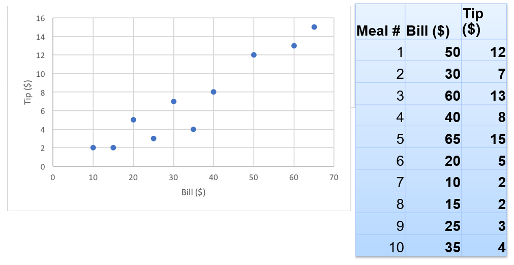
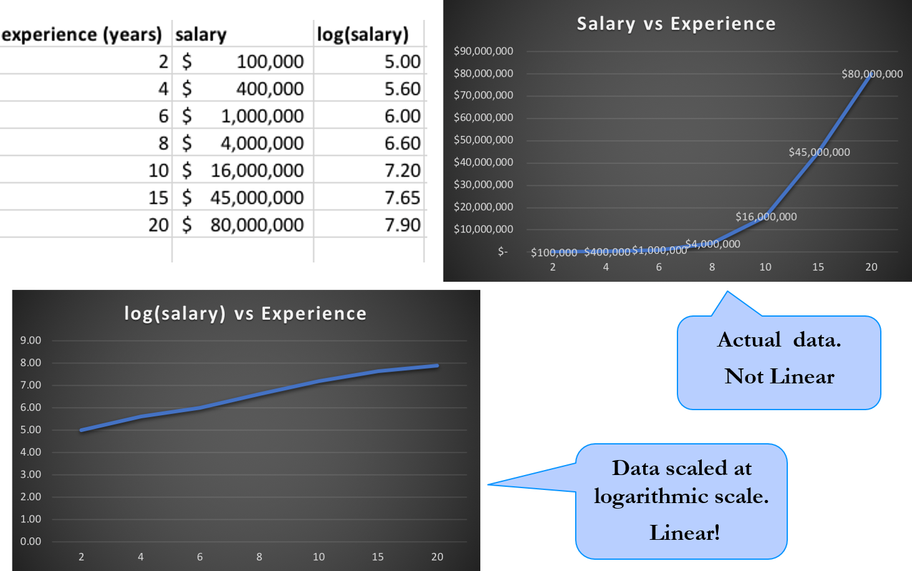

# Regression Intro

<!-- {"left" : 2.39, "top" : 2.61, "height" : 8.48, "width" : 12.71} -->

---

## Algorithm Summary

<!-- {"left" : 2.39, "top" : 2.61, "height" : 8.48, "width" : 12.71} -->

* [Reference](http://machinelearningmastery.com/supervised-and-unsupervised-machine-learning-algorithms/)

Notes:

---

## What Is Regression Analysis

* Regressions are used to estimate **numeric values**
     - House prices
     - Stock price

* In this example given 'Bedrooms', 'Bathrooms', 'Size', we are trying to predict the 'Sale Price' (basically a number)

| Bedrooms (input 1) | Bathrooms (input 2) | Size (input 3) | Sale Price (in thousands) (we are trying to predict) |
|--------------------|---------------------|----------------|------------------------------------------------------|
| 2                  | 0                   | 1499           | 229                                                  |
| 2                  | 1                   | 1799           | 319                                                  |
| 4                  | 2                   | 2399           | 599                                                  |
| 3                  | 1                   | 1999           | 499                                                  |
| 3                  | 2.4                 | 2199           | 549                                                  |

<!-- {"left" : 0.59, "top" : 6.28, "height" : 1, "width" : 16.33} -->

Notes:

---

## Regression Algorithms

| Algorithm                       | Description                                                                                                                                |
|---------------------------------|--------------------------------------------------------------------------------------------------------------------------------------------|
| Linear Regression               | Simplest and most used. Calculates  a best fit 'straight line'                                                                             |
| Polynomial Regression           | If power of independent variable is more than 1.  <br/>  `Y = a * X + b * X2`  <br/>  - Can be prone to overfitting  <br/>  - Results can be hard to explain |
| Ridge Regression                | - used when independent variables are highly correlated  <br/> - Uses L2 regularization                                                          |
| Lasso Regression                | - used when independent variables are highly correlated  <br/> - Uses L1 regularization                                                         |
| Decision Tree                   | Non linear, can adopt to complex data                                                                                                      |
| Random Forest                   | Uses multiple Decision Trees and combines their output                                                                                     |
| K Nearest Neighbours (KNN)      | Non linear                                                                                                                                 |
| Support Vector Regression (SVR) | Non linear                                                                                                                                 |
<!-- {"left" : 0.41, "top" : 1.9, "height" : 1, "width" : 16.67} -->

<br/>

* References:
    - [comprehensive-guide-regression](https://www.analyticsvidhya.com/blog/2015/08/comprehensive-guide-regression/)

Notes:

---

# Linear Regression

---

## Algorithm Summary

<!-- {"left" : 1.92, "top" : 2.3, "height" : 9.12, "width" : 13.66} -->

* [Reference](http://machinelearningmastery.com/supervised-and-unsupervised-machine-learning-algorithms/)

Notes:

---

## Task: Tip Calculation

* Now our tip data include total bill amount too!

* Do you see any correlation?

<!-- {"left" : 2.35, "top" : 4, "height" : 6.59, "width" : 12.79} -->

Notes:

---

## Tips vs Bill

* There is clearly a correlation between bill amount and tip

* We can fit a line to predict tip

* This is **linear regression!**

<!-- {"left" : 4.67, "top" : 4.54, "height" : 6.16, "width" : 8.16} -->

Notes:

---

## Graph Review

<!-- {"left" : 10.57, "top" : 1.89, "height" : 6.13, "width" : 6.41} -->

* **`Y = aX + b`**

* **`Y = 2X + 4`**

    - 2 - slope of line

    - 4 - intercept

<br>

|   |                                   |
|---|-----------------------------------|
| Y | Dependent variable (depends on X) |
| X | Independent variable              |
| a | Slope of line                     |
| b | Intercept (line meets y-axis)     |

<!-- {"left" : 0.82, "top" : 5.43, "height" : 2.56, "width" : 9.37} -->

Notes:

---

## Linear Regression Vocabulary

* **`Y = aX + b`   &nbsp;&nbsp;&nbsp;&nbsp;&nbsp;&nbsp; Y = b<sub>0</sub> + b<sub>1</sub>X**

<br/>

| Term                   | Description                                                                   | Synonyms                                         |
|------------------------|-------------------------------------------------------------------------------|--------------------------------------------------|
| **Independent Variable**   | The variable used to predict the response.                                    | -X-variable <br/>- Feature <br/>- attribute                  |
| **Response**               | The variable we are trying to predict.                                        | -Y-variable <br/>- Dependent variable <br/>- Target <br/>- Outcome |
| **Intercept**              | The intercept of the regression line - that is, the predicted value when X= 0 | - b , b<sub>0</sub> , β<sub>0</sub>                                     |
| **Regression coefficient** | The slope of the regression line.                                             | - Slope <br/>- parameter estimates <br/>- Weights <br/>- a , b1     |

<!-- {"left" : 0.45, "top" : 2.6, "height" : 1, "width" : 16.61} -->

Notes:

---

## Using Linear Regression for Tips

<!-- {"left" : 9.85, "top" : 2.45, "height" : 5.56, "width" : 7.34} -->

* Linear regression model closely resembles algebra model

```text
Y = a X + b
 
Tip = a * bill + b
```

* If we figure out 'a' and 'b', then we can estimate tip for any amount

Notes:

---

## Calculating Linear Regression Model

<!-- {"left" : 9.7, "top" : 2.16, "height" : 5.13, "width" : 7.43} -->

* Here is the linear regression model coefficients for billing data

```text
Tip = a * bill + b

a = 0.242

b = -1.40000

Tip = 0.2428571 * bill - 1.40
```

* Seems like a reasonably good fit

Notes:

---

## Predicting Tips with Linear Model

<!-- {"left" : 12.7, "top" : 1.89, "height" : 6.7, "width" : 4.47} -->

```text
Tip = a * bill + b

Tip = 0.2428571 * bill - 1.40
```

* We can use this formula to predict tips.

```text
Tip for $100 bill
    = 0.2428571 * 100 - 1.40
    = $ 22.88
```

* In table to the right, observe 2 columns
    - **Actual Tip:** This column is the actual tip we recorded
    - **Estimated Tip:** This the amount our model (formula) is predicting

* **Question for the Class:** Are the amounts identical?

Notes:

---

## Evaluating Our Model Accuracy

<!-- {"left" : 12.49, "top" : 2.14, "height" : 7.03, "width" : 4.69} -->

- As we can see our model is not predicting the tips 100% accurately

- There is an error for each prediction

- We need to calculate the errors, so we can tune our model to be as close to the real value as is.

Notes:

---

# Errors and Residuals

[ML-Concepts-Errors-and-Loss-Functions.md#Error/Loss Functions for Regressions](ML-Concepts-Errors-and-Loss-Functions.md#Error/Loss Functions for Regressions)

---

## Calculating Linear Regression Model

<!-- {"left" : 10.63, "top" : 1.89, "height" : 5.9, "width" : 6.56} -->

* Here is the linear regression model equation

    - **`Tip = a * bill + b`**

* We need to find optimal values of **a** and **b** that gives the lowest **SSE** possible

* We can randomly test values for `a` and `b`
    - but infinite combinations
    - we need something more efficient
    - **Gradient Descent** to rescue

---

# Gradient Descent

[Gradient-Descent.md](Gradient-Descent.md)

---

# Evaluating Regression Models

<!-- {"left" : 11.36, "top" : 2.14, "height" : 1.79, "width" : 5.13} -->

---

## Evaluating Regression Models

<!-- {"left" : 11.36, "top" : 2.14, "height" : 1.79, "width" : 5.13} -->

<!-- {"left" : 11.36, "top" : 5.15, "height" : 1.11, "width" : 5.13} -->

* Simple measures
    - **`Sum of the Squared Errors (SSE)`** or derivatives like **`Mean Sum of Errors (MSE)`**
    - **`Root Mean Square Error (RMSE)`**
    - **`correlation coefficient  ( r )`**
    - **`coefficient of determination  (r2)`**

* More advanced
    - t-statistic
    - p-value

Notes:

---

## Using SSE / MSE

<!-- {"left" : 12.1, "top" : 3.7, "height" : 1.83, "width" : 4.84} -->

* Here is an example

```python
import numpy as np
from sklearn.metrics import mean_squared_error

# these are the actual expected y values
y_actual =      np.array([5.4,  6.2,  18.0,  7.5, 3.8, 9.7, 10.2])

# these y values are predicted by model-1  (we are simulating it)
y_predicted_1 = np.array([5.2,  6.0,  19.0,  8.0, 3.5, 9.1, 10.5])

# these are predicted by model-2  (we are simulating it)
y_predicted_2 = np.array([5.0,  6.5,  19.3,  7.1, 3.9, 9.0, 10.7])

## now we calculate MSE for both model-1 and model-2
mse1 = mean_squared_error (y_actual, y_predicted_1)
mse2 = mean_squared_error (y_actual, y_predicted_2)

print ("mse1 : ", mse1)   # 0.26
print ("mse2 : ", mse2)   # 0.40
```

* We can conclude model-1 seems to be better as it's error (`MSE1 = 0.26`) is lower than model-2's error (`MSE2 = 0.40`)

* Of course `MSE = 0` would indicate a perfect model!

---

## Using RMSE

<!-- {"left" : 11.36, "top" : 5.15, "height" : 1.11, "width" : 5.13} -->

* **`RMSE (Root Mean Square Error)`** is calculated by taking the sqrt of MSE
* RMSE tells us the average distance between the predicted values from the model and the actual values in the dataset.
* So lower the RMSE the better; RMSE=0 would indicate a perfect model

```python
import numpy as np
from sklearn.metrics import mean_squared_error
from math import sqrt

# these are the actual expected y values
y_actual =      np.array([5.4,  6.2,  18.0,  7.5, 3.8, 9.7, 10.2])

# these y values are predicted by model-1  (we are simulating it)
y_predicted_1 = np.array([5.2,  6.0,  19.0,  8.0, 3.5, 9.1, 10.5])

## now we calculate MSE
mse1 = mean_squared_error (y_actual, y_predicted_1)
rmse1 = sqrt (mse1)

print ("mse1 : ", mse1)   #  0.267
print ("RMSE1 : ",rmse1)   # 0.51
```

* If model-1 gives RMSE = 3.2  and model-2 gives RMSE = 2.1, we would say model-2 is better, as it yields lower RMSE

---

## Using Correlation Coefficient ( r )

* **`Pearson correlation (r)`**  measures the strength and direction of the linear relationship between two variables

* r value is between -1 and +1

* A correlation |r| >= 0.8 is considered  **`strong`**

* A correlation |r| < 0.5  is considered  **`weak`**

<!-- {"left" : 3.15, "top" : 5.63, "height" : 4.99, "width" : 11.19} -->

Notes:

---

## Using Correlation Coefficient ( r )

* Here is code snippet showing how to calculate r

```python
import numpy as np

x = np.array([50.00, 30.00, 60.00, 40.00, 65.00, 20.00, 10.00, 15.00, 25.00, 35.00])
y = np.array([12.00, 7.00, 13.00, 8.00, 15.00, 5.00, 2.00, 2.00, 3.00, 4.00])

corr = np.corrcoef(x,y)
print (corr)
## Prints : 
##        [[1.         0.95221535]
##        [0.95221535 1.        ]]
```

* Here correlation between variables x and y is 0.95221535,  that is a very strong correlation!

<!-- {"left" : 1.56, "top" : 4.16, "height" : 3.96, "width" : 14.38} -->

---

## Using Coefficient of Determination (r2)

<!-- {"left" : 1.56, "top" : 4.16, "height" : 3.96, "width" : 14.38} -->

* **'Coefficient of Determination** ' tells us how well our model 'fits' the data

* r2 ranges between 0 and 1.0
    - 0 : The model does not predict the outcome.
    - between 0 and 1 : The model partially predicts the outcome
    - 1 : The model perfectly predicts the outcome.

* So we want r2 to be as close 1.0 as possible

* References:
    - [Coefficient of Determination 1](https://www.scribbr.com/statistics/coefficient-of-determination/)
    - [Coefficient of Determination 2](https://en.wikipedia.org/wiki/Coefficient_of_determination)

---

## Using Coefficient of Determination (r2)

* Here is a usage example of r2

```python
from sklearn.metrics import r2_score

# these are the actual expected y values
y_actual =      np.array([5.4,  6.2,  18.0,  7.5, 3.8, 9.7, 10.2])

# these y values are predicted by model-1  (we are simulating it)
y_predicted_1 = np.array([5.2,  6.0,  19.0,  8.0, 3.5, 9.1, 10.5])

r2 = r2_score (y_actual, y_predicted_1)
print ('r2 : ', r2)  # 0.9858
```

* Here our r2 is pretty close to 1.0, so that means the model is a great fit!

---

## Linear Regression Using Logarithmic Scale

* Some times, even if the raw data is not linear, by convering it to **log-scale** we may identify linear relationship

<!-- {"left" : 2.17, "top" : 2.73, "height" : 8.24, "width" : 13.16} -->

Notes:

---

## Preparing Data For Linear Regressions

* **Linear Assumption:** Linear Regression assumes linear relationship between input and output.May be need to transform data (e.g. log transform) to make the relationship linear

* **Remove Outlier:** : LR would fit better with outliers removed

* **Remove Collinearity:** Linear regression will over-fit your data when you have highly correlated input variables

* **Gaussian Distributions:**  Linear regression will make more reliable predictions if your input and output variables have a Gaussian distribution. Transform data (e.g. logarithmic) make their distribution more Gaussian looking for better results

Notes:

---

## Doing Linear Regression

* Next section will show an example on how to do linear regression
