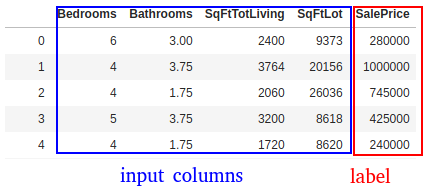

# Multiple Linear Regression

---

## Task: Predict House Prices

| Sale Price $ | Bedrooms | Bathrooms | Sqft_Living | Sqft_Lot |
|--------------|----------|-----------|-------------|----------|
| 280,000      | 6        | 3         | 2,400       | 9,373    |
| 1,000,000    | 4        | 3.75      | 3,764       | 20,156   |
| 745,000      | 4        | 1.75      | 2.06        | 26,036   |
| 425,000      | 5        | 3.75      | 3,200       | 8,618    |
| 240,000      | 4        | 1.75      | 1,720       | 8,620    |
| 327,000      | 3        | 1.5       | 1,750       | 34,465   |
| 347,000      | 4        | 1.75      | 1,860       | 14,650   |

<!-- {"left" : 0.25, "top" : 1.1, "height" : 4, "width" : 9.75} -->

 * Multiple factors decide house prices

 * It is not a simple  Y ~ X any more

 * We will use  **multiple linear regression**

Notes:


---

## Multiple Linear Regression

<!-- {"left" : 2.01, "top" : 1.37, "height" : 0.43, "width" : 6.24} -->

 * Outcome depends on multiple variables
 * __β<sub>1</sub>__ , __β<sub>2</sub>__ are coefficients
 *  __`e`__  is error / noise

Notes:


---

## Multiple Linear Regression Example (Python)

```python
import pandas as pd
from sklearn.linear_model import LinearRegression

house_prices = pd.read_csv("/data/house-prices/house-sales-full.csv")

input_columns= ['Bedrooms', 'Bathrooms', 'SqFtTotLiving', 'SqFtLot']
label_column = ['SalePrice']
x = house_prices2[input_columns]
y = house_prices2[label_column]

# train
model = LinearRegression ().fit(x,y)

# predict
predictions = model.predict(x)
```
<!-- {"left" : 0, "top" : 1.27, "height" : 3.88, "width" : 10.25} -->

<!-- {"left" : 0.19, "top" : 5.92, "height" : 2.01, "width" : 4.6} -->
<!-- {"left" : 4.89, "top" : 5.93, "height" : 2.12, "width" : 5.17} -->

---

## Evaluate the Model

```python
## print each feature and it's coefficients
coef = pd.DataFrame({"input_column" : input_columns,  
                     "coefficient": model.coef_[0]})
print(coef)

```
<!-- {"left" : 0, "top" : 1.27, "height" : 1.44, "width" : 9.78} -->


```text
# output

input_column  coefficient
0       Bedrooms   -65,211.74
1      Bathrooms    16,274.19
2  SqFtTotLiving       277.85
3        SqFtLot        -0.07

R2 :  0.483482252362197
MSE :  60702204448.745056
RMSE :  246378.1736452015

```
<!-- {"left" : 0, "top" : 3.64, "height" : 3.49, "width" : 5.61} -->

---

## Interpreting the Model

```text
# model coefficients

input_column  coefficient
0       Bedrooms   -65,211.74
1      Bathrooms    16,274.19
2  SqFtTotLiving       277.85
3        SqFtLot        -0.07
```
<!-- {"left" : 0, "top" : 1.11, "height" : 2.32, "width" : 5.61} -->

<br/>

- Above table lists coefficients for each input variable
- Coefficient for 'SqFtTotLiving' is '277.85'  
  That means
    - While __keeping everything the same (unchanged)__
    - If we increase 'SqFtTotLiving' by 1, the 'SalePrice' would go up by __277.85__

- __Question for class : Can you intrepret coefficient for 'Bedrooms'?__  
 Does it make sense? :-)

---


## Evaluating The Model

 * Root Mean Squared Error (RMSE)
    - Average error the model makes per prediction
 * Coefficient of Determination (R<sup>2</sup>)
    * R<sup>2</sup> ranges from 0 to 1.0
    * Measures how well the model fits the data
    * 1.0 is a perfet fit


<!-- {"left" : 0.74, "top" : 5.11, "height" : 0.79, "width" : 3.62} --><!-- {"left" : 5.49, "top" : 4.87, "height" : 1.26, "width" : 4.01} -->

Notes:


---

## Evaluating the Model


```python
from sklearn.metrics import r2_score

print ("R2 : " , r2_score(y, predictions))
# R2 :  0.483482252362197
```
<!-- {"left" : 0, "top" : 1.19, "height" : 1.72, "width" : 9.28} -->

<br/>
<br/>

 * R<sup>2</sup> is 0.4835  - not a great fit

 * See next slide for discussion


Notes:

---


## Class Discussion: Why is the Accuracy Low?


 *  **R<sup>2</sup> is 0.4835** - not a great fit

 *  **Question for class:**

    Why is R<sup>2</sup>  not close to 1?  (as in why is it not a great fit?)

     - Can you guys come up with some reasons

     - Hint: Look at Sale date in the dataset?  Think about what happened in that time frame

 * Answers are in next slide

Notes:


---

## Class Discussion: Why is the Accuracy Low?


 * May be we are not using enough features / inputs.

     - The original dataset has features like 'Year Built' ,  'Traffic Noise' ..etc.

 * Not enough data?

 * Outliers? (remember the house with 33 bedrooms?)

 * Data is skewed?

     - The sales happen the in the span of year 2006 and 2014.

     - We went through a crash in 2008

     - So the we probably have inconsistent data

 * Wrong algorithm?

Notes:


---

## Adding More Variables

- For our regression model we only had 4 input features :  
_Bedrooms, Bathrooms, SqFtTotLiving, SqFtLot_

- Our __R<sup>2</sup> = 0.48__ (not a great accuracy)

```python
import pandas as pd
from sklearn.metrics import r2_score

house_prices = pd.read_csv("/data/house-prices/house-sales-full.csv")

input_columns= ['Bedrooms', 'Bathrooms', 'SqFtTotLiving', 'SqFtLot']
label_column = ['SalePrice']

x = house_prices2[input_columns]
y = house_prices2[label_column]

# train
model = LinearRegression ().fit(x,y)

# predict
predictions = model.predict(x)

print ("R2 : " , r2_score(y, predictions))
# R2 = 0.48
```
<!-- {"left" : 0, "top" : 2.71, "height" : 4.86, "width" : 10.25} -->

---

## Let's Add More Variable

- Let's add a column called __LandVal__

- This gives us __R<sup>2</sup> = 76%__  (yay!)

```python
import pandas as pd
from sklearn.metrics import r2_score

house_prices = pd.read_csv("/data/house-prices/house-sales-full.csv")

input_columns= ['Bedrooms', 'Bathrooms', 'SqFtTotLiving', 'SqFtLot', 'LandVal']
label_column = ['SalePrice']

x = house_prices2[input_columns]
y = house_prices2[label_column]

# train
model = LinearRegression ().fit(x,y)

# predict
predictions = model.predict(x)

print ("R2 : " , r2_score(y, predictions))
# R2 = 0.76
```
<!-- {"left" : 0, "top" : 2.36, "height" : 4.26, "width" : 10.25} -->

---


## Deciding Important Variables

<!-- {"left" : 1.92, "top" : 1.3, "height" : 0.44, "width" : 6.42} -->


 * In Multiple Linear Regressions many predictors determine the value of response

 * How can we know which ones are important?

 * Imagine an equation   
    `Y = b0 +  b1 . X1  + b2 . X2`

 * We have two predictors `X1` & `X2` (p = 2)

 * Possible combinations 2<sup>p</sup> = 2<sup>2</sup> = 4
     - No variables
     - X<sub>1</sub> only
     - X<sub>2</sub> only
     - Both X<sub>1</sub> and X<sub>2</sub>


Notes:


---

## Deciding Important Variables


 * Possible combinations 2p can get large for sizeable p values.

    - P = 10 -> 2<sup>10</sup> -> 1024 combinations
    - P = 20 -> 2<sup>20</sup> -> 1,048,576 (1 million+) combinations


 * Some algorithms to decide important variables quickly

     - Mallow's Cp
     - Akaike Information Criterion (AIC)
     - Bayesian Information Criterion  (BIC)

 * Also Lasso Regularization can be used for variable selection as well (more on this later)

Notes:

"An introduction to Statistical Learning" – Chapter 3


---

## Akaike's Information Criteria (AIC)


 * Adding more variables will reduce RMSE and increase R<sup>2</sup> (towards 1)

 * How ever that doesn't mean we have a better model

 * So we need other measures to evaluate the model

 *  **Akaike's**  **Information Criteria (AIC)**  can be helpful
     - Developed by Hirotugu Akaike, a prominent Japanese statistician

 * If I add 'k' more variables the AIC is penalized by atleast 2k

 * Goal is to find minimal 'AIC'

```text
AIC = 2p  + n log (RSS / n)

p - number of variables
n - number of records

```
<!-- {"left" : 0, "top" : 5.25, "height" : 1.44, "width" : 5.28} -->


Notes:


---

## Deciding Important Variables


 * There are 3 classical approaches

 *  **Forward Selection**
     - Begin with null model (has only intercept, and no variables)
     - Run p simple linear regressions and add to null model that results in lowest RSS

 *  **Backward Selection**
     - Start with all variables
     - Remove variables with largest p-value (least statistically significant)
     - Keep going until desired p-value threshold is reached

 *   **Mixed Selection**
     - Combination of forward / backward selection

Notes:


---

##  AIC Sample Code (Python)

- Here our __R<sup>2</sup> = 0.84__

```python
import pandas as pd
import numpy as np
from sklearn.linear_model import  LassoLarsIC

house_prices = pd.read_csv("/data/house-prices/house-sales-full.csv")

## using all numeric columns
input_columns= ['zhvi_px', 'zhvi_px', 'NbrLivingUnits', 'SqFtLot', 'SqFtTotLiving', 'SqFtFinBasement',
                'Bathrooms', 'Bedrooms' , 'BldgGrade', 'YrBuilt', 'YrRenovated', 'TrafficNoise',
                'LandVal', 'ImpsVal', 'NewConstruction']

label_column = ['SalePrice']

x = house_prices[input_columns]
y = house_prices[label_column]

reg = LassoLarsIC(criterion='aic', max_iter=500)

model = reg.fit(x, np.ravel(y))

# train
model = reg.fit(x,y)

# predict
predictions = model.predict(x)

print ("R2 : " , r2_score(y, predictions))
# R2 = 0.84
```
<!-- {"left" : 0, "top" : 1.9, "height" : 4.83, "width" : 10.25} -->

---

## AIC - Coefficients

- Here are our  coefficients for inputs
- Inputs with zero value are ignored by AIC


```python
pd.options.display.float_format = '{:,.2f}'.format
coef = pd.DataFrame({"input_column" : input_columns,  
                     "coefficient": model.coef_})
coef

```
<!-- {"left" : 0, "top" : 2.1, "height" : 1.29, "width" : 8.72} -->


```text
input_column  coefficient
0           zhvi_px         0.00
1           zhvi_px         1.16
2    NbrLivingUnits     3,331.60
3           SqFtLot         0.35
4     SqFtTotLiving        34.51
5   SqFtFinBasement         0.00
6         Bathrooms     2,976.83
7          Bedrooms    -5,688.45
8         BldgGrade    17,247.28
9           YrBuilt      -152.65
10      YrRenovated        -5.94
11     TrafficNoise         0.00
12          LandVal         0.94
13          ImpsVal         0.60
14  NewConstruction    27,870.93

```
<!-- {"left" : 0, "top" : 3.59, "height" : 4.94, "width" : 6.11} -->

---

## Linear Regression: Strengths, Weaknesses, and Parameters

 *  **Strengths**
     - Relatively simple to understand
     - Computationally simple, very fast learners
     - Very scalable to large data sets

 *  **Weaknesses**
     - Will perform poorly if the inputs are not aligned along linear boundary
     - Can under-fit data

 *  **Parameters**
     - Use regularization to minimize overfitting
     - Lasso regularization can also do variable selection

Notes:


---

## Lab: Multiple Linear Regression

<!-- {"left" : 7.22, "top" : 1.13, "height" : 3.68, "width" : 2.76} -->

 *  **Overview:**
    - Practice Multiple Linear Regressions

 *  **Approximate Time:**
    - 30 mins

 *  **Instructions:**
    - Follow  appropriate Python / R / Spark instructions
    - See next few slides for sample code
    - LIR-2: House prices
    - BONUS Lab : LIR-3: AIC


Notes:
