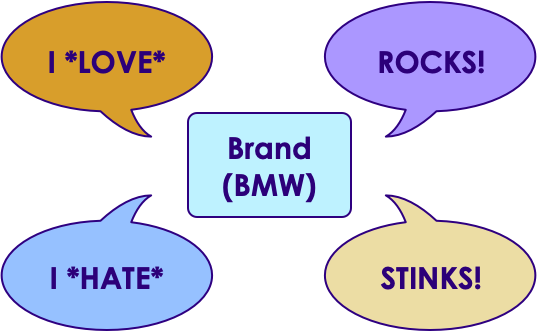
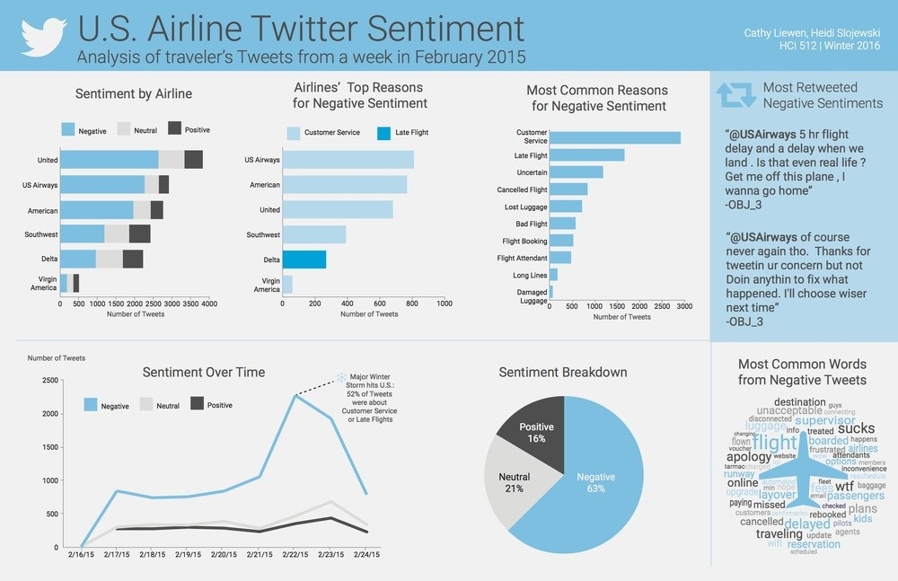
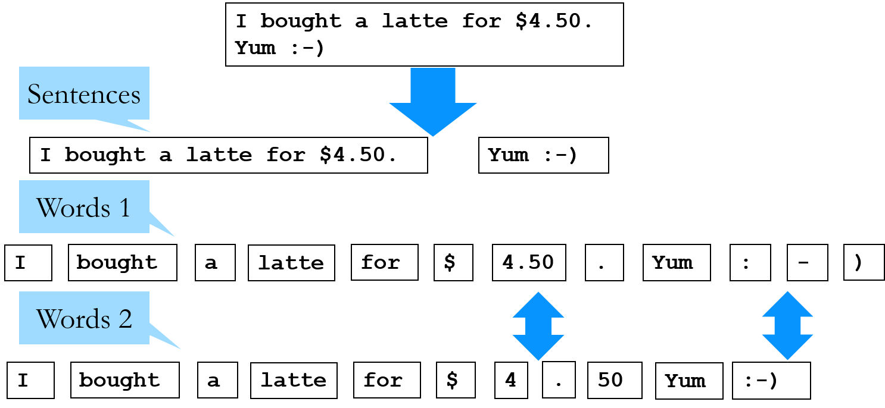
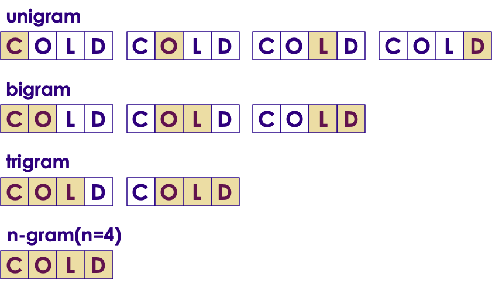

# Text Analytics

---

## Lesson Objectives

- Understand text analytics tools, algorithms and use cases


Notes:


---

# Text Analytics Overview

---

## Text Analytics Has Become Very Prominent

<!-- {"left" : 10.15, "top" : 2.21, "height" : 5.64, "width" : 7.05} -->

 * Rise of social media (Twitter / Facebook) allows lots of text exchanges

 * Customer 'chat' interaction

 * Customer emails

 * Unstructured data exists in many forms

 * Mostly underutilized

 * Can use data to great effect given right tools


Notes:


---

## Use Case: Customer Service Via Social Media


<!-- {"left" : 1.4, "top" : 2.74, "height" : 8.09, "width" : 14.7} -->


Notes:


---

## Use Case: Sentiment Analysis

- What are customers saying about a brand / product


<!-- {"left" : 3.68, "top" : 4.15, "height" : 6.26, "width" : 10.14} -->


Notes:

---

## Use Case - Sentiment Analytics

<!-- {"left" : 2.97, "top" : 2.46, "height" : 7.47, "width" : 11.55} -->


---

## Use Case: Support Tickets

- Automatic ticket routing
    - Parse the ticket / understand the context and send it to the right queue

- Assign priority (High, Medium, Low) based on ticket text

```
Ticket-123

When I try to save the document as PDF, it crashes
```

<!-- {"left" : 0.85, "top" : 3.97, "height" : 1.5, "width" : 12.8} -->

Notes:


---

# Text Analytics Tools and Algorithms

---

## Text Analytics Tools and Algorithms


 * Text visualizers: Word Cloud

 * 'Bag of Words'

 * Top-N words

 * Ngrams

 * Vectorizing
    - TF-IDF
    - Word2Vec

Notes:


---

## Visualizing Text - Word Clouds (State of the Union Speech 2014)

<!-- {"left" : 10.02, "top" : 2.34, "height" : 4.42, "width" : 7.2} -->

- Word Clouds are really neat way to get a 'sense' of the text

- Most frequent words are the biggest
    - 'America',  'Cheers'


Notes:

---

# Bag of Words

---

## 'Bag of Words'


 * Split the document(s) into words

<!-- {"left" : 2.77, "top" : 3.79, "height" : 6.79, "width" : 11.97} -->


Notes:


---

## Bag Words Example 1: 'Moby Dick' by Herman Melville

<!-- {"left" : 2.31, "top" : 2.61, "height" : 8.49, "width" : 12.89} -->


Notes:


---

## Bag Words Example2: 'Alice in Wonderland' by Lewis Carrol

<!-- {"left" : 2.38, "top" : 2.71, "height" : 8.3, "width" : 12.73} -->


Notes:


---

## Bag of Words Process


 *  **Cleanup**
     -  **Step 1: Lowercase text:**
        (The Sun was bright -> the sun was bright)

     -  **Step 2: Remove punctuations**
        (!  ,   .  #)

     -  **Step 3: Remove numbers (optional)**
        (1, 2, 3)

     -  **Step 4: Remove STOP words (and any other unnecessary words)**  
        ( the, is, in, and)*

 *  **Tokenize**

     - Break text into words  (bag of words)

 *  **Analyze**

Notes:


---


## Bag of Words Example: "Tale of Two Cities" by Charles Dickens


 * We are going to walk through processing some text(slightly modified version)

```text
It was the best of times. It was the worst of times! It was the age of wisdom!!
$123

```
<!-- {"left" : 0.85, "top" : 3.54, "height" : 0.81, "width" : 14.03} -->


Notes:


---


## Text Cleanup: Lowercase, Remove Punctuations


```text
It was the best of times. It was the worst of times! It was the age of wisdom!!
$123

```
<!-- {"left" : 0.85, "top" : 2.52, "height" : 0.85, "width" : 14.79} -->


<!-- {"left" : 6.8, "top" : 4.11, "height" : 1.4, "width" : 2.76} -->


```text
it was the best of times. it was the worst of times! it was the age of wisdom!!
$123

```
<!-- {"left" : 0.85, "top" : 6.4, "height" : 0.85, "width" : 14.79} -->

<!-- {"left" : 4.33, "top" : 8.08, "height" : 1.69, "width" : 8.84} -->


```text
it was the best of times it was the worst of times it was the age of wisdom

```
<!-- {"left" : 0.85, "top" : 10.3, "height" : 0.61, "width" : 14.79} -->


Notes:


---

## Dealing With Stop Words

<!-- {"left" : 9.83, "top" : 2.49, "height" : 4.85, "width" : 7.44} -->

 * Sample stop words
     - English (total 153):  *'a', 'about', 'above', 'after', 'again', 'against',..*
     - Spanish (total 313): *'a', 'al', '*  *algo*  *', '*  *algunas*  *', '*  *algunos*  *',*  *...*
     - German (total 231):  *'*  *wie*  *', 'also', '*  *alle*  *', '*  *anderer*  *', 'des',*

 * However they don't contribute much to analytics
     - Here we see an example of 'Alice in Wonderland' analysis.  And there are lot of stop words

 * Most text mining packages has a built in stop words dictionaries for various languages

Notes:


---

## Text Cleanup: Remove stop words


```text
it was the best of times it was the worst of times it was the age of wisdom

```
<!-- {"left" : 0.85, "top" : 2.15, "height" : 0.57, "width" : 13.85} -->

<!-- {"left" : 5.18, "top" : 3.61, "height" : 1.61, "width" : 5.39} -->


```text
English stopwords
 a, able, about, across, after, all, almost, also, am, among, an, and, any, are,
 as, at, be, because, been, but, by, can, cannot, could, dear, did, do, does,
 either, else, ever, every, for, from, get, got, had, has, have, he, her, hers,
 him, his, how, however, i, if, in, into, is, it, its, just, least, let, like,
 likely, may, me, might, most, must, my, neither, no, nor, not, of, off, often,
 on, only, or, other, our, own, rather, said, say, says, she, should, since,
 so, some, than, that, the, their, them, then, there, these, they, this, tis,
 to, too, twas, us, wants, was, we, were, what, when, where, which, while,
 who, whom, why, will, with, would, yet, you, your

```
<!-- {"left" : 0.85, "top" : 5.48, "height" : 2.86, "width" : 13.85} -->

<!-- {"left" : 6.96, "top" : 8.77, "height" : 1.61, "width" : 1.84} -->


```text
best times worst times age wisdom

```
<!-- {"left" : 0.85, "top" : 10.62, "height" : 0.73, "width" : 8.48} -->


Notes:

---

## Tokenizing Text


 * Tokenizing is breaking the text into tokens (words / sentences)

 * Most text algorithms work on 'tokens'

 * Can you spot the differences in word-tokenization below?

<!-- {"left" : 3.5, "top" : 5.8, "height" : 4.84, "width" : 10.49} -->


Notes:


---

## Text Analytic: Word Count


 * Finally we have cleaned up text to do a simple analytics - word count


```text
Original text
-------------

It was the best of times. It was the worst of times! It was the age of wisdom!!
$123

```
<!-- {"left" : 0.85, "top" : 2.89, "height" : 1.45, "width" : 12.67} -->


```text
Cleaned text
-------------

best times worst times age wisdom

```
<!-- {"left" : 0.85, "top" : 4.56, "height" : 1.64, "width" : 7.76} -->


```text

Word count
----------

Total number of words = 6

+-------+-----+
|   word|count|
+-------+-----+
|  best |    1|
|  times|    2|
|  worst|    1|
|    age|    1|
| wisdom|    1|
+-------+-----+

```
<!-- {"left" : 0.85, "top" : 6.4, "height" : 4.91, "width" : 6.11} -->


Notes:


---

## Bag of Words Review


 *  **Pros**

    * Easy to implement, well understood

 *  **Cons**

    * Context is lost.Both sentences below map to same 'bag of words'.But the meaning is very different.

<!-- {"left" : 1.17, "top" : 6.18, "height" : 2.27, "width" : 15.16} -->


Notes:

---

# N-gram Analysis

---

## N-gram Analysis

<!-- {"left" : 9.03, "top" : 2.27, "height" : 4.64, "width" : 8.08} -->

 * N-gram: sequence of  'n' number of words
     - Words have to be sequential
     - Order matters

 * N = 1: unigram (single word)

 * N = 2: bigram
     - "American people"
     - "black cats"

 * N-gram applications:
     - Predict the next word
       "Please call me `back`"

Notes:


---

## N-gram(2) Analysis Results for 'Moby Dick'


 * Moby-dick novel from project Gutenberg
     - 22,108 lines
     - 215,136 words
     - 1,257,274 characters

 * Below the 'bigram' analysis
    - Lot's of filler words

```text
('of', 'the'): 1873,
('in', 'the'): 1129,
('to', 'the'): 725,
('from', 'the'): 432,
('and', 'the'): 358,
('of', 'his'): 357,
('of', 'a'): 331,
('on', 'the'): 327,
('with', 'the'): 324,
('at', 'the'): 318

```
<!-- {"left" : 0.85, "top" : 5.45, "height" : 4.71, "width" : 6.9} -->


Notes:


---

## N-gram(2) Analysis After Removing Stop Words


 * Here we show the results of top bigrams analysis on both
 * Moby-dick.txt

     - Before cleanup: 215,136  words
     - After 'stop word' cleanup: 115,093  words

 <!-- {"left" : 3.01, "top" : 5.35, "height" : 5.31, "width" : 11.48} -->


Notes:


---

## Lab: Work With Raw Text


 *  **Overview*‫:‬*
     - Tokenize / Clean / Stem raw text.

 *  **Builds on previous labs‫:‬**
     - None

 *  **Approximate time‫:‬**
     - 15 mins

 *  **Instructions‫:‬**
     - R / Python  / Spark


Notes:


---

## Lab: Text Analytics: ngrams


 *  **Overview‫:‬**
     - N-gram analytics

 *  **Builds on previous labs‫:‬**
     - None

 *  **Approximate time‫:‬**
     -  15 mins

 *  **Instructions‫:‬**
     - R / Python  / Spark


Notes:
