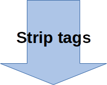

# Text Cleanup And Preperation

---

## Lesson Objectives

* Learn to clean up and prepare text for machine learning

Notes:

---

## Text Cleanup

* Raw text is usually NOT in a clean format to be analyzed

* Here is an example snippet:
  - This text has HTML markup tags
  - And it has symbols (!, $) and numbers (123)

* Usually, we need to cleanup the text before we can do some meaningful analysis

```html
It was the <b>best of times</b>. It was the <b>worst of times</b>! It was the age of wisdom!!
<br>
$123
```
---

## Word Count: 'Moby Dick'

* Here is simple experiment.  We are counting the words in text

* Notice the difference between raw text and cleaned text

<!-- {"left" : 1.02, "top" : 2.12, "height" : 5.41, "width" : 8.21} -->

Notes:

---

## Word Count: 'Alice in Wonderland'

* Again, notice the difference between raw text and cleaned text

<!-- {"left" : 1.02, "top" : 2.15, "height" : 5.35, "width" : 8.21} -->

Notes:

---

## Text Cleanup Process

* **Step 1: Strip any markup tags:**  
(convert HTML --> plain text)

* **Step 2: Lowercase text:**  
(The Sun was bright -> the sun was bright)

* **Step 3: Tokenize**

* **Step 4: Remove punctuations and numbers**  
(!  ,   .  #) (1, 2, 3)

* **Step 5: Remove STOP words (and any other unnecessary words)**  

* **Step 6: Stemming**:  
Merge similar words into one (e.g.   running -> run)

Notes:

---

## Example Walkthrough

* We are going to walk through processing some text(slightly modified version)

```html
It was the <b>best of times</b>. It was the <b>worst of times</b>! It was the age of wisdom!!
<br />
$123
```
<!-- {"left" : 0, "top" : 2.1, "height" : 0.59, "width" : 10.25} -->

Notes:

---

## Step 1 - Strip Markup Tags

* We can use [BeautifulSoup](https://www.crummy.com/software/BeautifulSoup/) library to achieve this in Python

```python
from bs4 import BeautifulSoup

str = """It was the <b>best of times</b>. It was the <b>worst of times</b>! It was the age of wisdom!!
<br>
$123"""

cleantext = BeautifulSoup(str).text
print(cleantext)
```

* And here is the result

```html
It was the <b>best of times</b>. It was the <b>worst of times</b>! It was the age of wisdom!!
<br />
$123
```

<!-- {"left" : 3.84, "top" : 2.69, "height" : 0.97, "width" : 1.91} -->

```text
It was the best of times. It was the worst of times! It was the age of wisdom!!
$123

```
<!-- {"left" : 0, "top" : 1.49, "height" : 0.59, "width" : 10.25} -->

---

## Step 2 - Lowercase

* Use standard python string functions

* This would make word **`Apple`** and **`apple`** the word

* If we need to analyze these words seperately, we can skip this step

```python
str = """It was the best of times. It was the worst of times! It was the age of wisdom!!
$123"""

str_lower = str.lower()
```

* Result

```text
It was the best of times. It was the worst of times! It was the age of wisdom!!
$123
```
<!-- {"left" : 0, "top" : 1.49, "height" : 0.59, "width" : 10.25} -->


<!-- {"left" : 3.84, "top" : 2.69, "height" : 0.97, "width" : 1.91} -->


```text
it was the best of times. it was the worst of times! it was the age of wisdom!!
$123

```
<!-- {"left" : 0, "top" : 4.18, "height" : 0.59, "width" : 10.25} -->

---

## Step 3 - Tokenizing Text

* Tokenizing is breaking the text into tokens (words / sentences)

* Most text algorithms work on 'tokens'

* Can you spot the differences in word-tokenization below?

<!-- {"left" : 1.02, "top" : 3.64, "height" : 3.79, "width" : 8.21} -->

Notes:

---

## Step 3 - Tokenizing Text

```python
import nltk
from nltk.corpus import stopwords

str = """It was the best of times. It was the worst of times! It was the age of wisdom!!
$123"""

## lowercase
str_lower = str.lower()

## Tokenize
words = nltk.word_tokenize(str_lower)
print (words)
```

```text
['it', 'was', 'the', 'best', 'of', 'times', '.', 'it', 'was', 'the', 'worst', 'of', 
'times', '!', 'it', 'was', 'the', 'age', 'of', 'wisdom', '!', '!', '$', '123']
```

---

## Step 4  - Remove Numbers & Punct

```python
import nltk

str = """It was the best of times. It was the worst of times! It was the age of wisdom!!
$123"""
str_lower = str.lower()
words = nltk.word_tokenize(str_lower)

print ('before:\n', words)

## Only select regular words
words=[word for word in words if word.isalpha()]
print ('after:\n', words)
```

```text
It was the best of times. It was the worst of times! It was the age of wisdom!!
$123
```

<!-- {"left" : 2.06, "top" : 5.44, "height" : 1.17, "width" : 6.13} -->

```text
before:
 ['it', 'was', 'the', 'best', 'of', 'times', '.', 'it', 'was', 'the', 'worst', 
 'of', 'times', '!', 'it', 'was', 'the', 'age', 'of', 'wisdom', '!', '!', '$', '123']


after:
 ['it', 'was', 'the', 'best', 'of', 'times', 'it', 'was', 'the', 'worst', 'of', 
 'times', 'it', 'was', 'the', 'age', 'of', 'wisdom']
```
<!-- {"left" : 0, "top" : 6.88, "height" : 0.42, "width" : 10.25} -->


Notes:


---

## Stop Words

<!-- {"left" : 5.93, "top" : 1.62, "height" : 2.81, "width" : 4.31} -->

* Remember our word count example of 'Alice in Wonderland'?

* In raw text (left) the largest number of words are `the, and, to ..`

* These are called **stop words**

* They don't really contribute much to the analysis

* Usually we remove these words from the corpus, before we analyze the text

Notes:

---

## Stop Words

* Most text mining packages has a built in stop words dictionaries for various languages

```python
import nltk
from nltk.corpus import stopwords

stopwords_en = stopwords.words('english')
print (stopwords_en)
```

* English stopwords (~170)

```text
 a, able, about, across, after, all, almost, also, am, among, an, and, any, are,
 as, at, be, because, been, but, by, can, cannot, could, dear, did, do, does,
 either, else, ever, every, for, from, get, got, had, has, have, he, her, hers,
 him, his, how, however, i, if, in, into, is, it, its, just, least, let, like,
 likely, may, me, might, most, must, my, neither, no, nor, not, of, off, often,
 on, only, or, other, our, own, rather, said, say, says, she, should, since,
 so, some, than, that, the, their, them, then, there, these, they, this, tis,
 to, too, twas, us, wants, was, we, were, what, when, where, which, while,
 who, whom, why, will, with, would, yet, you, your
```

---

## Step 5 - Remove Stop Words

* Here is sample code

```python
import nltk
from nltk.corpus import stopwords

str = """It was the best of times. It was the worst of times! It was the age of wisdom!!
$123"""

## Tokenize
str_lower = str.lower()
words = nltk.word_tokenize(str_lower)
words=[word for word in words if word.isalpha()]

# grab stopwords
stopwords_en = stopwords.words('english')

print ('before:\n', words)
## filter out stopwords
words = [w for w in words if not w in stopwords_en]
print ('after:\n', words)
```

* Result

```text
before:
  ['it', 'was', 'the', 'best', 'of', 'times', 'it', 'was', 'the', 'worst', 
   'of', 'times', 'it', 'was', 'the', 'age', 'of', 'wisdom']

after:
  ['best', 'times', 'worst', 'times', 'age', 'wisdom']

```

Notes:

---

## Step 6 - Stemming

* [Stemming](https://en.wikipedia.org/wiki/Stemming) refers to the process of reducing each word to its root or base

* Examples:
  - 'running', 'run', 'ran' --> 'run'

* Why stem?
  - Reduces vobulary size
  - Allows us to focus on the 'sense' of the word

* There are various stemming algorithms:
  - [Porter stemmer](https://tartarus.org/martin/PorterStemmer/)
  - [Lancaster stemmer](https://www.nltk.org/_modules/nltk/stem/lancaster.html)
  - [Snowball stemmer](https://www.nltk.org/_modules/nltk/stem/snowball.html)
  - [NLTK reference](https://www.nltk.org/howto/stem.html)

---

## Step 6 - Stemming

* Let's compare different stemming algorithms

```python
import nltk
from nltk.stem.snowball import SnowballStemmer
from nltk.stem.porter import PorterStemmer
from nltk.stem.lancaster import LancasterStemmer
import pandas as pd

words = ['run', 'running', 'like', 'liked', 'snow', 'snowing', 'dog', 'dogs', 'maximum', 
         'multiply', 'crying', 'leaves', 'fairly']

stemmer_snowball = SnowballStemmer("english")
stemmer_porter = PorterStemmer()
stemmer_lancaster = LancasterStemmer()

## We are using pandas dataframe for pretty print
columns = ['word', 'snowball_stem', 'porter_stem', 'lancaster_stem']
df = pd.DataFrame(columns=columns)

for w in words:
    snowball_stem = stemmer_snowball.stem(w)
    porter_stem = stemmer_porter.stem(w)
    lancaster_stem = stemmer_lancaster.stem(w)
    
    new_row = pd.DataFrame ([[w, snowball_stem, porter_stem, lancaster_stem]], columns=columns)
    df = df.append(new_row, ignore_index=True)
    
print(df)
```

---

## Step 6 - Stemming

* Here are the results of how different stemmers produce results

* You can see most of the time they produce the same results;  but sometimes they differ

```text
        word snowball_stem porter_stem lancaster_stem

0        run           run         run            run
1    running           run         run            run
2       like          like        like            lik
3      liked          like        like            lik
4       snow          snow        snow           snow
5    snowing          snow        snow           snow
6        dog           dog         dog            dog
7       dogs           dog         dog            dog
8    maximum       maximum     maximum          maxim
9   multiply      multipli    multipli       multiply
10    crying           cri         cri            cry
11    leaves          leav        leav           leav
12    fairly          fair      fairli           fair
```

---

## Lemmatization

* Stemming finds the **root or base of the word**
  - running --> run

* How ever it can be too simple for dealing with sophisticated text

* In contrast, lemmatization looks beyond word reduction; It considers the language vocabulary for conversion
  - books --> book
  - mice --> mouse

* References: 
  - [Stemming vs Lemmatization](https://towardsdatascience.com/stemming-vs-lemmatization-2daddabcb221)

---

## Lemmatization Example

```python
import nltk
from nltk.stem import WordNetLemmatizer

words = ['run', 'running', 'books', 'people', 'leaves',  'mice']

lemmatizer = WordNetLemmatizer() 
for w in words:
    print (w, ':', lemmatizer.lemmatize(w))
```

```text
run : run
running : running
books : book
people : people
leaves : leaf
mice : mouse
```


---

## Putting It All Together: Word Count


 * Finally we have cleaned up text to do a simple analytics - word count


```text
Original text
-------------

It was the best of times. It was the worst of times! It was the age of wisdom!!
$123

```
<!-- {"left" : 0, "top" : 2.15, "height" : 1.17, "width" : 10.25} -->


```text
Cleaned text
-------------

best times worst times age wisdom

```
<!-- {"left" : 0, "top" : 3.5, "height" : 1.33, "width" : 6.28} -->


```text

Word count
----------

Total number of words = 6

+-------+-----+
|   word|count|
+-------+-----+
|  best |    1|
|  times|    2|
|  worst|    1|
|    age|    1|
| wisdom|    1|
+-------+-----+

```
<!-- {"left" : 0, "top" : 4.99, "height" : 3.97, "width" : 4.94} -->


Notes:

---

## Lab: Text Cleanup

<!-- {"left" : 6.76, "top" : 0.88, "height" : 4.37, "width" : 3.28} -->

* **Overview:**
  - Get familiar with text cleanup methods

* **Approximate run time:**
  - ~20 mins

* **Instructions:**
  - **Text-PREP-1**: Text Cleanup lab

Notes:

---

## Review and Q&A

<!-- {"left" : 8.56, "top" : 1.21, "height" : 1.15, "width" : 1.55} -->
<!-- {"left" : 6.53, "top" : 2.66, "height" : 2.52, "width" : 3.79} -->

* Let's go over what we have covered so far

* Any questions?
