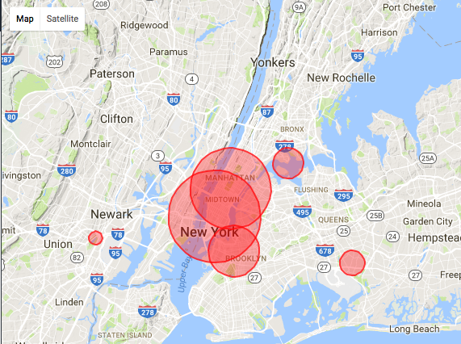

# Clustering

<!-- {"left" : 2.59, "top" : 2.74, "height" : 8.23, "width" : 12.32} -->

---

## Algorithm Map

<!-- {"left" : 2.59, "top" : 2.74, "height" : 8.23, "width" : 12.32} -->

---

## Clustering

* Clustering finds natural groupings in data

* Here we are grouping alcohol beverages according to 2 dimensions (alcohol %, fizziness); And we see similar drinks fall into natural groups

* In real world applications, we could be clustering by many dimensions (10s or 100s)

<!-- {"left" : 8, "top" : 2.3, "height" : 3.44, "width" : 9.07} -->

---

## Clustering Use Cases: Fraud / Anomaly Detection

<!--  {"left" : 10.8, "top" : 2.35, "height" : 5.02, "width" : 6.19} -->

* Anomaly detection
    - Find fraud
    - Detect network intrusion attack
    - Discover problems on servers

* Clustering does not necessarily detects fraud
    - But it points to unusual data
    - And the need for further investigation

Notes:

---

## Clustering Example: Google News

* Google News algorithm automatically groups **related news stories**  into sections

<!-- {"left" : 10.5, "top" : 2, "height" : 6.72, "width" : 6.68} -->

Notes:

---

## Clustering Use Case: Uber Trips

 * Figure out where demand is so more cars can be sent to that area  
 (we will do this lab!)

<!-- {"left" : 4.17, "top" : 4.16, "height" : 6.83, "width" : 9.17} -->

Notes:

---

## Clustering Use Case: Customer Purchases @ Walmart

<!--  {"left" : 10.35, "top" : 2.48, "height" : 4.03, "width" : 6.71} -->

* Here is how Walmart is segmenting customer purchases
    - Pharmacy Runs
    - Strictly Grocery
    - Grocery and General Merchandise
    - Michaels Run
    - Party Trip
    - Toys
    - Baby
    - Gallon of Milk
    - *Booze and Calories*

* **Question for class:What is the use case for this?**

* [Reference](https://www.kaggle.com/c/walmart-recruiting-trip-type-classification)

Notes:

---

## Clustering Algorithms

* **K-Means**
    * we seek to partition the observations into a pre-specified number of clusters

* **Hierarchical clustering**
    * We do not know in advance how many clusters we want
    * We end up with a tree-like visual representation of the observations, called a  **dendrogram**
    * View the clusterings obtained for each possible number of clusters, from 1 to n

Notes:

---

# K-Means

<!-- {"left" : 2.33, "top" : 2.57, "height" : 8.57, "width" : 12.83} -->

---

## Algorithm Summary

<!-- {"left" : 2.33, "top" : 2.57, "height" : 8.57, "width" : 12.83} -->

* [Reference](http://machinelearningmastery.com/supervised-and-unsupervised-machine-learning-algorithms/)

Notes:

---

## K-Means Clustering

* K-means clustering is a simple and elegant approach for partitioning a data set into K  **distinct, non-overlapping** clusters

* To start K-Means, we need to specify the number of clusters (K)

* Then the algorithm will assign each observation to  **exactly one cluster (no overlapping)**

* Not all clusters will have the same size,  but the clusters are best separated

<!-- {"left" : 2.33, "top" : 2.57, "height" : 8.57, "width" : 12.83} -->

Notes:

---

## K-Means Visualized

<!-- {"left" : 4.52, "top" : 1.89, "height" : 4.24, "width" : 8.47} -->

* Animations
    - [http://stanford.edu/class/ee103/visualizations/kmeans/kmeans.html](http://stanford.edu/class/ee103/visualizations/kmeans/kmeans.html)
    - [https://www.naftaliharris.com/blog/visualizing-k-means-clustering/](https://www.naftaliharris.com/blog/visualizing-k-means-clustering/)
    - [http://www.bytemuse.com/post/k-means-clustering-visualization/](http://www.bytemuse.com/post/k-means-clustering-visualization/)

Notes:

---

## K-Means Clustering Walkthrough

* **Step 1:** Centroids are randomly seeded in the data.  
Example: 3 centroids (red, green, blue)
* **Step 2:** Each point in the dataset is associated with its nearest centroid, as determined by a distance measurement.
* **Step 3:** The centroid (geometric center) of the clustered points becomes the new centroid of that cluster. Each centroid  updated.
* **Step 4:** Repeat steps 2 and 3 until convergence is reached (the points move less than the threshold amount).

  &nbsp; &nbsp; <!--  {"left" : 1.76, "top" : 7.22, "height" : 3.54, "width" : 3.67} --><!--  {"left" : 5.74, "top" : 7.68, "height" : 2.6, "width" : 3.02} --> &nbsp; &nbsp; <!--  {"left" : 8.4, "top" : 7.22, "height" : 3.54, "width" : 4.1} --> &nbsp; &nbsp; <!--  {"left" : 12.72, "top" : 7.68, "height" : 2.6, "width" : 3.02} -->

Notes:

---

## K-Means Visualization

<!--  {"left" : 4.2, "top" : 2.31, "height" : 9.08, "width" : 9.1} -->

* Image credit : "Introduction to Statistical Learning", used with author's permission (http://www-bcf.usc.edu/~gareth/ISL/)

Notes:

---

## Evaluating K-means Performance

* We use a method called **WSSSE - Within cluster sum of squares by cluster  / Within-Cluster-SS**

* Remember K-Means works like this

    - Each observation is allocated to closest cluster

    - Measure distance between observation and cluster center

    - Keep iterating until max-K is reached  or change in successive WSSSE is less than the threshold value

* Goal is to minimize WSSSE

Notes:

---

## MTCars Clustering

 <!--  {"left" : 9.49, "top" : 2.32, "height" : 3.86, "width" : 7.76} -->

* We are going to cluster cars using two attributes: MPG & CYL

* This is `mtcars` dataset
    - has 32 data points

* Attributes
    - name - name of the car
    - mpg - Miles/(US) gallon
    - cyl - Number of cylinders
    - disp - Displacement (cu.in.)
    - hp - Gross horsepower
    - drat - Rear axle ratio

Notes:

---

## Starting With K = 2  (Find 2 clusters)

<!-- {"left" : 2.37, "top" : 3.13, "height" : 6.96, "width" : 12.76} -->

Notes:

---

## Starting With K = 4  (Find 4 clusters)

<!-- {"left" : 2.78, "top" : 2.35, "height" : 7.68, "width" : 11.94} -->

Notes:

---

## Evaluating K-Means With WSSSE

* Goal is to  **minimize WSSSE** with  **reasonable effort**

* We look for elbows - that indicates a reasonable clustering

* After the elbow, the improvement is minimal

* **Question for class:** At  **k=32**  we have achieved  **WSSSE=0** , as in perfect fit !How is that?

<!-- {"left" : 3.34, "top" : 6.05, "height" : 4.61, "width" : 10.82} -->

Notes:

---

## K-Means Drawbacks

* Initial centroid positions are very important
    - Badly initialized centroids can lead to
        * sub-optimal solution ("local minima" phenomenon)
        * Can take too long to converge

* No deterministic way to guarantee the clustering is optimal (NP hard)
    - Choose centroid randomly
    - Do several runs
    - Compare WSSSE score

* `Lloyd's algorithm` can be used overcome some of these issues (outside the scope of this course)

* [Reference: Lloyd's algorithm](https://en.wikipedia.org/wiki/Lloyd%27s_algorithm)

Notes:

---

## K-Means Centroid Positioning DEMO

<!-- {"left" : 11.43, "top" : 2.25, "height" : 5.13, "width" : 5.33} -->

* Go to: https://www.naftaliharris.com/blog/visualizing-k-means-clustering/

* Demo 1
     - Centroid positions: "I will pick"
     - Data: "smiley face"
     - Place centroid off center at the top
     - Step through

* Demo 2:
     - Centroid positions: "I will pick"
     - Data: "smiley face"
     - Place centroids evenly
     - Step through

Notes:

---

## How to Find the Best K?

<!-- {"left" : 10.21, "top" : 1.89, "height" : 4.06, "width" : 6.97} -->

* No single standard to find 'best' number of clusters

* **Elbow method**  is commonly used

* Increasing K beyond the elbow doesn't produce noticeable improvements in clustering

* Practical approach
    - Number of Clusters (K) is usually determined by the application need
    - See Walmart data on shopping-cart grouping
        - 'grocery run',  'milk run'
        - ~37 categories

Notes:

---

## K-Means Strengths & Weaknesses

* **Strengths**
    - K-Means is simple, well-understood
    - Verification straightforward
    - Easy to parallelize, scales to large datasets

* **Weaknesses:**
    - Value of k must be known in advance, which may mean running the exercise many times to get optimum results.
    - Initial centroid positions are important; may cause long convergence.
    - Outliers may bias results.
    - Clusters not broadly (hyper)spherical don't work well for k-means.
        - Use hierarchical clustering for these situations.

Notes:

---

## K-Means: Further Reading

* "**Practical Statistics for Data Scientists**"  - O'Reilly Chapter 7

* "**An Introduction to Statistical Learning**" - SpringerChapter 10

* Wikipedia: [https://en.wikipedia.org/wiki/K-means_clustering](https://en.wikipedia.org/wiki/K-means_clustering)

Notes:

---

# Hierarchical Clustering

---

## Algorithm Summary

<!-- {"left" : 2.7, "top" : 2.16, "height" : 8.07, "width" : 12.1} -->

* [Reference](http://machinelearningmastery.com/supervised-and-unsupervised-machine-learning-algorithms/)

Notes:

---

## Hierarchical Clustering

* One potential disadvantage of K-means clustering is that it requires us to pre-specify the number of clusters K

* **Hierarchical clustering** is an alternative approach which does not require that we commit to a particular choice of K

* It has an added advantage over K-means clustering in that it results in an attractive tree-based representation of the observations, called a  **dendrogram**

Notes:

---

## Visualizing Hierarchical Clustering

* Input

<!-- {"left" : 4.12, "top" : 3.22, "height" : 8.23, "width" : 9.26} -->

Notes:

---

## Visualizing Hierarchical Clustering

* Output: **Dendogram** (upside down tree)

 <!-- {"left" : 2.6, "top" : 3.89, "height" : 7.4, "width" : 12.29} -->

Notes:

---

## Doing Clustering

* The following section will show sample code on how to implement Clustering algorithms
