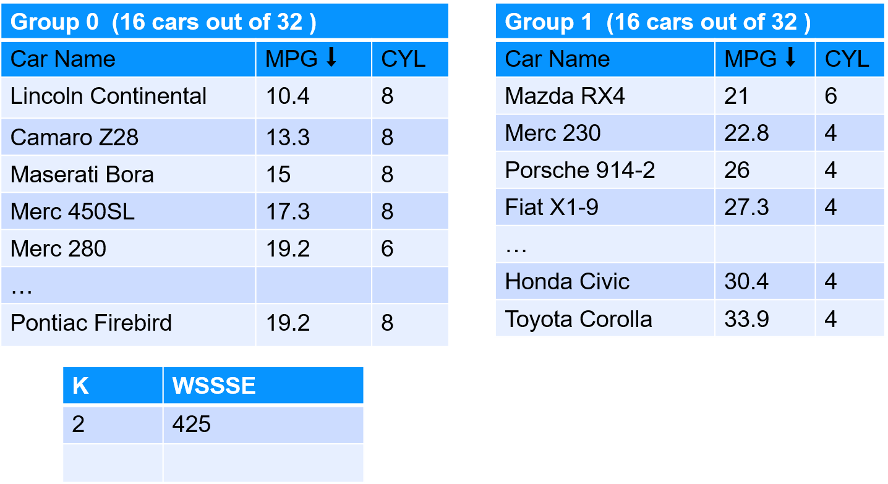
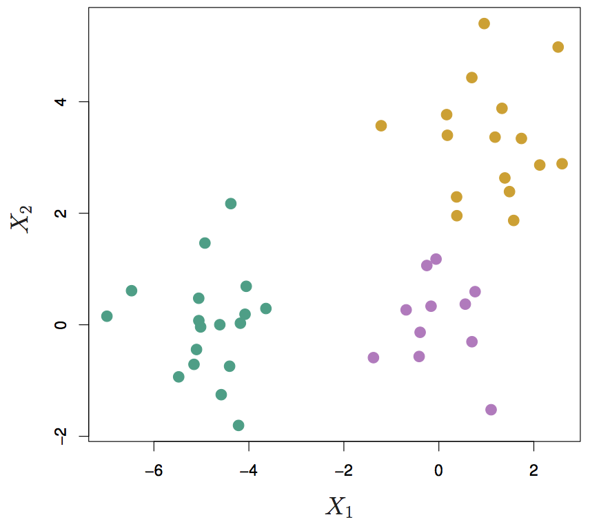

# Clustering

---

## Algorithm Map

<!-- {"left" : 1.02, "top" : 1.24, "height" : 5.48, "width" : 8.21} -->

---

## What is Clustering?
<!-- TODO shiva -->

 * Clustering finds natural **groupings / clusters**  in data
     - Each group shares similar traits with elements in its own group
     - and is different from elements in other groups

 * Humans naturally cluster data we encounter
     - Categorizing, organizing, etc.
     - Our brains seek patterns

 * Why do we cluster?
     - To understand our data
     - To find "more like this"

Notes:

---

## Clustering Use Cases: Fraud / Anomaly Detection

<!-- TODO shiva  -->
<!--  {"left" : 3.37, "top" : 4.21, "height" : 2.84, "width" : 3.5} -->

 * Anomaly detection
     - Find fraud
     - Detect network intrusion attack
     - Discover problems on servers

 * Clustering does not necessarily detects fraud
     - But it points to unusual data
     - And the need for further investigation

Notes:

---

## Clustering Use Cases:  Google News

 <!-- TODO shiva -->
<!-- {"left" : 1.02, "top" : 1.88, "height" : 4.21, "width" : 8.21} -->

- Google News groups similar articles together.  This has to be done dynamically, as news stories change all the time

Notes:

---

## Clustering Use Case : Uber Trips

 * Figure out where demand is so more cars can be sent to that area  
 (we will do this lab!)

<!-- {"left" : 2.24, "top" : 1.83, "height" : 4.3, "width" : 5.77} -->

Notes:

---

## Clustering Use Cases: Segmenting

 * Marketing / Sales
     - Segment the customer base; for promotion / advertisement
     - Soccer mom  / new parents

 * Politics
     - Group potential voters for ad targeting
     - Farmers / Christians

 * See next slide

Notes:

TODO : add pictures

---

## Clustering Use Case: Customer Purchases @ Walmart
<!-- TODO shiva -->
<!--  {"left" : 6.09, "top" : 4.85, "height" : 2.34, "width" : 3.9} -->

* Here is how Walmart is segmenting customer purchases
    - Pharmacy Runs
    - Strictly Grocery
    - Grocery and General Merchandise
    - Michaels Run
    - Party Trip
    - Toys
    - Electronics
    - Baby
    - Gallon of Milk
    - *Booze and Calories*

* **Question for class:What is the use case for this?**

Notes:

https://www.kaggle.com/c/walmart-recruiting-trip-type-classification

---

## Clustering Algorithms

*  **K-Means**
    * we seek to partition the observations into a pre-specified number of clusters

* **Hierarchical clustering**
    * We do not know in advance how many clusters we want
    * We end up with a tree-like visual representation of the observations, called a  **dendrogram**
    * View the clusterings obtained for each possible number of clusters, from 1 to n

Notes:

---

# K-Means

---

## Algorithm Summary

<!-- {"left" : 1.02, "top" : 1.24, "height" : 5.48, "width" : 8.21} -->

Notes:

http://machinelearningmastery.com/supervised-and-unsupervised-machine-learning-algorithms/

---

## K-Means Clustering

 * K-means clustering is a simple and elegant approach for partitioning a data set into K  **distinct, non-overlapping** clusters

 * To start K-Means, we need to specify the number of clusters (K)

 * Then the algorithm will assign each observation to  **exactly one cluster (no overlapping)**

 * Not all clusters will have the same size,  but the clusters are best separated

Notes:

---

## K-Means Visualized

<!-- {"left" : 1.73, "top" : 1.08, "height" : 3.4, "width" : 6.78} -->

 * Animations
     - [http://stanford.edu/class/ee103/visualizations/kmeans/kmeans.html](http://stanford.edu/class/ee103/visualizations/kmeans/kmeans.html)
     - [https://www.naftaliharris.com/blog/visualizing-k-means-clustering/](https://www.naftaliharris.com/blog/visualizing-k-means-clustering/)
     - [http://www.bytemuse.com/post/k-means-clustering-visualization/](http://www.bytemuse.com/post/k-means-clustering-visualization/)

Notes:

---

## K-Means Clustering Walkthrough

*  **Step 1** : Centroids are randomly seeded in the data.  
Example: 3 centroids (red, green, blue)
*  **Step 2** : Each point in the dataset is associated with its nearest centroid, as determined by a distance measurement.
*  **Step 3** : The centroid (geometric center) of the clustered points becomes the new centroid of that cluster. Each centroid  updated.
*  **Step 4** : Repeat steps 2 and 3 until convergence is reached (the points move less than the threshold amount).

<!-- TODO shiva -->
  &nbsp; &nbsp; <!--  {"left" : 7.26, "top" : 1.51, "height" : 2.39, "width" : 2.48} -->
&nbsp; &nbsp;
&nbsp; &nbsp;

Notes:

---

## K-Means Visualization
<!-- TODO Shiva  -->
<!-- {"left" : 2.04, "top" : 0.9, "height" : 6.17, "width" : 6.18} -->

Notes:

Image credit : "Introduction to Statistical Learning", used with author's permission (http://www-bcf.usc.edu/~gareth/ISL/)

---

## Math Behind K-Means

 * Cluster into K-cluster, such that total inter-cluster variation is as small as possible

 * For example

     - For cluster Ck

     - Variations within this cluster is W(Ck)

Notes:

Formulate images : "Introduction to Statistical Learning", used with author's permission (http://www-bcf.usc.edu/~gareth/ISL/)

---

## Evaluating K-means Performance

 * We use a method called **WSSSE - Within cluster sum of squares by cluster  / Within-Cluster-SS**

 * Remember K-Means works like this

     - Each observation is allocated to closest cluster

     - Measure distance between observation and cluster center

     - Keep iterating until max-K is reached  or change in successive WSSSE is less than the threshold value

 * Goal is to minimize WSSSE

Notes:

---

## MTCars Clustering
<!-- TODO shiva -->
 <!--  {"left" : 1.16, "top" : 2.01, "height" : 3.94, "width" : 7.94} -->

 * We are going to cluster cars using two attributes : MPG & CYL
 * This is `mtcars` dataset
    - has 32 data points
 * Attributes
    - name - name of the car
    - mpg - Miles/(US) gallon
    - cyl - Number of cylinders
    - disp - Displacement (cu.in.)
    - hp - Gross horsepower
    - drat - Rear axle ratio

Notes:

---

## Starting With K = 2  (Find 2 clusters)

<!-- {"left" : 1.02, "top" : 1.75, "height" : 4.48, "width" : 8.21} -->

Notes:

---

## Starting With K = 4  (Find 4 clusters)

<!-- {"left" : 1.02, "top" : 1.34, "height" : 5.28, "width" : 8.21} -->

Notes:

---

## Evaluating K-Means With WSSSE

 * Goal is to  **minimize WSSSE** with  **reasonable effort**

 * We look for elbows - that indicates a reasonable clustering

 * After the elbow, the improvement is minimal

 *  **Question for class:** At  **k=32**  we have achieved  **WSSSE=0** , as in perfect fit !How is that?

<!-- {"left" : 1.02, "top" : 3.49, "height" : 3.5, "width" : 8.21} -->

Notes:

---

## K-Means Complexity

 * Finding optimal solution in K-means is NP-hard

 * For K=clusters and d=dimensions and n=observations

<!-- {"left" : 4.26, "top" : 1.94, "height" : 0.61, "width" : 1.72} -->

 * Heuristic algorithms like Lloyd's can helpComplexity - linear (best case)

<!-- {"left" : 4.36, "top" : 4.45, "height" : 0.53, "width" : 1.53} -->

- i = iterations

- worst case can be superpolynomial

Notes:

Source : https://en.wikipedia.org/wiki/K-means_clustering

---

## K-Means Drawbacks

 * Initial centroid positions are very important
     - Badly initialized centroids can lead to
        * sub-optimal solution ("local minima" phenomenon)
        * Can take too long to converge

 * No deterministic way to guarantee the clustering is optimal (NP hard)
     - Choose centroid randomly
     - Do several runs
     - Compare WSSSE score

 * `Lloyd's algorithm` can be used overcome some of these issues (outside the scope of this course)

Notes:

https://en.wikipedia.org/wiki/Lloyd%27s_algorithm

---

## K-Means Centroid Positioning DEMO
<!-- TODO shiva  -->
<!-- {"left" : 7.67, "top" : 1.8, "height" : 1.79, "width" : 1.86} -->

 * Go to : https://www.naftaliharris.com/blog/visualizing-k-means-clustering/
 * Demo 1
     - Centroid positions : "I will pick"
     - Data : "smiley face"
     - Place centroid off center at the top
     - Step through
 * Demo 2 :
     - Centroid positions : "I will pick"
     - Data : "smiley face"
     - Place centroids evenly
     - Step through

Notes:

https://www.naftaliharris.com/blog/visualizing-k-means-clustering/

---

## How to Find the Best K?
<!-- TODO shiva  -->
<!-- {"left" : 2.37, "top" : 3.27, "height" : 3.22, "width" : 5.52} -->

-  No single standard to find 'best' number of clusters
-  **Elbow method**  is commonly used
- Increasing K beyond the elbow doesn't produce noticeable improvements in clustering

- Practical approach
    -  Number of Clusters (K) is usually determined by the application need
    - See Walmart data on shopping-cart grouping
        - 'grocery run',  'milk run'
        - ~37 categories

Notes:

---

## K-Means Revision

 *  **Cluster**

    A group of records that are similar

 *  **K**

    The number of clusters

 *  **WSSSE**

    Within-Cluster-Sum-of-Squares   /  Within-cluster-SS

Notes:

---

## K-Means Strengths & Weaknesses

 * **Strengths**
    * K-Means is simple, well-understood
    * Verification straightforward
    * Easy to parallelize, scales to large datasets

 * **Weaknesses:**
    * Value of k must be known in advance, which may mean running the exercise many times to get optimum results.
    * Initial centroid positions are important; may cause long convergence.
    * Outliers may bias results.
    * Clusters not broadly (hyper)spherical don't work well for k-means.
        - Use hierarchical clustering for these situations.

Notes:

Hierarchical Clustering is a cluster analysis that seeks to build a hierarchy of clusters.

---

# Hierarchical Clustering

---

## Algorithm Summary

<!-- {"left" : 1.02, "top" : 1.24, "height" : 5.48, "width" : 8.21} -->

Notes:

http://machinelearningmastery.com/supervised-and-unsupervised-machine-learning-algorithms/

---

## Hierarchical Clustering

 * One potential disadvantage of K-means clustering is that it requires us to pre-specify the number of clusters K

 *  **Hierarchical clustering** is an alternative approach which does not require that we commit to a particular choice of K

 * It has an added advantage over K-means clustering in that it results in an attractive tree-based representation of the observations, called a  **dendrogram**

Notes:

---

## Visualizing Hierarchical Clustering

 * Input

<!-- {"left" : 2.16, "top" : 1.35, "height" : 5.27, "width" : 5.93} -->

Notes:

---

## Visualizing Hierarchical Clustering

 * Output:  **Dendogram**  (upside down tree)

<!-- {"left" : 1.02, "top" : 1.51, "height" : 4.94, "width" : 8.21} -->

Notes:

---

## Lab: KMeans

 *  **Instructor**:
     - Recommended to do the Uber lab as the last lab for the class

 *  **Overview**:
    - Experiment with KMeans

 *  **Approximate time**:
    - 20 - 40 mins

 *  **Instructions**:
     - See next few slides for sample code in Python / R / Spark instructions
     - KMEANS-1: mtcars
     - KMEANS-2: Uber trips
     - Bonus Lab: KMEANS-3: Walmart shopping data

Notes:

---

## K-Means: Further Reading

 * "**Practical Statistics for Data Scientists**"  - O'Reilly Chapter 7

 * "**An Introduction to Statistical Learning**" - SpringerChapter 10

 * Wikipedia: [https://en.wikipedia.org/wiki/K-means_clustering](https://en.wikipedia.org/wiki/K-means_clustering)

Notes:
