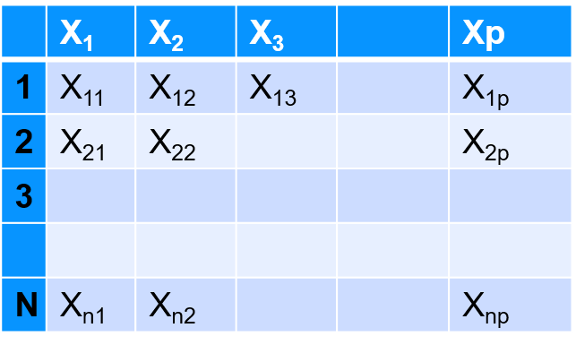
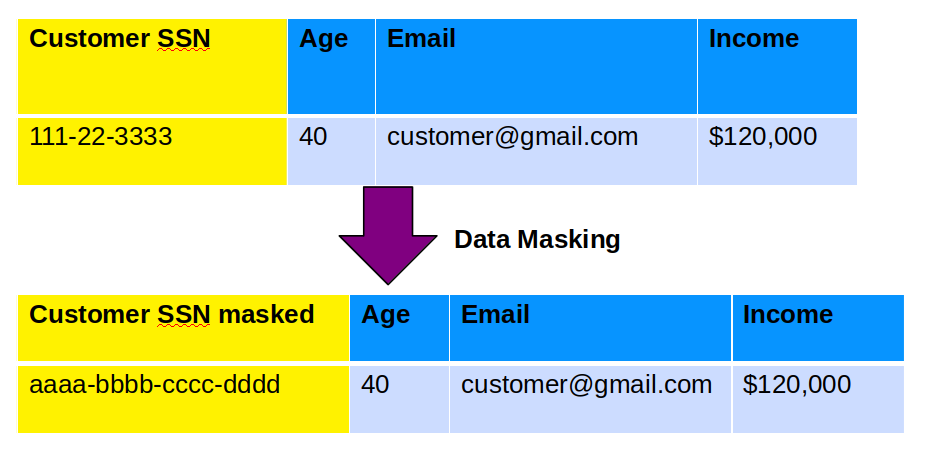
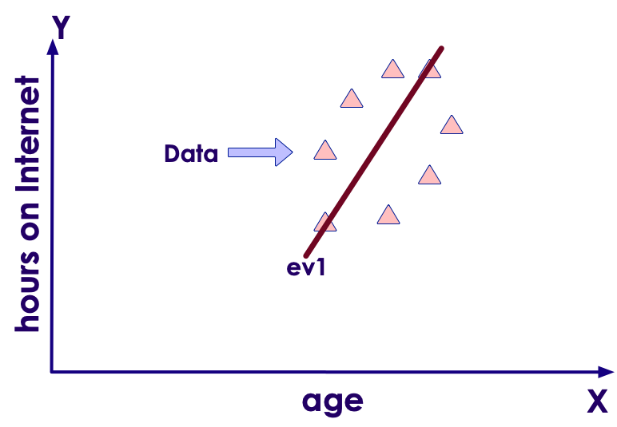
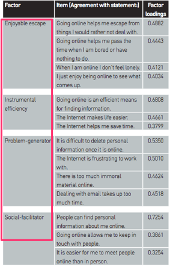
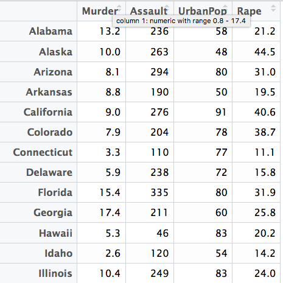
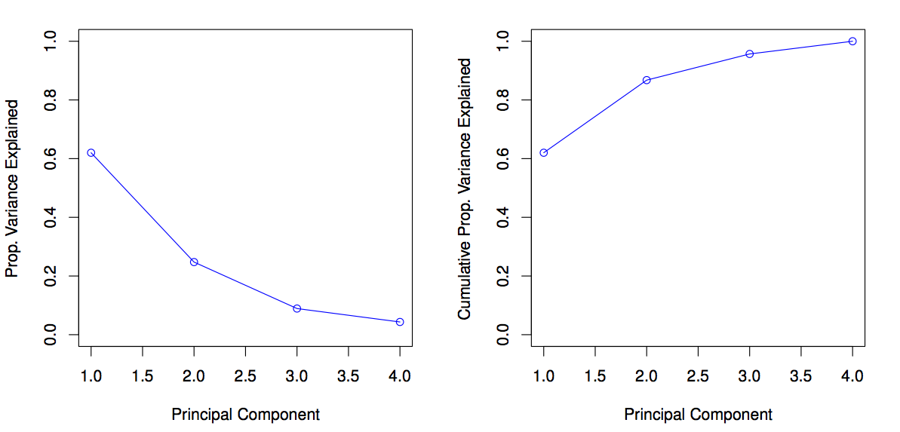

# Dimensionality Reduction

---

## Algorithm Summary

<!-- {"left" : 0.56, "top" : 2, "height" : 5.65, "width" : 9.14} -->

Notes:

http://machinelearningmastery.com/supervised-and-unsupervised-machine-learning-algorithms/

---

## Dimensionality Reduction

 *  Imagine we have too many variables/features (hundreds or even thousands!)

 * But this is good!?
     - Not always

 * Too many variables
    - complicate the model make it prone to overfit
    - Slow down the calculation
    - Require lots of compute power and resources

&nbsp;

| Feature 1 | F 2 | F 3 | ... | ... | F 99 | F  100 |
|-----------|-----|-----|-----|-----|------|--------|
|           |     |     |     |     |      |        |
|           |     |     |     |     |      |  &nbsp;|

<!-- {"left" : 0.25, "top" : 5.16, "height" : 1.5, "width" : 9.75} -->

Notes:

---

## Can We Reduce the Features?

* Can we use fewer features?

* Advantages
    - Efficient compute
        - Use compute more effectively, use less memory, reduce network traffic (in distributed scenarios)
    - Simpler model
        - Less susceptible for overfitting
        - Quicker to train

* However, we can not just drop features
     - We don't want to drop important features
     - Also we don't want to loose too much of 'signal' from original data

Notes:

---

## Why Dimensionality Reduction?

<!-- {"left" : 5.84, "top" : 3.9, "height" : 2.57, "width" : 4.3} -->

 *  **Reason 1: Efficient computation**

 * Say we have N observations with P features  
 X1, X2, X3, .... XP

 * We can visualize this data by2D scatter plots
     - X1 vs X2
     - X1 vs X2
     - So on...

 * For P variables there are
    - p * (p - 1) / 2 combinations!
    - P = 10 --> 45 plot combinations!
    - P = 100 --> 4500 plot combinations!

Notes:

---

## Why Dimensionality Reduction?

 *  **Reason 2: To mask data**
 * Imagine a dataset with sensitive data
     - Patients in medical trial data, valuable customer data like SSN
 * We want to make this data available to others.  
 But we also need to protect the data
    - we can mask sensitive data; here we are masking SSN

<!-- {"left" : 1.02, "top" : 4.47, "height" : 4.06, "width" : 8.21} -->

Notes:

---

## Why Dimensionality Reduction?

 *  **Reason 3: Eliminate duplicate data**

 * When multiple datasets are merged there may be duplicates
     - Could be coming from different departments / different equipment
     - Sometimes hard to detect

 * Here is an example of 'height' recorded in feet and cm.
     - They may not even agree, due to rounding errors

<!-- {"left" : 0.48, "top" : 4.74, "height" : 3.04, "width" : 9.28} -->

Notes:

---

## Dimensionality Reduction Solution

 * Say we have a data set with 100 attributes
 * We want to create 10 attributes out of 100 and give this out for further analysis
     - Retains as much spirit' of original data
     - Hard to reverse engineer
 * Here we are creating **totally new attributes** (a,b,c) from original attributes

<!-- {"left" : 1.02, "top" : 4.56, "height" : 3.81, "width" : 8.21} -->

Notes:

---

## Analogy: Image Resolution Reduction

 * You want to email / SMS a beautiful sunset photo
 * original image is 10 MB - high resolution
 * SMS program will resize / reduce resolution for sending
     - Smaller size, but still maintains the image

<!-- {"left" : 1.49, "top" : 3.97, "height" : 4.26, "width" : 7.26} -->

Notes:

Image "Sunset at Mauii, Hawaii",  credit: Sujee Maniyam (author) - used with permission

---

## Dimensionality Reduction Problem

 * Reduce the number of variables

     - Not just simply dropping attributes!

 * Come up with (potentially, new) variables

     - that will reflect the nature of original data

     - Without loosing too much information

     - Reasonably easy to compute

     - And not easy to reverse-engineer

 * By far, the most popular is PCA ( **P** rincipal  **C** omponent  **A** nalysis)

Notes:

---

# Principle Component Analysis (PCA)

---

## Algorithm Summary

<!-- {"left" : 0.77, "top" : 1.84, "height" : 5.39, "width" : 8.71} -->

Notes:

http://machinelearningmastery.com/supervised-and-unsupervised-machine-learning-algorithms/

---

## Principle Component Analysis (PCA)

 * Not all dimensions are equally interesting.Can we reduce the  **'dimensionality** ' of data,  **without loosing too much information** ?

 * PCA does just that

 * It finds low-dimensional representation of data that contains as much as possible of  **variation**

 * PCA seeks a small number of dimensions that are as  **interesting**  as possible

 *  **Interesting**  is measured by the amount that the observations vary along each dimension

<!-- {"left" : 1.02, "top" : 5.91, "height" : 1.79, "width" : 8.21} -->

Notes:

---

## PCA Example: Cultures of Internet in UK

<!-- {"left" : 6.57, "top" : 1.4, "height" : 5.32, "width" : 3.36} -->

 * This is an study by Oxford Internet Institute (OxIS)

 * 2500+ people were asked 15 questions in a survey
     - age
     - Hours on mobile
     - Hours on the internet
     - Etc.

 * The study summarized the findings in 4 PCA items
     - Enjoyable Escape
     - Instrumental efficiency
     - Problem generator
     - Social facilitator

Notes:

http://oxis.oii.ox.ac.uk/wp-content/uploads/2014/11/OxIS-2013.pdf

---

## PCA Theory: Eigen Vectors / Values

 * Say we are measuring the following responses
     - Age,   hours on the internet
     - 2 variables --> 2 dimensional dataset --> 2 Eigen Vectors
 * If we measure
     - Age, hours on the internet, hours on the mobile phone
     - 3 variables,  3 dimensional dataset --> 3 Eigen vectors
 * So number of Eigen vectors = number of dimensions
 * EigenVector is a direction - vertical, horizontal, 45' degrees ..etc
 * EigenValue is a number - denoting how much 'variance' in the data in that vector's direction
 * Eigen Vector and Eigen Value go together(E Vector,   E Value)
 * EigenVector with highest EigenValue (meaning lot of variance in that direction)  becomes a Principal Component

Notes:

---
## Eigen Vector Example

<!-- {"left" : 5.57, "top" : 2.46, "height" : 3.71, "width" : 4.52} -->

- Imagine we are in a town with bunch of bars and restaurants

- if we only travel on streets North and East, we wouldn't see most of the restaurants

- But if we walk down the alley way, we will encounter most of the restaurants and bars

- So the alleyway is a better street

---

## PCA Math: Eigen Vectors

 * In the plot below, EigenVector (ev1) is shown that crosses the data with 'highest variance'

<!-- {"left" : 1.46, "top" : 2.61, "height" : 5.08, "width" : 7.32} -->

Notes:

Image adopted with thanks to: https://georgemdallas.wordpress.com/2013/10/30/principal-component-analysis-4-dummies-eigenvectors-eigenvalues-and-dimension-reduction/

---

## PCA Math: Eigen Vectors

 * But we have a 2-dimensional data -> 2 eigen vectors

 * To maximize coverage the second EigenVector will be orthogonal (90 degrees) to the first one (ev1)

 <!-- {"left" : 1.4, "top" : 3.09, "height" : 5.16, "width" : 7.45} -->

Notes:

Image adopted with thanks to: https://georgemdallas.wordpress.com/2013/10/30/principal-component-analysis-4-dummies-eigenvectors-eigenvalues-and-dimension-reduction/

---

## PCA Math: Eigen Vectors

 * The EigenVectors have given us more useful axis to frame data

 * Remember, the data hasn't changed at all, we are just looking at it from a different perspective

<!-- {"left" : 1.92, "top" : 3.54, "height" : 4.56, "width" : 6.42} -->

Notes:

Image adopted with thanks to: https://georgemdallas.wordpress.com/2013/10/30/principal-component-analysis-4-dummies-eigenvectors-eigenvalues-and-dimension-reduction/

---

## PCA on Oxford Internet Study

<!-- {"left" : 7.16, "top" : 1.18, "height" : 4.53, "width" : 2.89} -->

 * Say there were
     - 2500 people interviewed == 2500 observations
     - 15 questions = 15 dimensions = 15 EigenVectors & Values

 * Say our 15 Eigen Values are (in descending order)  
 [  **`25, 22, 15, 13`** , 8, 5, 4, 3, 2, 1, 0.7, 0.5, 0.4,  0.3, 0.1 ]

 * We see the first 4 have the biggest values
     - Indicating 4 directions with lots of information

 * We have identified our 4 Principal Components (PC)

 * We have gone from 15 attributes to 4  (call them PC1, PC2, PC3, PC4)

Notes:

---

## Principal Components

 * First Principal Component (PC1)  has the largest variance (EigenValue)

 * Second Principal Component has second largest variance that is uncorrelated to PC1

     - Orthogonal vector to PC1

Notes:

---

## PCA Example: USArrests Data

<!-- {"left" : 5.75, "top" : 1.68, "height" : 4.34, "width" : 4.34} -->

 * N=50,  p=4

 * PCA was performed after standardizing each variable to have mean zero and standard deviation one

Notes:

Example from "An Introduction to Statistical Learning"  Chapter 10

---

## PC Vectors and BiPlot

<!-- {"left" : 4.84, "top" : 1.22, "height" : 1.8, "width" : 5.08} -->

<!-- {"left" : 0.25, "top" : 3.07, "height" : 5.66, "width" : 5.66} -->

Notes:

Diagram with thanks to : "An introduction to Statistical Learning" book.

---

## Understanding BiPlot

<!-- {"left" : 5.54, "top" : 1.23, "height" : 4.57, "width" : 4.57} -->

 * Biplot displays both

     - Principal Component scores (left & lower axis)

     - And Principal Component loadings (top & right axis)

 * States are mapped according their PC1 / PC2 value  (left / lower axis)

 * Orange arrows indicated the first 2 PC vectors (axis on top and right)

     - Loading for 'Rape' on PC1 0.54  (top axis)

     - Loading for 'Rape' on PC2 0.17  (right axis)

Notes:

---

## Understanding BiPlot

<!-- {"left" : 6.85, "top" : 1.05, "height" : 3.22, "width" : 3.22} -->

 * Crime related variables (Murder, Assault and Rape) are close to each other
 * UrbanPop is far from other three
     - Less correlated with others
 * States with large PC1 scores have high crime rates
     - California, Nevada, Florida
 * States with negative PC1 scores low crime rates
     - North Dakota
 * California also high on PC2 indicating more urbanized.While Mississippi and NC are least urbanized
 * States close to zero on both components like Indiana have average crime and urbanization

Notes:

---

## Effects of Scaling Variables Before PCA

<!-- {"left" : 5.21, "top" : 1.02, "height" : 3.33, "width" : 4.99} -->

 * Left: Scaled data, centered at zero, with standard deviation one
 * Right: Unscaled data
 * With unscaled data we see 'Assault' having the largest loading on PC1 (b/c it has the highest variance)
 * So it is exerting a lot of influence on the data
 * So it is recommended to  **scale the data before performing** a PCA

Notes:

Diagram with thanks to : "An introduction to Statistical Learning" book.

---

## Evaluating PCA - Scree Plot

 * We use a  **scree plot** to understand PCA
 * Left chart plots Variance for each PC component.
     - First component (PC1) has the most (62%)
     - Second one PC2 around 25%
     - PC4 hast the least
 * Right graph shows 'accumulated' variance when combining PCs.  We are moving towards ONE

<!-- {"left" : 1.02, "top" : 4.4, "height" : 4.48, "width" : 8.21} -->

Notes:

---

## How Many Principals Components to Use?

 * In general an [n x p] matrix has   min( n-1, p) distinct principal components

 * We aren't interested in all of them.

 * We want to pick fewest PCs that will give us a good understanding of data

 * So how many?

 * There is no single (or simple) answer to this question!

 * Scree plot can help to gauge the variance for each PC

Notes:

---

## Choosing PCs - Practical Advice

<!-- {"left" : 5.25, "top" : 2.19, "height" : 2.4, "width" : 4.92} -->

 * Adhoc

     - Start with PC components that give you enough coverage on variance (say 70%)

     - Then add more PCs until we don't discover any more patterns in the data

 * Another

     - Feed PCA'd data into a Supervised learning algorithm  (e.g. regression or classification)

     - Then use evaluation methods for Supervised Learning to tweak the number of PCs

Notes:

---

## Generalized PCA Algorithm

* From n-dimension to k-dimension   (k < n)
     - Find k vectors in Rn that will minimize the combined projection error of the data in Rn

* **Algorithm overview**
    1. Preprocessing, or feature scaling (normalization)
    2. Compute the "covariance" matrix
        - How each feature is related to another
    3. Find the "eigenvectors" of the covariance matrix
    4. Find the important principal components
      - Transform your features into k-dimension

Notes:

---

## Normalizing Data

| id | age | salary  |
|----|-----|---------|
| 1  | 32  | 60,000  |
| 2  | 26  | 50,000  |
| 3  | 40  | 100,000 |
| 4  | 37  | 75,000  |

<!-- {"left" : 0.25, "top" : 1.16, "height" : 2.5, "width" : 9.75} -->

* In this data variables are all in different ranges
     - Age : 26- 40
     - Salary : 50,000  - 100,000

---

## Normalized Data

<!-- {"left" : 6.66, "top" : 1.09, "height" : 2.62, "width" : 3.37} -->

* Age values are[ 32, 26, 40, 37]
     - Min = 26,  Max = 40
     - Range = 40 - 26 = 24
* Normalize (age) = (value - min) / range
* Scaled data is between 0.0 and 1.0

| id | age | salary  | age scaled   (value - min) / range     |
|----|-----|---------|--------------------------------------|
| 1  | 32  | 60,000  | = (32 - 26)/ (40 - 26)  = 0.428571429 |
| 2  | 26  | 50,000  | = (26 - 26) / (40 - 26)   = 0.0        |
| 3  | 40  | 100,000 | = (40 - 26) / (40 - 26)   = 1.0        |
| 4  | 37  | 75,000  | = (37-26) / (40 - 26)   = 0.7857       |

<!-- {"left" : 0.25, "top" : 4.82, "height" : 3.45, "width" : 9.75, "columnwidth" : [1.18, 1.46, 1.93, 5.19]} -->

---

## Restoring Original Data

<!-- {"left" : 6.8, "top" : 0.97, "height" : 2.62, "width" : 3.37} -->

 * Yes, you can restore original data

 * If we took all Eigen Vectors, then we can restore the original data exactly

 * But usually we only select a few Eigen Vectors -> you will lose some precision

 * Apply the same transforms backwards to the new points

 

 <!-- {"left" : 6.2, "top" : 5.3, "height" : 2.25, "width" : 3.84} -->

 * See the beach picture (we can not 100% restore original image from a down-sampled image)

Notes:

---

## How to Chose K

* We have optimized the projection error  

 <!-- {"left" : 0.4, "top" : 1.94, "height" : 1.3, "width" : 6.45} -->

* And we have reduced the total variation in the data
  
 <!-- {"left" : 0.4, "top" : 4.73, "height" : 1.34, "width" : 3.69} -->

* Retain 99% of the variance means that  

 <!-- {"left" : 0.25, "top" : 7.57, "height" : 1.07, "width" : 4.09} -->

Notes:

You may choose 95%, 90%, etc

---

## When to Use PCA

 * Good use of PCA
     - Compression of data for reduce resource requirements
     - Speed up supervised learning
     - Visualization
        * Reducing to K = 2 (two dimensional) or K = 3 (three dimensional)

 * Bad use of PCA
     - To prevent overfitting
     - Your thinking: less features, less likely to overfit
     - Most likely it is not a good idea, since the data is the same
     - Rather, use regularization parameter lambda (λ) to reduce overfitting

Notes:

---

## Practical Advice

 * Use PCA to speed up supervised learning! Why?

 * It is easy to get vectors of sizes like 10,000

 * Just think of a 100x100 pixel matrix for classification

 * With PCA, you may get 1,000 instead of 10,000

 * And run 10 times faster

Notes:

Image credit: https://www.1st-art-gallery.com/Joseph-Mallord-William-Turner/Rain-Steam-And-Speed-The-Great-Western-Railway.html

---

## Machine Learning Pipelines

 * Plan 1
     - Data gathering
     - PCA
     - Other algorithms

 * Plan 2: Better plan
     - Data gathering
     - ~~PCA~~
     - Other algorithms

 * Try without PCA first
     - PCA may not be needed
     - It is used for specific purposes

Notes:

---

## PCA Implementation

 * Two ways to implement PCA

 * Option 1: Compute the matrices using linear algebra
     - Not very stable numerically
     - Errors build up
     - Large matrix size

 * Option 2: Compute eigenvectors iteratively
     - Almost as precise as above
     - But much faster

Notes:

---

## PCA: Further Readings

 * ["Internet Cultures of UK"](http://oxis.oii.ox.ac.uk/wp-content/uploads/2014/11/OxIS-2013.pdf) study by Oxford Internet Institute

 * [PCA for dummies](https://georgemdallas.wordpress.com/2013/10/30/principal-component-analysis-4-dummies-eigenvectors-eigenvalues-and-dimension-reduction/) - a nice blog post by George Dallas

 * [Intro to PCA](https://valiancesolutions.com/introduction-to-principal-component-analysis)

Notes:

---

## Lab: PCA

 *  **Overview:**

    - Reduce data dimension with PCA

 *  **Approximate Time:**

    - 30 mins

 *  **Instructions:**

    - Follow  appropriate Python, R, or Scala instructions

Notes:
