# Unsupervised Learning

---

## Lesson Objectives

 * Learn about Unsupervised algorithms

 * Learn use cases

Notes:

---

# Unsupervised Learning

---

## Algorithm Summary

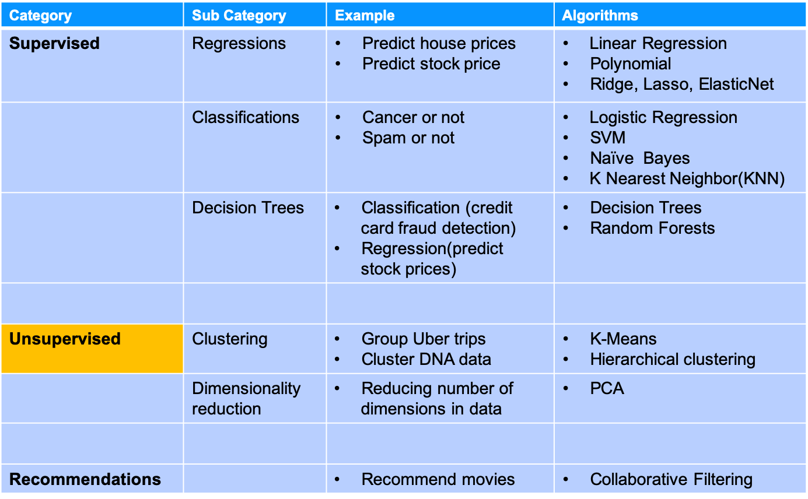<!-- {"left" : 1.02, "top" : 1.24, "height" : 5.48, "width" : 8.21} -->

Notes:

http://machinelearningmastery.com/supervised-and-unsupervised-machine-learning-algorithms/

---

## Supervised & Unsupervised Learning

 * **Supervised Learning**

    * We train the model on 'training set'

    * And use the model to make predictions

    * Will validate predictions using testing set

    * E.g.: Predict house prices

 * **Unsupervised Learning**

    * There is NO training

    * Discover interesting  **patterns / groupings** of data

Notes:

---

## Unsupervised Learning

 * Unsupervised Learning refers to statistical methods that  **extract meaning from data without training a model on labeled data**

 * (In our supervised learning, we trained models and then used them for prediction)

 * Unsupervised learning also  **builds models from data** , but  **does not distinguish between response variable and predictor variable**

 * Big part of exploratory data analysis

     - Sift through large amount of data or large amount of variables

     -  **Cold-start**  : when we start out a project, we may not have 'training data'.  So we can use Clustering to identify pockets and analyze them independently

Notes:

References
"Practical Statistics for Data Scientists"  , Chapter 7 - Oreilly

---

## Supervised Vs. Unsupervised

| Supervised                                                                                                                                         | Unsupervised                 |
|----------------------------------------------------------------------------------------------------------------------------------------------------|------------------------------|
| most algorithms are supervised                                                                                                                     |                              |
| Lots of tools and algorithms.  (such as logistic regression, linear discriminant analysis, classification trees, support vector machines, and more) |                              |
| Assessing model performance is well defined (validation, cross-validation, independent test set)                                                   | Tends to be more subjective. |

Notes:

---

## Unsupervised Applications

 * Medicine / Genomics
     - Group cancer cells into sub groups

 * Online shopping
     - Group customer purchases ('grocery run' )

 * Web
     - Prioritize search results based on other user's clicks.  
       E.g. search results for 'eclipse'
     - Group news stories / articles  
       E.g. Google News

Notes:

---

## Unsupervised Algorithms and Use Cases

| Unsupervised        | Use Cases                                                                                                                                | Algorithms                               |
|---------------------|------------------------------------------------------------------------------------------------------------------------------------------|------------------------------------------|
| Clustering          | -Analyze web clicks and segment customers. And improve their web  -Analyze network traffic and isolate anomalies (potential attacks) | - K-means  - Hierarchical clustering |
| Dimension Reduction | - Par down the data to manageable set of variables (e.g Sensor data)                                                                     | - Principal Component Analysis(PCA)      |

Notes:

---

# Clustering

---

## What is Clustering?

 <!-- TODO shiva -->

 * Clustering finds natural **groupings / clusters**  in data
     - Each group shares similar traits with elements in its own group
     - and is different from elements in other groups

 * Humans naturally cluster data we encounter
     - Categorizing, organizing, etc.
     - Our brains seek patterns

 * Why do we cluster?
     - To understand our data
     - To find "more like this"

Notes:

---

## Clustering Use Cases: Fraud / Anomaly Detection

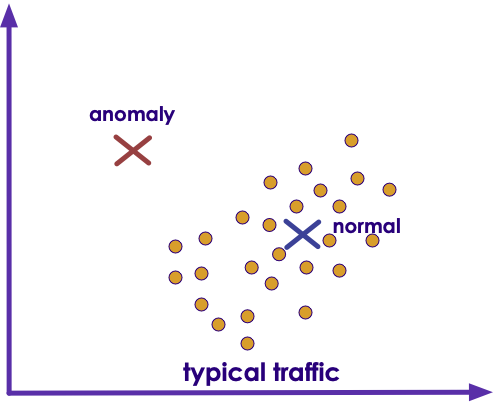<!-- TODO shiva {"left" : 3.37, "top" : 4.21, "height" : 2.84, "width" : 3.5} -->

 * Anomaly detection
     - Find fraud
     - Detect network intrusion attack
     - Discover problems on servers

 * Clustering does not necessarily detects fraud
     - But it points to unusual data
     - And the need for further investigation

Notes:

---

## Clustering Use Cases:  Google News

- Google News groups similar articles together.  This has to be done dynamically, as news stories change all the time

<!-- TODO shiva {"left" : 1.02, "top" : 1.88, "height" : 4.21, "width" : 8.21} -->

Notes:

---

## Clustering Use Case : Uber Trips

 * Figure out where demand is so more cars can be sent to that area  
 (we will do this lab!)

<!-- {"left" : 2.24, "top" : 1.83, "height" : 4.3, "width" : 5.77} -->

Notes:

---

## Clustering Use Cases: Segmenting

 * Marketing / Sales
     - Segment the customer base; for promotion / advertisement
     - Soccer mom  / new parents

 * Politics
     - Group potential voters for ad targeting
     - Farmers / Christians

 * See next slide

Notes:

TODO : add pictures

---

## Clustering Use Case: Customer Purchases @ Walmart

<!-- TODO shiva {"left" : 6.09, "top" : 4.85, "height" : 2.34, "width" : 3.9} -->

* Here is how Walmart is segmenting customer purchases
    - Pharmacy Runs
    - Strictly Grocery
    - Grocery and General Merchandise
    - Michaels Run
    - Party Trip
    - Toys
    - Electronics
    - Baby
    - Gallon of Milk
    - *Booze and Calories*

* **Question for class:What is the use case for this?**

Notes:

https://www.kaggle.com/c/walmart-recruiting-trip-type-classification

---

## Clustering Algorithms

*  **K-Means**
    * we seek to partition the observations into a pre-specified number of clusters

* **Hierarchical clustering**
    * We do not know in advance how many clusters we want
    * We end up with a tree-like visual representation of the observations, called a  **dendrogram**
    * View the clusterings obtained for each possible number of clusters, from 1 to n

Notes:

---

# K-Means

---

## Algorithm Summary

<!-- {"left" : 1.02, "top" : 1.24, "height" : 5.48, "width" : 8.21} -->

Notes:

http://machinelearningmastery.com/supervised-and-unsupervised-machine-learning-algorithms/

---

## K-Means Clustering

 * K-means clustering is a simple and elegant approach for partitioning a data set into K  **distinct, non-overlapping** clusters

 * To start K-Means, we need to specify the number of clusters (K)

 * Then the algorithm will assign each observation to  **exactly one cluster (no overlapping)**

 * Not all clusters will have the same size,  but the clusters are best separated

Notes:

---

## K-Means Visualized

<!-- {"left" : 1.73, "top" : 1.08, "height" : 3.4, "width" : 6.78} -->

 * Animations
     - [http://stanford.edu/class/ee103/visualizations/kmeans/kmeans.html](http://stanford.edu/class/ee103/visualizations/kmeans/kmeans.html)
     - [https://www.naftaliharris.com/blog/visualizing-k-means-clustering/](https://www.naftaliharris.com/blog/visualizing-k-means-clustering/)
     - [http://www.bytemuse.com/post/k-means-clustering-visualization/](http://www.bytemuse.com/post/k-means-clustering-visualization/)

Notes:

---

## K-Means Clustering Walkthrough

*  **Step 1** : Centroids are randomly seeded in the data.  
Example: 3 centroids (red, green, blue)
*  **Step 2** : Each point in the dataset is associated with its nearest centroid, as determined by a distance measurement.
*  **Step 3** : The centroid (geometric center) of the clustered points becomes the new centroid of that cluster. Each centroid  updated.
*  **Step 4** : Repeat steps 2 and 3 until convergence is reached (the points move less than the threshold amount).

  &nbsp; &nbsp; <!-- TODO shiva {"left" : 7.26, "top" : 1.51, "height" : 2.39, "width" : 2.48} -->
&nbsp; &nbsp;
&nbsp; &nbsp;

Notes:

---

## K-Means Visualization

<!-- TODO Shiva {"left" : 2.04, "top" : 0.9, "height" : 6.17, "width" : 6.18} -->

Notes:

Image credit : "Introduction to Statistical Learning", used with author's permission (http://www-bcf.usc.edu/~gareth/ISL/)

---

## Math Behind K-Means

 * Cluster into K-cluster, such that total inter-cluster variation is as small as possible

 * For example

     - For cluster Ck

     - Variations within this cluster is W(Ck)

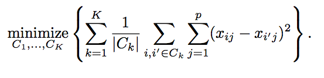

Notes:

Formulate images : "Introduction to Statistical Learning", used with author's permission (http://www-bcf.usc.edu/~gareth/ISL/)

---

## Evaluating K-means Performance

 * We use a method called **WSSSE - Within cluster sum of squares by cluster  / Within-Cluster-SS**

 * Remember K-Means works like this

     - Each observation is allocated to closest cluster

     - Measure distance between observation and cluster center

     - Keep iterating until max-K is reached  or change in successive WSSSE is less than the threshold value

 * Goal is to minimize WSSSE

Notes:

---

## MTCars Clustering

 <!-- TODO shiva {"left" : 1.16, "top" : 2.01, "height" : 3.94, "width" : 7.94} -->

 * We are going to cluster cars using two attributes : MPG & CYL
 * This is `mtcars` dataset
    - has 32 data points
 * Attributes
    - name - name of the car
    - mpg - Miles/(US) gallon
    - cyl - Number of cylinders
    - disp - Displacement (cu.in.)
    - hp - Gross horsepower
    - drat - Rear axle ratio

Notes:

---

## Starting With K = 2  (Find 2 clusters)

<!-- {"left" : 1.02, "top" : 1.75, "height" : 4.48, "width" : 8.21} -->

Notes:

---

## Starting With K = 4  (Find 4 clusters)

<!-- {"left" : 1.02, "top" : 1.34, "height" : 5.28, "width" : 8.21} -->

Notes:

---

## Evaluating K-Means With WSSSE

 * Goal is to  **minimize WSSSE** with  **reasonable effort**

 * We look for elbows - that indicates a reasonable clustering

 * After the elbow, the improvement is minimal

 *  **Question for class:** At  **k=32**  we have achieved  **WSSSE=0** , as in perfect fit !How is that?

<!-- {"left" : 1.02, "top" : 3.49, "height" : 3.5, "width" : 8.21} -->

Notes:

---

## K-Means Complexity

 * Finding optimal solution in K-means is NP-hard

 * For K=clusters and d=dimensions and n=observations

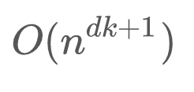<!-- {"left" : 4.26, "top" : 1.94, "height" : 0.61, "width" : 1.72} -->

 * Heuristic algorithms like Lloyd's can helpComplexity - linear (best case)

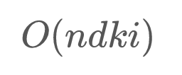<!-- {"left" : 4.36, "top" : 4.45, "height" : 0.53, "width" : 1.53} -->

- i = iterations

- worst case can be superpolynomial

Notes:

Source : https://en.wikipedia.org/wiki/K-means_clustering

---

## K-Means Drawbacks

 * Initial centroid positions are very important
     - Badly initialized centroids can lead to
        * sub-optimal solution ("local minima" phenomenon)
        * Can take too long to converge

 * No deterministic way to guarantee the clustering is optimal (NP hard)
     - Choose centroid randomly
     - Do several runs
     - Compare WSSSE score

 * `Lloyd's algorithm` can be used overcome some of these issues (outside the scope of this course)

Notes:

https://en.wikipedia.org/wiki/Lloyd%27s_algorithm

---

## K-Means Centroid Positioning DEMO

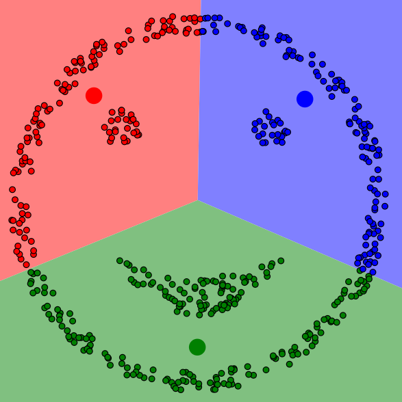<!-- TODO shiva {"left" : 7.67, "top" : 1.8, "height" : 1.79, "width" : 1.86} -->

 * Go to : https://www.naftaliharris.com/blog/visualizing-k-means-clustering/
 * Demo 1
     - Centroid positions : "I will pick"
     - Data : "smiley face"
     - Place centroid off center at the top
     - Step through
 * Demo 2 :
     - Centroid positions : "I will pick"
     - Data : "smiley face"
     - Place centroids evenly
     - Step through

Notes:

https://www.naftaliharris.com/blog/visualizing-k-means-clustering/

---

## How to Find the Best K?

<!-- TODO shiva {"left" : 2.37, "top" : 3.27, "height" : 3.22, "width" : 5.52} -->

-  No single standard to find 'best' number of clusters
-  **Elbow method**  is commonly used
- Increasing K beyond the elbow doesn't produce noticeable improvements in clustering

- Practical approach
    -  Number of Clusters (K) is usually determined by the application need
    - See Walmart data on shopping-cart grouping
        - 'grocery run',  'milk run'
        - ~37 categories

Notes:

---

## K-Means Revision

 *  **Cluster**

    A group of records that are similar

 *  **K**

    The number of clusters

 *  **WSSSE**

    Within-Cluster-Sum-of-Squares   /  Within-cluster-SS

Notes:

---

## K-Means Strengths & Weaknesses

 * **Strengths**
    * K-Means is simple, well-understood
    * Verification straightforward
    * Easy to parallelize, scales to large datasets

 * **Weaknesses:**
    * Value of k must be known in advance, which may mean running the exercise many times to get optimum results.
    * Initial centroid positions are important; may cause long convergence.
    * Outliers may bias results.
    * Clusters not broadly (hyper)spherical don't work well for k-means.
        - Use hierarchical clustering for these situations.

Notes:

Hierarchical Clustering is a cluster analysis that seeks to build a hierarchy of clusters.

---

# Hierarchical Clustering

---

## Algorithm Summary

<!-- {"left" : 1.02, "top" : 1.24, "height" : 5.48, "width" : 8.21} -->

Notes:

http://machinelearningmastery.com/supervised-and-unsupervised-machine-learning-algorithms/

---

## Hierarchical Clustering (Just a word!)

 * One potential disadvantage of K-means clustering is that it requires us to pre-specify the number of clusters K

 *  **Hierarchical clustering** is an alternative approach which does not require that we commit to a particular choice of K

 * It has an added advantage over K-means clustering in that it results in an attractive tree-based representation of the observations, called a  **dendrogram**

Notes:

---

## Visualizing Hierarchical Clustering

 * Input

<!-- {"left" : 2.16, "top" : 1.35, "height" : 5.27, "width" : 5.93} -->

Notes:

---

## Visualizing Hierarchical Clustering

 * Output:  **Dendogram**  (upside down tree)

<!-- {"left" : 1.02, "top" : 1.51, "height" : 4.94, "width" : 8.21} -->

Notes:

---

## Lab: KMeans

 *  **Instructor**:
     - Recommended to do the Uber lab as the last lab for the class

 *  **Overview**:
    - Experiment with KMeans

 *  **Approximate time**:
    - 20 - 40 mins

 *  **Instructions**:
     - Follow appropriate Python / R / Spark instructions
     - KMEANS-1 lab (mtcars)
     - KMEANS-2: Uber trips
     - Bonus Lab: KMEANS-3: Walmart shopping data

Notes:

---

## K-Means: Further Reading

 * "**Practical Statistics for Data Scientists**"  - O'Reilly Chapter 7

 * "**An Introduction to Statistical Learning**" - SpringerChapter 10

 * Wikipedia: [https://en.wikipedia.org/wiki/K-means_clustering](https://en.wikipedia.org/wiki/K-means_clustering)

Notes:

---

# Dimensionality Reduction

---

## Algorithm Summary

<!-- {"left" : 1.02, "top" : 1.24, "height" : 5.48, "width" : 8.21} -->

Notes:

http://machinelearningmastery.com/supervised-and-unsupervised-machine-learning-algorithms/

---

## Dimensionality Reduction

 *  Imagine we have too many variables/features (hundreds or even thousands!)

 * But this is good!?
     - Not always

 * Too many variables
    - complicate the model make it prone to overfit
    - Slow down the calculation
    - Require lots of compute power and resources

&nbsp;

| Feature 1 | F 2 | F 3 | ... | ... | F 99 | F  100 |
|-----------|-----|-----|-----|-----|------|--------|
|           |     |     |     |     |      |        |
|           |     |     |     |     |      |        |

Notes:

---

## Can We Reduce the Features?

* Can we use fewer features?

* Advantages
    - Efficient compute
        - Use compute more effectively, use less memory, reduce network traffic (in distributed scenarios)
    - Simpler model
        - Less susceptible for overfitting
        - Quicker to train

* However, we can not just drop features
     - We don't want to drop important features
     - Also we don't want to loose too much of 'signal' from original data

Notes:

---

## Why Dimensionality Reduction?

<!-- TODO shiva {"left" : 6.59, "top" : 5.25, "height" : 2.09, "width" : 3.5} -->

 *  **Reason 1: Efficient computation**

 * Say we have N observations with P features  
 X1, X2, X3, .... XP

 * We can visualize this data by2D scatter plots
     - X1 vs X2
     - X1 vs X2
     - So on...

 * For P variables there are
    - p * (p - 1) / 2 combinations!
    - P = 10 --> 45 plot combinations!
    - P = 100 --> 4500 plot combinations!

Notes:

---

## Why Dimensionality Reduction?

 *  **Reason 2: To mask data**
 * Imagine a dataset with sensitive data
     - Patients in medical trial data, valuable customer data like SSN
 * We want to make this data available to others.  
 But we also need to protect the data
    - we can mask sensitive data; here we are masking SSN

Notes:

---

## Why Dimensionality Reduction?

 *  **Reason 3: Eliminate duplicate data**

 * When multiple datasets are merged there may be duplicates
     - Could be coming from different departments / different equipment
     - Sometimes hard to detect

 * Here is an example of 'height' recorded in feet and cm.
     - They may not even agree, due to rounding errors

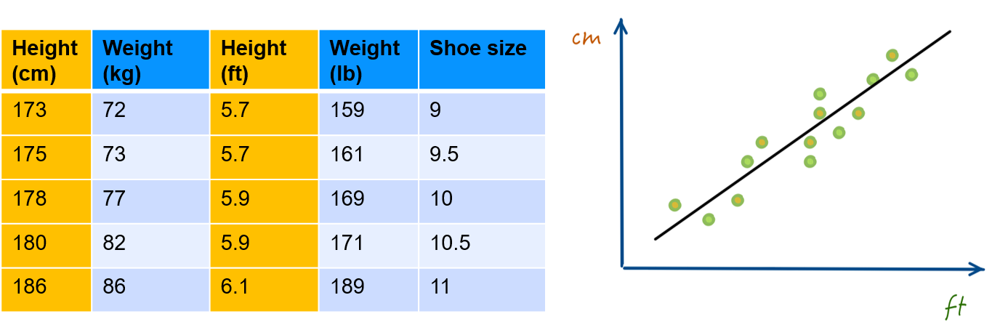<!-- {"left" : 1.02, "top" : 3.99, "height" : 2.68, "width" : 8.21} -->

Notes:

---

## Dimensionality Reduction Solution

 * Say we have a data set with 100 attributes
 * We want to create 10 attributes out of 100 and give this out for further analysis
     - Retains as much spirit' of original data
     - Hard to reverse engineer
 * Here we are creating **totally new attributes** (a,b,c) from original attributes

<!-- {"left" : 1.31, "top" : 3.44, "height" : 3.54, "width" : 7.63} -->

Notes:

---

## Analogy: Image Resolution Reduction

 * You want to email / SMS a beautiful sunset photo
 * original image is 10 MB - high resolution
 * SMS program will resize / reduce resolution for sending
     - Smaller size, but still maintains the image

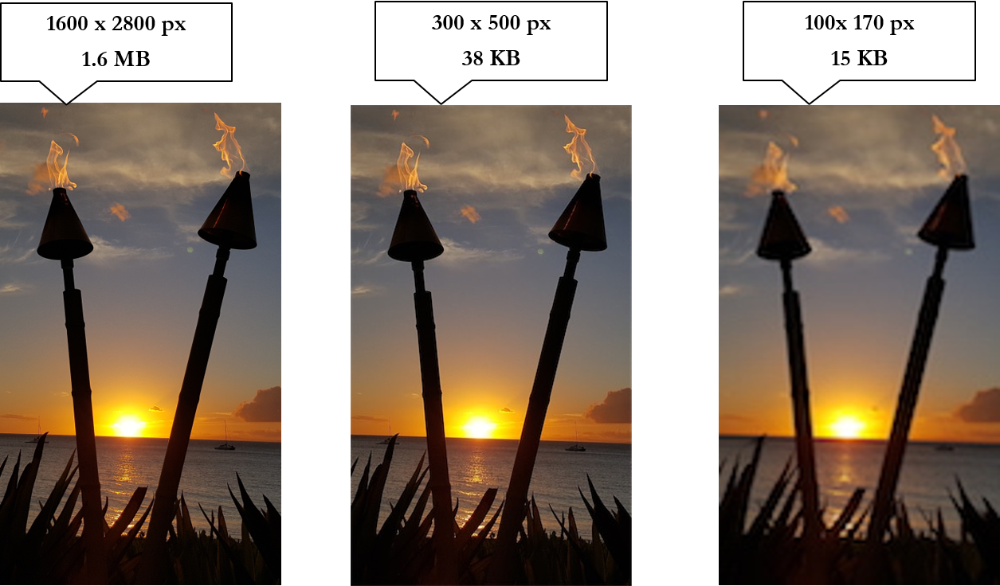<!-- {"left" : 1.97, "top" : 3.12, "height" : 3.7, "width" : 6.31} -->

Notes:

Image "Sunset at Mauii, Hawaii",  credit: Sujee Maniyam (author) - used with permission

---

## Dimensionality Reduction Problem

 * Reduce the number of variables

     - Not just simply dropping attributes!

 * Come up with (potentially, new) variables

     - that will reflect the nature of original data

     - Without loosing too much information

     - Reasonably easy to compute

     - And not easy to reverse-engineer

 * By far, the most popular is PCA ( **P** rincipal  **C** omponent  **A** nalysis)

Notes:

---

# Principle Component Analysis (PCA)

---

## Algorithm Summary

<!-- {"left" : 1.02, "top" : 1.24, "height" : 5.48, "width" : 8.21} -->

Notes:

http://machinelearningmastery.com/supervised-and-unsupervised-machine-learning-algorithms/

---

## Principle Component Analysis (PCA)

 * Not all dimensions are equally interesting.Can we reduce the  **'dimensionality** ' of data,  **without loosing too much information** ?

 * PCA does just that

 * It finds low-dimensional representation of data that contains as much as possible of  **variation**

 * PCA seeks a small number of dimensions that are as  **interesting**  as possible

 *  **Interesting**  is measured by the amount that the observations vary along each dimension

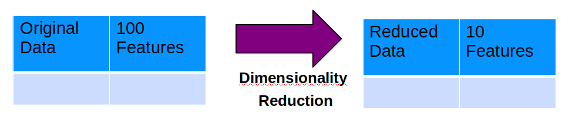<!-- TODO shiva {"left" : 1.02, "top" : 1.24, "height" : 5.48, "width" : 8.21} -->

Notes:

---

## PCA Example: Cultures of Internet in UK

<!-- {"left" : 8.03, "top" : 4.1, "height" : 3.21, "width" : 2.03} -->

 * This is an study by Oxford Internet Institute (OxIS)

 * 2500+ people were asked 15 questions in a survey
     - age
     - Hours on mobile
     - Hours on the internet
     - Etc.

 * The study summarized the findings in 4 PCA items
     - Enjoyable Escape
     - Instrumental efficiency
     - Problem generator
     - Social facilitator

Notes:

http://oxis.oii.ox.ac.uk/wp-content/uploads/2014/11/OxIS-2013.pdf

---

## PCA Theory: Eigen Vectors / Values

 * Say we are measuring the following responses
     - Age,   hours on the internet
     - 2 variables --> 2 dimensional dataset --> 2 Eigen Vectors
 * If we measure
     - Age, hours on the internet, hours on the mobile phone
     - 3 variables,  3 dimensional dataset --> 3 Eigen vectors
 * So number of Eigen vectors = number of dimensions
 * EigenVector is a direction - vertical, horizontal, 45' degrees ..etc
 * EigenValue is a number - denoting how much 'variance' in the data in that vector's direction
 * Eigen Vector and Eigen Value go together(E Vector,   E Value)
 * EigenVector with highest EigenValue (meaning lot of variance in that direction)  becomes a Principal Component

Notes:

---
## Eigen Vector Example

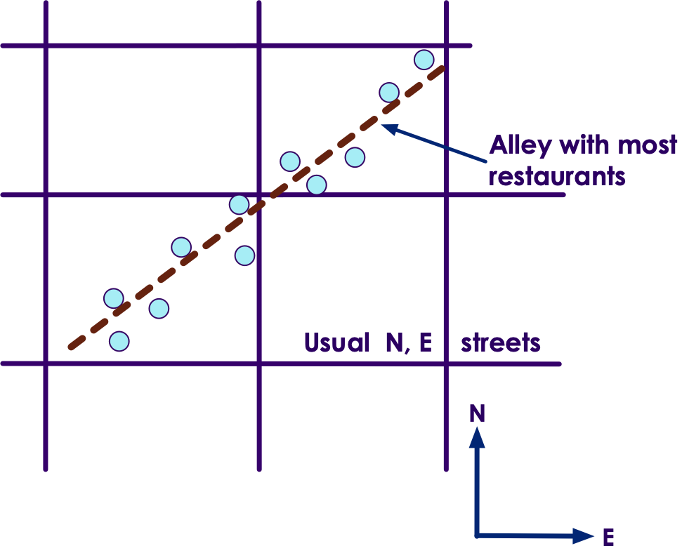

- Imagine we are in a town with bunch of bars and restaurants

- if we only travel on streets North and East, we wouldn't see most of the restaurants

- But if we walk down the alley way, we will encounter most of the restaurants and bars

- So the alleyway is a better street

---

## PCA Math: Eigen Vectors

 * In the plot below, EigenVector (ev1) is shown that crosses the data with 'highest variance'

<!-- {"left" : 2.21, "top" : 1.96, "height" : 4.04, "width" : 5.83} -->

Notes:

Image adopted with thanks to: https://georgemdallas.wordpress.com/2013/10/30/principal-component-analysis-4-dummies-eigenvectors-eigenvalues-and-dimension-reduction/

---

## PCA Math: Eigen Vectors

 * But we have a 2-dimensional data -> 2 eigen vectors

 * To maximize coverage the second EigenVector will be orthogonal (90 degrees) to the first one (ev1)

 <!-- {"left" : 2.21, "top" : 2.86, "height" : 4.04, "width" : 5.83} -->

Notes:

Image adopted with thanks to: https://georgemdallas.wordpress.com/2013/10/30/principal-component-analysis-4-dummies-eigenvectors-eigenvalues-and-dimension-reduction/

---

## PCA Math: Eigen Vectors

 * The EigenVectors have given us more useful axis to frame data

 * Remember, the data hasn't changed at all, we are just looking at it from a different perspective

<!-- {"left" : 2.3, "top" : 2.9, "height" : 4.11, "width" : 5.65} -->

Notes:

Image adopted with thanks to: https://georgemdallas.wordpress.com/2013/10/30/principal-component-analysis-4-dummies-eigenvectors-eigenvalues-and-dimension-reduction/

---

## PCA on Oxford Internet Study

<!-- {"left" : 3.37, "top" : 1.23, "height" : 5.51, "width" : 3.51} -->

 * Say there were
     - 2500 people interviewed == 2500 observations
     - 15 questions = 15 dimensions = 15 EigenVectors & Values

 * Say our 15 Eigen Values are (in descending order)  
 [  **`25, 22, 15, 13`** , 8, 5, 4, 3, 2, 1, 0.7, 0.5, 0.4,  0.3, 0.1 ]

 * We see the first 4 have the biggest values
     - Indicating 4 directions with lots of information

 * We have identified our 4 Principal Components (PC)

 * We have gone from 15 attributes to 4  (call them PC1, PC2, PC3, PC4)

Notes:

---

## Principal Components

 * First Principal Component (PC1)  has the largest variance (EigenValue)

 * Second Principal Component has second largest variance that is uncorrelated to PC1

     - Orthogonal vector to PC1

Notes:

---

## PCA Example: USArrests Data

<!-- {"left" : 3.1, "top" : 2.48, "height" : 4.05, "width" : 4.05} -->

 * N=50,  p=4

 * PCA was performed after standardizing each variable to have mean zero and standard deviation one

Notes:

Example from "An Introduction to Statistical Learning"  Chapter 10

---

## PC Vectors and BiPlot

<!-- {"left" : 0.28, "top" : 1, "height" : 1.93, "width" : 5.44} -->

<!-- {"left" : 5.63, "top" : 2.63, "height" : 4.28, "width" : 4.28} -->

Notes:

Diagram with thanks to : "An introduction to Statistical Learning" book.

---

## Understanding BiPlot

<!-- TODO shiva {"left" : 5.63, "top" : 2.63, "height" : 4.28, "width" : 4.28} -->

 * Biplot displays both

     - Principal Component scores (left & lower axis)

     - And Principal Component loadings (top & right axis)

 * States are mapped according their PC1 / PC2 value  (left / lower axis)

 * Orange arrows indicated the first 2 PC vectors (axis on top and right)

     - Loading for 'Rape' on PC1 0.54  (top axis)

     - Loading for 'Rape' on PC2 0.17  (right axis)

Notes:

---

## Understanding BiPlot

<!-- TODO shiva {"left" : 5.63, "top" : 2.63, "height" : 4.28, "width" : 4.28} -->

 * Crime related variables (Murder, Assault and Rape) are close to each other
 * UrbanPop is far from other three
     - Less correlated with others
 * States with large PC1 scores have high crime rates
     - California, Nevada, Florida
 * States with negative PC1 scores low crime rates
     - North Dakota
 * California also high on PC2 indicating more urbanized.While Mississippi and NC are least urbanized
 * States close to zero on both components like Indiana have average crime and urbanization

Notes:

---

## Effects of Scaling Variables Before PCA

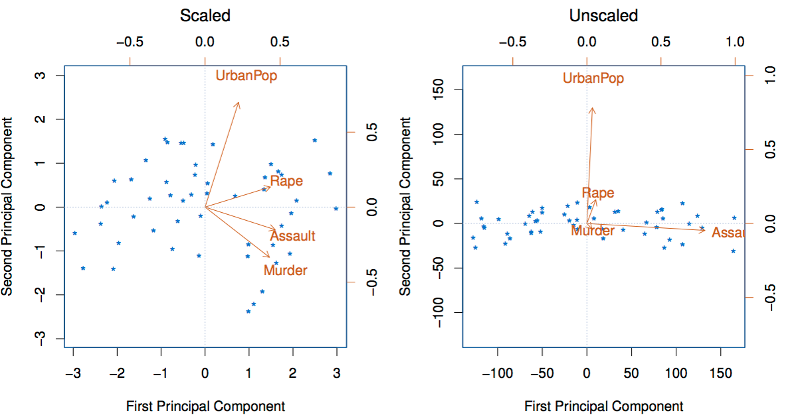<!-- TODO shiva {"left" : 1.02, "top" : 1.24, "height" : 5.48, "width" : 8.21} -->

 * Left : Scaled data, centered at zero, with standard deviation one
 * Right: Unscaled data
 * With unscaled data we see 'Assault' having the largest loading on PC1 (b/c it has the highest variance)
 * So it is exerting a lot of influence on the data
 * So it is recommended to  **scale the data before performing** a PCA

Notes:

Diagram with thanks to : "An introduction to Statistical Learning" book.

---

## Evaluating PCA - Scree Plot

 * We use a  **scree plot** to understand PCA
 * Left chart plots Variance for each PC component.
     - First component (PC1) has the most (62%)
     - Second one PC2 around 25%
     - PC4 hast the least
 * Right graph shows 'accumulated' variance when combining PCs.  We are moving towards ONE

<!-- {"left" : 2.31, "top" : 4.06, "height" : 3.07, "width" : 5.63} -->

Notes:

---

## How Many Principals Components to Use?

 * In general an [n x p] matrix has   min( n-1, p) distinct principal components

 * We aren't interested in all of them.

 * We want to pick fewest PCs that will give us a good understanding of data

 * So how many?

 * There is no single (or simple) answer to this question!

 * Scree plot can help to gauge the variance for each PC

Notes:

---

## Choosing PCs - Practical Advice

 <!-- TODO Shiva -->

 * Adhoc

     - Start with PC components that give you enough coverage on variance (say 70%)

     - Then add more PCs until we don't discover any more patterns in the data

 * Another

     - Feed PCA'd data into a Supervised learning algorithm  (e.g. regression or classification)

     - Then use evaluation methods for Supervised Learning to tweak the number of PCs

Notes:

---

## Generalized PCA Algorithm

* From n-dimension to k-dimension   (k < n)
     - Find k vectors in Rn that will minimize the combined projection error of the data in Rn

* **Algorithm overview**
    1. Preprocessing, or feature scaling (normalization)
    2. Compute the "covariance" matrix
        - How each feature is related to another
    3. Find the "eigenvectors" of the covariance matrix
    4. Find the important principal components
      - Transform your features into k-dimension

Notes:

---

## Normalizing Data

| id | age | salary  |
|----|-----|---------|
| 1  | 32  | 60,000  |
| 2  | 26  | 50,000  |
| 3  | 40  | 100,000 |
| 4  | 37  | 75,000  |

* In this data variables are all in different ranges
     - Age : 26- 40
     - Salary : 50,000  - 100,000

---

## Normalized Data

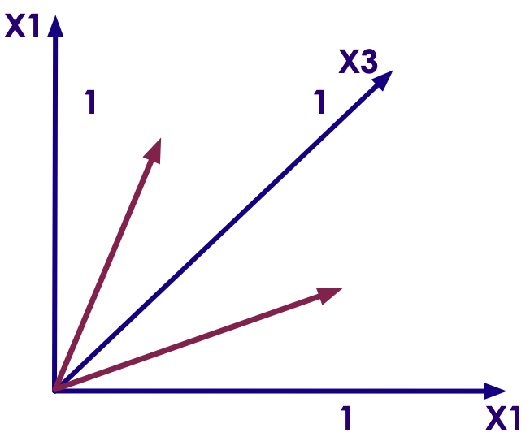<!-- TODO shiva {"left" : 5.94, "top" : 3.82, "height" : 3.24, "width" : 3.89} -->

* Age values are[ 32, 26, 40, 37]
     - Min = 26,  Max = 40
     - Range = 40 - 26 = 24
* Normalize (age) = (value - min) / range
* Scaled data is between 0.0 and 1.0

| id | age | salary  | age scaled   (value - min) / range     |
|----|-----|---------|--------------------------------------|
| 1  | 32  | 60,000  | = (32 - 26)/ (40 - 26)  = 0.428571429 |
| 2  | 26  | 50,000  | = (26 - 26) / (40 - 26)   = 0.0        |
| 3  | 40  | 100,000 | = (40 - 26) / (40 - 26)   = 1.0        |
| 4  | 37  | 75,000  | = (37-26) / (40 - 26)   = 0.7857       |

---

## Restoring Original Data

<!-- TODO shiva {"left" : 2.73, "top" : 3.56, "height" : 3.72, "width" : 4.79} -->

 * Yes, you can restore original data

 * If we took all Eigen Vectors, then we can restore the original data exactly

 * But usually we only select a few Eigen Vectors -> you will lose some precision

  * Apply the same transforms backwards to the new points

 

 <!-- TODO shiva {"left" : 2.73, "top" : 3.56, "height" : 3.72, "width" : 4.79} -->

 * See the beach picture (we can not 100% restore original image from a down-sampled image)

Notes:

---

## How to Chose K

* We have optimized the projection error  
<!-- {"left" : 1.9, "top" : 1.42, "height" : 1.3, "width" : 6.45} -->

* And we have reduced the total variation in the data  
<!-- {"left" : 3.28, "top" : 4.26, "height" : 1.34, "width" : 3.69} -->

* Retain 99% of the variance means that  
<!-- {"left" : 6.94, "top" : 6.36, "height" : 0.84, "width" : 3.19} -->

Notes:

You may choose 95%, 90%, etc

---

## When to Use PCA

 * Good use of PCA
     - Compression of data for reduce resource requirements
     - Speed up supervised learning
     - Visualization
        * Reducing to K = 2 (two dimensional) or K = 3 (three dimensional)

 * Bad use of PCA
     - To prevent overfitting
     - Your thinking: less features, less likely to overfit
     - Most likely it is not a good idea, since the data is the same
     - Rather, use regularization parameter lambda (λ) to reduce overfitting

Notes:

---

## Practical Advice

 * Use PCA to speed up supervised learning! Why?

 * It is easy to get vectors of sizes like 10,000

 * Just think of a 100x100 pixel matrix for classification

 * With PCA, you may get 1,000 instead of 10,000

 * And run 10 times faster

Notes:

Image credit: https://www.1st-art-gallery.com/Joseph-Mallord-William-Turner/Rain-Steam-And-Speed-The-Great-Western-Railway.html

---

## Machine Learning Pipelines

 * Plan 1
     - Data gathering
     - PCA
     - Other algorithms

 * Plan 2 : Better plan
     - Data gathering
     - ~~PCA~~
     - Other algorithms

 * Try without PCA first
     - PCA may not be needed
     - It is used for specific purposes

Notes:

---

## PCA Implementation

 * Two ways to implement PCA

 * Option 1 : Compute the matrices using linear algebra
     - Not very stable numerically
     - Errors build up
     - Large matrix size

 * Option 2 : Compute eigenvectors iteratively
     - Almost as precise as above
     - But much faster

Notes:

---

## Lab: PCA

 *  **Overview**

    Reduce data dimension with PCA

 *  **Approximate Time**

    30 mins

 *  **Instructions**

    Follow  appropriate Python, R, or Scala instructions

Notes:

---

## Review Questions

Notes:

---

## PCA: Further Readings

 * ["Internet Cultures of UK"](http://oxis.oii.ox.ac.uk/wp-content/uploads/2014/11/OxIS-2013.pdf) study by Oxford Internet Institute

 * [PCA for dummies](https://georgemdallas.wordpress.com/2013/10/30/principal-component-analysis-4-dummies-eigenvectors-eigenvalues-and-dimension-reduction/) - a nice blog post by George Dallas

 * [Intro to PCA](https://valiancesolutions.com/introduction-to-principal-component-analysis)

Notes:
