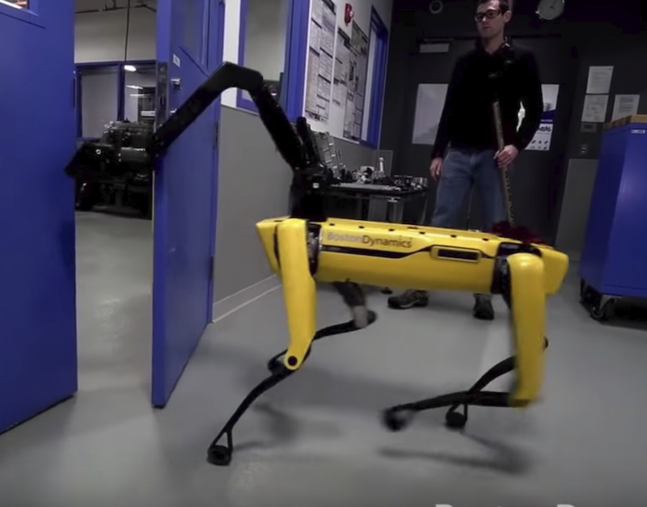
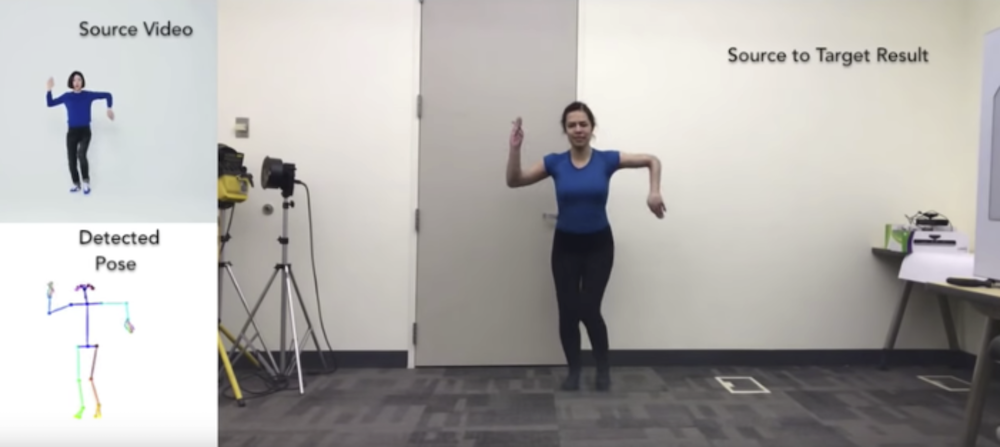

# Videos and Demos

---

# Machine Learning Basics

---
## Machine Learning Intro from Google

<!-- {"left" : 3.13, "top" : 2.3, "height" : 5.84, "width" : 11.23} -->

[Link](https://www.youtube.com/watch?v=HcqpanDadyQ)

---

# Advances in Hardware

---

## Advances in Hardware

<!-- {"left" : 4.97, "top" : 1.89, "height" : 5.23, "width" : 7.55} -->

 * [Google TPU](https://www.youtube.com/watch?v=UsDhVx6cOrw) (up to 5 min mark)

---

# AI & Data

---
## AI Scaling with Data

<!-- {"left" : 3.27, "top" : 2.19, "height" : 5.89, "width" : 10.96} -->

[Video by Andrew Ng](https://www.youtube.com/watch?v=LcfLo7YP8O4)

---

# Reinforcement Learning

---

## Reinforcement / Neural Net Demo: Alpha GO

<!-- {"left" : 3.61, "top" : 2.17, "height" : 5.81, "width" : 10.28} -->

[Link](https://www.youtube.com/watch?v=9xlSy9F5WtE)

---

# Misc

---

## Advances in Robotics

<!-- {"left" : 4.48, "top" : 1.89, "height" : 6.69, "width" : 8.54} -->

[Link](https://www.youtube.com/watch?v=8vIT2da6N_o)

---

## Closing Demo: Everybody Dance Now

<!-- {"left" : 3.2, "top" : 2.55, "height" : 4.97, "width" : 11.11} -->

 [Link](https://www.youtube.com/watch?v=PCBTZh41Ris)
