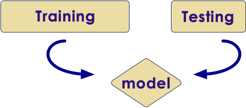

# ML Backup slides
---
## Data Science


<!-- {"left" : 7.37, "top" : 1.14, "height" : 2.44, "width" : 2.6} -->

 * **Data Science:** Deriving intelligence from data

 * For example, a real estate company can use data science to figure out which types of homes to build to maximize profits

 * A machine learning algorithm can learn from the past data and predict house prices for new houses coming on market

&nbsp;

| Bedrooms (input 0) | Bathrooms (input 1) | Size (input 2) | Sale Price (in thousands) (we are trying to predict) |
|--------------------|---------------------|----------------|------------------------------------------------------|
| 2                  | 0                   | 1499           | 229                                                  |
| 2                  | 1                   | 1799           | 319                                                  |
| 4                  | 2                   | 2399           | 599                                                  |
| 3                  | 1                   | 1999           | 499                                                  |
| 3                  | 2.4                 | 2199           | 549                                                  |

<!-- {"left" : 0.25, "top" : 5.6, "height" : 3.19, "width" : 9.75, "columnwidth" : [1.61, 1.81, 1.33, 5]} -->


Notes:

---
## Supervised Learning Methodology


 * Split the data set into

     - **Training set:** Train the algorithm (training set should represent data well enough)

     - **Test set:** Validate the model

 * We do this, so we can test the model without the model cheating

 * Start with 80% training, 20% test
    - Tweak the dials to increase or decrease the proportion

<!-- {"left" : 2.69, "top" : 5.16, "height" : 2.14, "width" : 4.87} -->


Notes:

Facebook used 95%/5% `Understanding text from scratch`

---
## How to do Machine Learning


 *  **Collect data**
    More data we have, the better the algorithms become.  This data can come from internal logs (clickstreams) or external sources (credit scores of customers)

 *  **Prepare Data**
    Raw data is hardly in a form to be used.  It needs to be cleansed, tagged and curated before ready to use

 *  **Train a model**
    Feed the training data to model so it can learn

 *  **Evaluate the model**
    Test the model accuracy

 *  **Improve the model**
    Either by adding more training data, choosing a different algorithm ..etc.

Notes:

---
## ML Terminology

| Algorithm                                             	| Example                                     	| Input                                              	| Output                                      |
|-------------------------------------------------	|-----------------------------------------	|----------------------------------------------------	|-------------------------------------	|
| Classification - produces 'discrete' or 'qualitative' 	| Spam or not                                 	|**Features**<br/>(email text, origin IP address)        	|**Label**<br/>(Spam / Not-Spam)                  |
| Regression - produces 'continuous' or 'quantitative'  	| Weather forecasting, predicting temperature 	|**Variables**<br/>(current temperature, pressure ..etc) 	|**Target**<br/>(predicted temperature -50.5 ' F) 	|

<!-- {"left" : 0.25, "top" : 1.55, "height" : 2.75, "width" : 9.75} -->


Notes:

---
## FE: Group Discussion

  * **Problem:**
    - A comment is left on the website.  Determine if it is a 'spam' comment or legitimate comment

  * **Data we have:**
    - Comment text
    - IP address of user

  * **Discuss:**
    - What other data you may need to determine if the comment is 'spam' ?
    - How can we acquire the data?


Notes:

---
## FE: Dealing With Time

  * Usually timestamps are stored in two formats:
    - Human readable format: '2017-02-01 14:10:45 PST'
    - Unix timestamp: 1489792175 (time elapsed since 1970-01-01 00:00:00)
  * Sometimes we need to 'slice / dice' timestamp

  * Hypothesis:  
  "On Facebook users click on photos more during lunch time"
    - Include 'time of day' on model calculation

  * Some other interesting attributes:
    - 'time of day'  (work hours,   after hours)
    - 'day of week'  (Mon / Tue / Wed ...   work day  / weekend)

  * **Question for class:**
    - Any other time based behavior?


Notes:

Use https://www.epochconverter.com/ to easily convert unix time and human readable time

---
## Bottom Up AI Success Stories


 * Image recognition

 * Translation

 * Self driving cars

<!-- {"left" : 0.64, "top" : 4.31, "height" : 2.88, "width" : 4.33} -->
 &nbsp;&nbsp;&nbsp;&nbsp; <!-- {"left" : 5.3, "top" : 4.31, "height" : 2.88, "width" : 4.31} -->


Notes:


---
## Incredible Growth of AI Power

<!-- {"left" : 5.38, "top" : 1.21, "height" : 5.73, "width" : 4.77} -->

 * Since 2012, the amount of compute used in the largest AI training runs has been increasing exponentially with a 3.5 month-doubling time

 * by comparison, Moore's Law had an 18-month doubling period

 * Source: https://blog.openai.com/ai-and-compute/

Notes:

---
## 2012 - AI Recognizes Cats in YouTube Videos

<!-- {"left" : 6.51, "top" : 1.3, "height" : 2.98, "width" : 3.45} -->

- 2012 Google created a neural network that can 'identify' cats from YouTube videos

- Up until now, traditional machine learning algorithms are trained on labeled data.  
    - So to train an algorithm to distinguish between cats and dogs, we need thousands of images labeled as 'cat' and thousands of images labeled as 'dog'
    - labeling takes a lot of work, and not a lot of labeled data is available


---
## 2012 - AI Recognizes Cats in YouTube Videos

<!-- {"left" : 6.51, "top" : 1.3, "height" : 2.98, "width" : 3.45} -->

- They built a huge neural network with **1 Billion+** connections and trained it on **16,000 CPU cores (distributed)**

- The network watched a lot of stills from YouTube videos and 'intuitively learned' to recognize cats
    - no one told the network what a cat looks like, it is 'self-taught'

- References:
    - [1](https://googleblog.blogspot.com/2012/06/using-large-scale-brain-simulations-for.html), [2](https://www.wired.com/2012/06/google-x-neural-network/)


Notes:

- References
    - ['Using large-scale brain simulations for machine learning and A.I.' - Google Blog](https://googleblog.blogspot.com/2012/06/using-large-scale-brain-simulations-for.html)
    - [Google AI learns to find cat videos -- Wired magazine](https://www.wired.com/2012/06/google-x-neural-network/)

---
## Data Science vs. Machine Learning

 * **Data Science** works with existing data and derive intelligence

 * **Machine Learning** learns from existing data and predicts on new/unseen data

 * The definitions are not clear-cut,  some people use these interchangeably

<!-- {"left" : 1.02, "top" : 4.17, "height" : 3.94, "width" : 8.21} -->


---

## Common Mistakes in Model Validation

* **Mistake: Using overly simplistic validation methods**
    - Model might appear to be working well

* **Mistake: Using more parameters (20 attributes) than actual observations (10 observations)**
    - Model will 'memorize' the data rather than learning
    - Will do well on testing data / but poorly on new data

* Solution:
    - Use more data


Notes:

---

## Clustering VS PCA


 * Both Clustering and PCA seek to simplify the data via small number of summaries / attributes

 * PCA looks to find a low-dimensional representation of the observations that explain a good fraction of the variance

 * Clustering looks to find homogeneous subgroups among the observations

Notes:


---

# Linear Regression

---

##  Linear Regression Code ( R )


```
> house.sales = read.csv("house-sales.csv")
27,000 entries

## run mlr
> house.lm = lm(SalePrice ~ Bedrooms + Bathrooms + SqFtTotLiving + SqFtLot,  
              data = house.prices, na.action = na.omit)

> summary(house.lm)

Call:lm(formula = SalePrice ~ Bedrooms + Bathrooms + SqFtTotLiving +     SqFtLot,

data = house.prices, na.action = na.omit)

Residuals:
     Min       1Q   Median       3Q      Max
 -1955089  -114575   -13670    81734  9081935

Coefficients:
                 Estimate   Std. Error t value             Pr(>|t|)
(Intercept)   106303.30612   6254.77558  16.996 < 0.0000000000000002 ***
Bedrooms      -65211.73613   2151.67471 -30.307 < 0.0000000000000002 ***
Bathrooms      16274.19139   2970.77108   5.478         0.0000000434 ***
SqFtTotLiving    277.84805      2.66890 104.106 < 0.0000000000000002 ***
SqFtLot           -0.07457      0.05472  -1.363                0.173    

---Signif. codes:  0 '***' 0.001 '**' 0.01 '*' 0.05 '.' 0.1 ' ' 1

Residual standard error: 246400 on 27058 degrees of freedom
Multiple R-squared:  0.4835,	Adjusted R-squared:  0.4834
F-statistic:  6332 on 4 and 27058 DF,  p-value: < 0.00000000000000022

```
<!-- {"left" : 0, "top" : 1.19, "height" : 3.69, "width" : 10.25} -->


Notes:


---

## Interpreting Results


```
> summary(house.lm)

Call:lm(formula = SalePrice ~ Bedrooms + Bathrooms + SqFtTotLiving +     SqFtLot,
          data = house.prices, na.action = na.omit)

Residuals:
    Min       1Q   Median       3Q      Max
-1955089  -114575   -13670    81734  9081935

Coefficients:
                  Estimate   Std. Error t value             Pr(>|t|)
(Intercept)   106303.30612   6254.77558  16.996 < 0.0000000000000002 ***
Bedrooms      -65211.73613   2151.67471 -30.307 < 0.0000000000000002 ***
Bathrooms      16274.19139   2970.77108   5.478         0.0000000434 ***
SqFtTotLiving    277.84805      2.66890 104.106 < 0.0000000000000002 ***
SqFtLot           -0.07457      0.05472  -1.363                0.173    

---Signif. codes:  0 '***' 0.001 '**' 0.01 '*' 0.05 '.' 0.1 ' ' 1
```
<!-- {"left" : 0, "top" : 4.1, "height" : 2.55, "width" : 10.25} -->


 * Adding one extra 'sqftTotLiving' space increases the house price by $277.85

     - While holding all other variables the same

Notes:


---

## Interpreting Results


```
> summary(house.lm)

Call:lm(formula = SalePrice ~ Bedrooms + Bathrooms + SqFtTotLiving +     SqFtLot,
         data = house.prices, na.action = na.omit)

Residuals:
    Min       1Q   Median       3Q      Max
-1955089  -114575   -13670    81734  9081935

Coefficients:
                 Estimate   Std. Error t value             Pr(>|t|)
(Intercept)   106303.30612   6254.77558  16.996 < 0.0000000000000002 ***
Bedrooms      -65211.73613   2151.67471 -30.307 < 0.0000000000000002 ***
Bathrooms      16274.19139   2970.77108   5.478         0.0000000434 ***
SqFtTotLiving    277.84805      2.66890 104.106 < 0.0000000000000002 ***
SqFtLot           -0.07457      0.05472  -1.363                0.173    

---Signif. codes:  0 '***' 0.001 '**' 0.01 '*' 0.05 '.' 0.1 ' ' 1

```
<!-- {"left" : 0, "top" : 4.1, "height" : 2.55, "width" : 10.25} -->

  * Question for class:
     - Interpret parameters for 'Bedrooms'


Notes:


---

## Calculating AIC - Sample Code ( R )


```R
options(scipen=999)
library(MASS)

house.prices = read.csv("house-sales-full.csv")

# using all attributes for LM
house.lm.full <- lm(SalePrice ~ SqFtTotLiving + SqFtLot + Bathrooms + Bedrooms +
                                BldgGrade + PropertyType + NbrLivingUnits + SqFtFinBasement +
                                YrBuilt + YrRenovated + NewConstruction,
                    data=house.prices, na.action=na.omit)

step <- stepAIC(house.lm.full, direction="both")

step
```
<!-- {"left" : 0, "top" : 1.27, "height" : 2.5, "width" : 10.25} -->

Notes:


---

## Calculating AIC Sample Code ( R )


```R
# original LM formula
house.lm.full <- lm(SalePrice ~ SqFtTotLiving + SqFtLot + Bathrooms + Bedrooms +
                                BldgGrade + PropertyType + NbrLivingUnits + SqFtFinBasement +
                                YrBuilt + YrRenovated + NewConstruction,
                    data=house.prices, na.action=na.omit)
```
<!-- {"left" : 0, "top" : 4.03, "height" : 1.01, "width" : 10.25} -->

```R

lm(formula = SalePrice ~ SqFtTotLiving + Bathrooms + Bedrooms +     
                         BldgGrade + PropertyType + SqFtFinBasement +
                         YrBuilt + NewConstruction,
            data = house.prices, na.action = na.omit)

Coefficients:
             (Intercept)              SqFtTotLiving                  Bathrooms
              5730856.779                    170.255                  37950.708
                   Bedrooms                  BldgGrade  PropertyTypeSingle Family
                -44124.897                 122498.089                  14862.934
    PropertyTypeTownhouse            SqFtFinBasement                    YrBuilt
                  77562.844                      8.153                  -3286.098
       NewConstructionTRUE                   7886.546  
```
<!-- {"left" : 0, "top" : 5.53s, "height" : 2.66, "width" : 10.25} -->

 *  **stepAIC**  has come up with a new formula

 * Dropped attributes : SqFtLot, NbrLivingUnits, YrRenovated, and NewConstruction.

Notes:


---

---

# PCA

---


## Step-1. Normalization


 * Normalized vector[ (30 - 22) / 48, (45 - 22) / 48, .... (22 - 22) / 48 ] [0.17, 0.48,  0.58, 1.00, 0.79, 0.06, 0.00]

 * Result

     - Our features (black) are all in the range of -1 to  1

 * Other possibility, mean based: (x - mean) / range

     - Mean = 43.14G
G
     - [ (30 - 43.14) / 48, (45 - 43.14) / 48, .... (22 - 43.14) / 48 ] = [ -0.274,   0.039, 0.143, 0.560, 0.351, 0.378, 0.440 ]


Notes:

---


## Quantization

 * Sometimes we do want the ML model to interpret categorical variables
    - Grades:  A > B > C > D
    - Domain specific meaning
 * For example, colors in physics has a numeric meaning:
    - Red: 480 THz frequency of light
    - Green: 600 THz
 * This might allow our models to make inferences
    - e.g., Orange is close to red on the spectrum, but more distant from violet.

<!-- {"left" : 1.83, "top" : 5.77, "height" : 2.79, "width" : 6.59} -->


Notes:

Image credit : https://study.com/academy/lesson/the-nature-of-light-origin-spectrum-color-frequency.html


---


## Scaling Example

<br/>

```python
import pandas as pd
data = pd.DataFrame ( { 'age' : [33,45,42,35,60],
                        'income' : [40000,80000,120000,32000,110000]
                    })
## z-score scaling
data_scaled_z =  (data - data.mean()) / data.std()
## min-max scaling
data_scaled_mm = (data - data.min()) / (data.max() - data.min())
```
<!-- {"left" : 0, "top" : 1.12, "height" : 2.03, "width" : 10.25} -->

- Here our original data (left) , z-scaling (middle) is on a uniform distribution;   and min-max scale (right) is between 0 to 1.0

 &nbsp; <!-- {"left" : 0.38, "top" : 5.31, "height" : 3.46, "width" : 2.83} -->  &nbsp; <!-- {"left" : 3.14, "top" : 5.25, "height" : 3.46, "width" : 3.42} --> <!-- {"left" : 6.49, "top" : 5.38, "height" : 3.46, "width" : 3.62} -->

---

## Scaling Example 2

```python
import pandas as pd

data = pd.DataFrame ( { 'age' : [33,45,42,35,60],
                        'income' : [40000,80000,120000,32000,110000],
                        'home_owner' : ['no', 'yes', 'no', 'yes', 'yes' ],
                        'marital_status' : ['single', 'married', 'divorced', 'single', 'married'],
                        'approved' : ['no', 'yes', 'yes', 'no', 'yes']
                    })
data

data['age_z'] = (data['age'] - data['age'].mean()) / data['age'].std()
data['income_z'] = (data['income'] - data['income'].mean()) / data['income'].std()
data
```
<!-- {"left" : 0, "top" : 1.28, "height" : 2.22, "width" : 10.25} -->


<!-- {"left" : 0.17, "top" : 4.82, "height" : 1.97, "width" : 4.64} --><!-- {"left" : 4.81, "top" : 4.92, "height" : 2.1, "width" : 5.3} -->

Notes:

---
