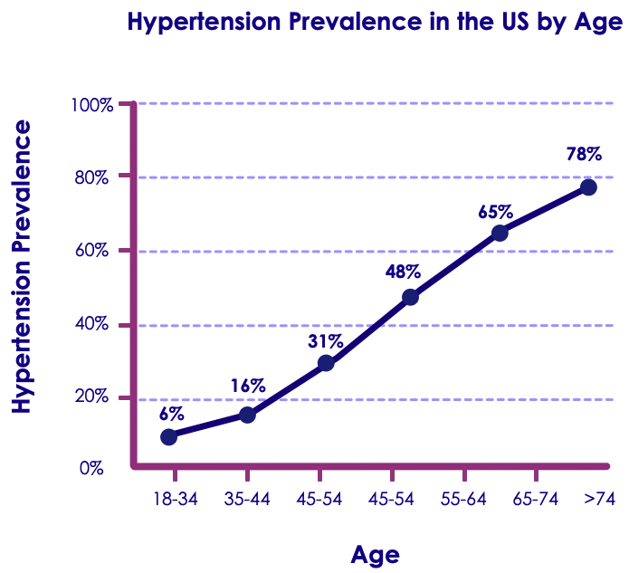
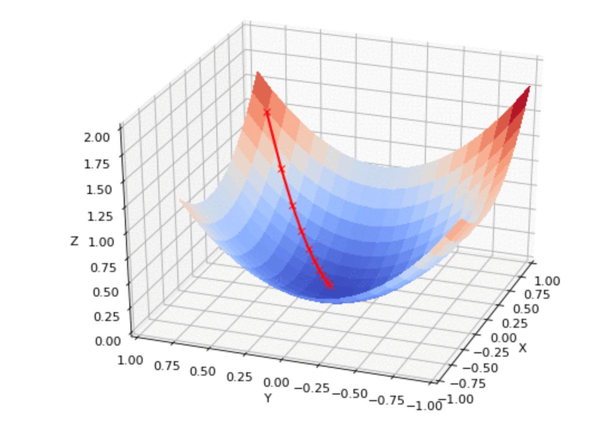

# Session: Linear Regression

---

## Lesson Objectives

  * Understand linear regression with one variable
  * Introduce the idea of the model
  * Explain the gradient Gradient Descent
  * descent solution
  * Understand linear regression with many variables

---

## What Is Linear Regression?

  * Data

<!-- {"left" : 1.79, "top" : 1.73, "height" : 3.46, "width" : 6.67} -->

* Input variables => continuous output

---

## Linear Regression Example

  * Blood pressure as function of age

<!-- {"left" : 2.08, "top" : 2.47, "height" : 5.56, "width" : 6.1} -->

Notes:
* Source: http://tmedweb.tulane.edu/pharmwiki/doku.php/hypertension_pathophysiology

---

## House Price vs Size

<!-- {"left" : 2.25, "top" : 1.33, "height" : 4.23, "width" : 5.76} -->

* Not a perfect fit
* More predictors may be needed

Notes:

* Source: https://www.statcrunch.com/5.0/viewreport.php?reportid=5647

---

# One Variable

---

## Linear Regression With One Variable
  * Univariate (simple) linear regression

  * One input => One output
  * x => y
  * Our hypothesis (or model)

    - y = T0 + T1 x

---

## Problem: Tip Calculation

* Bill => Tip
* Imagine we do not know 15% rule
* Looks like a linear dependency

<!-- {"left" : 1.02, "top" : 3.25, "height" : 4.11, "width" : 8.21} -->

---

## Solution Attempt
  * Hypothesis
 	tip = T0 + T1 bill
  * But what are T0 and T1?
  * Say T0=0 and T1=0.15
  * Not a fantastic success

| Meal # | Bill($) | Tip ($) | Prediction |
|--------|---------|---------|------------|
| 1      | 50      | 12      | 7.5        |
| 2      | 30      | 7       | 4.5        |
| 3      | 60      | 13      | 9          |
| 4      | 40      | 8       | 6          |
| 5      | 65      | 15      | 9.75       |
| 6      | 20      | 5       | 3          |
| 7      | 10      | 2       | 1.5        |
| 8      | 15      | 2       | 2.25       |
| 9      | 25      | 3       | 3.75       |
| 10     | 35      | 4       | 5.25       |

<!-- {"left" : 0.25, "top" : 3.1, "height" : 5.5, "width" : 9.75} -->

---

## We Need a Data Scientist!

<!-- {"left" : 0.86, "top" : 2.09, "height" : 5.46, "width" : 8.53} -->

---

## Cost Function

* Cost of replacing data with our model
* Measures the accuracy of our hypothesis (model)

<!-- {"left" : 2.4, "top" : 2.21, "height" : 1.7, "width" : 5.46} -->

  * Where
    - y' is estimated
    - y is real value

---

## Cost Function Explained

  * Error          
  * **ℎ𝑇(𝑥𝑖)−𝑦𝑖**
  * Square error   

<!-- {"left" : 3.38, "top" : 2.65, "height" : 1.8, "width" : 3.49} -->

  * Special multiplier        
  * **1/2𝑚**
  * To do **mean** and to cancel out in subsequent gradient descent

---

## Cost Function Breakdown

<!-- {"left" : 1.21, "top" : 1.16, "height" : 1.12, "width" : 4.45} -->

  * Better, use function hT instead of 𝑦′𝑖

<!-- {"left" : 1.21, "top" : 3.24, "height" : 1.12, "width" : 4.45} -->

---

## Here the Cost Would Be Zero

  * If the line passes through all points
  * The the cost would be zero

𝐶(𝑇0, 𝑇1)= 0

<!-- {"left" : 1.19, "top" : 3.5, "height" : 4.09, "width" : 7.87} -->

---

## Cost Function Illuminated

  * We want to find the best possible line to approximate the data
  * Each line will have a cost
  * We want to find a line that will minimize the cost

<!-- {"left" : 1.22, "top" : 3.61, "height" : 4.16, "width" : 7.81} -->

---

# Gradient Descent

---

## Optimization Problem

  * We have the cost formula
  * We can calculate the cost for every T0 and T1
  * We want to find the best values of T0 and T1

<!-- {"left" : 1.76, "top" : 2.92, "height" : 5.06, "width" : 6.73} -->

---

## MSE for T0=0.0

<!-- {"left" : 1.02, "top" : 2.43, "height" : 4.78, "width" : 8.21} -->

---

## MSE for T0=0.1

<!-- {"left" : 1.02, "top" : 2.24, "height" : 5.17, "width" : 8.21} -->

---

## MSE for T0=0.5

<!-- {"left" : 1.02, "top" : 2.43, "height" : 4.79, "width" : 8.21} -->

---

## MSE for T0=1.0

<!-- {"left" : 1.02, "top" : 2.41, "height" : 4.82, "width" : 8.21} -->

---

## MSE for T0=2.0

<!-- {"left" : 1.02, "top" : 2.38, "height" : 4.88, "width" : 8.21} -->

---

## Cost vs T0 and T1

<!-- {"left" : 1.31, "top" : 1.73, "height" : 6.18, "width" : 7.63} -->

Notes:

* It is hard to draw 3-dimensional pictures in 2D, but imagine that the last curve is higher than the previous.

---

## Gradient Descent Idea

<!-- {"left" : 1.02, "top" : 1.55, "height" : 6.55, "width" : 8.21} -->

Notes:

* Source: https://github.com/pvigier/gradient-descent
* Imagine you drop a heavy metal ball. It will roll down and find its way to the bottom.

---

## Gradient Descent Demo

<!-- {"left" : 0.98, "top" : 1.71, "height" : 6.22, "width" : 8.29} -->

---

## Gradient Descent Result

<!-- {"left" : 1.02, "top" : 1.85, "height" : 5.95, "width" : 8.21} -->

---

## Algorithm for Gradient Descent

<!-- {"left" : 0.1, "top" : 1.08, "height" : 5.93, "width" : 9.51} -->

---

## Batch Gradient Descent

  * We did "batch" gradient descent
     - We used all training samples
     - There are versions that will use some groups of samples
  * There exists a precise solution in linear algebra
     - But gradient descent scales better
  * Gradient descent will be used everywhere

---

## Stochastic Gradient Descent
  * For each step of the Gradient Descent, we need a derivative

  * 𝐷𝑖𝑟𝑒𝑐𝑡𝑖𝑜𝑛=𝑑𝐶𝑜𝑠𝑡/𝑑𝑇

<!-- {"left" : 5.49, "top" : 2.73, "height" : 3.61, "width" : 4.59} -->

  * How many calculations is that?
     - Proportionate to m (cost)
     - Proportionate to n (predictors)
  * Stochastic Gradient Descent
     - samples data at each step

Notes:
* By Joe Pharos at the English language Wikipedia, CC BY-SA 3.0, https://commons.wikimedia.org/w/index.php?curid=42498187

---
## Lab: Linear Regressions

  * Overview: Practice Linear Regression

  * Approximate Time: 30 mins

  * Instructions:
     - Linear-regression / 1-lr
     - Follow  appropriate Python / R / Spark instructions

     - (1T-lr-tips.ipynb, 1K-lr-tips.ipynb)

---

# Many Variables

---

## Problem: House Prices

| **Sale Price $** | **Bedrooms** | **Bathrooms** | **Sq.ft Living** | **Sq.ft Lot** |
|------------------|--------------|---------------|------------------|---------------|
| 280,000          | 6            | 3             | 2,400            | 9,373         |
| 1,000,000        | 4            | 3.75          | 3,764            | 20,156        |
| 745,000          | 4            | 1.75          | 2,060            | 26,036        |
| 425,000          | 5            | 3.75          | 3,200            | 8,618         |
| 240,000          | 4            | 1.75          | 1,720            | 8,620         |
| 327,000          | 3            | 1.5           | 1,750            | 34,465        |
| 347,000          | 4            | 1.75          | 1,860            | 14,650        |

<!-- {"left" : 0.25, "top" : 1.71, "height" : 4, "width" : 9.75} -->

 

* Multiple factors are needed to predict house prices
* This is called multiple linear regression
* Terminology note
    - "Multivariate" would mean a vector output, not scalar

---

## Our Data is a Matrix
  * What are the m and n for the previous slides?

<!-- {"left" : 1.45, "top" : 1.97, "height" : 5.69, "width" : 7.35} -->

---

## Linear Regression With Many Variables

  * Multiple linear regression
  * Many inputs => One output
  * (x1, x2, x3, ..., xn) => y
  * Our hypothesis (or model)

  * y = T0 + T1 x1 + T2x2 + T3x3+ ... + Tnxn

---

## Cost Function

  * Cost of replacing data with our model
  * Measures the accuracy of our hypothesis (model)

<!-- {"left" : 1.86, "top" : 2.6, "height" : 1.93, "width" : 6.53} -->

---

## Cost Function Breakdown

<!-- {"left" : 0.63, "top" : 1.12, "height" : 1.74, "width" : 5.89} -->

  * Better, use function hT instead of 𝑦′𝑖

<!-- {"left" : 0.53, "top" : 3.62, "height" : 1.82, "width" : 6.45} -->

  * Where

    - ℎ𝑇(𝑥𝑖) = 𝑇0 + 𝑇1𝑥1 + 𝑇2𝑥2 + ... + 𝑇𝑛𝑥 𝑛

---

## Solution Advice
  * Verify the dimensions
  * Feature scaling
  * Choose learning rate

---

## Verify the Dimensions

  * Number of features: n
  * Feature index j = 1 to n
  * Number of data points: m
  * Data index i = 1 to m

<!-- {"left" : 2.02, "top" : 3.37, "height" : 4.82, "width" : 6.21} -->

---

## Feature Scaling

  * Approximately
     - −0.5 ≤ 𝑥𝑗 ≤ 0.5

  * For example, floor area
    - 𝑥3=  (𝑠𝑞. 𝑓𝑡 −2000)/4000
---

## Chose Learning Rate

* Sufficiently small learning rate gives always improving cost
* Avoid jumps up and down

<!-- {"left" : 1.39, "top" : 3.43, "height" : 3.75, "width" : 2.67} --> &nbsp;&nbsp;&nbsp;&nbsp;&nbsp;&nbsp;&nbsp;&nbsp;&nbsp; <!-- {"left" : 6.04, "top" : 3.33, "height" : 3.96, "width" : 2.82} -->

---

## Lab: Multiple Linear Regression
  * Overview:
    - Practice Multiple Linear Regressions
  * Approximate Time:
    - 30 mins
  * Instructions:
    - Follow appropriate Python / R / Spark instructions
      - LIR-2: House prices
      - (2T-mlr-house-prices.ipynb, 2K-mlr-house-prices.ipynb)

---

## Regularization

  * Regularization seeks to.
      - Minimize RSS of model.
      - And to reduce the complexity of the model.
  * How to reduce the complexity of model.
      - Removing unnecessary coefficients (b1, b2 ..etc)
      - Keeping coefficient values getting too large (**parameter shrinkage**).
        - Large coefficients amplify certain parameters.
  * **Minimize = RSS  + ƛ * penalty on the parameters**.
  * Two types of regularizations.
      - **Lasso Regression (L1 regularization):**
        - Minimizes the absolute sum of the coefficients.
      - **Ridge Regression (L2 regularization):**
        - Minimizes the squared absolute sum of the coefficients.

 

<!-- {"left" : 0.84, "top" : 7.67, "height" : 0.6, "width" : 8.56} -->

---

## Ridge vs. Lasso

  * Ridge regression will **minimize coefficients** but not to zero.
      - Called **parameter shrinkage**.
  * Lasso regression can **shrink parameters can also set them zero!**
      - By setting some coefficients to zero, it eliminates certain features.
      - Called **variable/feature selection**.
  * Lambda (ƛ) can be calculated using cross validation.

 

<!-- {"left" : 0.84, "top" : 5.58, "height" : 0.6, "width" : 8.56} -->

Notes:

* https://www.slideshare.net/ShangxuanZhang/ridge-regression-lasso-and-elastic-net

---

## Lab: Multiple Linear Regression
  * Overview:
    - Practice Multiple Linear Regressions
  * Approximate Time:
    - 30 mins
  * Instructions:
    - Follow  appropriate Python / R / Spark instructions
      - LIR-2: House prices
      - LIR-3: AIC

---

## Preparing Data for Linear Regressions
  * **Linear Assumption:**
Linear Regression assumes linear relationship between input and output.
May be need to transform data (e.g. log transform) to make the relationship linear
  * **Remove Noise:**
Remove outlier data
  * **Remove Collinearity:**
Linear regression will over-fit your data when you have highly correlated input variables
  * **Gaussian Distributions**
Linear regression will make more reliable predictions if your input and output variables have a Gaussian distribution. Transform data (e.g. logarithmic) make their distribution more Gaussian looking for better results

---

## Preparing Data for Linear Regression

<!-- {"left" : 1.02, "top" : 1.83, "height" : 5.42, "width" : 8.21} -->

---

## Review Questions

* What is Linear Regression?
