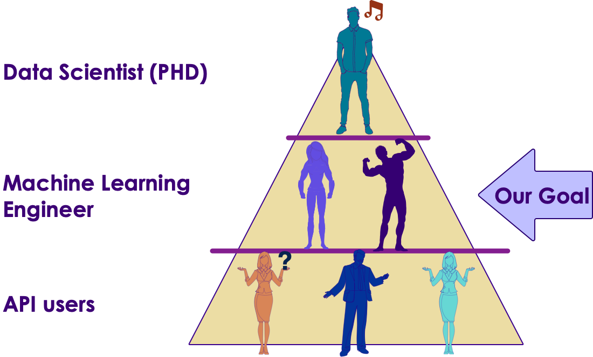
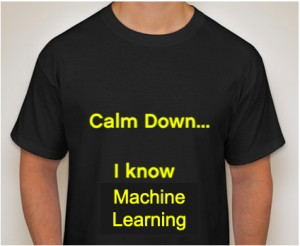

<!-- {"left" : 11.86, "top" : 0.52, "height" : 1.84, "width" : 5.02} -->

# Applied AI and ML

<!-- {"left" : 4.26, "top" : 7.43, "height" : 3.4, "width" : 3.41} --> &nbsp; &nbsp;
  <!-- {"left" : 8.36, "top" : 8.55, "height" : 1.17, "width" : 4.87} -->

---

## About This Class

* A **practical approach to ML**

* Goals
    - **'Top-Down' learning**
    - **Learn** fundamentals of ML
    - And **implement** them in an ML environment

* Beyond the scope
    - Deep Math / Stats coverage
    - Advanced concepts

Notes:

---

## Prerequisites & Expectations

<!-- {"left" : 11.65, "top" : 2.09, "height" : 1.33, "width" : 5.54} -->

* Development background
    - Need to be comfortable programming
    - Our labs are in Python
    - If you don't know Python, do not worry.  
        - It is very easy language to pick up
        - and we will provide some resources

* We don't expect Math / Statistics background

Notes:

---

## Data Science Totem pole

 <!-- {"left" : 2.33, "top" : 3.02, "height" : 7.68, "width" : 12.83} -->

Notes:

---

## Our Teaching Philosophy

 <!-- {"left" : 10.07, "top" : 2.27, "height" : 5.87, "width" : 7.27} -->

* Enable you to be a **'ML engineer'** by giving you
    - The essential knowledge of ML
    - Plenty of time and playground environment for learning the API
    - Show how to evaluate, test, and tweak the models
    - Expose you to useful tools

* Emphasis on concepts & fundamentals, not API

* Highly interactive (questions, discussions ..etc  are welcome)

* Hands-on - lots and lots of labs! (learn by doing)

Notes:

---

## Real World Datasets

* We will work on real world datasets such as
    - Uber Trips data
    - Walmart Shopping data
    - Netflix recommendation
    - Credit card default data
    - Prosper loan data
    - NYSE Stock data

<!-- {"left" : 1.34, "top" : 7.19, "height" : 1.36, "width" : 2.95} --> &nbsp;  &nbsp; <!-- {"left" : 4.99, "top" : 7.52, "height" : 0.76, "width" : 3.13} --> &nbsp;  &nbsp; <!-- {"left" : 8.83, "top" : 6.97, "height" : 1.83, "width" : 2.52} --> &nbsp;  &nbsp; <!-- {"left" : 12.4, "top" : 7.34, "height" : 1.07, "width" : 3.76} -->

Notes:

---

## Class Overview

* **Day 1**
  - ML intro
  - Statistics Primer
  - Data Exploration & Visualizing
  - Feature Engineering
  - ML Concepts

* **Day 2**
  - Python SciKit Learn Overview
  - Regression
  - Classification
  - Clustering
  - Recommendations

---

## After The Class...

 <!-- {"left" : 4.29, "top" : 3.19, "height" : 7.33, "width" : 8.93} -->

Notes:

* By the end of the class...

---

## Introductions

* About Instructor
* About you
    - Your Name
    - Your background (developer, admin, manager, etc.)
    - Technologies you are familiar with
    - Familiarity with Machine Learning   
    (scale of 1 - 4 ;  1 - new, 2 - know some concepts,  3 - played around a little, 4 -  using it at work)
    - Something non-technical about you!  
    (favorite ice cream flavor / hobby...etc)

 &nbsp; <!-- {"left" : 2.26, "top" : 7.37, "height" : 3.19, "width" : 3.61} --> &nbsp; <!-- {"left" : 5.91, "top" : 7.41, "height" : 3.08, "width" : 5.68} --> &nbsp; <!-- {"left" : 11.63, "top" : 7.37, "height" : 3.19, "width" : 3.61} -->

Notes:

---

## Class Logistics

* Instructor's contact

* Slides
    - For each session, slides will be emailed out or delivered via virtual classroom

* Labs
    - Lab files will be distributed

* Playground
    - Provided in the cloud

---

## Let's Get Started!

  <!-- {"left" : 4.5, "top" : 2.86, "height" : 7.99, "width" : 8.5} -->
&nbsp;  &nbsp;
