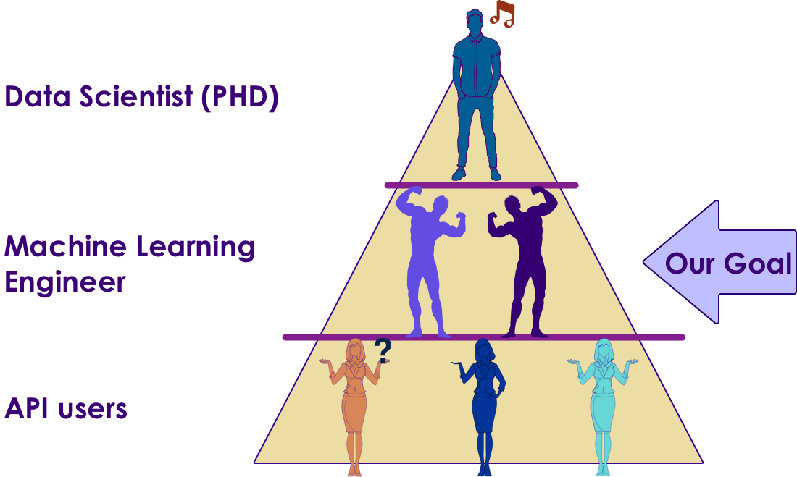
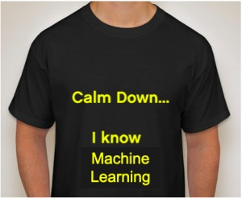

# Introduction to Machine Learning With Python

<!-- TODO shiva -->

 &nbsp;  &nbsp;

---

## About This Class

* A **practical approach to ML**

* Goals
    - **'Top-Down' learning**
    - **Learn** fundamentals of ML
    - And **implement** them in an ML environment

* Beyond the scope
    - Deep Math / Stats coverage
    - Advanced concepts

Notes:

---

## Prerequisites & Expectations

* Development background
    - Need to be comfortable programming - there are many labs
    - Our labs are in Python
    - If you don't know Python, do not worry.  
        - It is very easy language to pick up
        - and we will provide some resources

* We don't expect Math / Statistics background

Notes:

---

## What if I Don't Know Enough Math / Stats?

* Most often people are told to start Machine Learning with Linear Algebra / Calculus
    - These are hard subjects and lot of people loose interest pretty quickly
    - Or people spend too much time in Math / Stats

* Our approach:
    - We acknowledge Math / Stats are essential inner workings of Machine Learning
    - A practitioner can go far in ML with a little fundamentals and without too deep knowledge in Math / Stats

*  **Learn by practicing**
    - We do recommend you review the theories behind ML at your leisure

Notes:

---

## Data Science Totem pole

 <!-- {"left" : 0.55, "top" : 1.09, "height" : 5.48, "width" : 9.16} -->

Notes:

---

## Agenda - 2 Days

*  **Day 1**
    - AI  Intro
    - Text analytics
*  **Day 2**
    - Machine Learning concepts
    - Regressions
    - Classifications
    - Clustering

Notes:

---

## Real World Datasets

* We will work on real world datasets such as
    - Uber Trips data
    - Walmart Shopping data
    - Netflix recommendation
    - Credit card default data
    - Prosper loan data
    - NYSE Stock data

 &nbsp;  &nbsp;
 &nbsp;  &nbsp;
 &nbsp;  &nbsp;
 &nbsp;  &nbsp;

Notes:

---

## Our Teaching Philosophy

 * Emphasis on concepts & fundamentals
 * Highly interactive (questions and discussions are welcome)
 * Hands-on (learn by doing)

 <!-- {"left" : 2.05, "top" : 3.24, "height" : 4.97, "width" : 6.16} -->

Notes:

---

## After The Class...

 <!-- {"left" : 1.69, "top" : 0.93, "height" : 5.65, "width" : 6.88} -->

Notes:

* By the end of the class...

---

Introductions

* About Instructor
* About you
    - Your Name
    - Your background (developer, admin, manager, etc.)
    - Technologies you are familiar with
    - Familiarity with Machine Learning   
    (scale of 1 - 4 ;  1 - new, 2 - know some concepts,  3 - played around a little, 4 -  using it at work)
    - Something non-technical about you!  
    (favorite ice cream flavor / hobby...etc)

   &nbsp;

Notes:

---

## Class Logistics

* Instructor's contact

* Slides
    - For each session, slides will be emailed out or delivered via virtual classroom

* Labs
    - Lab files will be distributed

* Playground
    - Provided in the cloud

---

## Let's Get Started!
