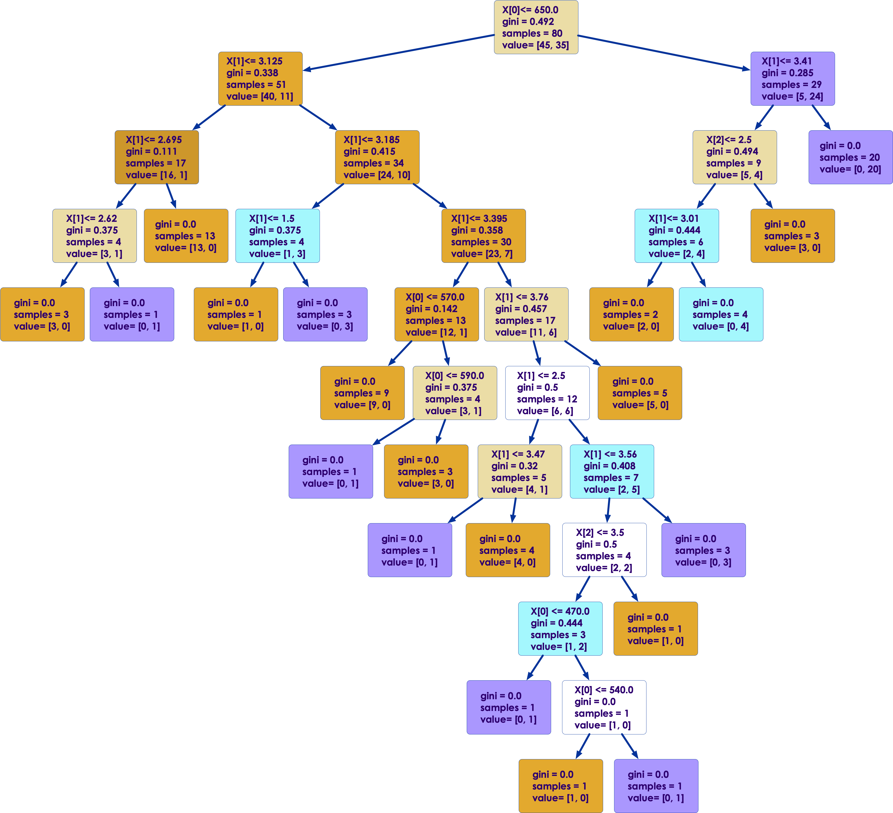

# Decision Trees in Scikit-Learn

---


## Lesson Objectives


 * Learn tree algorithms in Python 

Notes:

---

## Decision Trees

[../generic/Decision-Trees.md](../generic/Decision-Trees.md)

---

# Decision Trees in Python

---

## Trees Implementations in Python SciKit

* Classification
  * Implemented by **`sklearn.tree.DecisionTreeClassifier`**
  * Supports Binary and Multi-class Classification

* Regression
  * Implemented by **`sklearn.tree.DecisionTreeRegressor`**
  * Allows us to do a regression (numeric) output column

Notes: 


---

## Decision Tree Sample Code

* Classifier

```python
from sklearn.tree import DecisionTreeClassifier

# Initialize the algorithm
dt = DecisionTreeClassifier()

# Fit the model
model = dt.fit(x_train, y_train)
```
<!-- {"left" : 0.85, "top" : 2.62, "height" : 2.79, "width" : 12.54} -->

<br/>

* Regresssor

```python
from sklearn.tree import DecisionTreeRegressor

# Initialize the algorithm
dt = DecisionTreeRegressor()

# Fit the model
model = dt.fit(x_train, y_train)
```
<!-- {"left" : 0.85, "top" : 6.45, "height" : 3.41, "width" : 12.42} -->


Notes: 

---

## Visualizing the Tree

```python
from sklearn import tree
import matplotlib.pyplot as plt

fig, axes = plt.subplots(nrows = 1,ncols = 1,figsize = (4,4), dpi=300)
tree.plot_tree(model, filled=True)
```
<!-- {"left" : 0.85, "top" : 2.47, "height" : 1.93, "width" : 13.8} -->

<!-- {"left" : 1.6, "top" : 4.71, "height" : 6.81, "width" : 6.98} --><!-- {"left" : 8.49, "top" : 5.14, "height" : 5.95, "width" : 7.14} -->


Notes:


---

## Decision Trees Parameters 

| Parameter         | Description                                                                        | Default Value     |
|-------------------|------------------------------------------------------------------------------------|-------------------|
| criterion         | 'gini' for impurity vs. 'entropy' for information gain                             | `gini`           |
| max-features      | Maximum number of features to consider                                             | None            |
| max-depth         | Maximum depth of each tree                                                         | None            |
| min-samples-split | Min samples required to split in node                                              | 2                 |
| min-samples-leaf  | Min samples required to be leaf node                                               | 0                 |
| class-weight      | How to weight input classes (default is to balance based on class value frequency) | `balance`         |


<!-- {"left" : 0.93, "top" : 2.5, "height" : 1, "width" : 15.64} -->

Notes: 


---

## Decision Tree Attributes

| Attribute            | Description                                   | type                |
|----------------------|-----------------------------------------------|---------------------|
| classes_             | Class label for output                        | Array of  str       |
| n_classes_           | Number of output classes                      | int or List of  int |
| n_features_          | Number of features                            | Int                 |
| n_outputs_           | Number of outputs                             | Int                 |
| feature_importances_ | Relative importance based on OOB observations | array[float]        |
| tree_                | Underlying tree object                        | Tree                |

<!-- {"left" : 0.59, "top" : 2.5, "height" : 1, "width" : 16.33} -->


Notes: 


---

## Model Evaluation For Classifier


```python
model.score(x_test, y_test)
# output:  0.72

from sklearn.metrics import accuracy_score
accuracy_score(y_test, y_pred)
# output: 0.72

## Confusion matrix
from sklearn.metrics import confusion_matrix

cm = confusion_matrix(y_test, y_pred)
print(cm)
# array([[10,  3],
#        [ 2,  5]])
```
<!-- {"left" : 0.85, "top" : 2.44, "height" : 5.92, "width" : 11.01} -->

Notes: 

---

## Feature Importance

* Decision Tree can tell us which feature was influential in determining outcome

```python
print (model.feature_importances_)
# output : array([0.44220925, 0.47501859, 0.08277217])


## pretty print
fi = pd.DataFrame({'feature' : input_columns, 'importantance' : model.feature_importances_})
print (fi)

#   feature  importantance
# 0     gre       0.442209
# 1     gpa       0.475019
# 2    rank       0.082772

```
<!-- {"left" : 0.85, "top" : 3.51, "height" : 3.78, "width" : 16.11} -->

---

## Lab: Decision Trees

<!-- {"left" : 13.92, "top" : 1.7, "height" : 4.09, "width" : 3.07} -->

 *  **Overview**
 Create a classification decision tree

 *  **Approximate Time** 30 mins

 *  **Instructions**

     -  **DT-1: college-admission**

     -  **DT-2: prosper-loans**  
     (see following slides for details on Prosper dataset)

<!-- {"left" : 13.04, "top" : 7.53, "height" : 1, "width" : 4.28} -->


Notes:

---

## About the `Prosper` Dataset

 <!-- {"left" : 11.37, "top" : 2.28, "height" : 1.42, "width" : 6.05} -->

 * https://www.prosper.com/

 * America's first peer-to-peer lending marketplace

     - 2 million +  members

     - $ 2 B + in  funded loans

 * Dataset is public

     - 113,937 loans with 81 variables


Notes:


---

## Variables in the Prosper Dataset

| #     | Name                      |Name     | #                      |
|-------|---------------------------|---------|------------------------|
| 1     | ListingKey                |2        | ListingNumber          |
| 3     | ListingCreationDate       |4        | CreditGrade            |
| 5     | Term                      |6        | LoanStatus             |
| 7     | ClosedDate                |8        | BorrowerAPR            |
| 9     | BorrowerRate              |10       | LenderYield            |
| 11    | EstimatedEffectiveYield   |12       | EstimatedLoss          |
| 13    | EstimatedReturn           |14       | ProsperRating..numeric |
| 15    | ProsperRating..Alpha      |16       | ProsperScore           |
| 17    | ListingCategory..numeric  |18       | BorrowerState          |
| 19    | Occupation                |20       | EmploymentStatus       |
| 21    | EmploymentStatusDuration  |22       | IsBorrowerHomeowner    |
| 23    | CurrentlyInGroup          |...      | And so on, till #81    |

<!-- {"left" : 1.1, "top" : 2.73, "height" : 1, "width" : 15.3} -->


Notes:

---

## Random Forests

[../generic/Random-Forest.md](../generic/Random-Forest.md)

---

# Random Forests in Python

---

## Random Forests in Python

* Classifier

```python
from sklearn.ensemble import RandomForestClassifer

# 20 subtrees
rf = RandomForestClassifier(n_estimators=20)

# Fit the model
model = rf.fit(x_train, y_train)
```
<!-- {"left" : 0.85, "top" : 2.62, "height" : 2.79, "width" : 12.54} -->

<br/>

* Regression

```python
from sklearn.ensemble import RandomForestRegressor

# 20 subtrees
rf = RandomForestRegression(n_estimators=20)

# Fit the model
model = rf.fit(x_train, y_train)
```
<!-- {"left" : 0.85, "top" : 6.45, "height" : 3.41, "width" : 12.42} -->


Notes:

---

## Random Forest Parameters

* n_estimators
  - This is the number of trees to be trained
* All the same parameters as Decision Trees 
  - These parameters are run on a per-tree basis

<br />


 |   Parameter      |                                     Description                                    |   Default Value   |
|:-----------------:|:----------------------------------------------------------------------------------:|:-----------------:|
| n_estimators      | Max Numbers of trees                                                               |         10        |
| criterion         | 'gini' for impurity vs. 'entropy' for information gain                             |       `gini`      |
| max_features      | Maximum number of features to consider                                             |       `auto`      |
| max_depth         | Maximum depth of each tree                                                         |       `auto`      |
| min_samples_split | Min samples required to split in node                                              |         2         |
| min_samples_leaf  | Min samples required to be leaf node                                               |         1         |
| Class_weight      | How to weight input classes (default is to balance based on class value frequency) |     `balance`     |

<!-- {"left" : 0.35, "top" : 4.62, "height" : 1, "width" : 16.81} -->

Notes:

---

## Random Forest Attributes

|   Attribute            |   Description                                 |    Type               |
|------------------------|-----------------------------------------------|-----------------------|
| estimators_            | Collection of trees                           | OOB decision function |
| classes_               | Class label for output                        | Array of  str         |
| n_classes_             | Number of output classes                      | int or List of  int   |
| n_features_            | Number of features                            | Int                   |
| n_outputs_             | Number of outputs                             | Int                   |
| feature_importances_   | Relative importance based on OOB observations | array[float]          |
| oob_score_             | Score metric based on OOB observations        | float                 |
| oob_decision_function_ | OOB decision function                         | 2-d array             |

<!-- {"left" : 0.47, "top" : 2.5, "height" : 1, "width" : 16.55} -->

Notes: 

---

## Model Evaluation For Classifier

```python
model.score(x_test, y_test)
# output:  0.72

from sklearn.metrics import accuracy_score
accuracy_score(y_test, y_pred)
# output: 0.72

## Confusion matrix
from sklearn.metrics import confusion_matrix

cm = confusion_matrix(y_test, y_pred)
print(cm)
# array([[10,  3],
#        [ 2,  5]])
```
<!-- {"left" : 0.85, "top" : 2.56, "height" : 6.03, "width" : 11.21} -->

---

## Feature Importance

* Random Forest can tell us which feature was influential in determining outcome

* In this example, we see `StatedMonthlyIncome` is a very important feature

```python
print (model.feature_importances_)
# output : array([0.44220925, 0.47501859, 0.08277217])


## pretty print
fi = pd.DataFrame({'feature' : input_columns, 'importantance' : model.feature_importances_})
print (fi)

#                feature  importantance
# 0             EmpIndex       0.040567
# 1          CreditScore       0.135828
# 2  StatedMonthlyIncome       0.712424
# 3        CategoryIndex       0.111181

```
<!-- {"left" : 0.85, "top" : 3.96, "height" : 4.14, "width" : 16.38} -->

---

## Lab: Random Forest

<!--{"left" : 12.83, "top" : 1, "height" : 5.7, "width" : 4.27} -->

 *  **Overview**

 *  **Approximate Time** 30 mins

 *  **Instructions** 

     - RF1: Prosper loan data (classification)

     - RF2: Election contribution data (classification)

     - RF3: Election contribution data (regression)

Notes:

---

## Review and Q&A

<!-- {"left" : 12.85, "top" : 2.01, "height" : 3.04, "width" : 4.09} -->

* Let's go over what we have covered so far

* Any questions?

<!-- {"left" : 4.63, "top" : 5.46, "height" : 5.48, "width" : 8.24} -->

