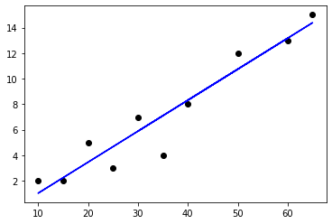

# Regressions in Scikit-Learn

---

# Regressions Intro

[../generic/Regressions-Intro.md](../generic/Regressions-Intro.md)

---

# Linear Regression in Python

---

## Linear Regression in Python

| Algorithm         | Class / Package                       | Description   |
|-------------------|---------------------------------------|---------------|
| Linear Regression | sklearn.linear_model.LinearRegression | SKlearn       |
| Linear Regression | scipy.stats.linregress                | SciPy package |
| Linear Regression | statsmodels.api.formula.OLS           | Statsmodels   |

<!-- {"left" : 1.02, "top" : 2.19, "height" : 1, "width" : 15.47} -->


- [sklearn.linear_model  docs](https://scikit-learn.org/stable/modules/classes.html#module-sklearn.linear_model)
- [scipy.stats.linregres](https://docs.scipy.org/doc/scipy-0.14.0/reference/generated/scipy.stats.linregress.html)

Notes:

- https://scikit-learn.org/stable/modules/classes.html#module-sklearn.linear_model
- https://docs.scipy.org/doc/scipy-0.14.0/reference/generated/scipy.stats.linregress.html


---

##  Linear Regression in Scikit-Learn

- Let's do a simple bill/tip regression

<!-- {"left" : 3.29, "top" : 4.25, "height" : 5.62, "width" : 10.91} -->


---

## Linear Regression in SciKit-Learn


```python
from sklearn.linear_model import LinearRegression

tip_data = pd.DataFrame({'bill' : [50.00, 30.00, 60.00, 40.00, 65.00, 20.00, 10.00, 15.00, 25.00, 35.00],
                        'tip' : [12.00, 7.00, 13.00, 8.00, 15.00, 5.00, 2.00, 2.00, 3.00, 4.00]})
x = tip_data[['bill']]
y = tip_data[['tip']]

# model and train
lr  = LinearRegression()
model = lr.fit(x,y)  # < -- this is the training step 

# predict
predictions = model.predict(x)

# pretty print
test_data_pd['predicted_tip'] =  predictions
test_data
```
<!-- {"left" : 0.85, "top" : 2.38, "height" : 4.15, "width" : 15.28} -->

```text

   bill   tip  predicted_tip
0  50.0  12.0      10.742857
1  30.0   7.0       5.885714
2  60.0  13.0      13.171429
3  40.0   8.0       8.314286
4  65.0  15.0      14.385714
5  20.0   5.0       3.457143
6  10.0   2.0       1.028571
7  15.0   2.0       2.242857
8  25.0   3.0       4.671429
9  35.0   4.0       7.100000
```
<!-- {"left" : 0.85, "top" : 6.84, "height" : 3.49, "width" : 5.44} -->

---

## Evaluate the Model

```python
# evaluate
from sklearn.metrics import mean_squared_error, r2_score

print ("R2 : " , r2_score(y, predictions))
# R2 :  0.9067140765530224
print ("MSE : ", mean_squared_error(y, predictions))
# MSE :  1.9114285714285715
```
<!-- {"left" : 0.85, "top" : 2.5, "height" : 2.57, "width" : 11.22} -->

```python
import matplotlib.pyplot as plt

plt.scatter(x,y , color="black")
plt.plot(x, predictions, color='blue')
```
<!-- {"left" : 0.85, "top" : 5.36, "height" : 1.57, "width" : 7.75} -->

<!-- {"left" : 5.6, "top" : 7.27, "height" : 4.24, "width" : 6.3} -->

---
## Lab: Linear Regressions

<!-- {"left" : 12.7, "top" : 1.65, "height" : 5.61, "width" : 4.22} -->

 *  **Overview:**
    - Practice Linear Regressions

 *  **Approximate Time:**
    - 30 mins

 *  **Instructions:**
     - Instructor: Please demo this lab
     - LR-1: Bill and Tips data


Notes:

---

# Multiple Linear Regression

[../generic/Regressions-Linear-Multi.md](../generic/Regressions-Linear-Multi.md)

---

# Multiple Linear Regression in Scikit-Learn

---

## Multiple Linear Regression in Scikit-Learn

```python
import pandas as pd
from sklearn.metrics import r2_score

house_prices = pd.read_csv("/data/house-prices/house-sales-full.csv")

input_columns= ['Bedrooms', 'Bathrooms', 'SqFtTotLiving', 'SqFtLot']
label_column = ['SalePrice']

x = house_prices2[input_columns]
y = house_prices2[label_column]

# train
model = LinearRegression ().fit(x,y)

# predict
predictions = model.predict(x)

print ("R2 : " , r2_score(y, predictions))
# R2 = 0.48
```
<!-- {"left" : 0.85, "top" : 2.48, "height" : 6.44, "width" : 13.58} -->

---

## Evaluate the Model

```python
from sklearn.metrics import mean_squared_error, r2_score
from math import sqrt

## print each feature and it's coefficients
coef = pd.DataFrame({"input_column" : input_columns,  
                     "coefficient": model.coef_[0]})
print(coef)

print ("R2 : " , r2_score(y, predictions))
print ("MSE : ", mean_squared_error(y, predictions))
print ("RMSE : ", sqrt(mean_squared_error(y, predictions)) )
```
<!-- {"left" : 0.85, "top" : 2.53, "height" : 3.88, "width" : 11.98} -->

```text
# output

input_column  coefficient
0       Bedrooms   -65,211.74
1      Bathrooms    16,274.19
2  SqFtTotLiving       277.85
3        SqFtLot        -0.07

R2 :  0.483482252362197
MSE :  60702204448.745056
RMSE :  246378.1736452015

```
<!-- {"left" : 0.85, "top" : 6.81, "height" : 4.08, "width" : 6.56} -->

---
## Lab: Multiple Linear Regression

<!-- {"left" : 12.47, "top" : 1.89, "height" : 5.7, "width" : 4.28} -->

 *  **Overview:**
    - Practice Multiple Linear Regressions

 *  **Approximate Time:**
    - 30 mins

 *  **Instructions:**
    - LR-2: House prices
    - BONUS Lab: LR-3: AIC

Notes:

---

# Regularization

[../generic/ML-Concepts-Regularization.md](../generic/ML-Concepts-Regularization.md)

---
## Review and Q&A

<!-- {"left" : 13.07, "top" : 1.89, "height" : 2.69, "width" : 3.63} -->

* Let's go over what we have covered so far

* Any questions?

<!-- {"left" : 4.62, "top" : 4.8, "height" : 5.53, "width" : 8.31} -->
