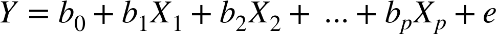
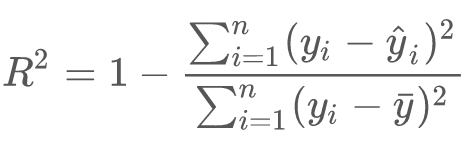

# Regressions in Scikit-Learn

---

# Regressions Intro

[../generic/Regressions-Intro.md](../generic/Regressions-Intro.md)

---

# Linear Regression in Python

---

## Linear Regression in Python

* There are various implementations in Python for doing Linear Regression

<br/>

| Algorithm         | Class / Package                       | Description   |
|-------------------|---------------------------------------|---------------|
| Linear Regression | sklearn.linear_model.LinearRegression | SKlearn       |
| Linear Regression | scipy.stats.linregress                | SciPy package |
| Linear Regression | statsmodels.api.formula.OLS           | Statsmodels   |

<!-- {"left" : 1.02, "top" : 2.19, "height" : 1, "width" : 15.47} -->

<br/>

* References:
    - [sklearn.linear_model  docs](https://scikit-learn.org/stable/modules/classes.html#module-sklearn.linear_model)
    - [scipy.stats.linregres](https://docs.scipy.org/doc/scipy-0.14.0/reference/generated/scipy.stats.linregress.html)

Notes:

---

## Linear Regression in Scikit-Learn

* Let's do a simple bill/tip regression

<!-- {"left" : 3.29, "top" : 4.25, "height" : 5.62, "width" : 10.91} -->

---

## Linear Regression in SciKit-Learn

```python
from sklearn.linear_model import LinearRegression

tip_data = pd.DataFrame({'bill' : [50.00, 30.00, 60.00, 40.00, 65.00, 20.00, 10.00, 15.00, 25.00, 35.00],
                        'tip' : [12.00, 7.00, 13.00, 8.00, 15.00, 5.00, 2.00, 2.00, 3.00, 4.00]})
x = tip_data[['bill']]
y = tip_data[['tip']]

# model and train
lr  = LinearRegression()
model = lr.fit(x,y)  # < -- this is the training step 

# predict
predictions = model.predict(x)

# pretty print
test_data_pd['predicted_tip'] =  predictions
test_data
```
<!-- {"left" : 0.85, "top" : 2.38, "height" : 4.15, "width" : 15.28} -->

```text

   bill   tip  predicted_tip
0  50.0  12.0      10.742857
1  30.0   7.0       5.885714
2  60.0  13.0      13.171429
3  40.0   8.0       8.314286
4  65.0  15.0      14.385714
5  20.0   5.0       3.457143
6  10.0   2.0       1.028571
7  15.0   2.0       2.242857
8  25.0   3.0       4.671429
9  35.0   4.0       7.100000
```
<!-- {"left" : 0.85, "top" : 6.84, "height" : 3.49, "width" : 5.44} -->

---

## Evaluate the Model

```python
from sklearn.metrics import mean_squared_error, r2_score
from math import sqrt

r2 = r2_score(y, predictions)
mse = mean_squared_error(y, predictions)
rmse = sqrt(mse)

print ("R2 : " , r2)    # R2 :   0.907
print ("MSE : ", mse)   # MSE :  1.911
print ("RMSE : ", rmse) # RMSE : 1.383
```
<!-- {"left" : 0.85, "top" : 2.5, "height" : 2.57, "width" : 11.22} -->

```python
import matplotlib.pyplot as plt

plt.scatter(x,y , color="black")
plt.plot(x, predictions, color='blue')
```
<!-- {"left" : 0.85, "top" : 5.36, "height" : 1.57, "width" : 7.75} -->

<!-- {"left" : 5.6, "top" : 7.27, "height" : 4.24, "width" : 6.3} -->

---

## Lab: Linear Regressions

<!-- {"left" : 12.7, "top" : 1.65, "height" : 5.61, "width" : 4.22} -->

* **Overview:**
    - Practice Linear Regressions

* **Approximate Time:**
    - 30 mins

* **Instructions:**
     - Instructor: Please demo this lab
     - LR-1: Bill and Tips data

Notes:

---

# Multiple Linear Regression in Scikit-Learn

---

## Predict House Prices

| Sale Price   | Bedrooms | Bathrooms | Sqft_Living | Sqft_Lot |
|--------------|----------|-----------|-------------|----------|
| 280,000      | 6        | 3         | 2,400       | 9,373    |
| 1,000,000    | 4        | 3.75      | 3,764       | 20,156   |
| 745,000      | 4        | 1.75      | 2.060       | 26,036   |
| 425,000      | 5        | 3.75      | 3,200       | 8,618    |
| 240,000      | 4        | 1.75      | 1,720       | 8,620    |
| 327,000      | 3        | 1.5       | 1,750       | 34,465   |
| 347,000      | 4        | 1.75      | 1,860       | 14,650   |

<!-- {"left" : 1.17, "top" : 2.5, "height" : 4.01, "width" : 15.15} -->

* Inputs: `Bedrooms, Bathrooms, Sqft_Living, Sqft_Lot`

* What we are predicting : `Sale_Price`

<!-- {"left" : 4.08, "top" : 2, "height" : 0.64, "width" : 9.34} -->

---

## Multiple Linear Regression in Scikit-Learn

```python
import pandas as pd

house_prices = pd.read_csv("house-sales.csv")

input_columns= ['Bedrooms', 'Bathrooms', 'SqFtTotLiving', 'SqFtLot']
label_column = ['SalePrice']

X = house_prices2[input_columns]
y = house_prices2[label_column]

# train
model = LinearRegression ().fit(x,y)

# predict
predictions = model.predict(x)
```
<!-- {"left" : 0.85, "top" : 2.48, "height" : 6.44, "width" : 13.58} -->

```text
# house-sales.csv

| Sale Price $ | Bedrooms | Bathrooms | Sqft_Living | Sqft_Lot |
|--------------|----------|-----------|-------------|----------|
| 280,000      | 6        | 3         | 2,400       | 9,373    |
| 1,000,000    | 4        | 3.75      | 3,764       | 20,156   |
| 745,000      | 4        | 1.75      | 2.06        | 26,036   |
| 425,000      | 5        | 3.75      | 3,200       | 8,618    |
| 240,000      | 4        | 1.75      | 1,720       | 8,620    |
| 327,000      | 3        | 1.5       | 1,750       | 34,465   |
| 347,000      | 4        | 1.75      | 1,860       | 14,650   |
```

---

## Evaluating the Regression Model

<!-- {"left" : 2.65, "top" : 6.93, "height" : 1.1, "width" : 5.04} -->

<!-- {"left" : 9.27, "top" : 6.59, "height" : 1.75, "width" : 5.58} -->

* We will use the following metrics

* **Root Mean Squared Error (RMSE)**
    - Average error the model makes per prediction

* **Coefficient of Determination (R<sup>2</sup>)**
    * R<sup>2</sup> ranges from 0 to 1.0
    * Measures how well the model fits the data
    * 1.0 is a perfet fit

Notes:

---

## Evaluate the Model

```python
from sklearn.metrics import mean_squared_error, r2_score
from math import sqrt

predictions = model.predict(x)

## print each feature and it's coefficients
coef = pd.DataFrame({"input_column" : input_columns,  
                     "coefficient": model.coef_[0]})
print(coef)

r2 = r2_score(y, predictions)
mse = mean_squared_error(y, predictions)
rmse = sqrt(mse)

print ("R2 : " , r2)
print ("MSE : ", mse)
print ("RMSE : ", rmse )
```
<!-- {"left" : 0.85, "top" : 2.53, "height" : 3.88, "width" : 11.98} -->

```text
# output

input_column  coefficient
0       Bedrooms   -65,211.74
1      Bathrooms    16,274.19
2  SqFtTotLiving       277.85
3        SqFtLot        -0.07

R2 :   0.483482252362197
MSE :  60702204448.745056
RMSE : 246378.1736452015
```
<!-- {"left" : 0.85, "top" : 6.81, "height" : 4.08, "width" : 6.56} -->

---

## Class Discussion: Why is the Accuracy Low?

* **R<sup>2</sup> is 0.4835** - not a great fit

* **Question for class:** Why is R<sup>2</sup>  not close to 1?  (as in why is it not a great fit?)

    - Can you guys come up with some reasons

    - Hint: Look at Sale date in the dataset?  Think about what happened in that time frame

* Answers are in next slide

Notes:

---

## Why is the Accuracy Low?

<!-- {"left" : 4.06, "top" : 2.22, "height" : 0.64, "width" : 9.38} -->

* May be we are not using enough features / inputs.
    - The original dataset has features like 'Year Built' ,  'Traffic Noise' ..etc.

* Not enough data?

* Outliers? (remember the house with 33 bedrooms?)

* Data is skewed?
    - The sales happen the in the span of year 2006 and 2014.
    - We went through a crash in 2008
    - So the we probably have inconsistent data

* Wrong algorithm?

Notes:

---

## Adding More Variables

* For our regression model we only had 4 input features
    - _Bedrooms, Bathrooms, SqFtTotLiving, SqFtLot_

* Our __R<sup>2</sup> = 0.48__ (not a great accuracy)

```python
import pandas as pd
from sklearn.metrics import r2_score

house_prices = pd.read_csv("house-sales.csv")

input_columns= ['Bedrooms', 'Bathrooms', 'SqFtTotLiving', 'SqFtLot']
label_column = ['SalePrice']

x = house_prices2[input_columns]
y = house_prices2[label_column]

# train
model = LinearRegression ().fit(x,y)

# predict
predictions = model.predict(x)

print ("R2 : " , r2_score(y, predictions))
# R2 = 0.48
```
<!-- {"left" : 0.85, "top" : 4.09, "height" : 6.37, "width" : 13.44} -->

---

## Let's Add More Variable

* Let's add a column called __LandVal__

* This gives us __R<sup>2</sup> = 76%__  (yay!)

```python
import pandas as pd
from sklearn.metrics import r2_score

house_prices = pd.read_csv("house-sales.csv")

# adding 'LandVal'
input_columns= ['Bedrooms', 'Bathrooms', 'SqFtTotLiving', 'SqFtLot', 'LandVal']
label_column = ['SalePrice']

x = house_prices2[input_columns]
y = house_prices2[label_column]

# train
model = LinearRegression ().fit(x,y)

# predict
predictions = model.predict(x)

print ("R2 : " , r2_score(y, predictions))
# R2 = 0.76
```
<!-- {"left" : 0.85, "top" : 3.68, "height" : 6.35, "width" : 15.29} -->

---

## Deciding Important Variables

<!-- {"left" : 4.06, "top" : 2.22, "height" : 0.64, "width" : 9.38} -->

* In Multiple Linear Regressions many variables/predictors determine the value of response

* How can we know which ones are important?

* For two predictors `X1` & `X2` --> p = 2 --> 2<sup>2</sup> = 4

* For 10 variables, p = 10 --> 2<sup>10</sup> --> 1024 combinations

* For 20 variables, p = 20 --> 2<sup>20</sup> --> 1,048,576 (1 million+) combinations

Notes:

---

## Deciding Important Variables

* Some algorithms to decide important variables quickly
    - Mallow's Cp
    - Akaike Information Criterion (AIC)
    - Bayesian Information Criterion  (BIC)
    - Stepwise Regression

* Also Lasso Regularization can be used for variable selection as well (more on this later)

* Also **`Decision Tree`** and **`Random Forest`** algorithms can determine feature importance

* Reference : See "An introduction to Statistical Learning" – Chapter 3

Notes:

---

## AIC Sample Code (Python)

* Here our __R<sup>2</sup> = 0.84__

```python
import pandas as pd
import numpy as np
from sklearn.linear_model import  LassoLarsIC

house_prices = pd.read_csv("/data/house-prices/house-sales-full.csv")

## using all numeric columns
input_columns= ['zhvi_px', 'zhvi_px', 'NbrLivingUnits', 'SqFtLot', 'SqFtTotLiving', 'SqFtFinBasement',
                'Bathrooms', 'Bedrooms' , 'BldgGrade', 'YrBuilt', 'YrRenovated', 'TrafficNoise',
                'LandVal', 'ImpsVal', 'NewConstruction']

label_column = ['SalePrice']

x = house_prices[input_columns]
y = house_prices[label_column]

reg = LassoLarsIC(criterion='aic', max_iter=500)

model = reg.fit(x, np.ravel(y))

# train
model = reg.fit(x,y)

# predict
predictions = model.predict(x)

print ("R2 : " , r2_score(y, predictions))
# R2 = 0.84
```
<!-- {"left" : 0.85, "top" : 2.78, "height" : 7.47, "width" : 15.74} -->

---

## AIC - Coefficients

* Here are our  coefficients for inputs

* Inputs with zero value are ignored by AIC

```python
pd.options.display.float_format = '{:,.2f}'.format
coef = pd.DataFrame({"input_column" : input_columns,  
                     "coefficient": model.coef_})
coef
```
<!-- {"left" : 0.85, "top" : 3.39, "height" : 1.68, "width" : 11.36} -->

```text
input_column  coefficient
0           zhvi_px         0.00
1           zhvi_px         1.16
2    NbrLivingUnits     3,331.60
3           SqFtLot         0.35
4     SqFtTotLiving        34.51
5   SqFtFinBasement         0.00
6         Bathrooms     2,976.83
7          Bedrooms    -5,688.45
8         BldgGrade    17,247.28
9           YrBuilt      -152.65
10      YrRenovated        -5.94
11     TrafficNoise         0.00
12          LandVal         0.94
13          ImpsVal         0.60
14  NewConstruction    27,870.93

```
<!-- {"left" : 0.85, "top" : 5.46, "height" : 5.31, "width" : 6.56} -->

---

## Linear Regression: Strengths, Weaknesses, and Parameters

* **Strengths**
    - Relatively simple to understand
    - Computationally simple, very fast learners
    - Very scalable to large data sets

* **Weaknesses**
    - Will perform poorly if the inputs are not aligned along linear boundary
    - Can under-fit data

* **Parameters**
    - Use regularization to minimize overfitting
    - Lasso regularization can also do variable selection

Notes:

---

## Lab: Multiple Linear Regression

<!-- {"left" : 12.47, "top" : 1.89, "height" : 5.7, "width" : 4.28} -->

* **Overview:**
    - Practice Multiple Linear Regressions

* **Approximate Time:**
    - 30 mins

* **Instructions:**
    - **LR-2: House prices**

Notes:

---

## Bonus Lab: AIC

<!-- {"left" : 12.47, "top" : 1.89, "height" : 5.7, "width" : 4.28} -->

* **Overview:**
    - Automatic feature selection using AIC

* **Approximate Time:**
    - 30 mins

* **Instructions:**
    - **BONUS Lab: LR-3: AIC**

Notes:

---

# Regularization

[../generic/ML-Concepts-Regularization.md](../generic/ML-Concepts-Regularization.md)

---

## Review and Q&A

<!-- {"left" : 13.07, "top" : 1.89, "height" : 2.69, "width" : 3.63} -->

* Let's go over what we have covered so far

* Any questions?

<!-- {"left" : 4.62, "top" : 4.8, "height" : 5.53, "width" : 8.31} -->
