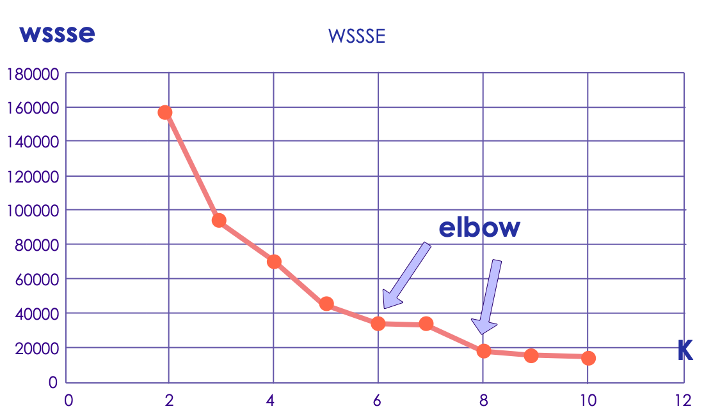

# Unsupervised Learning in Python SciKit

---

## Lesson Objectives


  * Learn about unsupervised algorithms in Scikit-Learn

  * Learn use cases

Notes:


---

## Unsupervised Intro

[../generic/Unsupervised-Intro.md](../generic/Unsupervised-Intro.md)

---

## Clustering

[../generic/Unsupervised-Clustering.md](../generic/Unsupervised-Clustering.md)

---

# Clustering in Scikit-Learn

---

## K-Means in Scikit-learn

  * Scikit-learn has good support for k-means
  * How to perform k-means clustering in Scikit-learn

    - Put data in ndarray
    - Perform clustering with a specified number of iterations
    - Evaluate the "fit" of the cluster. Is it a good run?
    - If not, change the number of clusters (value of k)
    - Once we have a good clustering run:
       - Map each vector to its nearest cluster
       - Group original data by its corresponding cluster
       - Assign (predict) new vectors to their nearest cluster

Notes:

---

## K-Means in Scikit-learn

```python
from sklearn.cluster import KMeans
import numpy as np

X = np.array([[1, 2], [1, 4], [1, 0],
             [10, 2], [10, 4], [10, 0]])
kmeans = KMeans(n_clusters=2, random_state=0).fit(X)

print (kmeans.labels_)

print (kmeans.predict([[0, 0], [12, 3]]))

print (kmeans.cluster_centers_)

## WSSSE
print (kmeans._inertia)
```

Notes:

---

## Evaluating Cluster Performance

<!-- {"left" : 6.26, "top" : 0.98, "height" : 2.29, "width" : 3.91} -->

  * WSSSE: Within Set Sum of Squared Errors
    - COST = sum of squared distances of points to cluster center.
  * WSSSSE = `kmeans._inertia`
  * What does this mean?
    - WSSSE will decrease with increasing values of k.
    - "Law of Diminishing Returns"
      - High values of k give marginal gain.
  * We can iterate across k until we get good results.
  * __Question for class:__
    - Identify the 'elbow' region
    - What would be a reasonably good K in this case?

Notes:
Elbow method is basically plotting “variance” % of a data against number of clusters and find the point after which  adding more clusters will not make a huge difference. That is called Elbow method.

---


## Using Scikit-Learn KMeans Model

  * How to apply the model to data?

  * Use predict:

    - `clusterIds = kmeans.predict(Vector)`

  * Predict returns an integer

    - Cluster number, i.e., `0, 1, 2, 3… (k-1)`.


Notes:

  * KMeans is a clustering model for K-means. Each point belongs to the cluster with the closest center.
    - Method Predict maps given points to their cluster indices. Returns the cluster index that a given point belongs to.

---

## Handling New Data

* New Data be assigned on the existing model:

- Make a Vector out of the new Data
- Call `KMeans.predict(vector)`, to get cluster membership as a number (integer)

* The new data will not affect the existing cluster locations.


Notes:

---


## Dimensionality Reduction

[../generic/Unsupervised-Dimensionality-Reduction.md](../generic/Unsupervised-Dimensionality-Reduction.md)

---


# PCA in Scikit-learn

---

## PCA Example

 * This will reduce the dimensionality down to 2 dimensions:
 * Good for Plotting!

```python
from sklearn.decomposition import PCA

pca = PCA(n_components=2)
X_r = pca.fit_transform(df)
```
