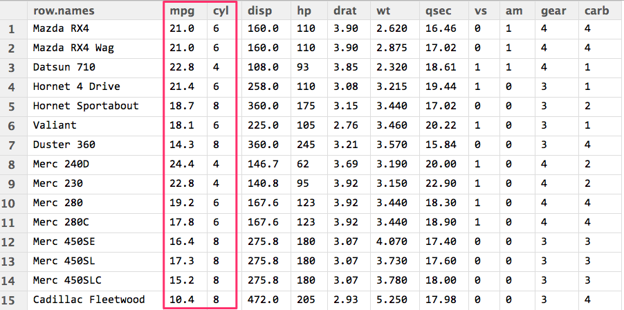
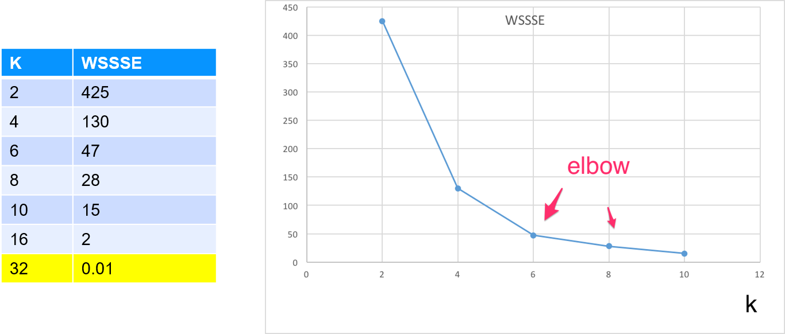

# Unsupervised Learning in SciKit-Learn

---

## Lesson Objectives


  * Learn about unsupervised algorithms in Scikit-Learn

  * Learn use cases

Notes:


---

# Unsupervised Intro

[../generic/Unsupervised-Intro.md](../generic/Unsupervised-Intro.md)

---

# Clustering

[../generic/Clustering.md](../generic/Clustering.md)

---
# Clustering in Python

---

## Clustering Algorithms in Python


 * K-Means

 * Bisecting K-Means

 * LDA

 * Power Iteration Clustering

 * Streaming K-Means

 * Gaussian Mixture

Notes:


---

# K-Means in Python

---

## Python ML Kmeans API - Python

```python
sklearn.cluster.KMeans (self, n_clusters=8, init='k-means++',
                    max_iter=300, tol=0.0001)
```
<!-- {"left" : 0.85, "top" : 2.63, "height" : 1.11, "width" : 14.14} -->


| Parameter  | Description                                                                                                                                               | Default Value |
|------------|-----------------------------------------------------------------------------------------------------------------------------------------------------------|---------------|
| n_clusters | Number of clusters                                                                                                                                        | 8             |
| init       | How to initialize cluster centers.  Possible values:  -"random" : choose random points  -"k-means++ : Uses a well-known algorithm for quicker convergence | "k-means++"   |
| tol        | Threshold indicating the convergence o fclusters                                                                                                          | 1e-4          |
| maxIter    | How many iterations                                                                                                                                       | 20            |
| n_init     | Initial seed setting                                                                                                                                      |               |
<!-- {"left" : 0.94, "top" : 4.81, "height" : 1, "width" : 15.62} -->


Notes:

---

## Let's Cluster Cars

* We will use `mtcars` dataset as below

* Cluster cars using **`mpg` and `cyl`** parameters


<!-- {"left" : 4.34, "top" : 4.95, "height" : 5.16, "width" : 8.82} -->

---

## Python K-Means Code

```python
from sklearn.cluster import KMeans 
import pandas as pd

dataset = pd.read_csv('mtcars_header.csv')

mpg_cyl = dataset[['model', 'mpg', 'cyl']]
featureVector = mpg_cyl.iloc[:,1:3].values

# Start KMeans with 2 clusters
kmeans = Kmeans(n_clusters=2)
model = kmeans.fit(featureVector)
wssse = model.inertia_
print(wssse)
dataset['prediction'] = model.predict(featureVector)
```
<!-- {"left" : 0.85, "top" : 2.48, "height" : 5.61, "width" : 13.58} -->

Notes:

---

## K-Means Run Output


```python
// for k=2
> model.cluster_centers_
> array([25.478571428571428,4.428571428571428]
[15.899999999999999,7.555555555555555])

```
<!-- {"left" : 0.85, "top" : 2.65, "height" : 1.98, "width" : 12.58} -->

```text
> predicted.sort_values(["prediction", "mpg"])
+-------------------+----+---+----------+----------+
|model              |mpg |cyl|features  |prediction|
+-------------------+----+---+----------+----------+
|Mazda RX4          |21.0|6  |[21.0,6.0]|0         |
|Mazda RX4 Wag      |21.0|6  |[21.0,6.0]|0         |
|Hornet 4 Drive     |21.4|6  |[21.4,6.0]|0         |
...  
|Cadillac Fleetwood |10.4|8  |[10.4,8.0]|1         |
|Lincoln Continental|10.4|8  |[10.4,8.0]|1         |
|Camaro Z28         |13.3|8  |[13.3,8.0]|1         |
|Duster 360         |14.3|8  |[14.3,8.0]|1         |
|Chrysler Imperial  |14.7|8  |[14.7,8.0]|1         |
+-------------------+----+---+----------+----------+

```
<!-- {"left" : 0.85, "top" : 5, "height" : 5.29, "width" : 12.58} -->


Notes:

---

## Multiple Runs With K vs. WSSSE


```python
import pandas as pd

k_wssse = pd.DataFrame(columns=('k', 'wssse'))

# loop through K
for k in range(2,17):
   print ("k=", k)
   kmeans = KMeans().setK(k).setSeed(1)   
   model = kmeans.fit(featureVector)  
   wssse = model.inertia_    
   print("k={}, wssse={}".format(k,wssse))  
   k_wssse = k_wssse.append( {'k': k, 'wssse': wssse}, ignore_index=True)

k_wssse
```
<!-- {"left" : 0.85, "top" : 1.8, "height" : 3.75, "width" : 12.21} -->

<br/>

* Kmeans run output

```text
k= 2
   k=2, wssse=425.39658730158885
k= 3
   k=3, wssse=169.40535714285784
k= 4
   k=4, wssse=140.88452380952572

```
<!-- {"left" : 0.85, "top" : 6.57, "height" : 2.47, "width" : 8.1} -->

Notes:


---
## K - WSSSE


<!-- {"left" : 2.19, "top" : 3.4, "height" : 5.59, "width" : 13.12} -->

Notes:


---
## Evaluating K-Means With WSSSE

 * WSSSE: Within Set Sum of Squared Errors
    - COST = sum of squared distances of points to cluster center.
 * Goal is to **minimize WSSSE** with **reasonable effort**
 * We look for elbows - that indicates a reasonable clustering
 * After the elbow, the improvement is minimal
 *  **Question for class:** At **k=32** we have achieved **WSSSE=0**, as in perfect fit !How is that?

<!-- {"left" : 4.01, "top" : 6.76, "height" : 4.04, "width" : 9.48} -->


Notes:

---


## Lab: K-Means in Python

 *  **Overview:**
    - K-Means in Python

 *  **Approximate time:**
    - 30-40 mins

 *  **Instructions:**
     - KMEANS-1 lab (mtcars)
     - KMEANS-2: Uber trips
     - Bonus Lab: KMEANS-3: Walmart shopping data

 *  **Answers:**
     - Instructor: Upload solution files


Notes:


---

# Dimensionality Reduction

[../generic/Unsupervised-Dimensionality-Reduction.md](../generic/Unsupervised-Dimensionality-Reduction.md)

---

# PCA in Scikit-learn

---

## Python sklearn PCA Parameters

```python
class sklearn.decomposition.PCA(n_components=None, *, copy=True,
            whiten=False, svd_solver='auto',
            tol=0.0, iterated_power='auto',
            random_state=None)
 ```
<!-- {"left" : 0.85, "top" : 2.57, "height" : 1.82, "width" : 14.43} -->


 | Parameter    | Description                                                                                                                                                                                                                   | Default Value |
 |--------------|-------------------------------------------------------------------------------------------------------------------------------------------------------------------------------------------------------------------------------|---------------|
 | n_components | Number of principal components                                                                                                                                                                                                |               |
 | svd_solver   | How to use SVD to get PCA  - Possible values: - "full" : calculate exact SVD - "arpack": truncated SVD for speed  - "randomized": uses Halko method for speed  - "auto": "full" for small data, "randomized" for larger data. | "auto"        |
 | whiten       | scale output to unit variance                                                                                                                                                                                                 | False         |
 | tol          | Threshold indicating the convergence o fclusters                                                                                                                                                                              | 1e-4          |
 | maxIter      | How many iterations                                                                                                                                                                                                           | 20            |
 | random_state | Initial seed setting                                                                                                                                                                                                          |               |

<!-- {"left" : 0.78, "top" : 4.84, "height" : 1, "width" : 15.95, "columnwidth" : [3.71, 8.56, 3.68]} -->

Notes:


---

## PCA Notebook Demo


Notes:


---
## Lab: PCA

<!-- {"left" : 12.65, "top" : 1.89, "height" : 5.83, "width" : 4.37} -->

 *  **Overview:**
    - Reduce data dimension with PCA

 *  **Approximate Time:**
    - 30 mins

 *  **Instructions:**
    - PCA-1: Wine quality data
