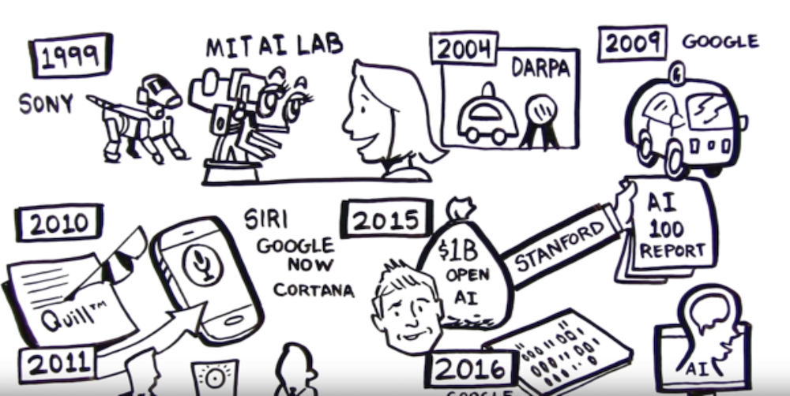

# A Brief (Modern) History of AI

---

## AI Evolution

 * Initial AI thinking was TOP DOWN (or symbolic logic)

 * Write a **big, comprehensive** program

     - Program **all the rules** (expert systems)

 * Problem:

     - Too many rules

     - Works only for specific domain, e.g. math theorems or chess

 * Success stories: playing chess at the grand master level

     - Domains with limited, clear rules

 * Not so successful: image recognition

Notes:

---

## Another AI Approach - Bottom Up

 * E.g. how babies learn to talk:

     - They don't start by learning the 'rules of the language'

     - Learn by example

 * Train computers the similar way

 * The focus shifts from  **logic to data**

 * More data --> smarter systems

 * Success stories

     - Image recognition

     - Language translation

     - Self-driving cars

Notes:

---

## AI Success Story : Translation - Early Approach

 * Creating a translation system (English <--> Japanese) involes the following

     - English dictionary + grammar rules

     - Japanese dictionary + grammar rules

     - Translation rules

 * Now the system is ready to translate

 * But this approach really doesn't work well:

     - Rules have too many exceptions

     - Context and subtle meanings are lost

 * Example : **"Minister of agriculture" --> "Priest of farming"**

Notes:

---

##  Translation - 'Bottom Up' Approach (Google Translate)

 * Google Translate has been ported to 'Google Brain' on Sept 2016
 * System learned from 'data'
 * AI based system improved the accuracy many times over
 * [Link to case study](https://www.nytimes.com/2016/12/14/magazine/the-great-ai-awakening.html)

Notes:

* https://en.wikiquote.org/wiki/Jorge_Luis_Borges
* https://www.nytimes.com/2016/12/14/magazine/the-great-ai-awakening.html

---

## Image Recognition: Cats & Dogs

Notes:

---

## Kaggle Competition

 * Recognize dogs & cats

 * Given 25,000 sample images to train

 * Then tested on 15,000 test images

 * Winning algorithm correctly classified 98.9% time!

 * [https://www.kaggle.com/c/dogs-vs-cats](https://www.kaggle.com/c/dogs-vs-cats )

&nbsp;

Notes:

---

## A Glimpse of AI History

 * Sixties

     - Commercial computers & mainframes

     - Computers play chess

 * Eighties

     - Artificial intelligence (AI) get  **'oversold** ', doesn't live up to the promise and gets a bad rap

 * 21st century

     - Big Data changes it all

Notes:

---
# The Great AI Revival
---

## The Great AI Revival (2010 on)

 * AI is going through a resurgence now because of the following

 *  **'Big Data** ' - now we have so much data to train our models

 *  **'Big Data ecosystem** ' - excellent big data platforms (Hadoop, Spark, NoSQL) are available as open source

 *  **'Big Compute** ' - **cloud**  platforms significantly lowered the barrier to massive compute power
     - $1 rents you 16 core + 128 G + 10 Gigabit machine for 1 hr on AWS!
     - So running a 100 node cluster for 5 hrs --> $500

 *  **Advances in hardware** - CPU / GPUs / TPUs

 - **Advances in Algorithms**

 - **Availability of pre-trained models**

Notes:

https://www.nytimes.com/2016/12/14/magazine/the-great-ai-awakening.html

---

## Hardware Advances: CPU & GPU

- Recently GPUs - Graphics Processing Units - have become popular (especially in Deep Learning)

- GPU cores are good at compute intensive calculations (math, matrix operations)

- Each GPU core is capable of executing small set instructions, but there are 1000s of core per GPU
Running in parallel

Notes:

---

## Hardware Advances - CPU

 * Modern Intel Xeon CPUs (E5 or later) have vectorized linear algebra
     - Properly optimized, approaches speed of GPUs
     - And offers faster I/O performance for Big Data.

 * [Intel Math Kernel Library](https://software.intel.com/en-us/mkl): highly optimized, threaded, and vectorized math functions that maximize performance on each processor family

Notes:
- https://software.intel.com/en-us/mkl

---

## Hardware Advances - TPU

 * A [Tensor processing unit (TPU)](https://github.com/tensorflow/tensorflow) is an AI accelerator application-specific integrated circuit (ASIC) developed by Google specifically for neural network machine learning

 * More capable the CPUs / GPUs in certain tasks

 * Designed for [Tensorflow](https://github.com/tensorflow/tensorflow)

 * Designed for high volume computes

     - A TPU can process 100 million photos a day

 * Available in Google Cloud platform

Notes:

* https://en.wikipedia.org/wiki/Tensor_processing_unit
* https://github.com/tensorflow/tensorflow

---

## Video: CPU vs. GPU

[Link](https://www.youtube.com/watch?v=-P28LKWTzrI)

From Myth Busters hosts!

Notes:

https://www.youtube.com/watch?v=-P28LKWTzrI

---

## Video: Nvidia Self Driving Car

[Link](https://www.youtube.com/watch?v=0rc4RqYLtEU)

Nice video showing Deep Learning perceptions during self driving.

Notes:

https://www.youtube.com/watch?v=0rc4RqYLtEU

---

## Video: Audi Autonomous Driving

[Link](https://www.youtube.com/watch?v=DjAJnQoNdMA)

Audi's self driving car program explained.  
Good comparison of brain vs. CPU vs. GPU around 50 second mark.

Notes:

https://www.youtube.com/watch?v=DjAJnQoNdMA

---

## Video - TPU

[Link](https://www.youtube.com/watch?v=UsDhVx6cOrw)

- Google CEO Sundar Pichai announces TPU @ Google I/O 2017
    - Training vs Inference performance @ 1:30
    - AutoML @ 4:25

Notes:

https://www.youtube.com/watch?v=UsDhVx6cOrw

---
## Incredible Growth of AI Power

Notes:

---

## Incredible Growth of AI Power

 * Since 2012, the amount of compute used in the largest AI training runs has been increasing exponentially with a 3.5 month-doubling time (by comparison, Moore's Law had an 18-month doubling period)Source: (https://blog.openai.com/ai-and-compute/)
 * Phases:
     - Before 2012: It was uncommon to use GPUs for ML, making any of the results in the graph difficult to achieve.
     - 2012 to 2014: Infrastructure to train on many GPUs was uncommon, so most results used 1-8 GPUs rated at 1-2 TFLOPS for a total of 0.001-0.1 pfs-days.
     - 2014 to 2016: Large-scale results used 10-100 GPUs rated at 5-10 TFLOPS, resulting in 0.1-10 pfs-days. Diminishing returns on data parallelism meant that larger training runs had limited value.
     - 2016 to 2017: Approaches that allow greater algorithmic parallelism such as huge batch sizes, architecture search, and expert iteration, along with specialized hardware such as TPU's and faster interconnects, have greatly increased these limits, at least for some applications.

Notes:

https://blog.openai.com/ai-and-compute/

---
## Advances in AI Research

- In recent years, lot of money is being invested in AI
- Companies like Google / Facebook / Amazon are in an 'arms race' to hire the best talent in AI
- Lot of research going on in public / private sectors
- Organizations like OpenAI are fostering research in public domain
- References
  - [Venture Capital Funding For Artificial Intelligence Startups Hit Record High In 2018 - Forbes](https://www.forbes.com/sites/jeanbaptiste/2019/02/12/venture-capital-funding-for-artificial-intelligence-startups-hit-record-high-in-2018/)

---
## Creating Complex Models Have Become Easier

- Historically, neural network models had to be coded from scratch
    - Converting math into code, testing and debugging
    - This could take weeks or months

- **Now tooling and libraries have gotten so much better**
    - High level tools like Keras and efficient libraries like Tensorflow, allow us to code complex models very quickly

---
## Availability of Pre-Trained Models

> "If I have seen further it is by standing on the shoulders of giants"  
>  -- Isaac Newton

- Creating complex models takes lot of data and lot of training
    - this can take huge amount of compute power (days or weeks of training)

- Now, we don't have to start from scratch

- There are lot of high quality models that are open source.  We can start with them and tweak them to fit our needs

- _This is probably the biggest reason DL has become mainstream_

- See example on next slide

---

## Building on Other Models

- Say we want to develop a model that can classify people into male / female

- Rather than starting from scratch, we can start with a model that can recognize peopole

- And then train it more to classify them into male/female

---

## Model Zoos

- Building and training complex models from scratch takes a lot of effort and compute

- Luckily, there are lot models available publicly  
    - Computer vision models : LeNet, AlexNet, ZFNet, GoogLeNet, VGGNet, Inception

- Available model zoos
    - [Tensorflow model zoo](https://github.com/tensorflow/models)
    - [Caffe model zoo](https://github.com/BVLC/caffe/wiki/Model-Zoo)

---

## AI History Recap

 * [Video](https://www.youtube.com/watch?v=056v4OxKwlI)

Notes:

https://www.youtube.com/watch?v=056v4OxKwlI
